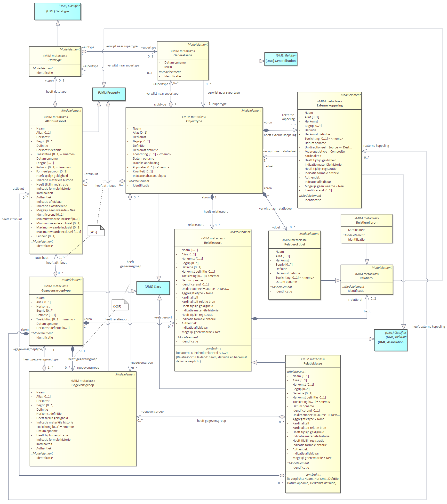
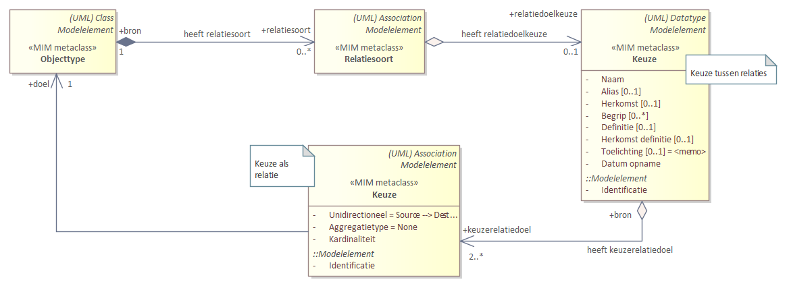
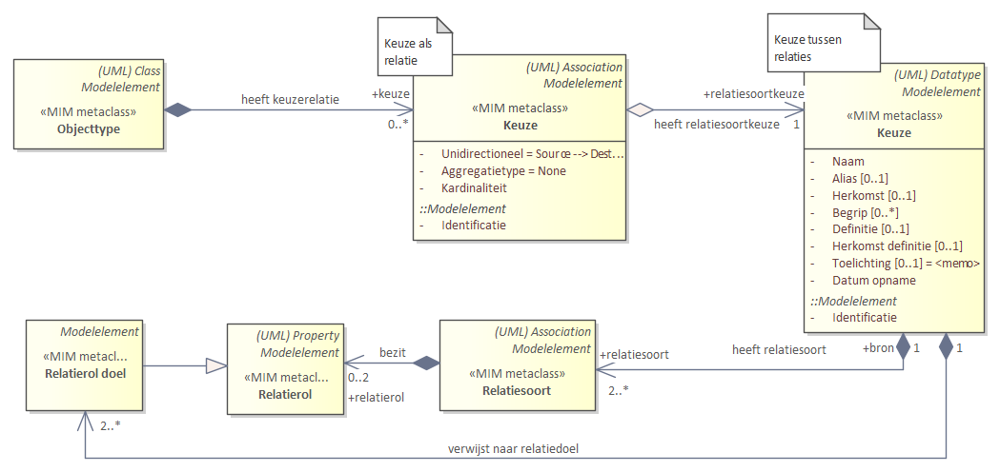

## Diagrammen

### Overzicht toegepaste UML metaclasses
 
<figure id="OverzichtToegepasteUMLmetaclasses.png">
  
  <figcaption>Diagram: toegepaste UML metaclasses</figcaption>
</figure>

### Modelelementen en metagegevens als diagram

Deze bijlage bevat alle modelelementen en metagegevens in één diagram.

*Kern - [Relatiesoort is leidend](#relatiesoort-alt-1-soort-leidend)*

<figure id="KernMetMetagegevens_Alt1.png">
  
  <figcaption>Diagram: Kern met metagegevens - relatiesoort leidend (alt 1)</figcaption>
</figure>
  
*Kern - [Relatierol is leidend](#relatierol-alt-2-rol-leidend)*

<figure id="KernMetMetagegevens_Alt2.png">
  
  <figcaption>Diagram: Kern met metagegevens - relatierol leidend (alt 2)</figcaption>
</figure>
   
*Datatypen*

<figure id="DatatypenMetMetagegevens.png">
  
  <figcaption>Diagram: Datatypen met metagegevens</figcaption>
</figure>
 
*Constraints*

<figure id="ConstraintsMetMetagegevens.png">
  
  <figcaption>Diagram: Constraints met metagegevens</figcaption>
</figure>

*Keuze*

*Keuze tussen datatypen*

Dit UML is uitgewerkt voor Objecttype. Voor Gegevensgroeptype en Relatieklasse geldt hetzelfde patroon.

<figure id="KeuzeDatatype1metMeta.png">
  
  <figcaption>Diagram: Keuze tussen datatypen met metagegevens</figcaption>
</figure>

*Keuze tussen attribuutsoorten*

Dit UML is uitgewerkt voor Objecttype. Voor Gegevensgroeptype en Relatieklasse geldt hetzelfde patroon.

<figure id="KeuzeAttribuutsoort2metMetaUML.png">
  
  <figcaption>Diagram: Keuze tussen attribuutsoorten met metagegevens</figcaption>
</figure>

*Keuze tussen attribuutsoorten binnen de context van een attribuutsoort*

Dit UML is uitgewerkt voor Objecttype. Voor Gegevensgroeptype en Relatieklasse geldt hetzelfde patroon.

<figure id="KeuzeAttribuutsoort3metMetaUML.png">
  
  <figcaption>Diagram: Keuze tussen attribuutsoorten binnen de context van een attribuutsoort met metagegevens</figcaption>
</figure>

*Keuze tussen relatiedoelen, als nadere invulling van 1 betekenisvolle relatiesoort*

Dit UML is uitgewerkt voor Objecttype. Voor Gegevensgroeptype geldt hetzelfde patroon, behalve dat een Gegevensgroeptype geen doel mag zijn voor een Relatiesoort.

<figure id="KeuzeRelatiedoel4metMetaUML.png">
  
  <figcaption>Diagram: Keuze tussen relatiedoelen met metagegevens</figcaption>
</figure>

*Keuze tussen relatiesoorten/relatierollen (elk afzonderlijk betekenisvol)*

Dit UML is uitgewerkt voor Objecttype. Voor Gegevensgroeptype geldt hetzelfde patroon, behalve dat een Gegevensgroeptype geen doel mag zijn voor een Relatiesoort.

<figure id="KeuzeRelatiedoel5metMetaUML.png">
  
  <figcaption>Diagram: Keuze tussen relatiesoorten/relatierollen met metagegevens</figcaption>
</figure>
 
*Packages*

<figure id="PackagesMetMetagegevens.png">
  
  <figcaption>Diagram: Packages met metagegevens</figcaption>
</figure>