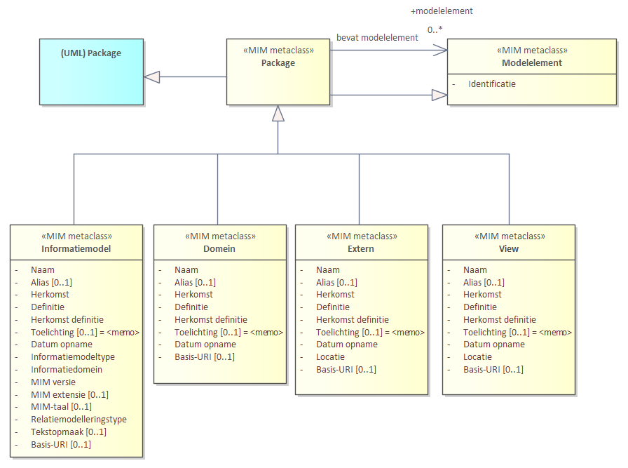

## Diagrammen

### Overzicht toegepaste UML metaclasses

### Modelelementen en metagegevens als diagram

Deze bijlage bevat alle modelelementen en metagegevens in één diagram.

*Kern - [Relatiesoort is leidend](#relatiesoort-leidend-alternatief-1-0)*

*Kern - [Relatierol is leidend](#relatierol-is-leidend-alternatief-2-0)*

*Datatypen*

*Constraints*

*Packages*

