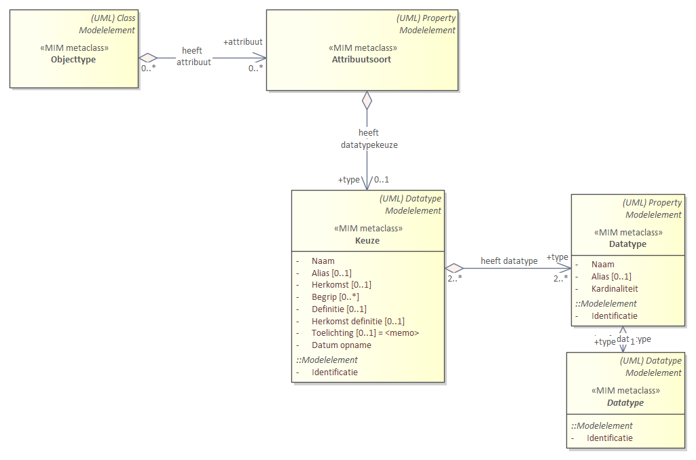

## Diagrammen

### Overzicht toegepaste UML metaclasses
 

### Modelelementen en metagegevens als diagram

Deze bijlage bevat alle modelelementen en metagegevens in één diagram.

*Kern - [Relatiesoort is leidend](#relatiesoort-leidend-alternatief-1)*

 
  
  
 
*Kern - [Relatierol is leidend](#relatierol-is-leidend-alternatief-2)*

 
  
  
*Datatypen*

 
 
 
*Constraints*

*Keuze*

*Keuze tussen datatypen*

Dit UML is uitgewerkt voor Objecttype. Voor Gegevensgroeptype en Relatieklasse geldt hetzelfde patroon.

*Keuze tussen attribuutsoorten*

Dit UML is uitgewerkt voor Objecttype. Voor Gegevensgroeptype en Relatieklasse geldt hetzelfde patroon.

*Keuze tussen attribuutsoorten binnen de context van een attribuutsoort*

Dit UML is uitgewerkt voor Objecttype. Voor Gegevensgroeptype en Relatieklasse geldt hetzelfde patroon.

*Keuze tussen relatiedoelen*

Dit UML is uitgewerkt voor Objecttype. Voor Gegevensgroeptype geldt hetzelfde patroon, behalve dat een Gegevensgroeptype geen doel mag zijn voor een Relatiesoort.

 
 
 

*Packages*

