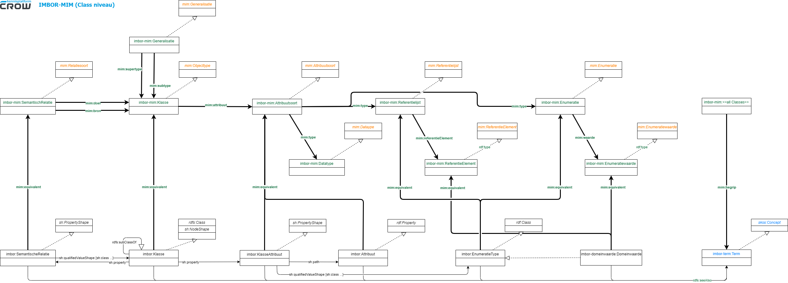

## Best practice: IMBOR

Het [IMBOR](https://www.crow.nl/imbor) staat voor "Informatiemodel Beheer Openbare Ruimte" en is een informatiemodel ontwikkeld door CROW, een Nederlandse organisatie die zich richt op kennisontwikkeling en kennisdeling op het gebied van infrastructuur, verkeer, vervoer en openbare ruimte. IMBOR is bedoeld als een gestandaardiseerde en uniforme manier om informatie over de openbare ruimte te structureren en uit te wisselen tussen verschillende partijen, zoals gemeenten, provincies, en andere beheerders van de openbare ruimte in Nederland. IMBOR bevat een set van objecttypen, attributen en relaties die gebruikt kunnen worden om informatie over de fysieke objecten in de openbare ruimte, zoals wegen, riolering, groen, en verlichting, te beschrijven. Het model is open beschikbaar en gebaseerd op open standaarden en kan gebruikt worden in verschillende informatiesystemen, zoals beheersystemen, GIS-systemen, en assetmanagementsystemen. IMBOR is bedoeld om de samenwerking en uitwisseling van informatie tussen verschillende partijen te bevorderen en de kwaliteit en efficiëntie van het beheer van de openbare ruimte te verbeteren.  

Het IMBOR bestaat in basis uit een [vocabulaire](https://begrippen.crow.nl/imbor/nl/) (Begrippenkader) en een [ontologie](https://docs.crow.nl/onto-verkenner/imbor/#/) (Kernmodel). Alle technische details hierover zijn te vinden in de [IMBOR Technische documentatie](https://docs.crow.nl/imbor/techdoc/). [Hier](https://docs.crow.nl/imbor/techdoc/#regie-op-standaarden) wordt ook beschreven vanuit het IMBOR perspectief hoe de genoemde standaarden zich tot elkaar zouden moeten verhouden. 

### Relatie met NEN2660-2
De [NEN2660-2 vormt de belangrijkste leidraad voor IMBOR](https://docs.crow.nl/imbor/techdoc/#nen2660-2) door twee belangrijke dingen te specificeren:
* Een praktisch toplevelmodel waarin genoeg semantiek aangegeven wordt om IMBOR in uit te drukken
* Een taalbinding (en daarmee de keuze voor) de LinkedData W3C standaarden. IMBOR maakt gebruik van deze twee keuzes en probeert daarom zo goed mogelijk aan te sluiten. In onderstaande figuur is ook te zien waar de NEN 2660-2 zich op focust. IMBOR neemt plaats in de "M1: Informatie model" laag.

#### Toplevelmodel
Het praktisch toplevelmodel van de NEN2660-2 betreffen de hoogte klassen in de IMBOR ontologie. Deze semantische klassen worden gebruikt als kapstok om de IMBOR klassen, attributen en relaties verder aan door te specialiseren. Middels relaties geadopteerd uit de NEN2660-2 wordt het mogelijk gemaakt om tussen concepten binnen IMBOR betekenisvolle relaties te leggen. De relaties betreffen:
1. `isSubtypeVan` (NEN2660-2: Is een verbijzondering van)
1. `heeftDeel` ([NEN2660-2:hasPart](https://w3id.org/nen2660/def#hasPart))
1. `isVerbondenMet` ([NEN2660-2:isConnectedTo](https://w3id.org/nen2660/def#isConnectedTo))
1. `isBeschrevenDoor` ([NEN2660-2:isDescribedBy](https://w3id.org/nen2660/def#isDescribedBy))
1. `bevat`([NEN2660-2:contains](https://w3id.org/nen2660/def#contains))
1. `heeftBegrenzing` ([NEN2660-2:hasBoundary](https://w3id.org/nen2660/def#hasBoundary))
1. `voertUit` ([NEN2660-2:executes](https://w3id.org/nen2660/def#executes))
1. `bestaatUit` ([NEN2660-2:consistsOf](https://w3id.org/nen2660/def#consistsOf))

In onderstaande diagram is in blauw aangegeven welke NEN2660-2 klassen er gebruikt worden en hoe IMBOR hier op doorgaat. Zo is te zien dat alle IMBOR klassen een subklasse (soms via meerdere tussen klassen) een subklasse zijn van een NEN2660-2 klasse. De basis betreft het `nen2660:DiscreteObject` (buiten de NEN2660-2 wordt dit ook wel als een 'Fysieke Object' gezien) en de `nen2660:SpatialRegion` (ook wel het 'Ruimtelijk Gebied'). Daarnaast betreft het het `nen2660:InformationObject` om beschrijvingen toe te voegen en `nen2660:Activity` om functies te kunnen definiëren. 

<figcaption>IMBOR Top van de ontologie (open op nieuw tabblad voor grotere weergave)</figcaption>

#### Taalbinding
En een ander belangrijk onderdeel van de NEN2660-2 betreft de taalbinding naar de W3C talen. In de NEN2660-2 wordt beschreven hoe de verschillende concepten binnen de NEN2660-2 uitgedrukt moeten worden in de semantic web talen. Dit zorgt voor uniformiteit op het gebied van gebruik van deze talen. De betreffende talen zijn heel flexibel en dat is hun kracht, maar voor uniformiteit, reproduceerbaarheid en duidelijkheid kan het helpen om de W3C talen op een vergelijkbare manier in te zetten. Zo volgt IMBOR de RDFS/SHACL taalbinding. 

### Relatie met NEN3610
De [NEN 3610 vormt tevens een belangrijke leidraad voor IMBOR](https://docs.crow.nl/imbor/techdoc/#nen3610) omdat het semantisch model uit de NEN 3610 hiërarchisch gezien het NEN 2660-2 praktisch toplevelmodel verder specialiseert. Zo wordt dit ook aangegeven in de NEN 2660-2. Daarnaast wordt de NEN 3610 ook gebruikt om de identificatie attributen te declareren en worden de temporele aspecten en het netwerkmodel volledig geïmplementeerd. 

#### Semantisch model
In het bovenstaande diagram zijn in groen de NEN3610 semantische klassen te zien. Deze worden (zoals in de NEN2660-2 gespecificeerd) gehangen onder het NEN2660-2 praktisch toplevelmodel. Deze indeling is geadopteerd in IMBOR en vervolgens is IMBOR verder gaan specialiseren onder de NEN3610. Zo is te zien dat bijna elke klasse uit IMBOR een subklasse (soms via meerdere tussen klassen) is van `nen3610:GeoObject`.

#### Identificatie, Temporele aspecten en Netwerk model

### Relatie met MIM
Zowel IMBOR als de NEN 3610 zijn beschreven volgens het MIM. Het IMBOR gebruikt vooralsnog alleen de LinkedData serialisatie van het MIM. Het [MIM wordt zodoende bij IMBOR gebruikt](https://docs.crow.nl/imbor/techdoc/#mim) om de IMBOR ontologie volledig in MIM-LD uit te drukken. Dit heeft als voordeel dat IMBOR vergeleken en gebruikt kan worden in samenhang met andere informatiemodellen die in MIM uitgedrukt worden. Dit is zowel voor de informatiemodelleurs als voor softwareleveranciers handig. Deze uitdrukking is het onderwerp van deze best practice. 

**NOTE**
_ToDo_

#### Drie lagen IMBOR-MIM
Binnen de IMBOR-MIM uitdrukking zijn drie lagen te onderscheiden waarbij elke onderliggende laag in de bovenliggende laag beschreven wordt:
1. Het MIM model (het metamodel dat MIM beschrijft)
2. Het IMBOR uitgedrukt in MIM-LD (het concrete informatiemodel wat in MIM beschreven wordt, maar de IMBOR ontologie beschrijft)
3. De "echte" LinkedData IMBOR ontologie (het model dat geïnstanteerd kan worden / voorkomens kan kennen)
Alle drie de lagen worden in dit geval in de semantic web talen uitgedrukt (RDF(S), OWL, SHACL). Zie voor een toelichting [Ontologisch metemodel in LD](https://docs.geostandaarden.nl/mim/def-st-mim-20201023/#ontologisch-metamodel-in-ld).

Onderstaande diagram illustreert dit (versimpeld). Waarbij in oranje het **MIM (bovenstaande laag 1)**, in groen het **IMBOR Metamodel (bovenstaande laag 2)** en in het zwart de **IMBOR ontologie (bovenstaande laag 3)** herkent kan worden. In blauw is de **IMBOR vocabulaire** te vinden. 

<figcaption>IMBOR-MIM op Class niveau (open op nieuw tabblad voor grotere weergave)</figcaption>

##### MIM Model
IMBOR is een relatief overzichtelijk model. In essentie bestaat het alleen uit _klassen_, hun onderlinge relaties_, informatiebehoeften in de vorm van _attributen_ en waarden bij die attributen in de vorm van _datatypen_ en _enumeraties_. Deze essentie is ook terug te zien in de klassen die gebruikt worden uit het MIM:
* `mim:Objecttype`
* `mim:Relatiesoort` en `mim:Generalisatie`
* `mim:Attribuutsoort`
* `mim:Datatype` 
* `mim:Referentielijst` en `mim:ReferentieElement`
* `mim:Enumeratie` en `mim:Enumeratiewaarde`
De relaties/properties die tussen deze klassen gedefinieerd worden in het MIM worden vanzelfsprekend toegepast. 

Vanuit het MIM worden ook (verplichte) attributen toegeschreven aan de MIM klassen. Deze zijn niet opgenomen in bovenstaand schema, maar worden wel in de voorbeelden meegenomen. Uitgangspunt daarbij is dat wanneer de kardinaliteit in het MIM gezet is op minimaal 1 dit attribuut sowieso ingevuld wordt. Verder worden alleen (niet verplichte) attributen gebruikt indien ze passen binnen de toepassingscope van IMBOR.

##### IMBOR in MIM-LD
Omdat MIM-LD 1-op-1 wordt toegepast spiegelt /instantieert de laag het MIM model op klasse niveau. 

##### IMBOR Ontologie
De IMBOR ontologie wordt uitvoerig beschreven [hier](https://docs.crow.nl/imbor/techdoc/#imbor-in-linkeddata). In essentie is het wederom simpel en ligt het dicht tegen het MIM model aan. IMBOR gebruikt de NEN2660-2 en NEN3610 klassen en relaties. Deze worden ook in MIM uitgedrukt. 

**NOTE**
_Hier moet NEN2660-abs bij komen_

### Voorbeeld in RDF
IMBOR wordt verstrekt in RDF middels Turtle files en SPARQL-Endpoints. De beschrijving in MIM is daar onderdeel van. Voor deze best practice is een representatieve sample set gebruikt. Deze is te zien in onderstaande twee voorbeelden. Deze set is tevenbs in Turtle te vinden in de repository die bij deze best practice hoort. In de sample set is tevens de NEN2660-2 taalbinding te zien en hoe de concepten uit de NEN3610 gebruikt worden. 

**NOTE**
_Juiste link toevoegen_

#### IMBOR-MIM (Laag 1 en 2)
Onderstaande betreft een sample set van IMBOR in MIM-LD (laag 2). Inclusief alle MIM properties die gebruikt zijn. Via de `rdf:type` is de link naar 'laag 1' te zien. 

<pre class='ex-turtle'>
@prefix imbor:              &lt;https://data.crow.nl/imbor/def/> .
@prefix imbor-domeinwaarde: &lt;https://data.crow.nl/imbor/id/domeinwaarden/> .
@prefix imbor-mim:          &lt;https://data.crow.nl/imbor/mim/> .
@prefix imbor-term:         &lt;https://data.crow.nl/imbor/term/> .
@prefix mim:                &lt;http://bp4mc2.org/def/mim#> .
@prefix nen2660:            &lt;https://w3id.org/nen2660/def#> .
@prefix nen2660-term:       &lt;https://w3id.org/nen2660/term#> .
@prefix nen3610:            &lt;http://definities.geostandaarden.nl/def/nen3610#> .
@prefix rdf:                &lt;http://www.w3.org/1999/02/22-rdf-syntax-ns#> .
@prefix rdfs:               &lt;http://www.w3.org/2000/01/rdf-schema#> .
@prefix sh:                 &lt;http://www.w3.org/ns/shacl#> .
@prefix dash:               &lt;http://datashapes.org/dash#> .
@prefix skos:               &lt;http://www.w3.org/2004/02/skos/core#> .
@prefix xsd:                &lt;http://www.w3.org/2001/XMLSchema#> .
@prefix quantitykind:       &lt;http://qudt.org/vocab/quantitykind/> .
@prefix unit:               &lt;http://qudt.org/vocab/unit/> .

imbor-mim:mim-DiscreteObject
        rdf:type                     mim:Objecttype ;
        mim:begrip                   nen2660-term:DiscreteObject ;
        mim:begripsterm              "DiscreetObject"@nl ;
        mim:datumOpname              "2023-01-01"^^xsd:date ;
        mim:definitie                "Reëel object dat bestaat uit een aaneengesloten hoeveelheid vormvaste materie, primair bijeengehouden door interne krachten (zwaartekracht of elektromagnetische kracht)."@nl ;
        mim:herkomst                 "NEN2660-2 - NEN"@nl ;
        mim:herkomstDefinitie        "NEN2660-2 - NEN"@nl ;
        mim:indicatieAbstractObject  true ;
        mim:locatie                  "https://w3id.org/nen2660/def" ;
        mim:naam                     "DiscreetObject"@nl .

imbor-mim:mim-Begroeiing
        rdf:type                     mim:Objecttype ;
        mim:begrip                   nen3610:Begroeiing ;
        mim:begripsterm              "Begroeiing"@nl ;
        mim:datumOpname              "2023-01-01"^^xsd:date ;
        mim:definitie                "Planten die op natuurlijke wijze zijn ontstaan of door mensen zijn aangeplant."@nl ;
        mim:herkomst                 "NEN3610 - Geonovum"@nl ;
        mim:herkomstDefinitie        "NEN3610 - Geonovum"@nl ;
        mim:indicatieAbstractObject  true ;
        mim:locatie                  "http://modellen.geostandaarden.nl/def/nen3610-2022" ;
        mim:naam                     "Begroeiing"@nl .

imbor-mim:mim-761406d1-87bc-4dc1-b1b7-bd3bb7ab54a7
        rdf:type                     mim:Objecttype ;
        mim:begrip                   imbor-term:54c784e0-420b-48ac-8798-18eb7fc9a861 ;
        mim:begripsterm              "Vegetatieobject"@nl ;
        mim:datumOpname              "2023-01-01"^^xsd:date ;
        mim:definitie                "Solitair vegetatieobject of lijn- of vlakvormige groep gelijksoortige vegetatieobjecten met een beperkte omvang."@nl ;
        mim:herkomst                 "IMBOR - Stichting CROW"@nl ;
        mim:herkomstDefinitie        "IMBOR - Stichting CROW"@nl ;
        mim:indicatieAbstractObject  true ;
        mim:locatie                  "https://data.crow.nl/imbor/def" ;
        mim:naam                     "Vegetatieobject"@nl .

imbor-mim:mim-83a942f7-5291-42f0-afb1-9a57d0fb2f15
        rdf:type                     mim:Objecttype ;
        mim:attribuut                imbor-mim:mim-fe4e8ac7-4e55-4641-a288-330526cc8be9 , imbor-mim:mim-c7da7cf4-ea1f-4f4d-8fd5-b3bd8a2147fd ;
        mim:begrip                   imbor-term:eecb9687-2dc9-43d3-b6f2-2c5ff35da666 ;
        mim:begripsterm              "Boom"@nl ;
        mim:datumOpname              "2023-01-01"^^xsd:date ;
        mim:definitie                "Een houtachtig gewas (loofboom of conifeer) met een wortelgestel en een enkele, stevige en houtige stam, die zich boven de grond vertakt."@nl ;
        mim:herkomst                 "IMBOR - Stichting CROW"@nl ;
        mim:herkomstDefinitie        "IMBOR - Stichting CROW"@nl ;
        mim:indicatieAbstractObject  false ;
        mim:locatie                  "https://data.crow.nl/imbor/def" ;
        mim:naam                     "Boom"@nl .

imbor-mim:mim-fe4e8ac7-4e55-4641-a288-330526cc8be9
        rdf:type                     mim:Attribuutsoort ;
        mim:begrip                   imbor-term:9f7bba5a-2b51-4b0c-879b-ecd488caf60d ;
        mim:begripsterm              "boomhoogte actueel"@nl ;
        mim:datumOpname              "2023-01-01"^^xsd:date ;
        mim:definitie                "Hoogte van de boom in meters."@nl ;
        mim:herkomst                 "IMBOR - Stichting CROW"@nl ;
        mim:herkomstDefinitie        "IMBOR - Stichting CROW"@nl ;
        mim:indicatieClassificerend  false ;
        mim:kardinaliteit            "0..1" ;
        mim:locatie                  "https://data.crow.nl/imbor/def" ;
        mim:naam                     "boomhoogte actueel"@nl ;
        mim:toelichting              unit:M ;
        mim:type                     imbor-mim:mim-decimal .    

imbor-mim:mim-decimal
        rdf:type         mim:Decimal ;
        mim:datumOpname  "2023-01-01"^^xsd:date ;
        mim:definitie    "Zie corresponderende specificatie"@nl ;
        mim:herkomst     "https://www.w3.org/2001/XMLSchema" ;
        mim:locatie      "https://www.w3.org/2001/XMLSchema" ;
         mim:naam         "Decimal"@nl .   

imbor-mim:mim-c7da7cf4-ea1f-4f4d-8fd5-b3bd8a2147fd
        rdf:type                     mim:Attribuutsoort ;
        mim:begrip                   imbor-term:41704b79-4a81-4f17-90a5-f977b5e0acd5 ;
        mim:begripsterm              "vrije takval"@nl ;
        mim:datumOpname              "2023-01-01"^^xsd:date ;
        mim:definitie                "Aanduiding of vrije takval toegestaan is."@nl ;
        mim:herkomst                 "IMBOR - Stichting CROW"@nl ;
        mim:herkomstDefinitie        "IMBOR - Stichting CROW"@nl ;
        mim:indicatieClassificerend  false ;
        mim:kardinaliteit            "0..1" ;
        mim:locatie                  "https://data.crow.nl/imbor/def" ;
        mim:naam                     "vrije takval"@nl ;
        mim:type                     imbor-mim:mim-1e29b693-f9d4-4a88-ab41-6a741effcd95 .

imbor-mim:mim-f4b80a70-ef80-49e3-b28a-f4737afff678
        rdf:type               mim:Relatiesoort ;
        mim:bron               imbor-mim:mim-83a942f7-5291-42f0-afb1-9a57d0fb2f15 ;
        mim:datumOpname        "2023-01-01"^^xsd:date ;
        mim:doel               imbor-mim:mim-6b021f79-ad6c-431e-a205-9eb4b9dc3b3c ;
        mim:herkomst           "IMBOR - Stichting CROW"@nl ;
        mim:herkomstDefinitie  "IMBOR - Stichting CROW"@nl ;
        mim:kardinaliteit      "0..1" ;
        mim:locatie            "https://data.crow.nl/imbor/def" ;
        mim:naam               "Boom is verbonden met Boomrooster"@nl ;
        mim:unidirectioneel    true .

imbor-mim:mim-6b021f79-ad6c-431e-a205-9eb4b9dc3b3c
        rdf:type                     mim:Objecttype ;
        mim:begrip                   imbor-term:42ee92eb-3324-4ac5-8fb8-49df4fa53666 ;
        mim:begripsterm              "Boomrooster"@nl ;
        mim:datumOpname              "2023-01-01"^^xsd:date ;
        mim:definitie                "Een rooster dat rondom de voet van de boom wordt aangebracht en aansluit op de omringende verharding."@nl ;
        mim:herkomst                 "IMBOR - Stichting CROW"@nl ;
        mim:herkomstDefinitie        "IMBOR - Stichting CROW"@nl ;
        mim:indicatieAbstractObject  false ;
        mim:locatie                  "https://data.crow.nl/imbor/def" ;
        mim:naam                     "Boomrooster"@nl .

imbor-mim:mim-1e29b693-f9d4-4a88-ab41-6a741effcd95
        rdf:type               mim:Enumeratie ;
        mim:begrip             imbor-term:9fe5b3c4-62df-4b20-835b-8ee2096da877 ;
        mim:begripsterm        "BoomVrijeTakval"@nl ;
        mim:datumOpname        "2023-01-01"^^xsd:date ;
        mim:definitie          "Het enumeratietype BoomVrijeTakval is de naam voor de domeinwaardenlijst van de klasse Boom en het attribuut vrije takval."@nl ;
        mim:herkomst           "IMBOR - Stichting CROW"@nl ;
        mim:herkomstDefinitie  "IMBOR - Stichting CROW"@nl ;
        mim:locatie            "https://data.crow.nl/imbor/def" ;
        mim:naam               "BoomVrijeTakval"@nl ;
        mim:waarde             imbor-mim:mim-f066df1f-8c4b-4d9d-b29a-6955b75508c9 , imbor-mim:mim-b57417cf-4bf4-43c1-9c19-b5378037ec60 , imbor-mim:mim-0ee748e8-8509-4813-be3c-b9e569a51434 .

imbor-mim:mim-f066df1f-8c4b-4d9d-b29a-6955b75508c9
        rdf:type               mim:Enumeratiewaarde ;
        mim:begrip             imbor-term:94801d13-672c-4b40-84c8-b5a34c554b74 ;
        mim:begripsterm        "Geen vrije takval mogelijk"@nl ;
        mim:datumOpname        "2023-01-01"^^xsd:date ;
        mim:definitie          "De directe omgeving van de boom laat niet toe takken onbegeleid uit de boomkroon vallen."@nl ;
        mim:herkomst           "IMBOR - Stichting CROW"@nl ;
        mim:herkomstDefinitie  "IMBOR - Stichting CROW"@nl ;
        mim:locatie            "https://data.crow.nl/imbor/id/domeinwaarden" ;
        mim:naam               "Geen vrije takval mogelijk"@nl .

imbor-mim:mim-b57417cf-4bf4-43c1-9c19-b5378037ec60
        rdf:type               mim:Enumeratiewaarde ;
        mim:begrip             imbor-term:bb9ec39f-9c15-4908-b47a-a98dcfbdcf34 ;
        mim:begripsterm        "Vrije takval mogelijk"@nl ;
        mim:datumOpname        "2023-01-01"^^xsd:date ;
        mim:definitie          "De directe omgeving van de boom laat toe dat takken onbegeleid uit de boomkroon vallen."@nl ;
        mim:herkomst           "IMBOR - Stichting CROW"@nl ;
        mim:herkomstDefinitie  "IMBOR - Stichting CROW"@nl ;
        mim:locatie            "https://data.crow.nl/imbor/id/domeinwaarden" ;
        mim:naam               "Vrije takval mogelijk"@nl .

imbor-mim:mim-0ee748e8-8509-4813-be3c-b9e569a51434
        rdf:type               mim:Enumeratiewaarde , mim:ReferentieElement ;
        mim:begrip             imbor-term:073e7fd4-c739-47c7-81f3-765ac1a97801 ;
        mim:begripsterm        "Onbekend"@nl ;
        mim:datumOpname        "2023-01-01"^^xsd:date ;
        mim:definitie          "De waarde onbekend bij dit attribuut komt overeen met een leeg veld bij het gebruik van de boolean als gegevenstype. Bij deze waarde moet nader onderzoek uitwijzen of de waarde ja of nee moet zijn."@nl ;
        mim:herkomst           "IMBOR - Stichting CROW"@nl ;
        mim:herkomstDefinitie  "IMBOR - Stichting CROW"@nl ;
        mim:locatie            "Voorlopig gedefinieerd binnen IMBOR op https://data.crow.nl/imbor/id/domeinwaarden"@nl , "https://data.crow.nl/imbor/id/domeinwaarden" ;
        mim:naam               "Onbekend"@nl .

imbor-mim:mim-Begroeiing_mim-DiscreteObject
        rdf:type         mim:Generalisatie ;
        mim:datumOpname  "2023-01-01"^^xsd:date ;
        mim:naam         "DiscreetObject is generalisatie van Begroeiing" ;
        mim:subtype      imbor-mim:mim-Begroeiing ;
        mim:supertype    imbor-mim:mim-DiscreteObject .

imbor-mim:mim-761406d1-87bc-4dc1-b1b7-bd3bb7ab54a7_mim-Begroeiing
        rdf:type         mim:Generalisatie ;
        mim:datumOpname  "2023-01-01"^^xsd:date ;
        mim:naam         "Begroeiing is generalisatie van Vegetatieobject" ;
        mim:subtype      imbor-mim:mim-761406d1-87bc-4dc1-b1b7-bd3bb7ab54a7 ;
        mim:supertype    imbor-mim:mim-Begroeiing .

imbor-mim:mim-83a942f7-5291-42f0-afb1-9a57d0fb2f15_mim-761406d1-87bc-4dc1-b1b7-bd3bb7ab54a7
        rdf:type         mim:Generalisatie ;
        mim:datumOpname  "2023-01-01"^^xsd:date ;
        mim:naam         "Vegetatieobject is generalisatie van Boom" ;
        mim:subtype      imbor-mim:mim-83a942f7-5291-42f0-afb1-9a57d0fb2f15 ;
        mim:supertype    imbor-mim:mim-761406d1-87bc-4dc1-b1b7-bd3bb7ab54a7 .
</pre>

#### IMBOR (laag 3) 
Onderstaande betreft een sample set van de IMBOR ontologie (laag 3), gekeken vanuit "Boom". Via de `mim:equivalent` is de link naar laag 2 te zien.

<pre class='ex-turtle'>
@prefix imbor:              &lt;https://data.crow.nl/imbor/def/> .
@prefix imbor-domeinwaarde: &lt;https://data.crow.nl/imbor/id/domeinwaarden/> .
@prefix imbor-mim:          &lt;https://data.crow.nl/imbor/mim/> .
@prefix imbor-term:         &lt;https://data.crow.nl/imbor/term/> .
@prefix mim:                &lt;http://bp4mc2.org/def/mim#> .
@prefix nen2660:            &lt;https://w3id.org/nen2660/def#> .
@prefix nen2660-term:       &lt;https://w3id.org/nen2660/term#> .
@prefix nen3610:            &lt;http://definities.geostandaarden.nl/def/nen3610#> .
@prefix rdf:                &lt;http://www.w3.org/1999/02/22-rdf-syntax-ns#> .
@prefix rdfs:               &lt;http://www.w3.org/2000/01/rdf-schema#> .
@prefix sh:                 &lt;http://www.w3.org/ns/shacl#> .
@prefix dash:               &lt;http://datashapes.org/dash#> .
@prefix skos:               &lt;http://www.w3.org/2004/02/skos/core#> .
@prefix xsd:                &lt;http://www.w3.org/2001/XMLSchema#> .
@prefix quantitykind:       &lt;http://qudt.org/vocab/quantitykind/> .
@prefix unit:               &lt;http://qudt.org/vocab/unit/> .

imbor:83a942f7-5291-42f0-afb1-9a57d0fb2f15
        rdf:type         sh:NodeShape , rdfs:Class ;
        rdfs:seeAlso     imbor-term:eecb9687-2dc9-43d3-b6f2-2c5ff35da666 ;
        rdfs:subClassOf  imbor:761406d1-87bc-4dc1-b1b7-bd3bb7ab54a7 ;
        mim:equivalent   imbor-mim:mim-83a942f7-5291-42f0-afb1-9a57d0fb2f15 ;
        dash:abstract    false ;
        skos:definition  "Een houtachtig gewas (loofboom of conifeer) met een wortelgestel en een enkele, stevige en houtige stam, die zich boven de grond vertakt."@nl ;
        skos:prefLabel   "Boom"@nl ;
        sh:property      imbor:80a326eb-96da-4a34-a299-5191d89b87ae, imbor:f4b80a70-ef80-49e3-b28a-f4737afff678, imbor:6a3e82d1-ef13-49de-91a4-29b3cb797846 .
    
imbor-term:eecb9687-2dc9-43d3-b6f2-2c5ff35da666
        rdf:type         skos:Concept ;
        skos:definition  "Een houtachtig gewas (loofboom of conifeer) met een wortelgestel en een enkele, stevige en houtige stam, die zich boven de grond vertakt."@nl ;
        skos:prefLabel   "Boom"@nl .

imbor:761406d1-87bc-4dc1-b1b7-bd3bb7ab54a7
        rdf:type         sh:NodeShape , rdfs:Class ;
        rdfs:subClassOf  nen3610:Begroeiing ;
        rdfs:seeAlso     imbor-term:54c784e0-420b-48ac-8798-18eb7fc9a861 ;
        mim:equivalent   imbor-mim:mim-761406d1-87bc-4dc1-b1b7-bd3bb7ab54a7 ;
        dash:abstract    true ;
        skos:definition  "Solitair vegetatieobject of lijn- of vlakvormige groep gelijksoortige vegetatieobjecten met een beperkte omvang."@nl ;
        skos:prefLabel   "Vegetatieobject"@nl .

imbor-term:54c784e0-420b-48ac-8798-18eb7fc9a861
        rdf:type         skos:Concept ;
        skos:definition  "Solitair vegetatieobject of lijn- of vlakvormige groep gelijksoortige vegetatieobjecten met een beperkte omvang."@nl ;
        skos:note        "IMGeo"@nl ;
        skos:prefLabel   "Vegetatieobject"@nl .

nen3610:Begroeiing  rdf:type  sh:NodeShape , rdfs:Class, skos:Concept ;
        rdfs:seeAlso     nen3610:Begroeiing ;
        rdfs:subClassOf  nen2660:DiscreteObject ;
        mim:equivalent   imbor-mim:mim-Begroeiing ;
        dash:abstract    true ;
        skos:definition  "Planten die op natuurlijke wijze zijn ontstaan of door mensen zijn aangeplant."@nl ;
        skos:note        "NEN3610"@nl ;
        skos:prefLabel   "Begroeiing"@nl .

nen2660:DiscreteObject
        rdf:type         rdfs:Class , sh:NodeShape ;
        rdfs:seeAlso     nen2660-term:DiscreteObject ;
        mim:equivalent   imbor-mim:mim-DiscreteObject ;
        dash:abstract    true ;
        skos:definition  "A real object consisting of a contiguous amount of form-retaining matter, held together primarily by internal forces (gravity or electromagnetic force)"@en , "Reëel object dat bestaat uit een aaneengesloten hoeveelheid vormvaste materie, primair bijeengehouden door interne krachten (zwaartekracht of elektromagnetische kracht)."@nl ;
        skos:note        "NEN2660"@nl ;
        skos:prefLabel   "Discrete object"@en , "DiscreetObject"@nl .

nen2660-term:DiscreteObject
        rdf:type         skos:Concept ;
        skos:definition  "A real object consisting of a contiguous amount of form-retaining matter, held together primarily by internal forces (gravity or electromagnetic force)"@en , "Een reëel object dat bestaat uit een aaneengesloten hoeveelheid vormvaste materie, primair bijeengehouden door interne krachten (zwaartekracht of elektromagnetische kracht)"@nl , "Reëel object dat bestaat uit een aaneengesloten hoeveelheid vormvaste materie, primair bijeengehouden door interne krachten (zwaartekracht of elektromagnetische kracht)."@nl ;
        skos:note        "NEN2660"@nl ;
        skos:prefLabel   "DiscreetObject"@nl , "Discreet object"@nl , "Discrete object"@en .

imbor:80a326eb-96da-4a34-a299-5191d89b87ae
        rdf:type            sh:PropertyShape ;
        skos:prefLabel      "boomhoogte actueel vastgezet op Boom"@nl ;
        sh:datatype         xsd:decimal ;
        sh:maxCount         1 ;
        sh:path             imbor:fe4e8ac7-4e55-4641-a288-330526cc8be9 ;
        nen2660:hasUnit     unit:M .

imbor:fe4e8ac7-4e55-4641-a288-330526cc8be9
        rdf:type                 rdf:Property ;
        rdfs:seeAlso             imbor-term:9f7bba5a-2b51-4b0c-879b-ecd488caf60d ;
        mim:equivalent           imbor-mim:mim-fe4e8ac7-4e55-4641-a288-330526cc8be9 ;
        skos:definition          "Hoogte van de boom in meters."@nl ;
        skos:prefLabel           "boomhoogte actueel"@nl ;
        nen2660:hasQuantityKind  quantitykind:Length .

imbor-term:9f7bba5a-2b51-4b0c-879b-ecd488caf60d
        rdf:type         skos:Concept ;
        skos:definition  "Hoogte van de boom in meters."@nl ;
        skos:prefLabel   "boomhoogte actueel"@nl .

imbor:f4b80a70-ef80-49e3-b28a-f4737afff678
        rdf:type                sh:PropertyShape ;
        mim:equivalent          imbor-mim:mim-f4b80a70-ef80-49e3-b28a-f4737afff678 ;
        skos:prefLabel          "Boom is verbonden met Boomrooster"@nl ;
        sh:path                 nen2660:isConnectedTo ;
        sh:qualifiedMaxCount    1 ;
        sh:qualifiedValueShape  [ sh:class  imbor:6b021f79-ad6c-431e-a205-9eb4b9dc3b3c ] .

imbor:6b021f79-ad6c-431e-a205-9eb4b9dc3b3c
        rdf:type         sh:NodeShape , rdfs:Class ;
        rdfs:seeAlso     imbor-term:42ee92eb-3324-4ac5-8fb8-49df4fa53666 ;
        mim:equivalent   imbor-mim:mim-6b021f79-ad6c-431e-a205-9eb4b9dc3b3c ;
        dash:abstract    false ;
        skos:definition  "Een rooster dat rondom de voet van de boom wordt aangebracht en aansluit op de omringende verharding."@nl ;
        skos:prefLabel   "Boomrooster"@nl .

imbor-term:42ee92eb-3324-4ac5-8fb8-49df4fa53666
        rdf:type         skos:Concept ;
        skos:definition  "Een rooster dat rondom de voet van de boom wordt aangebracht en aansluit op de omringende verharding."@nl ;
        skos:prefLabel   "Boomrooster"@nl .

imbor:6a3e82d1-ef13-49de-91a4-29b3cb797846
        rdf:type                sh:PropertyShape ;
        skos:prefLabel          "vrije takval vastgezet op Boom"@nl ;
        sh:in                   imbor:1e29b693-f9d4-4a88-ab41-6a741effcd95-list-0 ;
        sh:path                 imbor:c7da7cf4-ea1f-4f4d-8fd5-b3bd8a2147fd ;
        sh:qualifiedMaxCount    1 ;
        sh:qualifiedValueShape  [ sh:class  imbor:1e29b693-f9d4-4a88-ab41-6a741effcd95 ] .

imbor:1e29b693-f9d4-4a88-ab41-6a741effcd95-list-0
        rdf:type   rdf:List ;
        rdf:first  imbor-domeinwaarde:0ee748e8-8509-4813-be3c-b9e569a51434 ;
        rdf:rest   imbor:1e29b693-f9d4-4a88-ab41-6a741effcd95-list-1 .

imbor:1e29b693-f9d4-4a88-ab41-6a741effcd95-list-1
        rdf:type   rdf:List ;
        rdf:first  imbor-domeinwaarde:b57417cf-4bf4-43c1-9c19-b5378037ec60 ;
        rdf:rest   imbor:1e29b693-f9d4-4a88-ab41-6a741effcd95-list-2 .

imbor:1e29b693-f9d4-4a88-ab41-6a741effcd95-list-2
        rdf:type   rdf:List ;
        rdf:first  imbor-domeinwaarde:f066df1f-8c4b-4d9d-b29a-6955b75508c9 ;
        rdf:rest   () .

imbor:c7da7cf4-ea1f-4f4d-8fd5-b3bd8a2147fd
        rdf:type         rdf:Property ;
        rdfs:seeAlso     imbor-term:41704b79-4a81-4f17-90a5-f977b5e0acd5 ;
        mim:equivalent   imbor-mim:mim-c7da7cf4-ea1f-4f4d-8fd5-b3bd8a2147fd ;
        skos:definition  "Aanduiding of vrije takval toegestaan is."@nl ;
        skos:prefLabel   "vrije takval"@nl .

imbor-term:41704b79-4a81-4f17-90a5-f977b5e0acd5
        rdf:type         skos:Concept ;
        skos:definition  "Aanduiding of vrije takval toegestaan is."@nl ;
        skos:prefLabel   "vrije takval"@nl .

imbor:1e29b693-f9d4-4a88-ab41-6a741effcd95
        rdf:type         rdfs:Class ;
        rdfs:seeAlso     imbor-term:9fe5b3c4-62df-4b20-835b-8ee2096da877 ;
        rdfs:subClassOf  nen2660:EnumerationType ;
        mim:equivalent   imbor-mim:mim-1e29b693-f9d4-4a88-ab41-6a741effcd95 ;
        skos:definition  "Het enumeratietype BoomVrijeTakval is de naam voor de domeinwaardenlijst van de klasse Boom en het attribuut vrije takval."@nl ;
        skos:prefLabel   "BoomVrijeTakval"@nl .

imbor-term:9fe5b3c4-62df-4b20-835b-8ee2096da877
        rdf:type         skos:Concept ;
        skos:definition  "Het enumeratietype BoomVrijeTakval is de naam voor de domeinwaardenlijst van de klasse Boom en het attribuut vrije takval."@nl ;
        skos:inScheme    imbor-term:term-schema ;
        skos:prefLabel   "BoomVrijeTakval"@nl .

imbor-domeinwaarde:0ee748e8-8509-4813-be3c-b9e569a51434
        rdf:type         imbor:1e29b693-f9d4-4a88-ab41-6a741effcd95 ;
        rdfs:seeAlso     imbor-term:073e7fd4-c739-47c7-81f3-765ac1a97801 ;
        mim:equivalent   imbor-mim:mim-0ee748e8-8509-4813-be3c-b9e569a51434 ;
        skos:definition  "De waarde onbekend bij dit attribuut komt overeen met een leeg veld bij het gebruik van de boolean als gegevenstype. Bij deze waarde moet nader onderzoek uitwijzen of de waarde ja of nee moet zijn."@nl ;
        skos:prefLabel   "Onbekend"@nl .

imbor-term:073e7fd4-c739-47c7-81f3-765ac1a97801
        rdf:type         skos:Concept ;
        skos:definition  "De waarde onbekend bij dit attribuut komt overeen met een leeg veld bij het gebruik van de boolean als gegevenstype. Bij deze waarde moet nader onderzoek uitwijzen of de waarde ja of nee moet zijn."@nl ;
        skos:prefLabel   "Onbekend"@nl .

imbor-domeinwaarde:b57417cf-4bf4-43c1-9c19-b5378037ec60
        rdf:type         imbor:1e29b693-f9d4-4a88-ab41-6a741effcd95 ;
        rdfs:seeAlso     imbor-term:bb9ec39f-9c15-4908-b47a-a98dcfbdcf34 ;
        mim:equivalent   imbor-mim:mim-b57417cf-4bf4-43c1-9c19-b5378037ec60 ;
        skos:definition  "De directe omgeving van de boom laat toe dat takken onbegeleid uit de boomkroon vallen."@nl ;
        skos:prefLabel   "Vrije takval mogelijk"@nl .

imbor-term:bb9ec39f-9c15-4908-b47a-a98dcfbdcf34
        rdf:type         skos:Concept ;
        skos:definition  "De directe omgeving van de boom laat toe dat takken onbegeleid uit de boomkroon vallen."@nl ;
        skos:prefLabel   "Vrije takval mogelijk"@nl .

imbor-domeinwaarde:f066df1f-8c4b-4d9d-b29a-6955b75508c9
        rdf:type         imbor:1e29b693-f9d4-4a88-ab41-6a741effcd95 ;
        rdfs:seeAlso     imbor-term:94801d13-672c-4b40-84c8-b5a34c554b74 ;
        mim:equivalent   imbor-mim:mim-f066df1f-8c4b-4d9d-b29a-6955b75508c9 ;
        skos:definition  "De directe omgeving van de boom laat niet toe takken onbegeleid uit de boomkroon vallen."@nl ;
        skos:prefLabel   "Geen vrije takval mogelijk"@nl .

imbor-term:94801d13-672c-4b40-84c8-b5a34c554b74
        rdf:type         skos:Concept ;
        skos:definition  "De directe omgeving van de boom laat niet toe takken onbegeleid uit de boomkroon vallen."@nl ;
        skos:prefLabel   "Geen vrije takval mogelijk"@nl .
</pre>