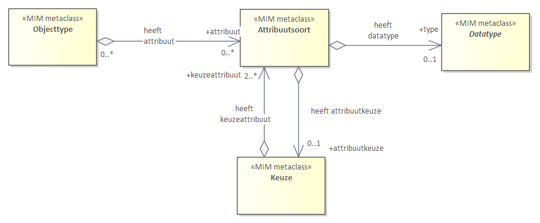
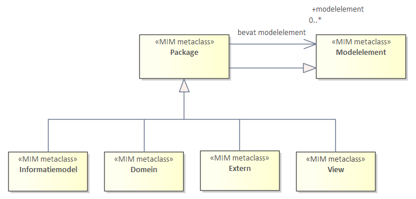

## Metamodel Algemeen

Dit hoofdstuk beschrijft het metamodel in diagramvorm en in tekst. De eerste
paragraaf bevat een diagram, die het overzicht van de modelelementen aangeeft,
alsmede hun onderlinge verhouding. Deze modelelementen worden gebruikt bij het maken van een
informatiemodel. Voorbeelden van modelelementen zijn: objecttype, attribuutsoort, relatiesoort,
maar denk ook datatypen of aan metadata. In de paragrafen hierna worden alle modelelementen beschreven en toegelicht.

Uitgangspunten voor het metamodel zijn:
- De modelelementen worden eerst uitgelegd zonder een specifieke specificatietaal te
gebruiken. Dit is zodat we hierna kunnen aangeven hoe je het modelelement.
uitdrukt per specifieke specificatietaal, te weten in UML of in W3C-specificatietechnieken.
- Een toolonafhankelijke beschrijving van het metamodel.
Verder is er, omdat VNG Realisatie, Kadaster en Geonovum en veel andere organisaties Sparx EA
gebruiken, aanvullend aangegeven hoe het metamodel in Enterprise Architect
toegepast wordt. Hierdoor borgen we deze relatie.
- Uniforme toepassing van het metamodel in informatiemodellen. Anders gezegd, uitbreiden mag, afwijken niet,
maak voor hetzelfde doel geen alternatieve constructies.
- Datatypen zijn onderdeel van het metamodel en beschrijven de structuur van de data, maar niet
de semantiek/betekenis. De aanbeveling is dan ook om eerst een informatiemodel
te maken zonder datatypen. De regel is dat als alle datatypen uit het model.
worden weggelaten, er geen semantische betekenis verloren mag gaan.
- Elk modelelement heeft een naam en een eigen MIM metaclass, waaraan je het modelelement overal kan herkennen.

*Toelichting metaclass*   
Alle modelelementen zijn een metaklasse in het metamodel. Hiermee wordt aangegeven dat het niet een klasse betreft
in een informatiemodel, zoals de klasse Persoon, maar dat het om de classificatie gaat dat de Persoon een Objecttype is,
oftewel dat de klasse Persoon van de metaklasse Objecttype is. Vandaar de term metaclass.

De metaklassen worden ook gebruikt om aan te geven hoe deze zich verhouden tot de metaklassen
van UML en W3C, in de volgende hoofdstukken.

Bij het maken van een informatiemodel modelleer je in feite gewoon met de modelelementen, en geef je aan dat een Persoon een Objecttype is en een geboortedatum een attribuutsoort.  

Hierna volgen eerst diagrammen met de modelelementen, als overzicht. In de paragrafen erna wordt de betekenis van elk van deze modelelementen beschreven, met een definitie en een toelichting en een voorbeeld. Tot slot volgt een paragraaf met metadata die bijgehouden wordt, of kan worden, bij een modelelement. 

### Structuur metamodel

Deze paragraaf bevat een overzicht van het metamodel voor informatiemodellen, kortweg MIM, en geeft alle
modelelementen weer. De beschrijving van de modelelementen staat in de volgende paragraaf.

De modelelementen zijn verdeeld over een aantal diagrammen, die elk een eigen
view op een deel van het metamodel tonen. Elk view toont een aantal van de
modelelementen, inclusief hun onderlinge samenhang.

Alle views samen vormen het metamodel als geheel:
- KERN, met de belangrijkste modelelementen in onderlinge samenhang.
- DATATYPEN, met de in het model te onderkennen soorten datatypen.
- OVERIGE modelelementen, die niet altijd aan de orde zijn.

Elk modelelement heeft een MIM metaclass met een naam. Hieraan is elk
modelelement te herkennen in alle diagrammen en in de tekst en in elke
specificatietaal die een uitdrukking is van dit metamodel.

Bij de modelelementen zijn in deze diagrammen geen beschrijvende kenmerken, de
metagegevens, opgenomen zoals naam, definitie enzovoorts. In de bijlage zijn deze wel
opgenomen.

### Kern

View 1: De kern van een informatiemodel. Deze bestaat uit de volgende modelelementen:

| **MIM metaclass** |
|-------------------|
| Objecttype        |
| Attribuutsoort    |
| Gegevensgroep     |
| Gegevensgroeptype |
| Generalisatie     |
| Relatiesoort      |
| Relatieklasse     |
| Relatierol        |
| Relatierol doel   |

De betekenis van deze modelelementen en de beschrijvingen ervan staat in [Objecttypen en attribuutsoorten](#Objecttypen-en-attribuutsoorten) en in [Relaties](#Relaties).

In diagramvorm:

Kern zonder Metagegevens

De verbindingen tussen de modelelementen geven aan welke combinaties kunnen voorkomen op metamodelniveau. Bijvoorbeeld:
- Een objecttype kan verbonden worden met een attribuutsoort. In een informatiemodel kan je attribuutsoorten dus aan een objecttype toekennen.
- Een objecttype kan *niet* verbonden worden met een gegevensgroeptype. In een informatiemodel kan je dus niet rechtstreeks een gegevensgroeptype aan een object toekennen. In het diagram is te zien dat dit via een gegevensgroep gaat.
- Een objecttype kan verbonden worden met een relatiesoort en deze relatiesoort kan weer verbonden worden met een objecttype. Dit geeft aan dat de relatiesoort een modelelement is dat twee objecttypen met elkaar verbindt.

### Datatypen

View 2: Datatypen. Deze bestaat uit de volgende modelelementen:

| **MIM metaclass**       |
|-------------------------|
| Primitief datatype      |
| Gestructureerd datatype |
| Data element            |
| Enumeratie              |
| Enumeratiewaarde        |
| Referentielijst         |
| Referentie element      |
| Codelijst                |

De betekenis van deze modelelementen en de beschrijvingen ervan staan in [Datatypen](#datatypen-1) en in [Waardelijsten](#waardelijsten). 

In diagramvorm:

Diagram: Datatypen zonder Metagegevens

### Overige

View 3a: constraint en keuze.

| **MIM metaclass** |
|-------------------|
| Constraint        |
| Keuze             |

De betekenis van deze modelelementen en de beschrijvingen ervan staan in [Overige modelelementen](#Overige-modelelementen)

In diagram vorm: 

Diagram: Constraint

**Keuze**

Er zijn vijf situaties/use cases waarin een keuze toegepast wordt:

Beschrijving: [Keuze](#Keuze)

Keuze tussen:
- Use case 1: een keuze tussen datatypen
- Use case 2: een keuze tussen attribuutsoorten
- Use case 3: een keuze tussen attribuutsoorten, als nadere invulling van 1 betekenisvol attribuutsoort
- Use case 4: een keuze tussen relatiesoorten
- Use case 5: een keuze tussen relatiedoelen, als nadere invulling van 1 betekenisvolle relatiesoort

Voor elk geldt een eigen subset van het metamodel.

In diagramvorm: 
 
*Use case 1: Keuze tussen datatypen*

Diagram: Keuze tussen datatypen

*Use case 2: Keuze tussen attribuutsoorten*

Diagram: Keuze tussen attribuutsoorten

*Use case 3: Keuze tussen attribuutsoorten als nadere invulling van 1 betekenisvol attribuutsoort* 

Diagram: Keuze tussen attribuutsoorten binnen een attribuutsoort

*Use case 4: Keuze tussen relatiesoorten*

Diagram: Keuze tussen relatiesoorten

*Use case 5: Keuze tussen relatiedoelen, als nadere invulling van 1 betekenisvolle relatiesoort*

Diagram: Keuze tussen relatiedoelen

*Relatierol*

View 3b: Relatiesoort en relatierol

| **MIM metaclass**     |
|-----------------------|
| Relatierol (abstract) |
| Relatierol bron       |
| Relatierol doel       |

In diagramvorm: 

Diagram: Relatierol

*Externe koppeling*

View 3c: Externe koppelingen. Deze bestaat uit de volgende modelelementen:

| **MIM metaclass** |
|-------------------|
| Externe koppeling |

In diagramvorm: 

*Groepering*

View 3d: Groepering. Deze bestaat uit de volgende modelelementen:

| **MIM metaclass** |
|-------------------|
| Informatiemodel   |
| Domein            |
| Extern            |
| View              |

De betekenis van deze modelelementen en de beschrijvingen ervan staan in [Packages](#packages).

In diagramvorm: 

Diagram: groepering

### Objecttypen en attribuutsoorten  
In deze paragraaf staan alle modelelementen opgesomd, die gebruikt worden bij
het maken van een informatiemodel.

#### Objecten en objecttype  

Een objecttype is een groep van gelijksoortige objecten. Zo zijn Jan en Katrien
allebei objecten die gelijksoortig zijn. Het zijn allebei personen, oftewel het
objecttype van beiden is Persoon. In het informatiemodel nemen we Persoon op met
behulp van het modelelement Objecttype.  

Diagram: [Kern](#Kern)

Om duidelijk(er) te maken wat wordt bedoeld kijken we eerst naar het begrip ‘object’.

>   **Definitie Object**  
>   Een ding, een tastbaar iets, in de werkelijkheid, zoals daarnaar gekeken
>   wordt vanuit een bepaald domein.

*Toelichting:* Met in de werkelijkheid wordt bedoeld dat het om de daadwerkelijke onderwerpen van gesprek gaat, de verzameling van de concrete tastbare dingen waarover we het hebben. Bijvoorbeeld, de persoon Jan, Paleis 't Loo.
Het wordt veelal als niet politiek correct beschouwd mensen als
objecten te zien. In dit kader, de informatievoorziening, beschouwen we evenwel
natuurlijke en niet-natuurlijke personen wel als objecten. ‘Tastbaar’ moet
hierbij ruim geïnterpreteerd worden. Het gaat niet alleen om fysiek herkenbare
objecten zoals auto’s, gebouwen en mensen, ook om zogenaamde virtuele objecten
waarover binnen het domein door betrokkenen gecommuniceerd wordt zoals
kadastrale percelen, (maatschappelijke) activiteiten en processen. Hoe een
‘tastbaar iets’ als een object beschouwd wordt, hangt af van het domein waarvoor
dat ‘tastbaar iets’ relevant is. Zo wordt de gebouwde omgeving in het ene domein
beschouwd als een verzameling gebouwen terwijl een ander domein daarin panden
onderscheidt. Een object is voor een domein relevant als eigenschappen
(kenmerken) daarvan van belang zijn voor het functioneren van dat domein.

>   **Definitie Objecttype**  
>   De typering van een groep objecten die binnen een
>   domein relevant zijn en als gelijksoortig worden beschouwd.

*Toelichting* Jan, Piet en Marie zijn mensen die vanuit het Burgerzaken-domein
beschouwd worden als objecten van het type ‘natuurlijk persoon’. In een ander
domein, ‘de volksmond’, noemen we dit ‘mens’ wat ook een objecttype is. In weer
een ander domein is Jan van het type ‘vergunninghouder’ en Piet en Marie niet,
omdat aan hen (nog) nooit een vergunning verleend is. Objecttypen zijn een
abstractie van de werkelijkheid oftewel we beogen hiermee de werkelijkheid zo
getrouw mogelijk te beschrijven, binnen de context van het domein. Dit staat
geheel los van het vastleggen van gegevens over objecten van een type in een
registratie. Daartoe is veelal een interpretatie nodig (van die werkelijkheid
cq. die objecttypen) naar eenheden die in een registratie vastgelegd kunnen
worden (records, entiteiten e.d.) op basis van andere overwegingen.

De objecten die in het beschouwde domein onderkend worden zijn zelf nooit abstract. Ze behoren altijd tot een concreet objecttype, en niet tot een abstract objecttype. Abstracte objecttypes worden wel gebruikt in de modellering, om generalisaties aan te duiden en de definitie. Zo kan bij het objecttype Pand bijvoorbeeld aangegeven worden dat dit een 'Element in de fysieke leefomgeving' is, en dat deze laatste als een abstract objecctype gezien moet worden (in ons domein). Meer over abstracte objecttypes is beschreven in [Abstracte objecttypes en concrete objecten].  

#### Attribuutsoort en een groepering ervan   

Een attribuutsoort is de metaklasse waarmee kenmerken van een objecttype worden vastgelegd. Het zijn de kenmerken waarvoor gegevens worden bijgehouden.  
Voordat we attribuutsoort definieren kijken we eerst naar het begrip ‘gegeven’.

>   **Definitie Gegeven**  
>   De betekenisvolle formulering van een waargenomen feit, waaraan een waarde
>   kan worden toegekend.

*Toelichting:* Gegevens zijn de objectief waarneembare neerslag of registratie
van feiten op een bepaald medium, zodanig dat deze gegevens uitgewisseld en voor
langere tijd bewaard kunnen worden. Dat kan op papier, in digitale vorm, et
cetera. Met deze gegevens wordt een model (een selectief deel dus) van de
werkelijkheid vastgelegd in de tijd. Ofschoon de werkelijkheid nooit stilstaat,
kan deze door het vastleggen van de gegevens toch worden bevroren.

Voorbeelden van gegevens zijn de waardes ‘Jan’ en ‘1-1-1970’ betreffende de naam en
de geboortedatum van een object van het type Persoon. Merk op dat een gegeven zonder
duidelijkheid over het soort gegeven c.q. de attribuutsoort 'naam' geen informatie biedt.

Een informatiemodel specificeert niet de gegevens zelf. Een gegeven zoals '1-1-1970' noemen we een
attribuut van Jan. In het informatiemodel wordt dit het attribuutsoort 'naam' van een objecttype Persoon.

>   **Definitie Attribuutsoort**  
>   De typering van gelijksoortige gegevens die voor een objecttype van
>   toepassing is.

*Toelichting*
De gegevens Jan en Katrien worden als gelijksoortig gezien en worden daarom ondergebracht in attribuutsoort 'naam'.
Je kan ook zeggen, het objecttype Persoon heeft een attribuutsoort 'naam' en deze is geschikt om gegevens in te plaatsen.

Aan elk objecttype worden nul, één of meer *«*Attribuutsoort**en toegekend. In een informatiemodel
worden alleen voor het domein relevante attribuutsoorten opgenomen bij een objecttype.

Attribuutsoorten worden ook wel kenmerken of eigenschappen genoemd. Dit zijn het ook, maar er zijn
andere kenmerken, zo is een relatiesoort ook een kenmerk of eigenschap.  

#### Gegevensgroep

>   **Definitie Gegevensgroep**  
>   Een typering van een groep van gelijksoortige gegevens die voor een
>   objecttype van toepassing is.

*Toelichting:* Dit modelelement verzorgt de modelmatige aankoppeling van een
gegevensgroeptype aan het objecttype waartoe een gegevensgroeptype onlosmakelijk
behoort.

De groep van gegevens is een kenmerk van een object. De gegevensgroep is een
betekenisvol kenmerk van een objecttype. De gegevensgroep heeft altijd als type
een gegevensgroeptype.

#### Gegevensgroeptype

>   **Definitie Gegevensgroeptype**  
>   Een groep van met elkaar samenhangende attribuutsoorten. Een
>   gegevensgroeptype is altijd een type van een gegevensgroep.

*Toelichting:* De attribuutsoorten van het gegevensgroeptype zijn semantisch
gezien eigenschappen van het objecttype. Echter, vanwege samenhangend gedrag (ze
horen semantisch bij elkaar, ze wijzigen bijvoorbeeld gelijktijdig e.d.) zijn
deze ondergebracht in een apart modelelement. Het onderbrengen van
attribuutsoorten in een groep c.q. in het modelelement gegevensgroeptype, is een
keuze, het is niet perse noodzakelijk. Wanneer deze ondergebracht worden in een
gegevensgroeptype dan zijn/blijven het afzonderlijke kenmerken van het object en
dus attribuutsoorten van het objecttype, maar dan ondergebracht in een
gegevensgroeptype. De gegevensgroep als geheel wordt daarom expliciet niet
gezien als zijnde één attribuutsoort van een object.

*Toelichting:* bijvoorbeeld: in de BRK is een persoon eigenaar van een Schip,
niet van een Motor. In de BRK kan het eigendom van een Motor niet worden
overgedragen aan een ander persoon. In een ander informatiemodel, zoals van een
motorfabriek, zou de Motor wel een objecttype kunnen zijn, omdat het daar wel
hét onderwerp van gesprek is.\*

Een gegevensgroeptype is meestal het type van slechts één gegevensgroep, omdat
de semantiek meestal exclusief is voor één objecttype. Echter, hergebruik is
mogelijk (als de semantiek niet exclusief is voor één objecttype). Voorwaarde
voor hergebruik is dat de definitie (de definitie en toelichting, inclusief alle
metadata aspecten) dan inderdaad gelijk zijn, voor alle objecttypes die
hergebruik maken van het gegevensgroeptype.

Een gegevensgroeptype kan, naast attribuutsoorten, ook weer gegevensgroeptypen
bevatten.

Een gegevensgroeptype is verbonden met een objecttype, via het modelelement
Gegevensgroep.

### Relaties

Verbanden met betekenis, die gelegd zijn tussen modelelementen van het type
objecttype naar het type objecttype, of van een gegevensgroeptype naar een
objecttype.

Diagram: [Kern](#Kern)

#### Generalisatie

>   **Definitie Generalisatie tussen objecttypes**  
>   De typering van het hiërarchische verband tussen een meer generiek en een
>   meer specifiek modelelement van hetzelfde soort, waarbij het meer specifieke
>   modelelement eigenschappen van het meer generieke modelelement overerft. Dit
>   verband is alleen gedefinieerd voor objecttypen en datatypen.

*Toelichting:* Deze toelichting is tweeledig.

Generalisatie tussen objecttypes:

Een generalisatierelatie geeft aan dat bepaalde eigenschappen van een objecttype
(vaak attribuutsoorten en/of relatiesoorten) ook gelden voor de gerelateerde
objecttypen, én dat deze qua semantiek, structuur en syntax gelijk zijn. We
spreken dan van een supertype met subtypen. De modelelementen die generiek
gelden worden in een generiek objecttype, het supertype, gemodelleerd en deze
worden overerft door elk subtype (minimaal twee) die de generalisatie relatie
legt naar dit generieke objecttype.

Generalisatie tussen datatypes:

Het meer specifieke datatype brengt een verbijzondering aan in de vorm van een
meer restrictieve definitie, of een meer restrictief patroon/formeel patroon.

Het andere datatype is bijvoorbeeld een CharacterString, Integer, GM Surface of
DMO en dient als basis voor een zelf te definiëren datatype (zie [Datatype zelf
definiëren](#datatype-zelf-definieren)), zoals een CharacterString Postcode, of
een NietNegatiefGetal.

Deze generalisatie is van toepassing op de volgende datatypes: «Primitief
datatype», «Gestructureerd datatype», «Referentielijst», «Codelijst»,
«Enumeratie».

#### Relatiesoort

>   **Definitie Relatiesoort**  
>   De typering van het structurele verband tussen een object van een objecttype
>   en een (ander) object van een ander (of hetzelfde) objecttype.

*Toelichting:* Objecten hebben eigenschappen die gemodelleerd kunnen worden met
attribuutsoorten maar ook met relatiesoorten naar andere objecttypen. Relatiesoort is de metaklasse waarmee deze eigenschappen worden beschreven. Als het
voor het desbetreffende domein van belang is om die eigenschap te modelleren als
onderdeel van een ander objecttype, dan maakt de relatiesoort die eigenschap
beschikbaar voor het eerstgenoemde objecttype. Bijvoorbeeld, een attribuutsoort
van het objecttype PERSOON zou kunnen zijn ‘Naam geregistreerd partner’ (naast
de attribuutsoort ‘Naam’ van PERSOON). De naam van de geregistreerde partner
komt evenwel ook beschikbaar met een relatiesoort van PERSOON naar PERSOON:
“heeft geregistreerd partnerschap met”. Zie ook het eerder genoemde voorbeeld
van SCHIP en MOTOR.

Wanneer een relatie gebruikt wordt om objecten aan elkaar te verbinden, zonder
dat er eigenschappen over deze relatie worden vastgelegd, dan betreft dit de
MIM-metaclass «Relatiesoort».

#### Relatieklasse

>   **Definitie Relatieklasse**  
>   Een relatiesoort met eigenschappen.

*Toelichting:* De relatieklasse geeft aan dat er een relatie is tussen twee
objecten, waarbij er gegevens over deze relatie vastgelegd moeten worden. De
relatie wordt in dit geval behandeld als een object, met gegevens. De gegevens
over de relatie bestaan alleen zolang de relatie tussen beide objecten bestaat
en zolang elk van beide objecten zelf (nog) bestaan.

*Opmerking*: de gegevens van de relatie worden voor één relatie vastgelegd en
niet voor meerdere relaties tegelijk. Als dit laatste het geval is, dan worden
de gegevens vastgelegd in een «Objecttype». Een CONTRACT kan bijvoorbeeld ook
een afspraak zijn tussen twee óf méér SUBJECTen, waarbij de gegevens van de
relatie voor alle betrokken objecten hetzelfde zijn. CONTRACT wordt dan
gemodelleerd als objecttype, waarbij beschreven wordt wat er moet gebeuren
wanneer één van de SUBJECTen niet meer bestaat.

#### Externe Koppeling

>   **Definitie Externe koppeling**  
>   Een associatie waarmee vanuit het perspectief van het eigen informatiemodel
>   een objecttype uit het ‘eigen’ informatiemodel gekoppeld wordt aan een
>   objecttype van een extern informatiemodel. De relatie zelf hoort bij het
>   ‘eigen’ objecttype.

*Toelichting:*  
Hiermee wordt aangegeven dat er een relatie ligt naar een informatiemodel van een ander domein.
Dit kan rechtstreeks zijn, maar het is ook mogelijk om het objecttype van een ander domein
over te nemen naar het eigen domein, en specifiek te maken voor hoe je deze informatie ziet
vanuit je eigen domein (dit laatste noemen we ook wel een [View](#view).

Zie [Koppelen met een ander informatiemodel](#koppelen-met-een-ander-informatiemodel-externe-koppeling).

#### Relatierol

>   **Definitie Relatierol**  
>   De benaming van de manier waarop een object deelneemt aan een relatie met
>   een ander object.

*Toelichting:* Met relatie wordt in deze de volgende bedoeld: *«Relatiesoort»*,
*«Relatieklasse»* of *«Externe koppeling»*. Voor *«*Generalisatie*»* speelt het
niet. Een relatie heeft een bron kant, die de eigenaar is van de relatie, en
is gericht naar de doel kant. De relatierol kan aan beide kanten een naam en
een definitie krijgen.

>   **Definitie Relatierol bron**  
>   De relatierol die de rol beschrijft van de bron van de relatie.

>   **Definitie Relatierol doel**  
>   De relatierol die de rol beschrijft van het doel van de relatie.

### Waardelijsten

Een datatype waarvan de mogelijke waarden zijn opgesomd in een lijst. De waarde
van een attribuutsoort moet één van de waarden zijn uit de gespecificeerde
waardenlijst.

#### Referentielijst

>   **Definitie Referentielijst**  
>   De representatie van een lijst met een opsomming van de mogelijke domeinwaarden van een
>   attribuutsoort, die buiten het model in een externe waardenlijst worden
>   beheerd. De domeinwaarden in de lijst kunnen in de loop van de tijd
>   aangepast, uitgebreid, of verwijderd worden, zonder dat het informatiemodel
>   aangepast wordt (in tegenstelling tot bij een enumeratie).
>   De representatie bevat een aantal kenmerken, die overgenomen zijn van de specificatie van de externe waardelijst.

*Toelichting:*
De referentielijst bevat representaties van objecten, die in het informatiemodel
niet als een objecttype onderwerp van gesprek zijn. De referentielijst wordt
gebruikt als type van een attribuut van een object.

Het objecttype LAND uit het voorbeeld is opgenomen in een referentielijst en
niet als objecttype. Maar we willen wel de structuur en betekenis van LAND
vastleggen, zodat we er naar kunnen refereren. Een object dat is opgenomen in
een referentielijst heeft daarom veelal meerdere attributen, zoals de naam, de
ontstaansdatum, een omschrijving en de ISO code, die zijn opgenomen in de
referentie lijst.

Alle attributen van gerefereerde objecten uit de referentielijst gelden in de
context van het informatiemodel, mits opgenomen in de *«Referentielijst»*. In de
registratie wordt vaak alleen de referentie ernaartoe opgenomen, omdat het niet
de bedoeling is om alle gegevens over te nemen. De gegevens staan immers al in
de referentielijst en er is bewust gekozen om een referentielijst te modelleren.
Het attribuut van een objecttype dat als type een referentielijst heeft bevat in
de registratie daarom (vaak) alleen een referentie naar een object uit de lijst.

#### Referentie element

>   **Definitie Referentie element**  
>   Een eigenschap van een object in een referentielijst in de vorm van een gegeven.

*Toelichting:*
Een referentie element kan uniek zijn, zoals een code, en is dan op zichzelf
geschikt om gebruikt te worden als referentie (zoals bedoeld in de definitie van
Referentielijst). Bij het referentie element kan een definitie en toelichting worden opgenomen, die aangeven hoe de externe waardelijst in het eigen informatiemodel gebruikt wordt.

#### Enumeratie

>   **Definitie Enumeratie**  
>   Een datatype waarvan de mogelijke waarden limitatief zijn opgesomd in een statische lijst.

*Toelichting:* In de registratie krijgt een attribuut één van deze waarden. De
lijst is een statische lijst met constanten (meerdere attributen, zoals bij een
referentielijst, zijn nooit aan de orde).

#### Enumeratiewaarde

>   **Definitie Enumeratiewaarde**  
>   Een gedefinieerde waarde, in de vorm van een eenmalig vastgesteld constant gegeven.

*Toelichting:*
De waarde van de data zelf. Bijvoorbeeld: Plein, Brug, Spoor, M (man).  
Alleen deze waarde mag gebruiken worden.

#### Codelijst

>   **Definitie Codelijst**  
>   De representatie van een lijst met een opsomming van de mogelijke domeinwaarden van een
>   attribuutsoort, die buiten het model in een externe waardenlijst worden
>   beheerd. De domeinwaarden in de lijst kunnen in de loop van de tijd
>   aangepast, uitgebreid, of verwijderd worden, zonder dat het informatiemodel
>   aangepast wordt (in tegenstelling tot bij een enumeratie).
>   De representatie bevat geen kenmerken, voor alle kenmerken wordt verwezen naar de specificatie van de externe waardelijst.

*Toelichting:* Zowel referentielijsten als codelijsten zijn in feite
waardenlijsten. In tegenstelling echter tot de referentielijst wordt een
codelijst *niet* in het informatiemodel beschreven, omdat de definitie en
semantiek geheel in de externe waardenlijst staat en niet (nader) geduid hoeft
te worden in het informatiemodel zelf. Een codelijst heeft in het informatiemodel
daarom geen attributen (en zou voor de definitie alleen hoeven te refereren naar
de definitie bij de extern gepubliceerde waardenlijst, maar voor het gemak is de
definitie wel opgenomen als metagegeven in dit metamodel). De extern
gepubliceerde waardenlijst bevat, naast gewone attributen, ook altijd één
specifiek attribuut, met daarin de domeinwaarden die gebruikt mogen/moeten
worden in de registratie. In het gebruik is een Codelijst daarom analoog aan een
Enumeratie. Welk specifiek attribuut dit is en wat de betekenis daarvan is staat
in de codelijst zelf gedefinieerd.

### Datatypen

>   **Definitie Datatype**  
>   Een beschrijving van de structuur waaraan een waarde, oftewel de data zelf, aan moet voldoen.

*Toelichting:* Zie ook [Objecttypen en attribuutsoorten](#objecttypen-en-attribuutsoorten).
Bij elke «Attribuutsoort» wordt gespecificeerd aan welk datatype de data c.q. de
waarde die hiervoor vastgelegd wordt moet voldoen. Het datatype wordt gebruikt
als type van een attribuutsoort.

Anders gezegd, Datatypes zijn veelal herbruikbaar en kunnen gespecificeerd
worden bij diverse «Attribuutsoort»-en.

Diagram: [Datatypen](#Datatypen)

#### Primitief datatype

Een standaard datatype, zoals bekend in vele
specificatietalen, dat de structuur van een gegeven beschrijft. Het metamodel
volgt waar mogelijk de definities zoals beschreven in ISO standaarden (zie
§3.1). Deze datatypes hebben altijd al een naam en definitie gekregen vanuit
deze standaarden en deze worden gebruikt. Deze worden niet door de modelleur
gecreëerd en hebben daarom geen MIM metaclass.

>   **Definitie Primitief datatype**  
>   Een in het eigen model gedefinieerd datatype die gebaseerd is op een
>   PrimitiveType, met een eigen naam en definitie.

NB: Wanneer het datatype Postcode landelijk zodanig beschikbaar is gemaakt zodat
hier gebruik van gemaakt kan worden in het model, dan hoeft Postcode niet meer
in het eigen model opgenomen te worden.

*Toelichting:* Een primitief datatype is een datatype zonder verdere
specificatie over de structuur. Dit datatype is enkelvoudig, oftewel niet
samengesteld, en wordt ook wel simpel datatype genoemd. Dit datatype kent daarom
zelf geen eigen modelelementen zoals een «Data element».

Wanneer een Primitief datatype wordt gespecificeerd, dan heeft deze standaard
als primitive datatype een CharacterString.

Een informatiemodel definieert datatypes als er behoefte is aan een datatype dat
eenmalig gedefinieerd wordt en op meerdere plekken in het model gebruikt moet
kunnen worden met altijd exact dezelfde structuur en waardenbereik (zie ook
‘patroon’ in [Domeinwaarden of lijsten](#domeinwaarden-of-lijsten)). Dit
datatype, met een eigen naam, wordt vervolgens gebruikt als type van een
attribuutsoort.

#### Gestructureerd datatype

>   **Definitie Gestructureerd datatype**  
>   Specifiek benoemd datatype dat de structuur van een gegeven beschrijft,
>   samengesteld uit minimaal twee elementen die in samenhang betekenisvol zijn.

*Toelichting:*

De waarde van het attribuutsoort verkoopprijs met gestructureerd datatype bedrag
is uitgedrukt in een combinatie van een som en valuta zoals 35 euro. De
introductie van één datatype Bedrag, uitgedrukt in som en valuta, legt dus vast
dat som en valuta onlosmakelijk met elkaar zijn verbonden.

De eigenschappen in het Gestructureerd datatype tezamen zijn identificerend (een
Gestructureerd datatype “identificeert zichzelf”, zoals er maar per definitie
één “1 liter” bestaat, één 35 euro en één datum 6 april 2017, met per definitie
altijd dezelfde betekenis:

-   Een blik olie heeft een inhoud van **7 liter**, kost **35 euro**, en is
    verkocht op **6 april 2017**.

-   Piet heeft **1 liter** bloed gedoneerd, daarvoor **35 euro** vergoeding
    gekregen, op **6 april 2017**.

Het identificerend zijn geldt bijvoorbeeld niet voor Jan Jansen. Er zijn
meerdere personen met deze naam en dat zijn verschillende personen (Jan Jansen
is dan ook een gegevensgroeptype Naam met voornaam Jan en achternaam Jansen en
geen Gestructureerd datatype).

#### Data element

>   **Definitie Data element**  
>   Een onderdeel/element van een Gestructureerd datatype die als type een datatype heeft.

*Toelichting:* Het data element is een eigenschap van een Gestructureerd
datatype en beschrijft de structuur van een gegeven. Het is niet een eigenschap
van een object en niet hetzelfde als een attribuutsoort.

Het data element beschrijft in combinatie met andere data-elementen de structuur
van een gegeven en heeft zelf een datatype. Dit datatype is meestal een
primitief datatype.

### Packages

>   **Definitie Package**  
>   Een package is een benoemde en begrensde verzameling/groepering van modelelementen.

#### Informatiemodel

>   **Definitie Informatiemodel**  
>   De groepering van alle modelelementen waaruit het informatiemodel is opgebouwd. Het informatiemodel als geheel.

*Toelichting:*
Het informatiemodel is een package, te weten het hoofdpackage van het informatiemodel, waar alle
subpackages die een informatiemodel beschrijven onder vallen, zoals Domein en View en extern.
Het informatiemodel wordt verder beschreven met metadata, zoals de aanduidig van het domein wat in het informatiemodel is gemodelleerd. Het is gangbaar om de naam van het informatiemodel te beginnen met IM, maar dit is niet verplicht.    

<aside class='example'>
    Voorbeeld: IMKAD, of IMBAGLV.
</aside>

Het domein wat hier gemodelleerd is, is het domein adressen en gebouwen, oftewel de BAG.

#### Domein
Een informatiemodel kan onderverdeeld worden in meerdere packages, waarbij aangegeven wordt dat
deze de modellering van de informatie van het domein bevatten.

>   **Definitie Domein**  
>   Een groepering van constructies die een semantisch samenhangend gedeelte van
>   een informatiemodel beschrijven.

*Toelichting:*
Waar het informatiemodel het hoofdpackage is, zijn dit de subpackages.  
Er zijn meerdere soorten packages. Om onderscheid te maken tussen packages waarin het domein gemodelleerd is, en andere opackages, heeft dit modelelement de naam Domein gekregen. Je zou ook kunnen zeggen, het informatiemodel bestaat uit de volgende subdomeinen.

<aside class='example'>
    Voorbeeld: Recht, of Stukken. De BRK houdt deze domein informatie in aparte packages apart bij, voor het overzicht, en om de packages afzonderlijke te kunnen aanpassen, zonder impact op de andere packages.     
</aside>

#### Extern

>   **Definitie Extern**  
>   Een groepering van constructies die een externe instantie beheert en
>   beschikbaar stelt aan een informatiemodel en die in het informatiemodel
>   ongewijzigd gebruikt worden.

<aside class='example'>
    Voorbeeld: het Externe package NEN3610 met datatype NEN3610ID. Het datatype van
    attribuutsoort Identificatie wegdeel in RSGB verwijst naar het datatype
    NEN3610ID zoals opgenomen in het Externe package.
</aside>

#### View

>   **Definitie View**  
>   Een groepering van objecttypen die gespecificeerd zijn in een extern
>   informatiemodel en vanuit het perspectief van het eigen informatiemodel
>   inzicht geeft welke gegevens van deze objecttypen relevant zijn binnen het
>   eigen informatiemodel.

<aside class='example'>
    IMKAD-BRP. Een aantal van de gegevens uit BAG objecten uit de
    basisregistratie BAG zijn relevant voor de basisregistratie Kadaster. De
    definities van de BAG worden gevolgd. Vanuit modelleringsperspectief wordt dit
    gezien als een view.
</aside>

### Overig

Diagram: [Overige](#Overige)

#### Constraint

>   **Definitie Constraint**  
>   Een constraint is een conditie of een beperking, die over een of meerdere
>   modelelementen uit het informatiemodel geldt.

*Toelichting:* Een constraint kan vastgelegd worden bij alle modelelementen. Echter, meestal
komt een constraint voor bij een objecttype, om te aan te geven dat de
constraint geldt voor 2 (of meer) kenmerken van een objecttype, of om een
bijzondere specificatie toe te voegen die niet via de bestaande modelelementen gelegd kan worden.

Een constraint wordt altijd in gewone tekst omschreven en kan optioneel als formele specificatie worden aangegeven.

#### Keuze

Een *Keuze* is een opsomming van meerdere modelelementen, waarbij er maar van één tegelijkertijd sprake kan zijn.

*Toelichting:* Er kan altijd maar één van de mogelijkheden gekozen worden. De keuze is voor een aantal use cases een alternatieve manier voor het modelleren van een constraint.

Een *Keuze* kan op meerdere plekken gebruikt worden, en maakt het mogelijk waar in het metamodel normaal gesproken maar één mogelijkheid bestaat, een opsomming te geven van meerdere mogelijkheden, waarbij in een concreet geval altijd precies één van deze mogelijkheden wordt gebruikt.

Een belangrijk voordeel van deze modellering is dat de kardinaliteiten zuiver gehouden kunnen worden. Anders gezegd, er kan mee voorkomen worden dat een kardinaliteit van bijvoorbeeld twee kenmerken eerst optioneel gemaakt moet worden en dat hierna via een constraint deze toch weer verplicht gemaakt moeten worden, voor precies één van de mogelijkheden. Het is aan de modelleur om te kiezen voor een constraint of een Keuze.

Dit document beschrijft een aantal use cases waarin het modelleren met een *Keuze* van toegevoegde waarde is. Zonder een dergelijke modelconstructie zou het nodig moeten zijn om met een expliciete constraint de keuze aan te geven.

Bij de use cases gaat het over meerdere kenmerken, waartussen een keuze gemaakt moet worden omdat er van precies 1 sprake is/mag zijn. Dit is in MIM een keuze tussen twee (of meer) modelelementen. In de verzamelingenleer noemen we dit een XOR situatie. Hierbij is het vooral van belang dat er als gevolg van de modellering van een keuze in plaats van constraint er geen nieuwe kenmerken mogen ontstaan en ook geen kenmerken mogen wegvallen. De kenmerken van het object blijven gelijk.

**Use case 1: een keuze tussen datatypen**

Een objecttype heeft een attrituutsoort en het datatype hiervan is ofwel datatype D1 ofwel datatype D2. In MIM modelleren we daarom 1  attribuutsoort met als datatype een keuze tussen het datatype D1 en het datatype D2. Het maken van deze keuze is verplicht.

Voorbeeld: *Attribuutsoort* geometrie als kenmerk van een objecttype. Dit is een keuze uit *Datatype* Line of *Datatype* Polygon. De opsomming van beide keuzemogelijkheden noemen we de *Keuze* LineOrPolygon. De aanhaking aan het attribuutsoort geometrie gebeurd door aan te geven dat LineOrPolygon het type is van geometrie. 

Het is niet de bedoeling om twee attribuutsoorten te modelleren met elk een datatype en de attribuutsoorten optioneel te maken.

In dit voorbeeld vormt LineOrPolygon de *Keuze* als geheel. De datatypes zelf zijn de keuze mogelijkheden, maar blijven in de modellering van de metaclass datatype en behoren in deze zin niet tot de modellering van de metaclass keuze.  

Zonder de mogelijkheid van keuze, zou je te maken krijgen met twee attribuutsoorten met bijbehorend datatype. Echter, in dat geval mogen de attribuutsoorten niet dezelfde naam hebben, aangezien deze bij hetzelfde objecttype horen. Ook zou de kardinaliteit niet kloppen: die zou dan [0..1] moeten worden, maar dat doet geen recht aan het feit dat er één verplicht aanwezig moet zijn, en er ook geen twee naast elkaar mogen zijn. De werkelijke kardinaliteit is [1..1].

**Use case 2: een keuze tussen attribuutsoorten**
Er is sprake van ofwel attribuutsoort A1 ofwel attribuutsoort A2. In MIM modelleren we daarom een keuze tussen de 2 attribuutsoorten A1 en A2. Het maken van deze keuze is verplicht.

Voorbeeld: bij een objecttype "Betalingsopdracht" moet naast het bedrag ook een betalingskenmerk worden opgenomen of een omschrijving. Eén van beide moet worden ingevuld. Het is niet toegestaan dat beide velden worden ingevuld. 

We modelleren daarom een *Keuze* 'BetalingskenmerkOfOmschrijving' met daarin een *Attribuutsoort* betalingskenmerk en een *Attribuutsoort* omschrijving.

Het is bij deze use case niet de bedoeling om een derde attribuutsoort, zoals BetalingskenmerkOfOmschrijving, te introduceren als attribuutsoort van het objecttype. De aanhaking van de *Keuze* 'BetalingskenmerkOfOmschrijving' is daarom aan het **objecttype**.

In dit voorbeeld vormt BetalingskenmerkOfOmschrijving en de aanhaking ervan op het objecttype de *Keuze* als geheel. De attribuutsoorten zelf zijn de keuze mogelijkheden, maar blijven in de modellering van de metaclass attribuutsoort en behoren in deze zin niet tot de modellering van de metaclass keuze.  

Zonder de mogelijkheid van keuze zouden beide attribuutsoorten opgenomen zijn bij het objecttype als optionele velden, met een constraint dat een van beide gevuld moet zijn. Nadeel hiervan is dat de kardinaliteit dan niet erg duidelijk gemodelleerd is: die zou dan voor beide attribuutsoorten [0..1] moeten worden, maar dat doet geen recht aan het feit dat er één verplicht aanwezig moet zijn, en er ook geen twee naast elkaar mogen zijn. De werkelijke kardinaliteit voor een gekozen attribuutsoort is [1..1]. Met een constraint is dit te specificeren en derhalve ook op zich wel correct te modelleren, maar met een modellering van een keuze is dit veel duidelijker.

**Use case 3: een keuze tussen attribuutsoorten, als nadere invulling van een betekenisvol attribuutsoort van een objecttype**
Er is sprake van ofwel attribuutsoort A0 en aanvullend hierbij een keuze tussen ofwel attribuutsoort A1 ofwel attribuutsoort A2. In MIM modelleren we daarom voor A1 en A2 een keuze tussen de 2 attribuutsoorten. Het maken van deze keuze is verplicht.

Bij een objecttype "Betalingsopdracht" moet een bedrag en een *beschrijving* worden opgenomen. Deze beschrijving heeft betekenis voor het objecttype, als eigenschap. Verder moet er voor de beschrijving aanvullend een keuze worden gemaakt tussen een *beschrijving in de vorm van een betalingskenmerk* OF een *beschrijving in de vorm van een omschrijving*. Beide worden (ook) gezien als attribuutsoorten. Het is niet toegestaan dat beide velden worden ingevuld: alleen een betalingskenmerk, of alleen een omschrijving. 

We modelleren daarom een *Keuze* 'BetalingskenmerkOfOmschrijving' met daarin een *Attribuutsoort* betalingskenmerk en een *Attribuutsoort* omschrijving. Het is bij deze use case niet de bedoeling om het attribuutsoort beschrijving kwijt te raken in de modellering. De aanhaking van de *Keuze* 'BetalingskenmerkOfOmschrijving' is daarom aan het **attribuutsoort**. De aanhaking aan het attribuutsoort beschrijving gebeurd door aan te geven dat BetalingskenmerkOfOmschrijving het type is van beschrijving. 

In dit voorbeeld vormt BetalingskenmerkOfOmschrijving de *Keuze* als geheel. De attribuutsoorten zelf zijn de keuze mogelijkheden, maar blijven in de modellering van de metaclass attribuutsoort en behoren in deze zin niet tot de modellering van de metaclass keuze.  

*Opmerking: use case 2 en 3 zijn voor een groot deel overeenkomstig. De overeenkomst is dat de keuze tussen de twee attribuutsoorten betalingskenmerk en omschrijving hetzelfde gemodelleerd wordt, als een keuze, met bijvoorbeeld de naam BetalingskemerkOfOmschrijving. Het verschil zit in de aanhaking.

**Use case 4: een keuze tussen relatiesoorten**
Er is sprake van ofwel relatiesoort R1 ofwel relatiesoort R2. In MIM modelleren we daarom een keuze tussen de 2 relatiesoorten R1 en R2. Het maken van deze keuze is verplicht.

Voorbeeld: een objecttype "Persoon" kan getrouwd zijn met een ander persoon, of een geregistreerd partnerschap hebben met een ander persoon. Het is niet mogelijk dat een persoon en getrouwd is en een geregistreerd partnerschap heeft met de andere persoon. We modelleren daarom een *Keuze* 'soort relatie' met daarin een *Relatiesoort* getrouwd en een *Relatiesoort* geregistreerd partnerschap.

Zonder de mogelijkheid van keuze zouden beide relatiesoorten opgenomen zijn bij het objecttype, met een optionele kardinaliteit. Hiermee is het echter niet duidelijk zichtbaar dat er slechts één van de twee relatiesoorten aanwezig mogen zijn. Met een constraint is dit op zich wel correct te modelleren, aan te geven dat precies 1 van beide verplicht is, maar met een modellering van een keuze is dit veel duidelijker.

In het voorbeeld vormt 'soort relatie' en de aanhaking ervan op het objecttype Persoon de keuze als geheel. De relatiesoorten zelf zijn de keuze mogelijkheden, maar blijven in de modellering van de metaclass relatiesoort en behoren in deze zin niet tot de modellering van de metaclass keuze.  

*Opmerking: use case 2 en 4 zijn vergelijkbaar, bij use case 2 gaat het om attribuutsoorten, bij use case 4 gaat het om relatiesoorten. Vanuit het perspectief van keuze gaat het in beide gevallen om een keuze tussen twee modelelementen die verbonden zijn met een objecttype. Het is ook mogelijk om een keuze te hebben tussen attribuutsoort OF een relatiesoort. Dit werkt analoog, maar is in de use cases (nog) niet uitgewerkt.*  

**Use case 5: een keuze tussen relatiedoelen, als nadere invulling van een betekenisvolle relatiesoort van een objecttype**
Er is sprake van een relatiesoort R0 en aanvullend hierbij een keuze tussen relatiedoel D1 of relatiedoel D2. In MIM modelleren we daarom een keuze tussen de 2 relatiedoelen D1 en D2. Het maken van deze keuze is verplicht.

Voorbeeld: een objecttype "Vervoersmiddel" heeft een eigenaar. Dit kan een persoon zijn, of een bedrijf, maar niet beiden. Er is sprake van één eigenaar" en een keuze tussen relatiedoel persoon (naar objecttype Persoon) en relatiedoel bedrijf (naar objecttype Bedrijf). We modelleren daarom 1 *Relatiesoort* eigenaar en aanvullend met een *Keuze* PersoonOfBedrijf met twee relatiedoelen, een naar persoon en een naar bedrijf.  

Het is bij deze use case niet de bedoeling om twee nieuwe relatiesoorten, eigenaar_persoon en eigenaar_bedrijf, te introduceren en al zeker niet om de relatiesoort eigenaar kwijt te raken. We modelleren daarom 1 relatiesoort met de naam eigenaar en een *Keuze* tussen relatiedoelen. 

In het voorbeeld vormen PersoonOfBedrijf en de twee relatiedoelen tezamen de keuze als geheel. De relatiesoorten zelf zijn de keuze mogelijkheden, maar blijven in de modellering van de metaclass relatiesoort en behoren in deze zin niet tot de modellering van de metaclass keuze.  

## Specificatie metagegevens informatiemodel

### Metagegeven: **Domein**

>   **Definitie Informatiedomein**  
>   Aanduiding van het functionele domein waartoe het informatiemodel behoort.

*Toelichting* Bijvoorbeeld: brk

*Toepassing*: informatiemodel (verplicht)

### Metagegeven: **Informatiemodel type**

>   **Definitie Informatiemodel type**  
>   De beschrijving van de aard van het informatiemodel, hoe het geinterpreteerd
>   moet worden.

*Toelichting* Bijvoorbeeld: conceptueel, logisch, technisch. Zoals bedoeld in: [Typen Informatiemodellen](#typen-informatiemodellen)

*Toepassing*: informatiemodel (verplicht)

### Metagegeven: **Relatiemodelleringstype**

>   **Definitie Relatiemodelleringstype**  
>   Aanduiding van een in MIM gedefinieerd alternatief voor een
>   modelleringswijze, en welke keuze hierbij is gemaakt.

*Toelichting* Bijvoorbeeld: "Relatiesoort leidend" of "Relatierol leidend". Dit
betreft de keuze die je maakt voor het in paragraaf [Alternatieven](#alternatieven) gekozen
alternatief. Er moet een keuze gemaakt worden.

*Toepassing*: informatiemodel (verplicht)

### Metagegeven: **MIM versie**

>   **Definitie MIM versie**  
>   De versie van de MIM specificatie die gebruikt is om het informatiemodel in
>   uit te drukken.

*Toelichting* Bijvoorbeeld: 1.0.1 of 1.1

*Toepassing*: informatiemodel (verplicht)

### Metagegeven: **MIM extensie**

>   **Definitie MIM extensie**  
>   De aanduiding van een extensie op MIM.

*Toelichting* Bijvoorbeeld: Kadaster of NEN3610:2020

*Toepassing*: informatiemodel (optioneel)

### Metagegeven: **MIM taal**

>   **Definitie MIM taal**  
>   De aanduiding van de taal die gebruikt is voor de modelelementen.

*Toelichting* Bijvoorbeeld: NL, EN

*Toepassing*: informatiemodel (optioneel)

## Specificatie metagegevens kenmerken

Elk modelelement kent een aantal metagegevens, die bepaalde aspecten van het
modelelement specificeren. Zo is er de *naam* van het modelelement, bijvoorbeeld
het objecttype met als *naam* Pand en een bijbehorende *definitie*, of de *Datum
opname* van het modelelement in het informatiemodel, bijvoorbeeld *Datum opname*
1-1-2012.

Merk op dat een aantal van deze metagegevens al meegenomen worden in een
specificatietaal.

Bijvoorbeeld het objecttype met de naam Pand wordt in UML gemodelleerd als
‘*Named element’* met als ‘*Name’* Pand (in UML 1.4 heette dit nog UML-Class,
met een propery ‘*Name’*).

Een aantal andere metagegevens, zoals de eerder genoemde *Datum opname* met
waarde 1-1-2012. worden als aparte data vastgelegd, in UML gebeurd dit in een
‘*Tagged value*’. In Linked data gebeurd dit met een ‘*owl:DatatypeProperty*’.

Merk op, de metadata aspecten zijn specifiek voor elk modelelement apart. Dus
als er in H2.2 sprake is van een generalisatie, dan worden deze metadata niet
overerft (en de ingevulde waardes worden uiteraard zeker niet overerft). De MIM
metaclass Union erft dus geen metagegevens, zoals patroon, van MIM metaclass
Datatype.

Voor de duidelijkheid zijn een aantal metagegevens verplicht gemaakt, om te
voorkomen dat een niet ingevulde waarde verschillende betekenissen heeft, zoals:
niet aan de orde (wat zo is bij optionele gegevens), nog niet ingevuld, leeg
betekent zie default waarde, of dat het onbekend is welk van deze voorgaande
betekenissen het is.

Hieronder volgen eerst de algemene metagegevens. Dit zijn metagegevens zoals
*Naam*, *Definitie* en *Datum opname*, en deze komen bij meerdere modelelementen
voor. De definitie en toelichting van deze metagegevens worden in deze paragraaf
gespecificeerd. In de paragrafen hierna wordt vervolgens naar deze paragraaf
verwezen. Specifieke metagegevens die maar één keer voorkomen zijn bij het
modelelement zelf beschreven.

### Metagegeven: **Naam**

>   **Definitie Naam**  
>   De naam van een modelelement.

*Toelichting*

Bijvoorbeeld: Pand is de naam van het modelelement objecttype, bouwjaar is de
naam van het modelelement attribuutsoort. De modelelementen zijn limitatief
opgesomd in het hoofdstuk [Betekenis modelelementen](#betekenis-modelelementen).  
(en eventueel zijn in een uitbreiding extra modelelementen limitatief opgesomd).

*Toepassing*: alle modelelementen.

### Metagegeven: **Definitie**

>   **Definitie Definitie**  
>   De beschrijving van de betekenis van dit modelelement.

*Toelichting*

Bijvoorbeeld: Een Pand is de kleinste, bij de totstandkoming functioneel en
bouwkundig-constructief zelfstandige eenheid die direct en duurzaam met de aarde
is verbonden en betreedbaar en afsluitbaar is.

De definitie volgt, indien aanwezig, de catalogus van de desbetreffende
(basis)registratie of informatiemodel, mits deze het modelelement definieert
vanuit een informatie en informatiemodel perspectief (er zijn ook andere
definities mogelijk vanuit andere perspectieven, zoals vanuit een juridisch
perspectief, of vanuit het perspectief van een model van begrippen, zoals
genoemd in de paragraaf [Typen informatiemodellen](#typen-informatiemodellen).
Dergelijke definities kunnen hetzelfde zijn, of op het moment hetzelfde, of
verschillend, of aanvullend op elkaar. Het is aan de beheerder van het
informatiemodel om hier zorgvuldig mee om te gaan).

*Toepassing*: alle modelelementen.

### Metagegeven: **Alias**

>   **Definitie Alias**  
>   De alternatieve weergave van de naam.

*Toelichting*

Als de naam van het modelelement in het informatiemodel kan bijvoorbeeld zonder
spaties is geschreven, dan kan in de alias de naam in natuurlijke taal worden
opgenomen. Bijvoorbeeld: OnroerendeZaak heeft als alias Onroerende zaak. De
alias is bedoeld als alternatieve schrijfwijze, en heeft verder geen andere
betekenis. De alias is optioneel (zie verder ook
[Naamgevingsconventies](#afspraken-rondom-naamgeving-en-definities)).

Bijvoorbeeld: OnroerendeZaak heeft als alias Onroerende zaak.

*Toepassing*: alle modelelementen die een naam hebben, uitgezonderd de
**Enumeratiewaarde**. NB: Een uitzondering is gemaakt voor UML modellen voor de
UML-EnumerationLiteral. De ‘naam’ betreft hier een daadwerkelijk waarde, waarin
de naam gelijk staat aan de waarde. Het is daarom expliciet ongewenst om
hiervoor een alternatieve naamgeving te gebruiken. De alias wordt hier, mede
daarom, gebruikt voor (alleen) de modellering van het metadata aspect Code,
welke aanvullend is op naam (niet een alternatief van naam).

### Metagegeven: **Toelichting**

>   **Definitie Toelichting**  
>   Een inhoudelijke toelichting op de definitie, ter verheldering of nadere duiding.

*Toelichting*

Bijvoorbeeld: een aantal treffende voorbeelden (waardes) van het kenmerk van het
object.

*Toepassing*: alle modelelementen met een definitie.

### Metagegeven: **Begrip**

>   **Definitie Begrip**  
>   Verwijzing naar een begrip, vanuit een modelelement, waarmee wordt
>   aangegeven op welk begrip, of begrippen, het informatiemodel element is
>   gebaseerd. De verwijzing heeft de vorm van een term of een URI.

*Toelichting*

Hiermee wordt aangegeven hoe een informatiemodel element zich verhoudt tot de
begrippen uit het begrippenkader, zoals genoemd in paragraaf [Typen Informatiemodellen](#typen-informatiemodellen).
Dit is niet een 1 op 1 relatie. Voor meer informatie hierover, zie hoofdstuk [Afspraken & Regels](#afspraken-regels).

Bijvoorbeeld: Perceel of
http://brk.basisregistraties.overheid.nl/id/begrip/Perceel

*Toepassing*: alle modelelementen met een naam, met uitzondering van packages en
constraint.

### Metagegeven: **Herkomst**

>   **Definitie Herkomst**  
>   De registratie of het informatiemodel waaraan het modelelement ontleend is
>   dan wel de eigen organisatie indien het door de eigen organisatie toegevoegd is.

*Toelichting*

Bijvoorbeeld: de herkomst van het kenmerk *begrenzing* van een Perceel heeft als
waarde: ‘BRK’. BRK staat dan bijvoorbeeld in de bijbehorende documentatie
uitgelegd als: de basisregistratie Kadaster.

Er wordt expliciet niet bedoeld van welke informatievoorziening of registratie
de *data* is overgenomen. Het gaat er bij dit metagegeven expliciet om uit welk
domein of bron het modelelement zijn herkomst vindt. Voor basisregistraties is
de herkomst altijd het eigen informatiemodel. Dit metagegeven is vooral van
belang als het modelelement is overgenomen uit een ander informatiemodel.

Bijvoorbeeld: de herkomst van het kenmerk *woonadres*, wat bijvoorbeeld een
«Relatiesoort» is van een Persoon in de basisregistratie Personen naar een
Nummeraanduiding in de basisregistratie Adressen en Gebouwen (BAG), heeft als
herkomst: ‘BRP’ (de basisregistratie Kadaster). Dit kenmerk *woonadres* wordt
bijgehouden in de BRP en de bron kant van de relatie zit in de BRP. De
Nummeraanduiding zelf heeft in de BAG veelal als herkomst: BAG. Mochten echter
de adresgegevens niet (direct of indirect) uit de BAG komen, maar bijvoorbeeld
via een eigen inwinningsproces in een eigen registratie worden bijgehouden, dan
de herkomst niet de BAG.

Deze definitie omvat ook de definite van herkomst van de stelselcatalogus (De
registratie in wiens catalogus het objecttype is gespecificeerd (oftewel de
registratie waar het objecttype deel van uitmaakt). Deze specificatie is
toegevoegd omdat het wel duidelijk moet zijn in welke (basis)registratie of
informatiemodel het objecttype).

*Toepassing*: alle modelelementen die een kenmerk (kunnen) zijn van objecttype
(objecttype zelf heeft een eigen definitie van herkomst) en in het
informatiemodel gedefinieerde datatypes (maar niet bij elementen van datatypes).

### Metagegeven: **Herkomst definitie**

>   **Definitie Herkomst definitie**  
>   De registratie of het informatiemodel waaruit de **definitie** is
>   overgenomen dan wel een aanduiding die aangeeft uit welke bronnen de
>   definitie is samengesteld.

*Toelichting*

Meestal staat in dit metagegeven aangegeven 'mijn IM', bijvoorbeeld BRK als
het om het informatiemodel van de BRK gaat.

Maar de herkomst van de definitie van het kenmerk *adres* kan ook als waarde
hebben: ‘BAG’. Of ‘BAG en BRK’, waarbij in de documentatie verder uitgelegd
wordt wat dit betekent, zoals dat de definitie is overgenomen en vervolgens
binnen het eigen informatiemodel verder aangescherpt is, of nader opgesplitst is
in twee aparte definities.

Dit metagegeven is niet bedoeld voor gevallen waarin een definitie alleen
geïnspireerd is door een andere definitie, of de andere definitie daadwerkelijke
dermate herdefinieerd dat de oorspronkelijke definitie niet meer van toepassing
is.

Het gaat erom dat het voor gebruikers helder is hoe informatie die aan dit
informatiemodel voldoet zich verhoudt tot informatie die aan het andere
informatiemodel voldoet. Het metagegeven *herkomst definitie* schept hier
duidelijkheid in.

*Toepassing*: alle modelelementen die het metagegeven **definitie** kennen.

### Metagegeven: **Datum opname**

>   **Definitie Datum opname**  
>   De datum waarop het modelelement is opgenomen in het informatiemodel.

*Toelichting*

Bijvoorbeeld: 1-1-2012.

*Toepassing*: alle modelelementen, uitgezonderd datatype elementen, packages en
overig.

### Metagegeven: **Identificerend**

>   **Definitie Identificerend**  
>   Een kenmerk van een objecttype die aangeeft of deze eigenschap uniek
>   identificerend is voor alle objecten in de populatie van objecten van dit
>   objecttype.

*Toelichting:* objecten hebben, of krijgen, in een administatie of
gegevensvoorziening vaak één identificerend kenmerk. Het kan ook zijn dat een
aantal kenmerken in combinatie identificerend zijn, zoals twee attibuutsoorten
of een attribuutsoort en een relatiesoort. De combinatie met een relatiesoort
wordt alleen gedaan voor objecttypes die zelf geen unieke aanduiding hebben en
daarom deze moeten samenstellen met de unieke aanduiding van een gerelateerde
objecttype.

### Metagegeven: **Indicatie materiële historie**

>   **Definitie Indicatie materiele historie**  
>   Indicatie of de materiële historie van het kenmerk van het object te
>   bevragen is.

*Toelichting*

Bijvoorbeeld: Ja. Met te bevragen wordt bedoeld, er wordt historie bijgehouden
op enerlei wijze, welke op enerlei wijze te bevragen is.

De in te vullen waarde komt uit: zie Tagged values en waardenbereik tagged
values.

Materiële historie geeft aan wanneer een verandering is opgetreden in de werkelijkheid die heeft
geleid tot verandering van de attribuutwaarde. Verdere toelichting,
zie het hoofdstuk [Afspraken & Regels](#afspraken-regels)

*Toepassing*: alle modelelementen die een kenmerk (kunnen) zijn van een
objecttype.

### Metagegeven: **Indicatie formele historie**

>   **Definitie Indicatie formele historie**  
>   Indicatie of de formele historie van het kenmerk van het object
>   bijgehouden wordt en te bevragen is.

*Toelichting*

Bijvoorbeeld: Nee. Met te bevragen wordt bedoeld, er wordt historie bijgehouden
op enerlei wijze, welke op enerlei wijze te bevragen is.

De in te vullen waarde komt uit: zie Tagged values en waardenbereik tagged
values.

Formele historie geeft aan wanneer in de administratie een verandering bekend
is, en is verwerkt. Verdere toelichting, zie het hoofdstuk [Afspraken &Regels](#afspraken-regels).

*Toepassing*: alle modelelementen die een kenmerk (kunnen) zijn van een
objecttype.

### Metagegeven: **Kardinaliteit**

>   **Definitie Kardinaliteit**  
>   De kardinaliteit geeft aan hoeveel keer waarden van dit kenmerk van een
>   object kunnen voorkomen bij een object van het betreffende objecttype.

*Toelichting*

1 : een object heeft altijd dit kenmerk. Bijvoorbeeld: geboortedatum persoon.

1..\*: een object heeft altijd dit kenmerk, het kenmerk kan meerdere malen
voorkomen. Bijvoorbeeld: aantal hoofdstukken in een boek (in dit domein is dat
er altijd minimaal 1).

0..1: is soms niet beschikbaar. Bijvoorbeeld: tussenvoegsel achternaam.

0..\*: is niet altijd beschikbaar, kan meerdere malen voorkomen.  
Bijvoorbeeld: verblijfsobjecten die gelegen zijn in een pand (garagebox 0, huis
1, flat \*).

Indien een attribuutsoort deel uit maakt van een gegevensgroeptype, dan wordt de
kardinaliteit vermeld van het attribuutsoort binnen het gegevensgroeptype. Voor
de uiteindelijke kardinaliteit van hoe vaak een gegeven voorkomt bij het object
moet rekening gehouden worden met de kardinaliteit van de gegevensgroep en met
de kardinaliteit van de attribuutsoort.

Merk op dat het zo kan zijn dat een object het kenmerk wel degelijk heeft/zou
moeten hebben, maar dat het vooralsnog niet gelukt is om dit gegeven in te
winnen of te achterhalen. Het is dan bekend dat het object dit kenmerk wel
degelijk heeft, maar de waarde ervan is onbekend. De kardinaliteit wordt dan
niet van 1 naar 0 gezet, maar er wordt aangegeven dat er sprake is van mogelijk
geen waarde. Meer hierover is beschreven in het hoofdstuk [Afspraken & Regels](#afspraken-regels).

*Toepassing*: alle modelelementen die een kenmerk (kunnen) zijn van een
objecttype.

### Metagegeven: **Authentiek**

>   **Definitie Authentiek**  
>   Aanduiding of het kenmerk een authentiek gegeven betreft.

*Toelichting*

Bijvoorbeeld: Authentiek, Basisgegeven, Landelijk kerngegeven, Gemeentelijk
kerngegeven, Overig.

Authentiek is van toepassing voor bijvoorbeeld het burger service nummer van een
natuurlijk persoon. In de wet van bijvoorbeeld een basisregistratie ligt vast
welke gegevens authentiek zijn. Een kenmerk is authentiek indien de juistheid
(hoogwaardige kwaliteit) van het gegeven gewaarborgd wordt via formele
inwinningsprocessen en wettelijk regelingen. Authentieke gegevens moeten door
alle overheidsinstellingen verplicht en zonder nader onderzoek, worden gebruikt
bij de uitvoering van publiekrechtelijke taken.

De in te vullen waarde komt uit: zie Tagged values en waardenbereik tagged
values.

*Toepassing*: alle modelelementen die een kenmerk (kunnen) zijn van een
objecttype.

### Metagegeven: **Indicatie afleidbaar**

>   **Definitie indicatie afleidbaar**  
>   Aanduiding dat gegeven afleidbaar is uit andere attribuut- en/of
>   relatiesoorten.

*Toelichting*

Bijvoorbeeld: de ‘naam’ van een openbare ruimte, zoals *Burgemeester Baron van
Voerst van Lyndenstraat* , wordt in de verkorte schrijfwijze de ‘verkorte naam’
*Burg Bar v V v Lyndenstr* – dit is een afgeleid gegeven. Bijvoorbeeld de
‘eigenaar’ van een huis kan worden afgeleid uit bepaalde andere gegevens die
binnen het informatiemodel zijn vastgelegd. Het afgeleide gegeven is zelf geen
brongegeven, en moet aangepast worden als de brongegevens aangepast worden. In
de beschrijving van het kenmerk zal aangegeven zijn om welke gegevens het gaat
en eventueel hoe de afleiding plaatsvindt.

*Toepassing*: de modelelementen waarvoor een waarde ingevuld kan worden, te
weten de modelelementen attribuutsoort en relatiesoort.

### Metagegeven: **Indicatie classificerend**

>   **Definitie Indicatie classificerend**  
>   Indicatie dat een attribuutsoort het objecttype waar het bijhoort classificeert in (sub)typen.

*Toelichting*

Een objecttype kan middels een attribuutsoort geclassificeerd worden in subtypen.
Bijvoorbeeld: type gebouw. Een toren, kerk, bunker, zwembad zijn allemaal typen gebouwen.
In een model op niveau 2 kunnen dergelijke typen als objecttypen en specialisaties van het
objecttype gebouw zijn gemodelleerd. Met name op niveau 3 kan het relevant zijn om deze informatie
daadwerkelijk te structureren door expliciet een aspect op te nemen waarmee direct
het type gebouw kan worden vastgelegd, los van de modellering van objecttypen.

Praktisch gezien kan vervolgens gekozen worden om de onderliggende objecttypen niet meer in het model
op te nemen, en slechts dit aspect op te nemen. Ook kan, in combinatie met **indicatie afleidbaar**
dit aspect afgeleid worden uit het meest concrete objecttype, indien dergelijke objecttypen wel zijn gemodelleerd.

De in te vullen waarde komt uit: zie Tagged values en waardenbereik tagged
values.

*Toepassing*: attribuutsoort.

### Metagegeven: **mogelijk geen waarde**

>   **Definitie mogelijk geen waarde**  
>   Aanduiding dat van een aspect geen waarde is geregistreerd, maar dat
>   onduidelijk is of de waarde er werkelijk ook niet is.

*Toelichting*

Bijvoorbeeld: land van herkomst. Elk mens komt uit een land, maar het kan op het
moment onduidelijk zijn welk land dit is. Bijvoorbeeld: RSIN van een
organisatie, voor gegevens in de registratie die ingewonnen zijn voordat het
RSIN bestond. Het RSIN is een verplicht veld in het actuele informatiemodel,
maar voor oude gegevens is de waarde onbekend.

Het gaat er hier om dat het onduidelijk is of de waarde er is, of als het wel
duidelijk is dat er een waarde is/zou moeten zijn, dat het onduidelijk is wat de
waarde dan is. Dit metagegeven geeft dan aan dat het toegestaan is dat deze
onduidelijkheid mag (blijven) bestaan. Veelal mag dit alleen onder bepaalde
voorwaarden, met een opgaaf van reden.

*Toepassing*: de modelelementen waarvoor een waarde ingevuld kan worden, te
weten de modelelementen attribuutsoort en relatiesoort.

### Metagegeven: **bron**

>   **Definitie bron**  
>   Aanduiding van het bronobject in een relatie tussen objecten. Een bronobject
>   heeft middels een relatiesoort een relatie met een doelobject.

*Toelichting*

Bijvoorbeeld: een persoon heeft een postadres. Het postadres is een kenmerk van
een persoon. De persoon is in deze het bronobject van de relatie. Het postadres
is de naam van het kenmerk c.q. de relatie tussen een persoon en een adres en
geeft betekenis aan deze relatie. Het adres is er gewoon en wie hem allemaal
gebruikt als adres en of dit als postadres is of als woonadres of nog iets
anders is voor het adres niet van belang.

*Toepassing*: relaties, oftewel de modelelementen Relatiesoort en Externe
koppeling.

### Metagegeven: **doel**

>   **Definitie doel**  
>   Aanduiding van het gerelateerde objecttype die het eindpunt van de relatie
>   aangeeft. Naar objecten van dit objecttype wordt verwezen.

*Toelichting*

Bijvoorbeeld: een persoon heeft een postadres. Het postadres is de naam van de
relatie tussen een persoon en een adres. Het adres is het doel van deze relatie.

*Toepassing*: relaties, oftewel de modelelementen Relatiesoort en Externe
koppeling.

### Metagegeven: **Unidirectioneel**

>   **Definitie Unidirectioneel**  
>   De richting van een relatie, welke betekenis geeft aan de relatie vanuit het
>   perspectief van de eigenaar van de relatie.

*Toelichting*

Bijvoorbeeld: een persoon heeft een postadres. De richting van de relatie is van
persoon naar adres. De eigenaar van de relatie (de bron) heeft kennis van de
het gerelateerde objecttype (het doel). In een modelleertaal wordt dit vaak
aangegeven met een pijl. De pijl heeft als vertrekpunt de bron en heeft als
pijlpunt, waar de relatie naar wijst, het gerelateerde objecttype. Alle relaties
zijn altijd gericht van het objecttype (bron) naar het gerelateerde objecttype
(doel).

Het is gebruikelijk om een richting aan te geven, enerzijds omdat de betekenis
van A naar B een andere is dan van B naar A, anderzijds omdat het van belang is
bij welke objecttype het kenmerk wordt bijgehouden, oftewel wie de eigenaar is.

*Toepassing*: relaties, oftewel de modelelementen Relatiesoort en Externe
koppeling.

### Metagegeven: **Aggregatietype**

>   **Definitie Aggregatietype**  
>   Aanduiding of het objecttype die de eigenaar is van een relatie het doel van
>   relatie ziet als een samen te voegen onderdeel.

*Toelichting* Bijvoorbeeld: een auto heeft verschillende onderdelen, waaronder
een motor. In het informatiemodel gaat het vooral om de auto en is de motor
alleen relevant vanuit het perspectief van dat het een onderdeel is van de auto.

Standaard is er bij een relatie geen sprake van een aggregatie, (aggregatietype "Geen").
Als er wel sprake is van een aggregatie, dan geeft dit
aan dat het objecttype die doel is van de relatie een onderdeel is van het
objecttype die de eigenaar is van de relatie. De eigenaar geeft aan hoe de
aggregatie in gezien moet worden. Dit kan zijn:

- 'Compositie': de eigenaar is volledig verantwoordelijk voor het beheer van het onderdeel. Als de eigenaar
vervalt, dan vervallen automatisch ook de onderdelen mee. Het doel kan niet
bestaan zonder de bron: het doel vervalt als de bron vervalt.
- 'Gedeeld': het onderdeel kan gebruikt en gedeeld worden door meerdere eigenaren.
Bijvoorbeeld: een betaalrekening.

*Toepassing*: relaties, oftewel de modelelementen Relatiesoort en Externe
koppeling.

### Metagegeven: **Locatie**

>   **Definitie Locatie**  
>   Als het type van het attribuutsoort een waardenlijst is, dan wordt hier de
>   locatie waar deze te vinden is opgegeven.

*Toelichting*

Indien mogelijk is de verwijzing een URI of een URL (als er geen URI is, dan kan
dit een URL zijn, waar de waardenlijst op basis van de naam van de waardenlijst
te vinden is).

Bijvoorbeeld: 'http://www.organisatie.nl/schemas/waardelijsten/NaamWaardelijst'

*Toepassing*: de modelelementen die een waardelijst zijn.

### Metagegeven: **Type** (domein van een waarde een gegeven)

>   **Definitie Type**  
>   Het datatype waarmee waarden van dit modelelement worden vastgelegd.

*Toelichting*

Een attribuutsoort heeft een datatype voor de specificatie van het toegestane
waardetype. Hetzelfde geldt voor een data element, een referentie element en
keuze elementen.

Dit is altijd conform een datatype uit dit metamodel (of een extensie ervan) of
een primitief datatype die extern is aan dit model. Betreft het een waarde uit
een dynamische waardentabel, dan wordt de naam van de desbetreffende
referentielijst of codelijst als type vermeld. Indien het een waarde uit een
statische opsomming van waarden betreft, dan wordt de naam van de desbetreffende
enumeratie als type vermeld.

Bijvoorbeeld: VlakOfMultivlak, CharacterString

*Toepassing*: Alle informatie elementen die een attribuut modelleren:
attribuutsoort, data element, referentie element, datatypekeuze, doelkeuze.

### Metagegeven: **Lengte** (domein van een waarde van een gegeven)

>   **Definitie Lengte**  
>   De aanduiding van de lengte van een gegeven.

*Toelichting*

Getallen kunnen altijd positief of negatief zijn.

*Toepassing*: attribuutsoort, primitief datatype (in het IM gedefinieerd), data
element, union element, referentie element.

### Metagegeven: **Patroon**

>   **Definitie Patroon**  
>   De verzameling van waarden die gegevens van deze attribuutsoort kunnen
>   hebben, oftewel het waardenbereik, uitgedrukt in een specifieke structuur.

*Toelichting*

De structuur is in woorden beschreven.

Bijvoorbeeld: conform de Nederlandse standaard voor het beschrijven van een
postcode.

Het specificeren van een patroon is alleen van toepassing wanneer de
specificatie aangeeft dat de waarde (direct of indirect) een primitief datatype
betreft, zoals een CharacterString.

*Toepassing*: de modelelementen uit de groep datatype en attribuutsoort.

### Metagegeven: **Formeel patroon**

>   **Definitie Formeel patroon**  
>   Zoals patroon, formeel vastgelegd, uitgedrukt in een formele taal die door
>   de computer wordt herkend.

*Toelichting*

De structuur is in een reguliere expressie beschreven.

Bijvoorbeeld: [1-9][0-9][0-9][0-9][A-Z][A-Z]

Het specificeren van een patroon is alleen van toepassing wanneer de
specificatie aangeeft dat de waarde (direct of indirect) een primitief datatype
betreft, zoals een CharacterString.

*Toepassing*: de modelelementen uit de groep datatype en attribuutsoort.

### Metagegeven: **Attribuut**

>   **Definitie Attribuut**  
>   De binding van een attribuutsoort als eigenschap aan een objecttype.

*Toelichting*

Een objecttype gebruikt attributen voor het specificeren van eigenschappen.

*Toepassing*: objecttypen met attributen.

### Metagegeven: **Gegevensgroep**

>   **Definitie Gegevensgroep**  
>   De binding van een gegevensgroep als groep van eigenschappen aan een
>   objecttype of gegevensgroeptype.

*Toelichting*

Een objecttype gebruikt gegevensgroepen voor het specificeren van groepen van
eigenschappen.

*Toepassing*: objecttypen met gegevensgroepen. Of een gegevensgroeptype dat zelf ook
weer een gegevensgroeptype bevat.

### Metagegeven: **Gegevensgroeptype**

>   **Definitie Gegevensgroeptype**  
>   De binding van een gegevensgroeptype als waardetype aan een gegevensgroep.

*Toelichting*

Een attribuut met het stereotype gegevensgroep heeft als waardetype een
gegevensgroeptype.

*Toepassing*: gegevensgroep.

### Metagegeven: **Data element**

>   **Definitie Data element**  
>   De binding van een data element aan een gestructureerd datatype.

*Toelichting*

Een gestructutreerd datatype bevat meerdere data elementen.

*Toepassing*: gestructereerd datatype.

### Metagegeven: **Waarde**

>   **Definitie Waarde**  
>   De binding van een waarde aan een enumeratie.

*Toelichting*

Een enumeratie bevat enumeratiewaarden.

*Toepassing*: enumeratie.

### Metagegeven: **Referentie element**

>   **Definitie Referentie element**  
>   De binding van een referentie element aan een referentielijst.

*Toelichting*

Een referentie lijst bevat bevat referentie elementen.

*Toepassing*: referentielijst.

### Metagegeven: **Constraint**

>   **Definitie Constraint**  
>   De binding van een constraint aan een klasse.

*Toelichting*

Een constraint is gekoppeld aan een klasse waarop ze van toepassing is.

*Toepassing*: objecttype, gegevensgroeptype, relatieklasse.

### Metagegeven: **code**

>   **Definitie Code**  
>   De in een registratie of informatiemodel aan de enumeratiewaarde toegekend unieke code

### Metagegeven: **indicatie abstract object**

>   **Definitie Indicatie abstract object**  
>   Indicatie dat het objecttype een generalisatie is, waarvan een object als specialisatie
>   altijd voorkomt in de hoedanigheid van een (en slechts één) van de specialisaties van het betreffende objecttype.

*Toelichting*

Een abstract objecttype moet altijd de generalisatie zijn van één of meerdere specialisaties.
Bijvoorbeeld het abstract objecttype "Voertuig", met concrete specialisaties "Auto", "Fiets" en "Bromfiets".

Zie ook sectie [Abstracte objecttypes en concrete objecten](#abstracte-objecttypes-en-concrete-objecten) waar
een nadere uitleg wordt gegeven van het fenomeen abstract objecttypen.

*Toepassing:* enumeratiewaarde

## Toegestane waarden voor (bepaalde) metadata gegevens

Tagged values zijn altijd van het datatype CharacterString. Aanvullend geldt:

-   Voor lengtes geldt dat er alleen getallen in mogen (van het datatype
    Integer).

-   Voor datums geldt dat deze het volgende patroon volgen: jjjjmmdd

| **Tagged value**                    | **Waardenbereik**                                                          |
|-------------------------------------|----------------------------------------------------------------------------|
| Indicatie materiële historie        | Ja, Nee                                                                    |
| Indicatie formele historie          | Ja, Nee                                                                    |
| Indicatie classificerend            | Ja, Nee                                                                    |
| Mogelijk geen waarde                | Ja, Nee                                                                    |
| [Aggregatietype](#metagegeven-aggregatietype) | Compositie, Gedeeld, Geen                                        |
| [Authentiek](#authentieke-gegevens) | Authentiek, Basisgegeven, Wettelijk gegeven, Landelijk kerngegeven, Overig |

NB: Geef bij overig in uw eigen informatiemodel aan wat u er onder verstaat.
