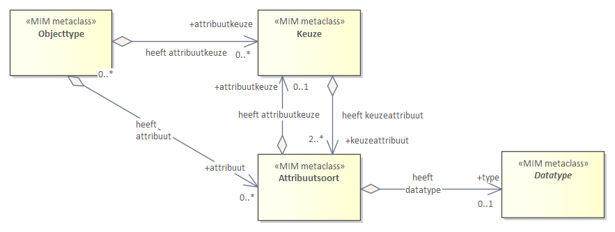
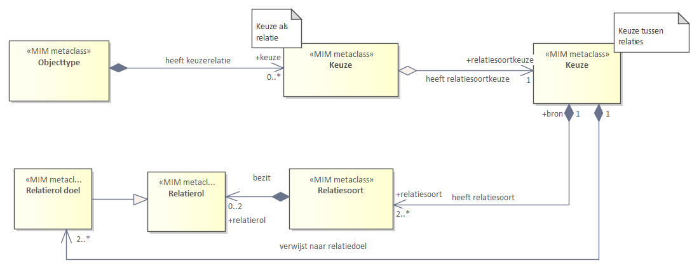
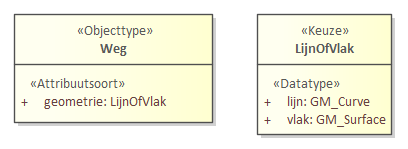
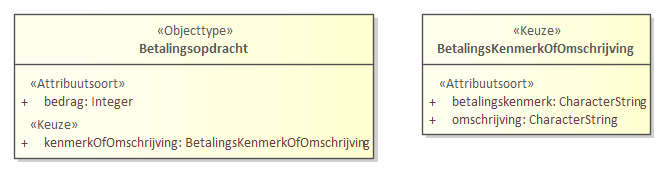
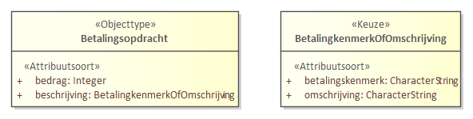
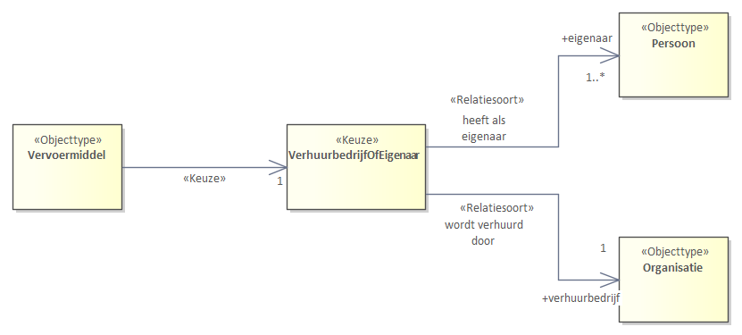
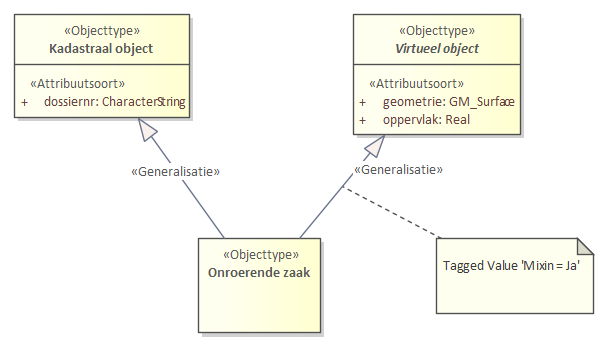

# Metamodel Algemeen

Dit hoofdstuk beschrijft de modelelementen van het MIM voor het maken van een informatiemodel. De eerste paragraaf bevat enkele **diagrammen** die een overzicht geven van de modelelementen die op metamodelniveau worden onderkend en hun onderlinge verhouding. De paragraaf geeft een algemene **beschrijving van alle modelelementen**, dat wil zeggen: onhankelijk van een modelleertaal. Wanneer u liever de beschrijvingen eerst leest, kunt u ook met de paragraaf [objecttypen en attribuutsoorten](#objecttypen-en-attribuutsoorten) beginnen. De laatste paragraaf bevat de **metagegevens** die worden bijgehouden over de modelelementen in een informatiemodel.

Ter illustratie van de relatie tussen een _metamodel_ en een _informatiemodel_: in de Basisregistratie Kadaster (BRK) wordt een `Perceel` gemodelleerd als een <code>«<a>Objecttype</a>»</code>. De `grens` van een perceel wordt gemodelleerd als een <code>«<a>Attribuutsoort</a>»</code>. «Objecttype» en «Attribuutsoort» zijn de modelelementen uit het metamodel informatiemodellering. 'Perceel' en 'grens' zijn de modelleringen op het niveau van het specifieke informatiemodel. In dit geval de BRK. Door 'Perceel' een `«Objecttype»` te noemen en 'grens' een `«Attribuutsoort»`, is aangegeven hoe ze geïnterpreteerd moeten worden.

## Uitgangspunten voor het metamodel

Het metamodel informatiemodellering hanteert een aantal uitgangspunten die aan de basis liggen van de totstandkoming en het gebruik van het model.

1. Elk modelelement heeft een naam en een eigen MIM-metaclass, waaraan je het modelelement overal kan herkennen.
1. De modelelementen worden eerst uitgelegd zonder een specifieke specificatietaal te
gebruiken. Dit is zodat we hierna kunnen aangeven hoe je het modelelement uitdrukt per specifieke specificatietaal, te weten in UML of in W3C-specificatietechnieken.
1. Een toolonafhankelijke beschrijving van het metamodel. Wel is er, omdat VNG Realisatie, Kadaster en Geonovum en veel andere organisaties Sparx Enterprise Architect gebruiken, aanvullend aangegeven hoe het metamodel in Enterprise Architect toegepast wordt. Hierdoor borgen we deze relatie.
1. Uniforme toepassing van het metamodel in informatiemodellen. Anders gezegd, uitbreiden mag, afwijken niet. Maak voor hetzelfde doel geen alternatieve constructies.
1. Datatypen zijn onderdeel van het metamodel en beschrijven de structuur van de data, maar niet de semantiek/betekenis. De aanbeveling is dan ook om eerst een informatiemodel
te maken zonder datatypen. De regel is dat als alle datatypen uit het model worden weggelaten, er geen semantische betekenis verloren mag gaan.

<!-- ### Toelichting MIM-metaclass
Alle modelelementen zijn een metaklasse in het metamodel. Hiermee wordt aangegeven dat het niet een klasse betreft in een informatiemodel (zoals bijvoorbeeld de klasse `Perceel`), maar dat het om de classificatie gaat dat de klasse `Persoon` van de metaklasse `«Objecttype»` is. Vandaar de term _metaclass_. Daarnaast verhouden de MIM-metaklassen zich ook weer tot metaklassen van UML en W3C,

De metaklassen worden ook gebruikt om aan te geven hoe deze zich verhouden tot de metaklassen
van UML en W3C, in de volgende hoofdstukken.

Bij het maken van een informatiemodel modelleer je in feite gewoon met de modelelementen, en geef je aan dat een Persoon een Objecttype is en een geboortedatum een attribuutsoort. -->  

Hierna volgen eerst diagrammen met een overzicht van de modelelementen. In de paragrafen erna wordt de betekenis van elk van deze modelelementen beschreven met een definitie en een toelichting en een voorbeeld. Tot slot volgt een paragraaf met metadata die bijgehouden wordt, of kan worden, bij een modelelement.

## Structuur metamodel

Deze paragraaf bevat een overzicht van het metamodel voor informatiemodellering, kortweg MIM, en geeft alle modelelementen weer. De beschrijving van de modelelementen staat in de volgende paragraaf. De modelelementen zijn verdeeld over een aantal diagrammen, die elk een eigen _view_ op een deel van het metamodel tonen. Elk _view_ toont een aantal van de modelelementen, inclusief hun onderlinge samenhang. Alle _views_ samen vormen het metamodel als geheel:
- [Kern](#kern): belangrijkste modelelementen in onderlinge samenhang.
- [Datatypen](#datatypen): de in het model te onderkennen soorten datatypen.
- [Overige modelelementen](#overige-modelelementen): elementen die niet altijd aan de orde zijn

Elk modelelement heeft een `«MIM metaclass»` met een naam. Hieraan is elk modelelement te herkennen in alle diagrammen, in de tekst én in elke specificatietaal die een uitdrukking is van dit metamodel. Bij de modelelementen zijn in deze diagrammen geen beschrijvende kenmerken opgenomen (bijvoorbeeld [metagegevens](#specificatie-metagegevens) zoals: naam, definitie, enzovoorts). In bijlage [[[#diagrammen]]] zijn deze wel opgenomen.

### Modelelement

Het modelelement is de superklasse van alle metaklassen in het MIM-metamodel.

<aside class="definition">
  <dfn>Modelelement</dfn>Een metaklasse van een metamodel.
</aside>

**Toelichting**: Modelelementen zijn de bouwstenen of metaklassen van het MIM-metamodel. Modelelement is de superklasse van alle metaklassen in het MIM.

### Kern

De kern van het metamodel bestaat uit de volgende modelelementen. Het diagram toont hoe ze onderling met elkaar samenghangen. Een uitgebreide beschrijving per element is opgenomen in de paragraaf [modelelementen](#modelelementen).

 1. `«MIM metaclass»`: <a>Objecttype</a>
 1. `«MIM metaclass»`: <a>Attribuutsoort</a>
 1. `«MIM metaclass»`: <a>Gegevensgroep</a>
 1. `«MIM metaclass»`: <a>Gegevensgroeptype</a>
 1. `«MIM metaclass»`: <a>Generalisatie</a>
 1. `«MIM metaclass»`: <a>Relatiesoort</a>
 1. `«MIM metaclass»`: <a>Relatieklasse</a>
 1. `«MIM metaclass»`: <a>Relatierol</a>
 1. `«MIM metaclass»`: <a>Relatierol doel</a>
 1. `«MIM metaclass»`: <a>Datatype</a>

<figure id="KernZonderUML">
  
  <figcaption>Diagram: Kern zonder UML en metagegevens</figcaption>
</figure>

In het diagram geven de verbindingen tussen de modelelementen aan welke combinaties kunnen voorkomen op metamodelniveau, oftewel welke modelelementen in een informatiemodel met elkaar gecombineerd kunnen worden. Bijvoorbeeld:
- Een <code><a>Objecttype</a></code> kan verbonden worden met een <code><a>Attribuutsoort</a></code>. In een informatiemodel kan je attribuutsoorten dus aan een `Objecttype` toekennen. Een `Attribuutsoort` kan in het informatiemodel vervolgens weer als type een <code><a>Datatype</a></code> krijgen.
- Een `Objecttype` kan verbonden worden met een <code><a>Relatiesoort</a></code> en deze `Relatiesoort` kan weer verbonden worden met een `Objecttype`. Dit geeft aan dat de `Relatiesoort` een modelelement is dat twee objecttypen met elkaar verbindt. Een `Objecttype` kan dus *niet* rechtstreeks verbonden worden met een ander `Objecttype`.
- Een `Objecttype` kan verbonden worden met een <code><a>Gegevensgroep</a></code> en deze `Gegevensgroep` kan weer verbonden worden met een <code><a>Gegevensgroeptype</a></code>. Een `Objecttype` kan dus *niet* rechtstreeks verbonden worden met een `Gegevensgroeptype`. In een informatiemodel is een `Gegevensgroep` een eigenschap van het `Objecttype` en kan je aangeven dat deze `Gegevensgroep` als type een `Gegevensgroeptype` heeft.

### Datatypen

Het MIM kent verschillende manieren om een datatype toe te kennen aan een modelelement. Het onderstaande overzicht toont welke typen beschikbaar zijn, inclusief de onderdelen waaruit sommige typen worden opgebouwd.

1. `«MIM metaclass»`: <code><a>Primitief datatype</a></code>
1. `«MIM metaclass»`: <code><a>Gestructureerd datatype</a></code>
1. `«MIM metaclass»`: <code><a>Data-element</a></code>
1. `«MIM metaclass»`: <code><a>Enumeratie</a></code>
1. `«MIM metaclass»`: <code><a>Enumeratiewaarde</a></code>
1. `«MIM metaclass»`: <code><a>Referentielijst</a></code>
1. `«MIM metaclass»`: <code><a>Referentie-element</a></code>
1. `«MIM metaclass»`: <code><a>Codelijst</a></code>

Het diagram toont de onderlinge samenhang en structuur. Daarin is zichtbaar dat een `Gestructureerd datatype` wordt opgebouwd uit twee of meer `Data-elementen`, een `Enumeratie` bestaat uit `Enumeratiewaarden` en een `Referentielijst` uit `Referentie-elementen`. In de paragrafen [datatypen](#datatypen-1) en [waardelijsten](#waardelijsten) worden deze typen uitgebreid toelicht.

<figure id="DatatypenZonderUML">
  
  <figcaption>Diagram: Datatypen zonder UML en metagegevens</figcaption>
</figure>

### Overige modelelementen

Naast de kernelementen en de datatypen, kent het MIM nog een aantal andere modelelementen. Deze modelelementen vallen uiteen in een aantal categorieën, waarvan de functie en structuur binnen het MIM in de volgende paragrafen verder wordt toegelicht.

1. `«MIM metaclass»`: <code><a>Constraint</a></code>
1. `«MIM metaclass»`: <code><a>Keuze</a></code>
1. `«MIM metaclass»`: <code><a>Relatierol</a></code>
1. `«MIM metaclass»`: <code><a>Relatierol bron</a></code>
1. `«MIM metaclass»`: <code><a>Relatierol doel</a></code>
1. `«MIM metaclass»`: <code><a>Externe koppeling</a></code>
1. `«MIM metaclass»`: <code><a>Informatiemodel</a></code>
1. `«MIM metaclass»`: <code><a>Domein</a></code>
1. `«MIM metaclass»`: <code><a>Extern</a></code>
1. `«MIM metaclass»`: <code><a>View</a></code>

#### Constraint en Keuze

De `Keuze` en de `Constraint` zijn verschillende manieren om een voorwaarde of een beperking op te leggen aan een modelelement. Beide methoden hebben voor- en nadelen. Meer daarover vind je in de paragrafen [constraint](#constraint) en [keuze](#keuze). In de volgende alinea's wordt verder toegelicht hoe je ze toepast.

<!-- <aside class="issue" title="Alinea aanvullen. Wat is het doel?"></aside> -->

**Constraint in het kort**

Een `Constraint` legt voorwaarden of beperkingen op aan een modelelement. Meer informatie vind je in de paragraaf over <code><a>Constraint</a></code>. Het diagram toont odat op alle modelelementen  een `Contraint` kan worden toegepast.

<figure id="ConstraintsZonderUML">
  
  <figcaption>Diagram: Constraint zonder UML en metagegevens</figcaption>
</figure>

**Keuze in het kort**

<!-- <aside class="issue" title="Use cases staan ook uitgewerkt in de paragraaf Keuze. Dubbel?"></aside> -->

Het modelelement keuze bepaalt dat er meerdere opties mogelijk zijn, waarvan er één gekozen moet worden. Er zijn vijf situaties mogelijk waarin een keuze toegepast wordt. Elke situatie heeft een eigen metamodel.
 1. een keuze tussen datatypen ([diagram](#example-keuze-tussen-datatypen))
 1. een keuze tussen twee of meer attribuutsoorten ([diagram](#example-keuze-tussen-meerdere-manieren-om-een-betekenisvol-attribuutsoort-in-te-vullen))
 1. een keuze tussen meerdere manieren om één betekenisvol attribuutsoort in te vullen ([diagram](#example-keuze-tussen-meerdere-manieren-om-een-betekenisvol-attribuutsoort-in-te-vullen))
 1. een keuze tussen relatiedoelen, als nadere invulling van één betekenisvolle relatiesoort ([diagram](#example-keuze-tussen-relatiedoelen-met-een-betekenisvolle-relatiesoort))
 1. een keuze tussen twee of meer relatiesoorten/relatierollen (elk afzonderlijk betekenisvol) ([diagram](#example-keuze-tussen-2-of-meer-relatiesoorten-relatierollen-elk-afzonderlijk-betekenisvol))

Voor elke mogelijkheid is een aparte `«MIM metaclass»` beschikbaar in het metamodel.
 1. `«MIM metaclass»`: <code>Datatype(keuze)</code>
 1. `«MIM metaclass»`: <code>Keuze(attribuut)</code>
 1. `«MIM metaclass»`: <code>Keuze(attribuut)</code>
 1. `«MIM metaclass»`: <code>Keuze(relatie)</code>
 1. `«MIM metaclass»`: <code>Keuze(relatie)</code>

<aside class="example" title="Keuze tussen datatypen">
  

      Dit diagram is uitgewerkt voor <code>Objecttype</code>. Voor <code>Gegevensgroeptype</code> en <code>Relatieklasse</code> geldt hetzelfde patroon. Een <code>Attribuutsoort</code> heeft normaal één <code>Datatype</code>. Als er sprake is van een <code>Keuze</code>, dan is het <code>Attribuutsoort</code> gekoppeld met een <code>Keuze</code> en de <code>Keuze</code> geeft twee of meer <code>Datatypen</code> aan.
  

  <figure id="KeuzeDatatype1">
    
    <figcaption>Diagram: Keuze tussen datatypen</figcaption>
  </figure>
</aside>

Voor use case zie: ([use case 1: datatypekeuze](#datatypekeuze)).

<!---
<aside class="issue" title="Aanvullende tekst afkomstig uit de branch bij issue 190">
  
Waar hoort deze tekst thuis? Afgaande op het onderwerp van issue 190 vermoed ik bij use case 5, maar het stond op een andere plek in het document.

  
<blockquote><i>Het bronobject heeft één relatie en één gerelateerd doelobject, maar dit doelobject kan van verschillende objecttypes zijn. Het bronobjecttype kent slechts één relatiesoort/-rol, met een eigen betekenis en deze relatiesoort/-rol verwijst naar twee of meer objecttypes. Dit kan voorkomen wanneer er vanuit het bronobjecttype gezien, slechts sprake is van één kenmerk dat ingevuld moet worden, ongeacht welk objecttype dit kenmerk zal gaan invullen. Dit diagram is uitgewerkt voor Objecttype. Voor Gegevensgroeptype geldt hetzelfde patroon (1 relatiesoort vanuit een gegevensgroeptype naar een objecttype).</i></blockquote>

  
Er wordt verwezen naar een diagram, maar die was geen onderdeel van de wijziging.

</aside>

<aside class="example" title="Keuze tussen twee of meer attribuutsoorten">
  

    Dit diagram is uitgewerkt voor <code>Objecttype</code>. Voor <code>Gegevensgroeptype</code> en <code>Relatieklasse</code> geldt hetzelfde patroon. Een <code>Objecttype</code> of <code>Gegevensgroep</code> kan normaal een <code>Attribuutsoort</code> hebben met een datatype (de lijn links onder). Als een <code>Objecttype</code> meerdere op zichzelf staande <code>Attribuutsoorten</code> heeft en er sprake is van een <code>Keuze</code> tussen een aantal van deze <code>Attribuutsoorten</code>, dan is het <code>Objecttype</code> gekoppeld met een <code>Keuze</code> (de lijn links boven) en de <code>Keuze</code> geeft twee of meer <code>Attribuutsoorten</code> aan (met elk een eigen <code>Datatype</code>).
  

  <figure id="KeuzeAttribuutsoort2">
    
    <figcaption>Diagram: Keuze tussen attribuutsoorten</figcaption>
  </figure>
</aside>

Voor use case zie: ([use case 2: attribuutkeuze_1](#attribuutkeuze_v1)).
-->

<aside class="example" title="Keuze tussen meerdere manieren om één betekenisvol attribuutsoort in te vullen">
  

    Dit diagram is uitgewerkt voor <code>Objecttype</code>. Voor <code>Gegevensgroeptype</code> en <code>Relatieklasse</code> geldt hetzelfde patroon. Een <code>Objecttype</code> of <code>Gegevensgroep</code> kan normaal een <code>Attribuutsoort</code> hebben met een <code>Datatype</code> (de lijn links). Als er sprake is van een <code>Attribuutsoort</code> die op meerdere manieren ingevuld kan worden met een <code>Keuze</code> hiertussen, dan is het <code>Attribuutsoort</code> niet gekoppeld met een <code>Datatype</code>, maar dan is het <code>Attribuutsoort</code> gekoppeld met een <code>Keuze</code> en de <code>Keuze</code> geeft twee of meer <code>Attribuutsoorten</code> aan (met elk een eigen <code>Datatype</code>).
  

  <figure id="KeuzeAttribuutsoort3">
    
    <figcaption>Diagram: Keuze tussen attribuutsoorten binnen een attribuutsoort</figcaption>
  </figure>
</aside>

Voor use case zie: ([use case 3: attribuutkeuze_2](#attribuutkeuze_v2)).

<aside class="example" title="Keuze tussen relatiedoelen met één betekenisvolle relatiesoort">
  

    Als nadere invulling van één betekenisvolle <code>Relatiesoort</code>. Dit diagram is uitgewerkt voor <code>Objecttype</code>. Voor <code>Gegevensgroeptype</code> geldt hetzelfde patroon, behalve dat een <code>Gegevensgroeptype</code> geen doel mag zijn van een <code>Relatiesoort</code>. Een <code>Objecttype</code> of <code>Gegevensgroep</code> kan normaal een <code>Relatiesoort</code> hebben, die gekoppeld is aan een <code>Objecttype</code>. Als er sprake is van een <code>Relatiesoort</code> met een <code>Keuze</code>, dan is het <code>Relatiedoel</code> van de <code>Relatiesoort</code> niet gekoppeld aan 1 <code>Objecttype</code>, maar dan is het <code>Objecttype</code> gekoppeld aan een <code>Keuze</code> en deze <code>Keuze</code> geeft 2 of meer <code>Relatiedoelen</code> aan.

  <figure id="KeuzeRelatiedoel4">
    
    <figcaption>Diagram: Keuze tussen relatiedoelen</figcaption>
  </figure>
  
  
Toelichting: een bron objecttype of gegevensgroeptype kan normaal een relatiesoort/relatierol hebben, die gekoppeld is aan (verwijst naar) een doel objecttype. Als er sprake is van een relatiesoort/relatierol met een relatiedoel keuze, dan is de relatiesoort niet gekoppeld aan 1 objecttype, maar dan is de relatiesoort gekoppeld aan een keuze en deze keuze is gekoppeld aan 2 of meer doel objecttypen. Elk objecttype is een afzonderlijk relatiedoel. Er moet voor deze ene relatiesoort/relatierol een keuze gemaakt worden voor 1 van de relatiedoelen. Het gerelateerde object is 1 van deze objecttypen, maar de betekenis van de relatie is hetzelfde, ongeacht van welk objecttype het object is.

</aside>

Voor use case zie: ([use case 4: relatiedoel keuze](#relatiedoelkeuze)).

<aside class="example" title="Keuze tussen 2 of meer relatiesoorten/relatierollen (elk afzonderlijk betekenisvol)">
  
Analoog aan de keuze tussen attribuutsoorten 2, maar dan voor relatiesoorten/relatierollen. Het objecttype kent 2 of meer relatiesoorten/relatierollen, met elk een eigen betekenis, en precies 1 hiervan is verplicht.

  
Het bronobject heeft meerdere relaties die aan de orde/gevuld zouden kunnen zijn, maar er mag er altijd maar 1 aan de orde/gevuld zijn. Het bron objecttype kent 2 of meer relatiesoorten/relatierollen, met elk een eigen betekenis, en elk van deze relatiesoorten/relatierollen is gekoppeld aan (verwijst naar) een eigen doel objecttype.

  
Dit diagram is uitgewerkt voor <code>Objecttype</code>.Voor <code>Gegevensgroeptype</code> geldt hetzelfde patroon (2 of meer relatiesoorten vanuit een gegevensgroeptype naar een objecttype).

  <figure id="KeuzeRelatiedoel5">
    
    <figcaption>Keuze tussen relatiesoorten</figcaption>
  </figure>

  
<strong>Toelichting</strong>: een bron objecttype of gegevensgroeptype kan normaal een relatiesoort/relatierol hebben, die gekoppeld is aan (verwijst naar) een doel objecttype. Als er sprake is van een relatiesoort/relatierol keuze, dan heeft het objecttype 1 koppeling met een 'keuze als relatie' naar een keuze. De 'keuze als relatie' heeft geen betekenis. De 'keuze tussen relaties' heeft 2 of meer relatiesoorten/relatierollen naar de doel objecttypes. Er moet een keuze gemaakt worden voor 1 van de relatiesoorten/relatierollen en daarmee voor het aan deze relatie gerelateerde doel objecttype.
 
	 
Opmerkingen: 
    <ul>
      <li>elke relatiesoort of rol moet een eigen naam hebben.</li>
      <li>een gegevensgroeptype mag zelf geen doel zijn</li>
    </ul>
  

</aside>

Voor use case zie: ([use case 5: relatiedoel-met betekenis](#relatiedoelkeuzeMetBetekenis)). 

#### Relatiesoort en relatierol

Uitwerking van de structuur en samenhang van relatierol, bron en doel.

 1. `MIM metaclass`: <code><a>Relatierol</a></code> (abstract)
 1. `MIM metaclass`: <code><a>Relatierol bron</a></code>
 1. `MIM metaclass`: <code><a>Relatierol doel</a></code>

In diagramvorm:

<figure id="AssociatierollenZonderUml">
  
  <figcaption>Diagram: Associatierollen zonder UML en metagegevens</figcaption>
</figure>

#### Externe koppeling

Externe koppeling bestaat uit de volgende modelelementen:

 1. `MIM metaclass`: <code><a>Externe koppeling</a></code>

Zie: [[[#KernZonderUML]]]

#### Groepering

Groepering bestaat uit de volgende modelelementen:

 1. `MIM metaclass`: <code><a>Package</a></code>
 1. `MIM metaclass`: <code><a>Modelelement</a></code>
 1. `MIM metaclass`: <code><a>Informatiemodel</a></code>
 1. `MIM metaclass`: <code><a>Domein</a></code>
 1. `MIM metaclass`: <code><a>Extern</a></code>
 1. `MIM metaclass`: <code><a>View</a></code>

De betekenis van deze modelelementen en de beschrijvingen ervan staan in [Packages](#packages).

In diagramvorm:

<figure id="PackageZonderUml">
  
  <figcaption>Diagram: Packages zonder UML</figcaption>
</figure>

## Modelelementen

In deze paragraaf staan alle modelelementen gespecificeerd die voorkomen in het MIM-metamodel. Bij elk modelelement is een definitie en een toelichting opgenomen. Voordat alle modelelementen worden gedefinieerd,
wordt eerst beschreven wat objecten en gegevens zijn en hoe deze zich verhouden tot modelelementen.

### Objecten en gegevens

MIM kent als belangrijk modelelement het objecttype. Een objecttype is een groep van gelijksoortige <strong>objecten</strong>. Zo zijn `Jan` en `Katrien` allebei objecten die gelijksoortig zijn en beide getypeerd kunnen worden als `persoon`. Het zijn allebei personen, oftewel het objecttype van beiden is `Persoon`. In het informatiemodel nemen we `Persoon` op met behulp van het modelelement `Objecttype`.

Om duidelijk(er) te maken wat wordt bedoeld kijken we eerst naar het begrip ‘object’ en het begrip 'gegeven'.

#### Object

<aside class="definition">
  <dfn data-lt="objecten">Object</dfn>Een ding, een tastbaar iets, in de werkelijkheid, zoals daarnaar gekeken wordt vanuit een bepaald domein.
</aside>

<aside class="note" title="Object vs. Objecttype">
  Een <strong>object is geen modelelement</strong> in een informatiemodel. Een objecttype is wel een modelelement in een informatiemodel.</a>
</aside>

*Toelichting:* 

Met in de werkelijkheid wordt bedoeld dat het om de daadwerkelijke onderwerpen van gesprek gaat, de verzameling van de concrete tastbare dingen waarover we het hebben. Bijvoorbeeld, de persoon Jan, Paleis 't Loo. Een object wordt ook wel een *exemplaar* van een objecttype genoemd (vele soortgelijke exemplaren samen zijn getypeerd naar een objecttype). 

Het wordt veelal als niet politiek correct beschouwd mensen als objecten te zien. In dit kader, de informatievoorziening, beschouwen we evenwel natuurlijke en niet-natuurlijke personen wel als objecten. ‘Tastbaar’ moet hierbij ruim geïnterpreteerd worden. Het gaat niet alleen om fysiek herkenbare objecten zoals auto’s, gebouwen en mensen, ook om zogenaamde virtuele objecten waarover binnen het domein door betrokkenen gecommuniceerd wordt zoals kadastrale percelen, (maatschappelijke) activiteiten en processen. Hoe een ‘tastbaar iets’ als een object beschouwd wordt, hangt af van het domein waarvoor dat ‘tastbaar iets’ relevant is. Zo wordt de gebouwde omgeving in het ene domein beschouwd als een verzameling gebouwen terwijl een ander domein daarin panden onderscheidt. Een object is voor een domein relevant als eigenschappen (kenmerken) daarvan van belang zijn voor het functioneren van dat domein. 

#### Gegeven

Een object heeft eigenschappen (ook wel kenmerken genoemd) waarvoor gegevens bekend zijn. 

<aside class="definition">
  <dfn>Gegeven</dfn>Een gegeven is een vastgelegde waarneming of bewering over een getypeerde eigenschap van een object.  
</aside>

<aside class="note" title="Gegeven">
  Een <strong>gegeven is geen modelelement</strong> in een informatiemodel.
</aside>

*Toelichting:*

Voorbeelden van gegevens zijn: de naam van een persoon is 'Jan', de geboortedatum van Jan is ‘1-1-1970’. 

Eigenschappen van een object kun je waarnemen of beweren en vervolgens vastleggen als gegeven. Aan alleen de _waarde_ '1-1-1970' heb je niet zo veel als je niet weet dat het om de _geboortedatum_ van een persoon gaat (de eigenschap) en om _welke persoon_ het precies gaat (het _onderwerp_ van gesprek). De waarde '1-1-1970' wordt vastgelegd als de geboortedatum van een specifiek persoon. Het is dus van belang om welke eigenschap van welke specifieke persoon het gaat. Verder is het uiteraard van belang om te weten wat de betekenis is die bij het gegeven hoort. 

Waarneming: een observatie die wordt waargenomen voor een eigenschap van een object. Bijvoorbeeld: de sensor waarneming dat de auto met kenteken 'AA 1234' met een snelheid van 120 kilometer per uur rijd. Een foto dat een brug op een bepaalde plek op aarde staat, of een meting van een geluid van 50 decibel. 

Bewering: een uitspraak, die meestal als waar bedoeld is maar niet per definitie waar is. Mijn geboortedatum is '1-1-1970', de waarde van dit huis is 200.000 euro (in het jaar 2018). Wie bewering gedaan heeft is vaak relevant. Denk bij een bewering aan hetgeen waarover besloten wordt door een bevoegd gezag, of aan een persoon die een gegeven opgeeft voor een bepaald doel. Een bewering gedaan worden over iets dat in de werkelijkheid is waargenomen, zoals bij de aangifte van een geboortedatum van een baby. Maar een bewering hoeft niet te zijn waargenomen in de werkelijkheid, zoals wanneer er een bouwvergunning is verleend.    

Vastgelegd: een gegeven kan in principe al bekend zijn zodra deze wordt waargenomen of beweerd, maar de waarneming moet eerst vastgelegd worden om bruikbaar te zijn in een informatievoorziening. De vastlegging kan op papier, in digitale vorm, op een foto, in een bericht, in een database et cetera. 

Getypeerd: een model specificeert niet de gegevens zelf. Een gegeven zoals '1-1-1970' noemen we een waarde voor een attribuut van Jan. In het informatiemodel wordt dit bv. het _attribuutsoort_ 'geboortedatum' of _attribuutype_ 'overlijdensdatum' van een _objecttype_ Persoon genoemd. Dat twee objecten een relatie hebben, gemodelleerd in het model als _relatietype_, wordt ook gezien als een eigenschap waarvoor een gegeven bekend kan zijn. De modelelementen waarmee een getypeerde _eigenschap_ van een object gemodelleerd kan worden zijn: _attribuutsoort_, _relatiesoort_ en _externe koppeling_. Hier kunnen gegevens over bekend zijn. Het _datatype_ is hierbij van belang voor de waarde, en het _objecttype_ is van belang omdat het helder moet zijn om welk object het gaat. 

Waarde: de waarde '1-1-1970' is een onderdeel van het gegeven. Om zeker te zijn dat het gegeven een toegestane waarde heeft moet de waarde van het gegeven voldoen aan het opgegeven datatype en eventuele aanvullende specificaties zoals een formeel patroon of dat de waarde voorkomt in een waardelijst. Er zijn waardes die:
- een enkelvoudige structuur hebben, zoals bij de voornaam 'Jan', of het object Natuurlijk persoon met identificatie '123';
- een interne structuur kennen die nader onderverdeeld is, zoals bijvoorbeeld een geometrie die bestaat uit meerdere coördinaten, een coördinaten referentiesysteem, enzovoorts. De onderdelen, oftewel de data elementen, vormen samen de waarde (de dataelementen zijn zelf niet een gegeven, maar zijn slechts een onderdeel ervan).

Met de vastlegging van gegevens in een informatievoorziening wordt een model van de werkelijkheid bevroren in de tijd. Hoewel de werkelijkheid nooit stil staat, kan deze door het vastleggen van de gegevens toch worden bevroren. Bij een gegeven kunnen ook metagegevens worden vastgelegd, voor het bijhouden van *historie*, zoals de tijdslijn geldigheid en de tijdslijn registratie. Op deze manier weet een gebruiker van de informatievoorziening wanneer het gegeven geldig is (of is geweest) en wanneer het gegeven is vastgelegd op een bepaald medium. Met betrekking tot gestructureerde datatypes: het is (meestal) niet zinvol om voor een onderdeel van een gegeven, oftewel een afzonderlijk data element van een gestructureerde datatype, historie bij te houden, want een onderdeel van een gegeven representeert niet de gehele waarde. 

### Objecttypen en attribuutsoorten  

#### Objecttype

<aside class="definition">
  <dfn>Objecttype</dfn>De typering van een groep objecten die binnen een domein relevant zijn en als gelijksoortig worden beschouwd.
</aside>

**Toelichting**: Jan, Piet en Marie zijn mensen die vanuit het Burgerzaken-domein beschouwd worden als <a>objecten</a> van het `«Objecttype»` `NatuurlijkPersoon`. In een ander domein, ‘de volksmond’, noemen we dit `Mens` wat ook een `«Objecttype»` is. In weer een ander domein is Jan van het `«Objecttype»` `Vergunninghouder` en Piet en Marie niet, omdat aan hen (nog) nooit een vergunning verleend is. Objecttypen zijn een abstractie van de werkelijkheid oftewel we beogen hiermee de werkelijkheid zo getrouw mogelijk te beschrijven, binnen de context van het domein. Dit staat geheel los van het vastleggen van gegevens over objecten van een type in een registratie. Daartoe is veelal een interpretatie nodig (van die werkelijkheid cq. die objecttypen) naar eenheden die in een registratie vastgelegd kunnen worden (records, entiteiten e.d.) op basis van andere overwegingen.

De objecten die in het beschouwde domein onderkend worden zijn zelf nooit abstract. Ze behoren altijd tot een concreet `«Objecttype»`, en niet tot een abstract `«Objecttype»`. Een abstract `«Objecttype»` wordt wel gebruikt in de modellering, om generalisatie aan te duiden en de definitie. Zo kan bij het `«Objecttype»` `Pand` bijvoorbeeld aangegeven worden dat dit een 'Element in de fysieke leefomgeving' is, en dat deze laatste als een abstract `«Objecttype»` gezien moet worden (in ons domein). Meer over abstracte objecttypen is beschreven in [Abstracte Objecttypen en concrete objecten](#abstracte-objecttypes-en-concrete-objecten).  

#### Attribuutsoort  

Een `«Attribuutsoort»` is de metaklasse waarmee kenmerken van een `«Objecttype»` worden vastgelegd. Het zijn de kenmerken waarvoor gegevens worden bijgehouden.

<aside class="definition">
  <dfn data-lt="attribuut">Attribuutsoort</dfn>De typering van gelijksoortige gegevens die voor een objecttype van toepassing is.
</aside>

**Toelichting**: De gegevens `"Jan"` en `"Katrien"` worden als gelijksoortig gezien en worden daarom ondergebracht in `«Attribuutsoort»` `naam`. Je kan ook zeggen, het `«Objecttype»` `Persoon` heeft een Attribuutsoort `naam` en deze is geschikt om gegevens in te plaatsen. Aan elk `«Objecttype»` worden nul, één, of meer attribuutsoorten toegekend. In een informatiemodel wordt alleen een voor het domein relevant `«Attribuutsoort»` opgenomen bij een `«Objecttype»`. Attribuutsoorten worden ook wel _kenmerken_ of _eigenschappen_ genoemd. Dit zijn het ook, maar ook andere modelelementen vallen onder deze omschrijving. Zo is een `«Relatiesoort»` ook een kenmerk of eigenschap.  

#### Gegevensgroep

<aside class="definition">
  <dfn>Gegevensgroep</dfn>Een typering van een groep van gelijksoortige gegevens die voor een objecttype van toepassing is.
</aside>

**Toelichting**: Dit modelelement verzorgt de modelmatige aankoppeling van een <code>«<a>Gegevensgroeptype</a>»</code> aan het <code>«<a>Objecttype</a>»</code> waartoe een `«Gegevensgroeptype»` onlosmakelijk behoort. De groep van gegevens is een kenmerk van een object. De `«Gegevensgroep»` is een betekenisvol kenmerk van een `«Objecttype»`. De `«Gegevensgroep»` heeft altijd als type een `«Gegevensgroeptype»`.

#### Gegevensgroeptype

<aside class="definition">
  <dfn>Gegevensgroeptype</dfn>Een groep van met elkaar samenhangende attribuutsoorten. Een gegevensgroeptype is altijd een type van een gegevensgroep.
</aside>

**Toelichting**: Een `«Attribuutsoort»` van een `«Gegevensgroeptype»` is semantisch
gezien een eigenschap van een `«Objecttype»`. Echter, vanwege samenhangend gedrag (ze
horen semantisch bij elkaar, ze wijzigen bijvoorbeeld gelijktijdig e.d.) zijn
deze ondergebracht in een apart modelelement. Het onderbrengen van
attribuutsoorten in een groep c.q. in het modelelement gegevensgroeptype, is een
modelleerkeuze, het is niet perse noodzakelijk. Wanneer deze ondergebracht worden in een
gegevensgroeptype dan zijn/blijven het afzonderlijke kenmerken van het object en
dus attribuutsoorten van het objecttype, maar dan ondergebracht in een
gegevensgroeptype. De gegevensgroep als geheel wordt daarom expliciet niet
gezien als zijnde één attribuutsoort van een object.

**Toelichting**: bijvoorbeeld: in de BRK heeft een schip een motor en de motor heeft een aantal eigenschappen. De BRK beschouwt een persoon als eigenaar van een schip, er kunnen geen afzonderlijke eigenaren zijn van elk van de motoren van een schip. In de BRK kan het eigendom van een Motor dan ook niet worden overgedragen aan een ander persoon. Een motor wordt daarom gezien als een eigenschap van het object schip, en omdat de motor meerdere eigenschappen heeft, worden deze ondergebracht in een gegevensgroeptype. In een ander informatiemodel, zoals van een motorfabriek, zou de Motor wel een objecttype kunnen zijn, omdat het daar wel hét onderwerp van gesprek is.

Een gegevensgroeptype is meestal het type van slechts één gegevensgroep, omdat de semantiek meestal exclusief is voor één objecttype. Echter, hergebruik is mogelijk (als de semantiek niet exclusief is voor één objecttype). Voorwaarde voor hergebruik is dat de definitie (de definitie en toelichting, inclusief alle metadata aspecten) dan inderdaad gelijk zijn, voor alle objecttypes die hergebruik maken van het gegevensgroeptype.

Een gegevensgroeptype kan, naast attribuutsoorten en relatiesoorten, ook zelf weer gegevensgroeptypen bevatten.

Een gegevensgroeptype is verbonden met een objecttype, via het modelelement
Gegevensgroep.

### Relaties

Verbanden met betekenis, die gelegd zijn tussen modelelementen van het type
objecttype naar het type objecttype, of van een gegevensgroeptype naar een
objecttype.

Diagram: [Kern](#kern)

#### Generalisatie

<aside class="definition">
  <dfn>Generalisatie</dfn>De typering van het hiërarchische verband tussen een meer generiek en een meer specifiek modelelement van hetzelfde soort, waarbij het meer specifieke modelelement eigenschappen van het meer generieke modelelement overerft. Dit verband is alleen gedefinieerd voor objecttypen en datatypen.
</aside>

*Toelichting:*

Generalisatie tussen objecttypes:

Een generalisatierelatie geeft aan dat bepaalde eigenschappen van een objecttype (vaak attribuutsoorten en/of relatiesoorten) ook gelden voor de gerelateerde objecttypen, én dat deze qua semantiek, structuur en syntax gelijk zijn. We spreken dan van een supertype met subtypen. De modelelementen die generiek gelden worden in een generiek objecttype, het supertype, gemodelleerd en deze worden overerfd door elk subtype dat de `«Generalisatie»` legt naar dit generieke `«Objecttype»`.

Generalisatie tussen datatypen:

Het meer specifieke datatype brengt een verbijzondering aan in de vorm van een meer restrictieve definitie, of een meer restrictief patroon/formeel patroon. Het andere datatype is bijvoorbeeld een `CharacterString`, `Integer`, `GM_Surface` of`DMO` en dient als basis voor een zelf te definiëren datatype (zie [Datatype zelf definiëren](#datatype-zelf-definieren)), zoals een `CharacterString` `Postcode`, of een `NietNegatiefGetal`.Deze generalisatie is van toepassing op de volgende datatypen: `«Primitief datatype»`, `«Gestructureerd datatype»`, `«Referentielijst»`, `«Codelijst»`,`«Enumeratie»`.

Meervoudige overerving of multiple-inheritance:

Een subtype kan meerdere objecttypen als generalisatie hebben. In het diagram [Kern](#kern) is dit aangegeven door een `«Objecttype»` als subtype naar `0..*` `«Generalisaties»` te laten verwijzen. Dat impliceert dat een subtype `0..*` supertypen kan hebben.

#### Relatiesoort

<aside class="definition">
  <dfn>Relatiesoort</dfn>De typering van het structurele verband tussen een object van een objecttype en een (ander) object van een ander (of hetzelfde) objecttype.
</aside>

*Toelichting:* Objecten hebben eigenschappen die gemodelleerd kunnen worden met attribuutsoorten maar ook met relatiesoorten naar andere objecttypen. Relatiesoort is de metaklasse waarmee deze eigenschappen worden beschreven. Als het voor het desbetreffende domein van belang is om die eigenschap te modelleren als onderdeel van een ander objecttype, dan maakt de relatiesoort die eigenschap beschikbaar voor het eerstgenoemde objecttype. Bijvoorbeeld, een attribuutsoort van het objecttype PERSOON zou kunnen zijn ‘Naam geregistreerd partner’ (naast de attribuutsoort ‘Naam’ van PERSOON). De naam van de geregistreerde partner komt evenwel ook beschikbaar met een relatiesoort van PERSOON naar PERSOON: “heeft geregistreerd partnerschap met”. Zie ook het eerder genoemde voorbeeld van SCHIP en MOTOR.

Wanneer een relatie gebruikt wordt om objecten aan elkaar te verbinden, zonder
dat er eigenschappen over deze relatie worden vastgelegd, dan betreft dit de
MIM-metaclass «Relatiesoort».

#### Relatieklasse

<aside class="definition">
  <dfn>Relatieklasse</dfn>Een relatiesoort met eigenschappen.
</aside>

*Toelichting:* De relatieklasse geeft aan dat er een relatie is tussen twee
objecten, waarbij er gegevens over deze relatie vastgelegd moeten worden. De
relatie wordt in dit geval behandeld als een object, met gegevens. De gegevens
over de relatie bestaan alleen zolang de relatie tussen beide objecten bestaat
en zolang elk van beide objecten zelf (nog) bestaan.

*Opmerking*: de gegevens van de relatie worden voor één relatie vastgelegd en
niet voor meerdere relaties tegelijk. Als dit laatste het geval is, dan worden
de gegevens vastgelegd in een «Objecttype». Een CONTRACT kan bijvoorbeeld ook
een afspraak zijn tussen twee óf méér SUBJECTen, waarbij de gegevens van de
relatie voor alle betrokken objecten hetzelfde zijn. CONTRACT wordt dan
gemodelleerd als objecttype, waarbij beschreven wordt wat er moet gebeuren
wanneer één van de SUBJECTen niet meer bestaat.

#### Externe Koppeling

<aside class="definition">
  <dfn>Externe koppeling</dfn>Een associatie waarmee vanuit het perspectief van het eigen informatiemodel een objecttype uit het ‘eigen’ informatiemodel gekoppeld wordt aan een objecttype van een extern informatiemodel. De relatie zelf hoort bij het ‘eigen’ objecttype.
</aside>

*Toelichting:*  
Hiermee wordt aangegeven dat er een relatie ligt naar een informatiemodel van een ander domein.
Dit kan rechtstreeks zijn, maar het is ook mogelijk om het objecttype van een ander domein
over te nemen naar het eigen domein, en specifiek te maken voor hoe je deze informatie ziet
vanuit je eigen domein (dit laatste noemen we ook wel een [View](#view).

Zie [Koppelen met een ander informatiemodel](#koppelen-met-een-ander-informatiemodel-externe-koppeling).

#### Relatierol

<aside class="definition">
  <dfn>Relatierol</dfn>De benaming van de manier waarop een object deelneemt aan een relatie met een ander object.
</aside>

*Toelichting:* Met relatie wordt in deze de volgende bedoeld: `«Relatiesoort»`,
`«Relatieklasse»` of `«Externe koppeling»`. Voor `«Generalisatie»` speelt het
niet. Een relatie heeft een bronkant, die de eigenaar is van de relatie, en
is gericht naar de doelkant. De relatierol kan aan beide kanten een `Naam` en
een `Definitie` krijgen.

<aside class="definition">
  <dfn>Relatierol bron</dfn>De relatierol die de rol beschrijft van de bron van de relatie.
</aside>

<aside class="definition">
  <dfn>Relatierol doel</dfn>De relatierol die de rol beschrijft van het doel van de relatie.
</aside>

### Waardelijsten

Een datatype waarvan de mogelijke waarden zijn opgesomd in een lijst. De waarde
van een attribuutsoort moet één van de waarden zijn uit de gespecificeerde
waardelijst.

#### Referentielijst

<aside class="definition">
  <dfn>Referentielijst</dfn>De representatie van een lijst met een opsomming van de mogelijke domeinwaarden van een attribuutsoort, die buiten het model in een externe waardelijst worden beheerd. De domeinwaarden in de lijst kunnen in de loop van de tijd aangepast, uitgebreid, of verwijderd worden, zonder dat het informatiemodel aangepast wordt (in tegenstelling tot bij een enumeratie). De representatie bevat een aantal kenmerken, die overgenomen zijn van de specificatie van de externe waardelijst.
</aside>

*Toelichting:*
De referentielijst bevat representaties van objecten, die in het informatiemodel
niet als een objecttype onderwerp van gesprek zijn. De referentielijst wordt
gebruikt als type van een attribuut van een object.

Het objecttype LAND uit het voorbeeld is opgenomen in een referentielijst en
niet als objecttype. Maar we willen wel de structuur en betekenis van LAND
vastleggen, zodat we er naar kunnen refereren. Een object dat is opgenomen in
een referentielijst heeft daarom veelal meerdere attributen, zoals de naam, de
ontstaansdatum, een omschrijving en de ISO code, die zijn opgenomen in de
referentielijst.

Alle attributen van gerefereerde objecten uit de referentielijst gelden in de
context van het informatiemodel, mits opgenomen in de `«Referentielijst»`. In de
registratie wordt vaak alleen de referentie ernaartoe opgenomen, omdat het niet
de bedoeling is om alle gegevens over te nemen. De gegevens staan immers al in
de referentielijst en er is bewust gekozen om een referentielijst te modelleren.
Het attribuut van een objecttype dat als type een referentielijst heeft bevat in
de registratie daarom (vaak) alleen een referentie naar een object uit de lijst.

#### Referentie-element

<aside class="definition">
  <dfn>Referentie-element</dfn>Een eigenschap van een object in een referentielijst in de vorm van een gegeven.
</aside>

*Toelichting:*
Een referentie-element kan uniek zijn, zoals een code, en is dan op zichzelf
geschikt om gebruikt te worden als referentie (zoals bedoeld in de definitie van
[Referentielijst](#referentielijst)). Bij het referentie-element kan een definitie en toelichting worden opgenomen, die aangeven hoe de externe waardelijst in het eigen informatiemodel gebruikt wordt.

#### Enumeratie

<aside class="definition">
  <dfn>Enumeratie</dfn>Een datatype waarvan de mogelijke waarden limitatief zijn opgesomd in een statische lijst.
</aside>

*Toelichting:* In de registratie krijgt een attribuut één van deze waarden. De
lijst is een statische lijst met constanten (meerdere attributen, zoals bij een
referentielijst, zijn nooit aan de orde).

#### Enumeratiewaarde

<aside class="definition">
  <dfn>Enumeratiewaarde</dfn>Een gedefinieerde waarde, in de vorm van een eenmalig vastgesteld constant gegeven.
</aside>

*Toelichting:*
De waarde van de data zelf. Bijvoorbeeld: Plein, Brug, Spoor, M (man).  
Alleen deze waarde mag gebruiken worden.

#### Codelijst

<aside class="definition">
  <dfn>Codelijst</dfn>De representatie van een lijst met een opsomming van de mogelijke domeinwaarden van een attribuutsoort, die buiten het model in een externe waardelijst worden beheerd. De domeinwaarden in de lijst kunnen in de loop van de tijd aangepast, uitgebreid, of verwijderd worden, zonder dat het informatiemodel aangepast wordt. De representatie bevat in tegenstelling tot een referentielijst geen metagegevens die de structuur beschrijven.
</aside>

*Toelichting:* Zowel referentielijsten als codelijsten zijn in feite waardelijsten. In tegenstelling echter tot de referentielijst wordt de structuur van een codelijst *niet* in het informatiemodel beschreven, omdat die niet (nader) geduid hoeft te worden in het informatiemodel. De extern gepubliceerde waardelijst die de Codelijst representeert bevat een of meer attributen, waarvan altijd één specifiek attribuut met daarin de domeinwaarden die gebruikt mogen/moeten worden in het informatiemodel. Welk specifiek attribuut dat is staat in het metagegeven Waarde-item. In het gebruik is een Codelijst daarom analoog aan een Enumeratie.

Als het wel van belang is om de structuur van een Codelijst in het model te definieren, dan moet een <code>«<a>Referentielijst</a>»</code> worden gebruikt.

### Datatypen

#### Datatype

<aside class="definition">
  <dfn>Datatype</dfn>Een beschrijving van de structuur waaraan een waarde, oftewel de data zelf, aan moet voldoen.
</aside>

*Toelichting:* Zie ook [Objecttypen en attribuutsoorten](#objecttypen-en-attribuutsoorten).
Bij elke «Attribuutsoort» wordt gespecificeerd aan welk datatype de data c.q. de
waarde die hiervoor vastgelegd wordt moet voldoen. Het datatype wordt gebruikt
als type van een attribuutsoort. Datatypen zijn veelal op vele plekken (her)bruikbaar en kunnen daarom gespecificeerd
worden bij diverse «Attribuutsoort»-en.

Diagram: [Datatypen](#datatypen)

#### Primitief datatype

<aside class="definition">
  <dfn>Primitief datatype</dfn>Een datatype met een eenvoudige basisstructuur, oftewel enkelvoudig en zonder gelaagdheid.
</aside>

*Toelichting:* Een primitief datatype is een datatype zonder verdere
specificatie over de structuur. Dit datatype is enkelvoudig, oftewel niet
samengesteld en wordt ook wel simpel datatype genoemd. Dit datatype kent daarom
zelf geen eigen modelelementen zoals een «Data element». Ook is er geen sprake van een gelaagdheid, ook wel nesting genoemd. Een primitief datatype kan wel een patroon of formeel patroon hebben, die een nadere restrictie legt.

Een primitief datatype kan een standaard datatype zijn, zoals CharacterString, Integer enz. Het metamodel volgt hierbij de definities zoals beschreven in de ISO standaarden (zie
§3.1).
* Deze datatypen hebben altijd al een naam en definitie gekregen vanuit deze standaarden en deze worden gebruikt.
* Deze datatypen hebben geen MIM metaclass.

Een primitief datatype kan ook in het eigen informatiemodel zelf-gedefinieerd zijn, zoals bijvoorbeeld een primitief datatype AN: een alfanumerieke CharacterString conform de MES-1 specificatie (oftewel zonder bijzondere karakters zoals een smiley en zonder bijzondere tekens uit niet Europese talen).
* Dit is een zelf-gedefinieerde variant die als basis een van de voorgaande standaard datatypen heeft, zoals CharacterString. Dit standaard datatype moet eenduidig aangegeven worden (zie generalisatie bij datatypen, of door in een extensie aan te geven wat de default is, bv. CharacterString).
* Hierbij hoort de MIM metaclass gespecificeerd te worden: `primitief datatype`.

Een informatiemodel definieert zelf datatypen als er behoefte is aan een datatype dat
eenmalig gedefinieerd wordt en op meerdere plekken in het model gebruikt moet
kunnen worden met altijd exact dezelfde structuur en waardenbereik (zie ook
‘patroon’ in [Domeinwaarden of lijsten](#domeinwaarden-of-lijsten)). Dit
datatype, met een eigen naam, wordt vervolgens gebruikt als type van een
attribuutsoort.

NB: Wanneer het datatype Postcode landelijk zodanig beschikbaar is gemaakt zodat
hier gebruik van gemaakt kan worden in het model, middels een verwijzing, dan hoeft Postcode niet meer
in het eigen model opgenomen te worden.

#### Gestructureerd datatype

<aside class="definition">
  <dfn>Gestructureerd datatype</dfn>Specifiek benoemd datatype dat de structuur van een gegeven beschrijft, samengesteld uit minimaal twee elementen die in samenhang betekenisvol zijn.
</aside>

*Toelichting:*

De waarde van het attribuutsoort verkoopprijs met gestructureerd datatype bedrag
is uitgedrukt in een combinatie van een som en valuta zoals 35 euro. De
introductie van één datatype Bedrag, uitgedrukt in som en valuta, legt dus vast
dat som en valuta onlosmakelijk met elkaar zijn verbonden.

De eigenschappen in het Gestructureerd datatype tezamen zijn identificerend (een
Gestructureerd datatype “identificeert zichzelf”, zoals er maar per definitie
één '1 liter' bestaat, één '35 euro' en één datum '6 april 2017', met per definitie
altijd dezelfde betekenis:

-   Een blik olie heeft een inhoud van `"7 liter"`, kost `"35 euro"`, en is
    verkocht op `"6 april 2017"`.

-   Piet heeft `"1 liter"` bloed gedoneerd, daarvoor `"35 euro"` vergoeding
    gekregen, op `"6 april 2017"`.

Het identificerend zijn geldt bijvoorbeeld niet voor Jan Jansen. Er zijn
meerdere personen met deze naam en dat zijn verschillende personen (Jan Jansen
is dan ook een gegevensgroeptype Naam met voornaam Jan en achternaam Jansen en
geen Gestructureerd datatype).

#### Data-element

<aside class="definition">
  <dfn>Data-element</dfn>Een onderdeel/element van een Gestructureerd datatype die als type een datatype heeft.
</aside>

*Toelichting:* Het data-element is een eigenschap van een Gestructureerd datatype en beschrijft de structuur van een gegeven. Het is niet een eigenschap van een object en niet hetzelfde als een attribuutsoort. Het data-element beschrijft in combinatie met andere data-elementen de structuur van een gegeven en heeft zelf een datatype. Dit datatype is meestal een primitief datatype.

### Packages

<aside class="definition">
  <dfn>Package</dfn>Een benoemde en begrensde verzameling/groepering van modelelementen.
</aside>

Er zijn verschillende modelelementen van het type package:
- Informatiemodel
- Domein
- Extern
- View

In een informatiemodel package mogen alleen domein of view packages opgenomen worden. Beide kunnen meertallig voorkomen en de volgorde is hierbij niet van belang. Een extern package bevindt zich buiten het package informatiemodel.

In een domein, view of extern package mogen de volgende MIM-elementen worden opgenomen:

- Objecttype
- Gegevensgroeptype
- Datatype (alle varianten)
- Relatieklasse
- Keuze

De volgorde is hierbij niet van belang.

De verschillende package-typen worden hier beneden uitgelegd.

#### Informatiemodel

<aside class="definition">
  <dfn>Informatiemodel</dfn>De groepering van alle modelelementen waaruit het informatiemodel is opgebouwd. Het informatiemodel als geheel.
</aside>

*Toelichting:*
Het informatiemodel is een package, te weten het hoofdpackage van het informatiemodel, waar alle
subpackages die een informatiemodel beschrijven onder vallen, zoals Domein en View en extern.
Het informatiemodel wordt verder beschreven met metadata, zoals de aanduiding van het domein wat in het informatiemodel is gemodelleerd. Het is gangbaar om de naam van het informatiemodel te beginnen met IM, maar dit is niet verplicht.    

<aside class='example'>
    Voorbeeld: IMKAD, of IMBAGLV. Elk van deze is een naam van een informatiemodel.
</aside>

#### Domein
Een informatiemodel kan onderverdeeld worden in meerdere packages, waarbij aangegeven wordt dat
deze de modellering van de informatie van het domein bevatten.

<aside class="definition">
  <dfn>Domein</dfn>Een groepering van modelelementen die een semantisch samenhangend gedeelte van een informatiemodel beschrijven.
</aside>

*Toelichting:*
Een domein package bevat de modelelementen waaruit een informatiemodel is samengesteld, zoals het objecttype Persoon en het objecttype Nummeraanduiding en de relatiesoort woonadres. Een informatiemodel is het hoofdpackage, en kent een aantal domein packages als subpackage. Er zijn meerdere soorten packages. Om onderscheid te maken tussen packages waarin het domein gemodelleerd is, en andere packages, heeft dit modelelement de naam Domein gekregen. Je zou ook kunnen zeggen, het informatiemodel bestaat uit de volgende subdomeinen.

<aside class='example'>
    Voorbeeld: Recht, of Stukken. De BRK houdt deze domeininformatie in aparte packages apart bij, voor het overzicht, en om de packages afzonderlijke te kunnen aanpassen, zonder impact op de andere packages.     
</aside>

#### Extern

<aside class="definition">
  <dfn>Extern</dfn>Een groepering van modelelementen die een externe instantie beheert en beschikbaar stelt aan een informatiemodel en die in het informatiemodel ongewijzigd gebruikt worden.
</aside>

<aside class='example'>
    Voorbeeld: het Externe package NEN3610 met datatype NEN3610ID. Het datatype van
    attribuutsoort Identificatie wegdeel in RSGB verwijst naar het datatype
    NEN3610ID zoals opgenomen in het Externe package.
</aside>

#### View

<aside class="definition">
  <dfn>View</dfn>Een groepering van modelelementen die gespecificeerd zijn in een extern informatiemodel en vanuit het perspectief van het eigen informatiemodel inzicht geeft welke gegevens van deze objecttypen relevant zijn binnen het eigen informatiemodel.
</aside>

<aside class='example'>
    IMKAD-BRP. Een aantal van de gegevens uit de basisregistratie personen (BRP) zijn relevant voor de basisregistratie Kadaster. Deze relevante subset is door de beheerder van IMKAD ondergebracht in de view IMKAD-BRP. Vanuit modelleringsperspectief wordt dit
    gezien als een view.
</aside>

### Constraint en Keuze

Diagram: [Overige](#overige)

#### Constraint

<aside class="definition">
  <dfn>Constraint</dfn>Een conditie of een beperking, die voor één of meerdere modelelementen uit het informatiemodel geldt.
</aside>

*Toelichting:* Een `Constraint` wordt opgenomen om een constructie uit te drukken die niet via bestaande modelelementen is uit te drukken. De `Constraint` wordt dan toegevoegd om de extra informatie formeel vast te leggen. Meestal wordt een `Constraint` vastgelegd op het niveau van een modelelement met eigenschappen zoals een <code><a>Objecttype</a></code>, <code><a>Gegevensgroeptype</a></code> en <code><a>Relatieklasse</a></code> om specifieke condities over die eigenschappen vast te leggen. Een voorbeeld is de [een 11-proef](https://nl.wikipedia.org/wiki/Elfproef) op een <code><a>Datatype</a></code> van een <code><a>Attribuutsoort</a></code>. Een `Constraint` wordt altijd in _gewone tekst_ omschreven en kan _optioneel als formele specificatie_ worden aangegeven.

Er zit bij een `Constraint` een _belangrijk verschil tussen betrekken en vastleggen_: **_betrekken_** bepaalt de modelelementen waar de `Constraint` op van toepassing is en **_vastleggen_** bepaalt wat de context van de `Constraint` is, het modelelement vanuit waar de `Constraint` geldt. Zo kan een constraint die van toepassing is op toegestane waarden van een attribuutsoort vastgelegd worden bij het objecttype dat de attribuutsoort gebruikt.

#### Keuze

<aside class="definition">
  <dfn>Keuze</dfn>Een opsomming van meerdere modelelementen, waarbij er maar van één tegelijkertijd sprake kan zijn.
</aside>

*Toelichting:* Er kan altijd maar één van de mogelijkheden gekozen worden. De `Keuze` is voor een aantal use cases een alternatieve manier voor het modelleren van een constraint.

Een `Keuze` maakt het mogelijk een opsomming te geven van meerdere mogelijkheden, waarbij in een concreet geval altijd precies één van deze mogelijkheden wordt gebruikt. Er zijn verschillende plekken waar dit gebruikt kan worden.

Een belangrijk voordeel van het gebruik van de `Keuze` ten opzichte van een constraint is dat de kardinaliteiten zuiver gehouden kunnen worden. Bij het gebruik van een constraint zie je vaak dat de kardinaliteit van bijvoorbeeld twee kenmerken optioneel gemaakt is en om vervolgens via de constraint toch weer verplicht gemaakt te worden, voor precies één van de mogelijkheden.

Dit document beschrijft een aantal use cases waarin het modelleren met een `Keuze` van toegevoegde waarde is. Zonder een dergelijke modelconstructie zou het nodig moeten zijn om met een expliciete constraint de keuze aan te geven.

Bij de use cases gaat het over meerdere kenmerken, waartussen een keuze gemaakt moet worden omdat er van precies 1 sprake is/mag zijn. Dit is in MIM een keuze tussen twee (of meer) modelelementen. In de verzamelingenleer noemen we dit een XOR situatie. Hierbij is het vooral van belang dat er als gevolg van de modellering van een keuze in plaats van constraint er geen nieuwe kenmerken mogen ontstaan en ook geen kenmerken mogen wegvallen. De kenmerken van het object blijven gelijk.

**Use case 1: een keuze tussen datatypen**  
Een objecttype heeft een attribuutsoort en het datatype hiervan is ofwel datatype D1 ofwel datatype D2. In MIM modelleren we daarom 1  attribuutsoort met als datatype een keuze tussen het datatype D1 en het datatype D2. Het maken van deze keuze is verplicht.

<aside class='example'>
  Voorbeeld: Attribuutsoort `geometrie` als kenmerk van een objecttype `Weg`. Dit is een keuze uit `Datatype` `GM_Curve` of `Datatype` `GM_Surface`. De opsomming van beide keuzemogelijkheden noemen we de `Keuze` `LijnOfVlak`. De binding aan het attribuutsoort `geometrie` gebeurt door aan te geven dat `LijnOfVlak` het type is van `geometrie`.
</aside>

<figure id="datatypekeuze">
  
  <figcaption>Diagram: Voorbeeld van keuze tussen datatypen</figcaption>
</figure>

In dit voorbeeld vormt `LijnOfVlak` de `Keuze` als geheel. De datatypen zelf zijn de keuzemogelijkheden, maar blijven in de modellering van de metaclass `Datatype` en behoren in deze zin niet tot de modellering van de metaclass `Keuze`.  

Bij een modellering zonder `Keuze` zou je te maken krijgen met een attribuutsoort per datatype, maar met een verschillende naam, hoewel ze betrekking hebben op hetzelfde kenmerk. Ook zou de kardinialiteit niet kloppen: die zou dan `0..1` moeten worden, maar dat doet geen recht aan het feit dat er één verplicht aanwezig moet zijn, en er ook geen twee naast elkaar mogen zijn. De werkelijke kardinaliteit is `1..1`.

**Use case 2: een keuze tussen 2 of meer attribuutsoorten**  
Er is sprake van ofwel attribuutsoort A1 ofwel attribuutsoort A2. In MIM modelleren we daarom een keuze tussen de 2 attribuutsoorten A1 en A2. Het maken van deze keuze is verplicht.

<aside class='example'>
  Voorbeeld: bij een objecttype `Betalingsopdracht` moet naast het `bedrag` ook een `betalingskenmerk` worden opgenomen of een `omschrijving`. Eén van beide moet worden gebruikt. Het is niet toegestaan dat beide attributen worden toegepast.
</aside>

<figure id="attribuutkeuze_v1">
  
  <figcaption>Diagram: Voorbeeld van keuze tussen attribuutsoorten</figcaption>
</figure>

We modelleren daarom een `Keuze` `BetalingskenmerkOfOmschrijving` met daarin een attribuutsoort `betalingskenmerk` en een attribuutsoort `omschrijving`.

Het is bij deze use case niet de bedoeling om een derde attribuutsoort, zoals kenmerkOfOmschrijving, te introduceren als attribuutsoort van het objecttype. `kenmerkOfOmschrijving` staat er wel maar is geen attribuutsoort maar een `Keuze`. De naam daarvan is arbitrair omdat het geen betekenis heeft en bij de implementatie in data niet voorkomt. De binding van de `Keuze` `BetalingskenmerkOfOmschrijving` is daarom aan het objecttype en niet aan een attribuutsoort.

In dit voorbeeld vormt `BetalingskenmerkOfOmschrijving` en de binding ervan aan het objecttype de `Keuze` als geheel. De attribuutsoorten zelf zijn de keuze mogelijkheden, maar blijven in de modellering van de metaclass attribuutsoort en behoren in deze zin niet tot de modellering van de metaclass keuze.  

Zonder de mogelijkheid van `Keuze` zouden beide attribuutsoorten opgenomen zijn bij het objecttype als optionele velden, met een constraint dat een van beide gevuld moet zijn. Nadeel hiervan is dat de kardinaliteit dan niet erg duidelijk gemodelleerd is: die zou dan voor beide attribuutsoorten [0..1] moeten worden, maar dat doet geen recht aan het feit dat er één verplicht aanwezig moet zijn, en er ook geen twee naast elkaar mogen zijn. De werkelijke kardinaliteit voor een gekozen attribuutsoort is [1..1]. Met een constraint is dit te specificeren en derhalve ook op zich wel correct te modelleren, maar met een modellering van een keuze is dit veel duidelijker.

**Use case 3: een keuze tussen meerdere manieren om invulling te geven aan 1 betekenisvol attribuutsoort van een objecttype**  
Er is sprake van ofwel attribuutsoort A0 en aanvullend hierbij een keuze tussen ofwel attribuutsoort A1 ofwel attribuutsoort A2. In MIM modelleren we daarom voor A1 en A2 een keuze tussen de 2 attribuutsoorten. Het maken van deze keuze is verplicht.

<aside class='example'>
  Bij een objecttype `Betalingsopdracht` moet een bedrag en een `beschrijving` worden opgenomen. Deze beschrijving heeft betekenis voor het objecttype, als eigenschap. Verder moet er voor de beschrijving aanvullend een keuze worden gemaakt tussen een beschrijving in de vorm van een betalingskenmerk OF een beschrijving in de vorm van een omschrijving. Beide worden (ook) gezien als attribuutsoorten. Het is niet toegestaan dat beide attributen worden gebruikt: alleen een `betalingskenmerk`, of alleen een `omschrijving`.
</aside>

<figure id="attribuutkeuze_v2">
  
  <figcaption>Diagram: Voorbeeld van een attribuutsoort gekoppeld aan een keuze tussen attribuutsoorten</figcaption>
</figure>

We modelleren daarom een `Keuze` `BetalingskenmerkOfOmschrijving` met daarin een attribuutsoort `betalingskenmerk` en een attribuutsoort `omschrijving`. Het is bij deze use case niet de bedoeling om het attribuutsoort `beschrijving` kwijt te raken in de modellering. De binding van de `Keuze` `BetalingskenmerkOfOmschrijving` is daarom aan het attribuutsoort. De binding van het attribuutsoort `beschrijving` gebeurt door aan te geven dat `BetalingskenmerkOfOmschrijving` het type is van `beschrijving`.

In dit voorbeeld vormt `BetalingskenmerkOfOmschrijving` de `Keuze` als geheel. De attribuutsoorten zelf zijn de keuze mogelijkheden, maar blijven in de modellering van de metaclass attribuutsoort en behoren in deze zin niet tot de modellering van de metaclass keuze.  

*Opmerking: use case 2 en 3 zijn voor een groot deel overeenkomstig. De overeenkomst is dat de keuze tussen de twee attribuutsoorten betalingskenmerk en omschrijving hetzelfde gemodelleerd wordt, als een keuze, met bijvoorbeeld de naam BetalingskemerkOfOmschrijving. Het verschil zit in de binding tussen de keuze en het objecttype.*

**Use case 4: een keuze tussen relatiedoelen, als nadere invulling van een betekenisvolle relatiesoort van een objecttype**  
Er is sprake van een relatiesoort R0 en aanvullend hierbij een keuze tussen relatiedoel D1 of relatiedoel D2. In MIM modelleren we daarom een keuze tussen de 2 relatiedoelen D1 en D2. Het maken van deze keuze is verplicht.

<aside class='example'>
  Voorbeeld: een objecttype `Vervoermiddel` heeft een `eigenaar`. Dit kan een `Persoon` zijn, of een `Bedrijf`, maar niet beiden. Er is sprake van één eigenaar" en een keuze tussen relatiedoel `persoon` (naar objecttype `Persoon`) en relatiedoel `bedrijf` (naar objecttype `Bedrijf`). We modelleren daarom 1 relatiesoort `eigenaar` en aanvullend met een `Keuze` `EigenaarKeuze` met twee relatiedoelen, een naar `Persoon` en een naar `Bedrijf`.  
</aside>

Het is bij deze use case niet de bedoeling om twee nieuwe relatiesoorten, eigenaar_persoon en eigenaar_bedrijf, te introduceren en al zeker niet om de relatiesoort `eigenaar` kwijt te raken. We modelleren daarom 1 relatiesoort met de naam eigenaar en een `Keuze` tussen relatiedoelen.

<figure id="relatiedoelkeuze">
  
  <figcaption>Diagram: Voorbeeld van keuze tussen relatiedoelen</figcaption>
</figure>

In het voorbeeld vormen `EigenaarKeuze` en de twee relatiedoelen tezamen de keuze als geheel. De relatiedoelen zelf zijn de keuze mogelijkheden. De modellering van de relatiesoort `eigenaar` blijft hetzelfde en behoort niet tot de modellering van de metaclass keuze.

**Use case 5: een keuze tussen twee of meer relatiesoorten/relatierollen (elk afzonderlijk betekenisvol)** 

Er is sprake van een relatiesoort R1 en een relatiesoort R2. R1 heeft als doel een object van objecttype D1 en R2 heeft als doel een object van objecttype 2. In MIM modelleren we daarom een keuze met als uitgaande relatiesoorten R1 en R2. Het maken van deze keuze is verplicht.

<aside class='example'>
  Voorbeeld: een objecttype `Vervoermiddel` heeft een `eigenaar` of wordt verhuurd door een `verhuurbedrijf`. Beide relatiesoorten zijn specifiek en van belang om te benoemen. We modelleren daarom 1 *Keuze(relatie)* naar een `Keuze` `VerhuurbedrijfOfEigenaar`. Deze heeft twee uitgaande relatiesoorten met elk een specifieke naam en/of relatiedoel naar `Persoon` en `Organisatie`. 
</aside>

<figure id="relatiedoelkeuzeMetBetekenis">
  
  <figcaption>Diagram: Voorbeeld van keuze tussen relatiesoorten die elk een betekenis hebben</figcaption>
</figure>

In het voorbeeld heeft `Vervoermiddel` de verplichte keuze tussen de relatiesoorten/rollen `heeft als contactpersoon`/`eigenaar` en `wordt verhuurd door`/`verhuurbedrijf`.

## Specificatie metagegevens

Bij de modelelementen in een informatiemodel kunnen metagegevens, zoals 'naam' van het modelelement, of 'datum opname' van het modelelement, worden bijgehouden. Dit zijn geen eigenschappen van een object en worden daarom niet als bijvoorbeeld een attribuutsoort van een objecttype gemodelleerd. In de volgende paragrafen worden de metagegevens in tekst beschreven. Bij elk metagegeven is de definitie opgenomen, een toelichting en de toepassing ervan bij modelelementen. In bijlage [[[#modelelementen-en-metagegevens-als-diagram]]] is de koppeling tussen metagegevens en de modelelementen beschreven door middel van UML diagrammen. Er is daarin ook opgenomen of ze verplicht of optioneel zijn. In [[[#toegestane-waarden-metagegevens]]] is het waardebereik en defaultwaarden voor een aantal metagegevens opgenomen.

### Informatiemodel - metagegevens

We onderkennen een aantal specifieke metagegevens op het niveau van het informatiemodel zelf. Deze staan beschreven in deze paragaaf.   

#### Metagegeven: **Informatiedomein**

<aside class="definition">
  <dfn>Informatiedomein</dfn>Aanduiding van het functionele domein waartoe het informatiemodel behoort.
</aside>

*Toelichting* Bijvoorbeeld: BRK. Wanneer bepaalde definities of identificaties van het informatiemodel in de wereld niet uniek zijn, omdat een ander informatiemodel dezelfde naam hanteert voor een modelelement, of eenzelfde structuur voor een identificerende eigenschap, dan is het mogelijk om deze uniek te maken met behulp van deze aanduiding.   

*Toepassing*: Informatiemodel (verplicht)

#### Metagegeven: **Informatiemodeltype**

<aside class="definition">
  <dfn>Informatiemodeltype</dfn>De beschrijving van de aard van het informatiemodel, hoe het geïnterpreteerd moet worden.
</aside>

*Toelichting*
Dit kan zijn: `"Conceptueel"` of `"Logisch"`. Zoals bedoeld in: [[[#typering-van-modellen-en-wat-wel-en-niet-in-scope-is-van-deze-standaard]]]. Er moet een keuze gemaakt worden. Dit kan bijvoorbeeld uitgebreid worden met: `"Technisch"` wanneer er behoefte is om niveau 4 aan te geven.

*Toepassing*: Informatiemodel (verplicht)

#### Metagegeven: **Relatiemodelleringstype**

<aside class="definition">
  <dfn>Relatiemodelleringstype</dfn>Aanduiding van een in MIM gedefinieerd alternatief voor een modelleringswijze, en welke keuze hierbij is gemaakt.
</aside>

*Toelichting*
Dit kan zijn `"Relatiesoort leidend"` of `"Relatierol leidend"`. Dit betreft de keuze die je maakt voor het in [[[#alternatieven]]] gekozen alternatief. Er moet een keuze gemaakt worden. Deze keuze geldt primair voor de modelelementen <code>«Relatiesoort»</code> en <code>«Relatierol»</code> zoals bedoeld in [[[#relaties-in-uml]]]. maar geldt in het verlengde hiervan voor het modelelement externe koppeling.

*Toepassing*: Informatiemodel (verplicht)

#### Metagegeven: **MIM-versie**

<aside class="definition">
  <dfn>MIM-versie</dfn>De versie van de MIM-specificatie die gebruikt is om het informatiemodel in uit te drukken.
</aside>

*Toelichting* Neem hiervoor een door MIM in gebruik zijnde MIM-versie.
Kies bij voorkeur een zo recent mogelijke versie.

Bijvoorbeeld: `"1.0.1"` of `"1.1"` of `"1.1.1"`

*Toepassing*: Informatiemodel (verplicht)

#### Metagegeven: **MIM-extensie**

<aside class="definition">
  <dfn>MIM-extensie</dfn>De aanduiding van een extensie op MIM.
</aside>

*Toelichting* Dit metagegeven is optioneel en alleen van toepassing als er sprake is van een extensie zoals bedoeld in [[[#een-eigen-extensie-op-het-metamodel]]]. Neem hiervoor een in gebruik zijnde extensie. Bijvoorbeeld: `"Kadaster"` of `"NEN3610:2022"`.

*Toepassing*: Informatiemodel (optioneel)

#### Metagegeven: **MIM-taal**

<aside class="definition">
  <dfn>MIM-taal</dfn>De aanduiding van de taal die gebruikt is voor de modelelementen.
</aside>

*Toelichting* Bijvoorbeeld: `"NL"`, `"EN"`

*Toepassing*: Informatiemodel (optioneel)

#### Metagegeven: **Tekstopmaak**

<aside class="definition">
  <dfn>Tekstopmaak</dfn>De specificatie van de opmaak van een tekstuele beschrijving in het model.
</aside>

*Toelichting* 

Bijvoorbeeld: `"rtf"`, `"html"`. 

De metagegevens 'definitie' en 'toelichting' bevatten tekst waarvan het nuttig kan zijn om deze op te maken. De opmaak zoals hier bedoeld betreft het verhogen van de leesbaarheid van de tekst, wanneer de modelleur van het model dit nuttig of nodig acht. Deze opmaak is nadrukkelijk niet bedoeld om aan te duiden in welke vorm het model gepubliceerd moet gaan worden (zoals in html, pdf, xml enz). In de MIM gedachte hoort een model vrij te zijn van deze overweging en kan een model in elk van deze, en ook in meerdere vormen tegelijk, gepubliceerd worden.  

De tekst kan en mag een bepaalde opmaak bevatten, maar dit hoeft niet. Maar als ervoor gekozen wordt, dan geldt het voor alle definities en alle toelichtingen. Wellicht is opmaak ook van belang voor andere metagegevens (zoals patroon, populatie, kwaliteit en mogelijk andere) maar in deze versie van MIM is de opmaak alleen bedoeld voor 'definitie' en 'toelichting'. Wel kunt u deze opmaak van toepassing verklaren op metagegevens uit uw eigen extensie (zoals bedoeld in [[[#een-eigen-extensie-op-het-metamodel]]]).

*Toepassing*: Informatiemodel (optioneel)

 ### Modelelementidentificatie - metagegevens

Informatiemodellen staan vaak niet op zichzelf. Ze kunnen elementen bevatten die refereren aan externe standaarden, waarin deze elementen een eigen identificatie hebben. Ook moeten de gemodelleerde elementen herbruikbaar zijn in andere modellen. Daarom is het nodig om de modelelementen uniek te kunnen identificeren. Wanneer een MIM-model uitgedrukt wordt in een Linked Data-model is het zelfs noodzakelijk om de modelelementen identificeren met een [[URI]]. De metagegevens <code><a>Basis-URI</a></code>, <code><a>Modelelement identificatie</a></code> en <code><a>is gedefinieerd in</a></code> maken het mogelijk om de modelelementen in een Linked Data-model te identificeren.

#### Metagegeven: **Basis-URI**

<aside class="definition">
  <dfn>Basis-URI</dfn>De standaard basis-URI voor elk element in dit informatiemodel.
</aside> 

*Toelichting* Een _uniform resource identifier_ (URI) is een compacte reeks tekens die een abstracte of fysieke resource identificeert. Een `Basis-URI` is het gemeenschappelijke deel van deze reeks tekens die voor alle elementen in het informatiemodel geldig is. De `Basis-URI` bevat altijd een `scheme`, dit kan bijvoorbeeld `http://` of `urn` zijn. En voldoet aan een gekozen URI-strategie. Wanneer er geen basis-URI is gespecificeerd wordt deze overgenomen van de eerst bovenliggende package met een basis-URI.

Een informatiemodel moet echter ook gebruikt kunnen worden zonder dat er vastgestelde (http-)uri's beschikbaar zijn (bijvoorbeeld tijdens de ontwikkelfase). In dit geval kan een [[URN]] op basis van de package alias en de naam van het modelelement bepaald worden. Wanneer er geen basis-URI is gespecificeerd wordt deze overgenomen van de eerst bovenliggende package met een basis-URI. Wanneer deze er niet is, wordt er een default waarde bepaald conform het patroon `urn:modelelement:` + `{informatiemodel.naam}:` + `{package.naam}:`. De defaultwaarde voor de `Basis-URI` van een informatiemodel is dan `urn:modelelement:` + `informatiemodel.naam`, bijvoorbeeld `"urn:modelelement:imbaglv"`. Iedere onderliggende package krijgt ook een default Basis-URI die gelijk is aan de basis-URI van het informatiemodel gevolgd door `package.naam`, bijvoorbeeld `"urn:modelelement:imbaglv:objecten"`. Dit is noodzakelijk omdat niet alle namen binnen een informatiemodel per definitie uniek zijn (denk aan een objecttype "Locatie" in een domein "Locatie"). De `URI` van een attribuutsoort "huisnummer" bij een "nummeraanduiding" in domein "objecten" uit het IMBAGLV model wordt dan `"urn:modelelement:imbaglv:objecten:nummeraanduiding.huisnummer"`.

*Toepassing*: informatiemodel (verplicht), domein, view, extern

<aside class="note">
  Wanneer er gebruik wordt gemaakt van de defaultwaarde van de basis-URI is er geen garantie dat er een globaal unieke URI opgebouwd wordt. De defaultwaarde resulteert altijd in unieke URI's binnen het informatiemodel.
</aside>

#### Metagegeven: **Modelelement identificatie**

<aside class="definition">
  <dfn>Modelelement identificatie</dfn>De identificatie van een modelelement.
</aside>

*Toelichting* De URI kan bijvoorbeeld op de volgende twee manieren voorkomen:
 - **urn-URI**: `<urn:modelelement:imbaglv:objecten:Pand`;
 - **http-URI**: `<http://.../def#Pand>`.

De `modelelement identificatie` kan bepaald worden aan de hand van de <code><a>Naam</a></code> van het modelelement en de `Basis-URI` van de _package_ waarin het modelelement zich bevindt (op logisch niveau conform de naamgevingsconventies). Dit vormt de default waarde. In de meeste gevallen zal een modelleur dit metagegeven niet expliciet invullen maar uitgaan van de defaultwaarde.

In sommige gevallen kan de `modelelement identificatie` van een modelelement niet bepaald worden aan de hand van de `Basis-URI` van de bijbehorende _package_ en de `Naam` van een modelelement. Bijvoorbeeld als gevolg van de gekozen URI-strategie of wanneer een <code><a>Attribuutsoort</a></code> uit een ander informatiemodel hergebruikt wordt (e.g. `nen3610-2022:identificatie`). In dit geval zal de modelleur het metagegeven `modelelement identificatie` wel invullen.

*Toepassing*:  alle modelelementen

#### Metagegeven: **is gedefinieerd in**

<aside class="definition">
  <dfn>is gedefinieerd in</dfn>De package waarin het modelelement gedefinieerd is.
</aside>

*Toelichting* De definiërende _package_ is meestal de _package_ die het modelelement bevat. De waarde voor dit metagegeven kan, wanneer dit het geval is, afgeleid worden. In afwijkende situaties moet de `URI` van de betreffende _package_ ingevuld worden. Een _package_ van het type <code><a>View</a></code> definieert nooit de modelelementen die het bevat, dit is altijd een ander _package_ van het type <code><a>Domein</a></code>. Het verschil met het metagegeven <code><a>Herkomst</a></code> is dat `Is gedefinieerd in` een directe verwijzing is naar een informatiemodel of een _package_ daarbinnen door middel van een `URI`. 

*Toepassing*: alle modelelementen

<!--Einde "Specificatie metagegevens informatiemodel" -->

### Modelelementen - metagegevens

We onderkennen een aantal specifieke metagegevens op het niveau van de modelelementen waarmee
een informatiemodel wordt samengesteld. Deze staan beschreven in deze paragaaf.    

Zo is er de `Naam` van het modelelement, bijvoorbeeld het objecttype met als `Naam` `"Pand"` en een bijbehorende `Definitie`, of de `Datum opname` van het modelelement in het informatiemodel, bijvoorbeeld `1-1-2012`. Welke metagegevens verplicht zijn per modelelement en welke niet staat beschreven in het diagram in [Metagegevens per modelelement](#modelelementen-en-metagegevens-als-diagram). Dit diagram is een onderdeel van de specificatie.

Elk modelelement kent een eigen set van metagegevens, die bepaalde aspecten van het modelelement specificeren. Metagegevens kunnen dus verplicht zijn en kunnen optioneel zijn. Zo is een definitie altijd verplicht voor elk modelelement die de betekenis van gegevens omschrijft, zoals een attribuutsoort of relatiesoort, maar ook voor het objecttype die de context hiervan is. Bij de meeste datatypen is de definitie daarentegen optioneel, deze worden alleen ingevuld indien nodig.

Merk op dat een aantal van deze metagegevens al meegenomen worden in een specificatietaal. Bijvoorbeeld het objecttype met de naam Pand wordt in UML gemodelleerd als `Named element` met als `Name` `Pand` (in UML 1.4 heette dit nog `UML-Class`, met een property  `Name`). Een aantal andere metagegevens, zoals de eerder genoemde `Datum opname` met waarde `"1-1-2012"`. worden als aparte data vastgelegd, in UML gebeurt dit in een `Tagged value`. In Linked data gebeurt dit met een `owl:DatatypeProperty`.

Merk op, de metadata aspecten zijn specifiek voor elk modelelement apart. Dus als er in H2.2 sprake is van een generalisatie, dan worden deze metadata niet overerft (en de ingevulde waardes worden uiteraard zeker niet overerft). De MIM metaclass Referentielijst erft dus geen metagegevens, zoals patroon, van MIM metaclass
Datatype.

Voor de eenduidigheid zijn een aantal metagegevens verplicht gemaakt om te voorkomen dat het onduidelijk is wat een niet ingevulde waarde betekent. De betekenis hoort te zijn: 'niet aan de orde', wat zo is bij optionele gegevens. Wat iets anders is dan: 'nog niet ingevuld', 'zie default waarde', of 'onbekend'.

Hieronder volgen eerst de algemene metagegevens. Dit zijn metagegevens zoals `Naam`, `Definitie` en `Populatie` met een definitie en een toelichting. In de paragrafen hierna wordt vervolgens naar deze paragraaf verwezen. Specifieke metagegevens die maar één keer voorkomen zijn bij het modelelement zelf beschreven en zijn niet opgenomen in deze algemene lijst.

#### Metagegeven: **Naam**

<aside class="definition">
  <dfn>Naam</dfn>De naam van een modelelement.
</aside>

*Toelichting*

Bijvoorbeeld: `"Pand"` is de naam van het modelelement `«Objecttype»`, `"bouwjaar"` is de naam van het modelelement `«Attribuutsoort»`. De modelelementen zijn limitatief opgesomd in [[[#metamodel-algemeen]]] (en eventueel zijn in een uitbreiding extra modelelementen limitatief opgesomd).

*Toepassing*: alle modelelementen.

#### Metagegeven: **Alias**

<aside class="definition">
  <dfn>Alias</dfn>De weergave van de naam van een modelelement in natuurlijke taal (niet technisch).
</aside>

*Toelichting*

Als de naam van iets wat in het informatiemodel gemodelleerd wordt spaties, diakrieten of verbindingstreepjes bevat, zoals een <code>«<a>Objecttype</a>»</code> `"Onroerende zaak"` of een <code>«<a>Attribuutsoort</a>»</code> `"geïnspireerd op"`, dan kan er gekozen worden om deze naam in het informatiemodel zo op te schrijven dat hier in de techniek makkelijker mee te werken is. Denk aan: `"geinspireerd op"` (geen diakrieten) of `"OnroerendeZaak"` (notitewijze: camelcase). Wanneer de originele schrijfwijze in natuurlijke taal van belang is kan deze worden opgenomen in het metagegeven `Alias`. Het is niet de bedoeling om (andersom) in de `Alias` de technische makkelijkere naam op te nemen.

De `Alias` wordt ook gebruikt voor een alternatieve weergave van een <code>«<a>Enumeratiewaarde</a>»</code>. De ‘naam’ betreft hier een daadwerkelijk waarde, zoals `"Nederlands"`, waarin de naam gelijk staat aan de waarde en dit moet zo blijven, maar als er sprake is van een voor documentatiedoeleinde bedoelde codering van deze <code>«<a>Enumeratiewaarde</a>»</code> dan kan deze code in de `Alias` worden opgenomen.

Toepassing: Objecttype, Attribuutsoort, Gegevensgroep, Relatiesoort, Relatierol, Relatieklasse, Externe Koppeling, Keuze, Enumeratie, Primitief datatype, Gestructureerd datatype, Data-element en _expliciet niet_ voor Packages, Enumeratiewaarde, en Constraint.

Opmerking: een uitzondering is gemaakt voor UML-modellen voor de UML-EnumerationLiteral. De ‘naam’ betreft hier een daadwerkelijk waarde, waarin de naam gelijk staat aan de waarde. Het is daarom expliciet ongewenst om hiervoor een _Alias_ te gebruiken. De `Alias` wordt hier, mede daarom, gebruikt voor (alleen) de modellering van het metadata aspect Code die aanvullend is op naam (niet een alternatief van naam).

#### Metagegeven: **Begrip**

<aside class="definition">
  <dfn>Begrip</dfn>Verwijzing naar een begrip, vanuit een modelelement, waarmee wordt aangegeven op welk begrip, of begrippen, het informatiemodel element is gebaseerd. De verwijzing heeft de vorm van een term of een URI.
</aside>

*Toelichting*

Hiermee wordt aangegeven hoe een informatiemodel element zich verhoudt tot de
begrippen uit het begrippenkader, zoals genoemd in [[[#typering-van-modellen-en-wat-wel-en-niet-in-scope-is-van-deze-standaard]]].
Dit is niet een 1 op 1 relatie. Voor meer informatie hierover, zie [[[#afspraken-regels]]].

Bijvoorbeeld:
 - `"Perceel"`;
 - `"http://brk.basisregistraties.overheid.nl/id/begrip/Perceel"`

*Toepassing*: alle modelelementen met een naam, met uitzondering van Package en
Constraint.

#### Metagegeven: **Herkomst**

<aside class="definition">
  <dfn>Herkomst</dfn>De registratie of het informatiemodel waaraan het modelelement ontleend is dan wel de eigen organisatie indien het door de eigen organisatie toegevoegd is.
</aside>

*Toelichting*

Bijvoorbeeld: de herkomst van het kenmerk *begrenzing* van een Perceel heeft als waarde: `"BRK"`. BRK staat dan bijvoorbeeld in de bijbehorende documentatie uitgelegd als: de basisregistratie Kadaster.

Er wordt expliciet niet bedoeld van welke informatievoorziening of registratie de *data* is overgenomen. Het gaat er bij dit metagegeven expliciet om uit welk domein of bron het _modelelement_ zijn herkomst vindt. Voor basisregistraties is de herkomst altijd het eigen informatiemodel. Dit metagegeven is vooral van belang als het modelelement is overgenomen uit een ander informatiemodel.

Bijvoorbeeld: de herkomst van het kenmerk *woonadres*, wat bijvoorbeeld een `«Relatiesoort»` is van een `Persoon` in de basisregistratie Personen naar een `Nummeraanduiding` in de basisregistratie Adressen en Gebouwen (BAG), heeft als herkomst: `"BRP"` (de basisregistratie Kadaster). Dit kenmerk `woonadres` wordt bijgehouden in de BRP en de bron kant van de relatie zit in de BRP. De `Nummeraanduiding` zelf heeft in de BAG veelal als herkomst: `"BAG"`. Mochten echter de adresgegevens niet (direct of indirect) uit de BAG komen, maar bijvoorbeeld via een eigen inwinningsproces in een eigen registratie worden bijgehouden, dan de herkomst niet de BAG.

Deze definitie omvat ook de definitie van herkomst van de stelselcatalogus (De registratie in wiens catalogus het objecttype is gespecificeerd (oftewel de registratie waar het objecttype deel van uitmaakt). Deze specificatie is toegevoegd omdat het wel duidelijk moet zijn in welke (basis)registratie of informatiemodel het objecttype).

*Toepassing*: alle modelelementen.

#### Metagegeven: **Definitie**

<aside class="definition">
  <dfn>Definitie</dfn>De beschrijving van de betekenis van dit modelelement.
</aside>

*Toelichting*

Bijvoorbeeld: Een Pand is de kleinste, bij de totstandkoming functioneel en bouwkundig-constructief zelfstandige eenheid die direct en duurzaam met de aarde is verbonden en betreedbaar en afsluitbaar is. De definitie volgt, indien aanwezig, de catalogus van de desbetreffende (basis)registratie of informatiemodel, mits deze het modelelement definieert vanuit een informatie en informatiemodel perspectief (er zijn ook andere definities mogelijk vanuit andere perspectieven, zoals vanuit een juridisch perspectief, of vanuit het perspectief van een model van begrippen, zoals genoemd in de paragraaf [Typen informatiemodellen](#typen-informatiemodellen). Dergelijke definities kunnen hetzelfde zijn, of op het moment hetzelfde, of verschillend, of aanvullend op elkaar. Het is aan de beheerder van het informatiemodel om hier zorgvuldig mee om te gaan).

*Toepassing*: alle modelelementen.

#### Metagegeven: **Herkomst definitie**

<aside class="definition">
  <dfn>Herkomst definitie</dfn>De registratie of het informatiemodel waaruit de definitie is overgenomen dan wel een aanduiding die aangeeft uit welke bronnen de definitie is samengesteld.
</aside>

*Toelichting*

Meestal staat in dit metagegeven aangegeven `"mijn IM"`, bijvoorbeeld `"BRK"` als het om het informatiemodel van de BRK gaat.

Maar de herkomst van de definitie van het kenmerk `adres` kan ook als waarde hebben: `"BAG"`. Of `"BAG en BRK"`, waarbij in de documentatie verder uitgelegd wordt wat dit betekent, zoals dat de definitie is overgenomen en vervolgens binnen het eigen informatiemodel verder aangescherpt is, of nader opgesplitst is in twee aparte definities.

Dit metagegeven is niet bedoeld voor gevallen waarin een definitie alleen geïnspireerd is door een andere definitie, of de andere definitie daadwerkelijke dermate herdefinieerd dat de oorspronkelijke definitie niet meer van toepassing is.

Het gaat erom dat het voor gebruikers helder is hoe informatie die aan dit informatiemodel voldoet zich verhoudt tot informatie die aan het andere informatiemodel voldoet. Het metagegeven `Herkomst definitie` schept hier duidelijkheid in.

*Toepassing*: alle modelelementen die het metagegeven `Definitie` kennen.

#### Metagegeven: **Toelichting**

<aside class="definition">
  <dfn>Toelichting</dfn>Een inhoudelijke toelichting op de definitie, ter verheldering of nadere duiding.
</aside>

*Toelichting*

Bijvoorbeeld: een aantal treffende voorbeelden (waardes) van het kenmerk van het object of een aanduiding van wat er niet onder de definitie valt.

Het is niet de bedoeling om andere metagegevens in de toelichting op te nemen, zoals populatie of begrip. De toelichting is op zichzelf helder en te begrijpen en is gericht op de betekenis van gegevens en/of de context van deze gegevens. De toelichting is niet gericht op de inwinning van de gegevens maar beschrijft de betekenis van hetgeen wat ingewonnen is, zodat het voor de gebruikers van de gegevens helder is wat de betekenis ervan is. Het is daarom niet de bedoeling om inwinregels of veelgestelde vragen zelf in de toelichting op te nemen. Uiteraard is het wel goed om kennis die in de inwinregels en antwoorden "verborgen" zit een plek te geven in de toelichting.

*Toepassing*: alle modelelementen die het metagegeven **definitie** kennen.

#### Metagegeven: **Datum opname**

<aside class="definition">
  <dfn>Datum opname</dfn>De datum waarop het modelelement is opgenomen in het informatiemodel.
</aside>

*Toelichting*

Bijvoorbeeld: `"1-1-2012"`.

*Toepassing*: alle modelelementen, uitgezonderd datatype elementen, packages en
overig.

#### Metagegeven: **Identificerend**

<aside class="definition">
  <dfn>Identificerend</dfn>Een aanduiding dat een kenmerk of een combinatie van kenmerken van een objecttype uniek identificerend is voor alle objecten in de populatie van	objecten van dit objecttype, of de aanduiding dat een referentie-element uniek identificerend is voor alle lijst items in een referentielijst.
</aside>

Toelichting: objecten hebben, of krijgen, in een administratie of gegevensvoorziening vaak één identificerend kenmerk. Het kan ook zijn dat een aantal kenmerken in combinatie identificerend zijn, zoals twee attribuutsoorten of een attribuutsoort en een relatiesoort. De combinatie met een relatiesoort wordt alleen gedaan voor objecttypes die zelf geen unieke aanduiding hebben en daarom deze moeten samenstellen met de unieke aanduiding van een gerelateerde objecttype. Het modelelement `«Referentielijst»` is het enige type waardelijst die dit metagegeven kan hebben, omdat de enumeratie zelf identificerend is en de uniek identificerende code van een codelijst zich buiten het informatiemodel bevindt.

Toepassing: attribuutsoort, alle relaties (relatiesoort, relatierol, relatieklasse, externe koppeling), referentie-element.

#### Metagegeven: **heeft tijdlijn geldigheid**

<aside class="definition">
  <dfn>heeft tijdlijn geldigheid</dfn>Indicatie of voor dit kenmerk een tijdlijn geldigheid bijgehouden wordt en te bevragen is.
</aside>

*Toelichting*

Bijvoorbeeld: `"Ja"`, `"Nee"`.

Met de `tijdlijn geldigheid` wordt bedoeld dat er op een tijdlijn wordt bijgehouden wanneer een verandering is opgetreden in de werkelijkheid die heeft geleid tot verandering van de waarde van een kenmerk van een object. Het gegeven is vanaf een bepaald tijdsmoment _geldig_ en dit tijdsmoment wordt op enerlei wijze als metagegeven bijgehouden bij het gegeven. 

Het komt vaak voor dat er besloten wordt of bepaald wordt dat een gegeven al geldig is of werd vanaf een bepaald tijdsmoment in het verleden en het komt voor dat het gegeven pas geldig zal worden vanaf een bepaald tijdsmoment in de (nabije) toekomst. Verdere toelichting, zie [[[#afspraken-regels]]]. 

Met te bevragen wordt bedoeld: het tijdsmoment vanaf wanneer een gegeven als geldig wordt beschouwd (en vanaf wanneer het gegeven niet meer als geldig wordt beschouwd) wordt op enerlei wijze als historie bijgehouden, en deze wijze is te bevragen. Dit metagegeven is alleen betekenisvol voor kenmerken waarvoor een waarde wordt bijgehouden. De in te vullen waarde komt uit [[[#toegestane-waarden-metagegevens]]].

**Toepassing**: alle modelelementen die een kenmerk (kunnen) zijn van een Objecttype, waarvoor data kan worden bijgehouden: Attribuutsoort en relaties (Relatiesoort, Relatieklasse, Externe Koppeling).

#### Metagegeven: **Indicatie materiële historie**

<aside class="definition">
  <dfn>Indicatie materiele historie</dfn>Indicatie of de materiële historie van het kenmerk van het object bijgehouden wordt en te bevragen is.
</aside>

<aside class="note" title="Opmerkingen bij 'indicatie materiële historie'">
<ol>
  <li>Dit metagegeven is gelijkwaardig met het metagegeven <code><a>heeft tijdlijn geldigheid</a></code>;</li>
  <li>In toekomstige versies van MIM, versie 2.x en later, wordt dit metagegeven uitgefaseerd. Vanwege backwards compatibility blijft op dit moment aanwezig in MIM 1.x</li>
</aside>

*Toelichting*

Bijvoorbeeld: `"Ja"`, `"Nee"`.

Met te bevragen wordt bedoeld, er wordt historie bijgehouden op enerlei wijze, welke op enerlei wijze te bevragen is. Dit metagegeven is alleen betekenisvol voor kenmerken waarvoor data wordt bijgehouden. De in te vullen waarde komt uit: zie [[[#toegestane-waarden-metagegevens]]]. Materiële historie geeft aan wanneer een verandering is opgetreden in de werkelijkheid die heeft geleid tot verandering van de attribuutwaarde. Verdere toelichting, zie [[[#afspraken-regels]]]. De in te vullen waarde komt uit: zie [[[#toegestane-waarden-metagegevens]]]

Materiële historie geeft aan wanneer een verandering is opgetreden in de werkelijkheid die heeft geleid tot verandering van de attribuutwaarde. Verdere toelichting, zie het hoofdstuk [Afspraken & Regels](#afspraken-regels)

**Toepassing**: alle modelelementen die een kenmerk (kunnen) zijn van een Objecttype, waarvoor data kan worden bijgehouden: Attribuutsoort en relaties (Relatiesoort, Relatieklasse, Externe Koppeling).

#### Metagegeven: **heeft tijdlijn registratie**

<aside class="definition">
  <dfn>heeft tijdlijn registratie</dfn>Indicatie of voor dit kenmerk een tijdlijn registratie bijgehouden wordt en te bevragen is.
</aside>

*Toelichting*

Bijvoorbeeld: `"Ja"`, `"Nee"`.

Met de tijdlijn registratie wordt bedoeld dat er op een tijdlijn wordt bijgehouden wanneer een bepaalde waarde voor een kenmerk van een object vastgelegd wordt, oftewel _geregistreerd_ wordt. Dit tijdsmoment wordt op enerlei wijze als metagegeven bijgehouden bij het gegeven. De vastlegging kan zijn op een bepaald medium of in een registratie van een informatievoorziening. Het tijdsmoment van vastlegging of registratie is altijd ten tijde van vastlegging van een gegeven in de echte tijd (de horloge tijd). Elke keer dat hetzelfde gegeven op een andere plek wordt vastgelegd is een apart tijdsmoment op de tijdlijn registatie dat relevant kan zijn om bij te houden. Verdere toelichting, zie het hoofdstuk [Afspraken & Regels](#afspraken-regels). 

Met te bevragen wordt bedoeld: het tijdsmoment wanneer een gegeven geregistreerd is wordt op enerlei wijze als historie bijgehouden, en deze wijze is te bevragen. Dit metagegeven is alleen betekenisvol voor kenmerken waarvoor een waarde wordt bijgehouden. Merk hierbij op dat het moment van registreren in de praktijk vaak, maar niet per definitie, gelijk is aan het moment van beschikbaar komen van een gegeven voor gebruikers van de informatievoorziening. De in te vullen waarde komt uit: zie [[[#toegestane-waarden-metagegevens]]]

**Toepassing**: alle modelelementen die een kenmerk (kunnen) zijn van een Objecttype, waarvoor data kan worden bijgehouden: Attribuutsoort en relaties (Relatiesoort, Relatieklasse, Externe Koppeling).

#### Metagegeven: **Indicatie formele historie**

<aside class="definition">
  <dfn>Indicatie formele historie</dfn>Indicatie of de formele historie van het kenmerk van het object bijgehouden wordt en te bevragen is.
</aside>

<aside class="note" title="Opmerkingen bij 'indicatie formele historie'">
<ol>
  <li>Dit metagegeven is gelijkwaardig met het metagegeven <code><a>heeft tijdlijn registratie</a></code>;</li>
  <li>In toekomstige versies van MIM, versie 2.x en later, wordt dit metagegeven uitgefaseerd. Vanwege backwards compatibility blijft op dit moment aanwezig in MIM 1.x</li>
</aside>

*Toelichting*

Bijvoorbeeld: `"Ja"`, `"Nee"`.

Met te bevragen wordt bedoeld, er wordt historie bijgehouden op enerlei wijze, welke op enerlei wijze te bevragen is. Dit metagegeven is alleen betekenisvol voor kenmerken waarvoor data wordt bijgehouden. De in te vullen waarde komt uit: zie [[[#toegestane-waarden-metagegevens]]]. Formele historie geeft aan wanneer in de administratie een verandering bekend is, en is verwerkt. Verdere toelichting, zie [[[#afspraken-regels]]]. De in te vullen waarde komt uit: zie [[[#toegestane-waarden-metagegevens]]]

Formele historie geeft aan wanneer in de administratie een verandering bekend is, en is verwerkt. Verdere toelichting, zie [[[#afspraken-regels]]].

**Toepassing**: alle modelelementen die een kenmerk (kunnen) zijn van een Objecttype, waarvoor data kan worden bijgehouden: Attribuutsoort en relaties (Relatiesoort, Relatieklasse, Externe Koppeling).

#### Metagegeven: **Kardinaliteit**

<aside class="definition">
  <dfn>Kardinaliteit</dfn>De kardinaliteit geeft aan hoeveel keer waarden van dit kenmerk van een object kunnen voorkomen bij een object van het betreffende objecttype.
</aside>

*Toelichting*

 1. Waarde: `1..1`: Een object heeft altijd dit kenmerk. Bijvoorbeeld: geboortedatum persoon.
 1. Waarde: `1..*`: Een object heeft altijd dit kenmerk en het kenmerk kan meerdere malen voorkomen. Bijvoorbeeld: aantal hoofdstukken in een boek (in dit domein is dat er altijd minimaal `1`).
 1. Waarde: `0..1`: Is soms niet beschikbaar. Bijvoorbeeld: tussenvoegsel achternaam.
 1. Waarde: `0..*`: Is niet altijd beschikbaar maar het kenmerk kan ook meerdere malen voorkomen. Bijvoorbeeld: verblijfsobjecten die gelegen zijn in een pand (`garagebox: 0`, `huis: 1`, `flat: *`). Andere getallen dan `0`, `1` en `*` zijn ook toegestaan, bijvoorbeeld `2..*` of `0..2`. De notatie van `*` verschilt per modelleertaal. Met `*` wordt bedoeld, _veel_ of _vele_ (niet nader gespecificeerd maar bijvoorbeeld `10` of `100` is toegestaan).

Indien een `«Attribuutsoort»` deel uit maakt van een `«Gegevensgroeptype»`, dan wordt de kardinaliteit vermeld van het `«Attribuutsoort»` binnen het `«Gegevensgroeptype»`. Voor de uiteindelijke kardinaliteit van hoe vaak een gegeven voorkomt bij het object moet rekening gehouden worden met de kardinaliteit van de gegevensgroep en met de kardinaliteit van de `«Attribuutsoort»`.

Merk op dat het zo kan zijn dat een object het kenmerk wel degelijk heeft/zou moeten hebben, maar dat het vooralsnog niet gelukt is om dit gegeven in te winnen of te achterhalen. Het is dan bekend dat het object dit kenmerk wel degelijk heeft, maar de waarde ervan is onbekend. De kardinaliteit wordt dan niet van `1` naar `0` gezet, maar er wordt aangegeven dat er sprake is van mogelijk geen waarde. Meer hierover is beschreven in [[[#afspraken-regels]]].

Een `«Generalisatie»` is een bijzondere vorm van een relatie. De kardinaliteit van de bron en van het doel is hier altijd en per definitie `1..1`. Dit hoeft daarom nooit via een aanduiding van een kardinaliteit te worden aangegeven.

*Toepassing*: alle modelelementen die een kenmerk (kunnen) zijn van een Objecttype.

#### Metagegeven: **Kardinaliteit relatie bron**

<aside class="definition">
  <dfn>Kardinaliteit relatie bron</dfn>De kardinaliteit relatie bron geeft bij een relatiesoort aan hoeveel instanties van het bron objecttype in een relatie met één instantie van het doel objecttype verbonden kunnen zijn.
</aside>

Voorbeeld: een verblijfsobject ligt in een pand. De eigenaar van de relatie is het verblijfsobject (de bron van de relatie) en het doel van de relatie is een pand.

- De kardinaliteit van het doel van de relatie geeft aan: in hoeveel panden kan één verblijfsobject liggen. Antwoord: `1..*`
- De kardinaliteit van de bron geeft aan: hoeveel verblijfsobjecten kunnen er in één pand liggen. Antwoord: `0..*`

Deze kardinaliteit is vooral nuttig voor controles, deze komt op data niveau echter (meestal) niet terug omdat relaties in MIM gericht zijn.  

*Toelichting*

De kardinaliteit van de bron van de relatie geeft aan hoeveel instanties van de bron van de relatie kunnen verwijzen naar één instantie van het doel van de relatie. Wanneer de kardinaliteit aan de bronkant van de relatie niet is gespecificeerd dan is er geen sprake van een defaultwaarde.

Toepassing: relatiesoort, externe koppeling en relatieklasse

#### Metagegeven: **Authentiek**

<aside class="definition">
  <dfn>Authentiek</dfn>Aanduiding of het kenmerk een authentiek gegeven betreft.
</aside>

*Toelichting*

Bijvoorbeeld:`"Authentiek"`,`"Basisgegeven"`,`"Landelijk kerngegeven"`,`"Gemeentelijk kerngegeven"`,`"Overig"`.

`Authentiek` is van toepassing voor bijvoorbeeld het burgerservicenummer van een natuurlijk persoon. In de wet van bijvoorbeeld een basisregistratie ligt vast welke gegevens authentiek zijn. Een kenmerk is authentiek indien de juistheid (hoogwaardige kwaliteit) van het gegeven gewaarborgd wordt via formele inwinningsprocessen en wettelijk regelingen. Authentieke gegevens moeten door alle overheidsinstellingen verplicht en zonder nader onderzoek, worden gebruikt bij de uitvoering van publiekrechtelijke taken.

De in te vullen waarde komt uit: zie [[[#toegestane-waarden-metagegevens]]]

*Toepassing*: alle modelelementen die een kenmerk (kunnen) zijn van een Objecttype.

#### Metagegeven: **Indicatie afleidbaar**

<aside class="definition">
  <dfn>Indicatie afleidbaar</dfn>Aanduiding dat gegeven afleidbaar is uit andere attribuut- en/of relatiesoorten.
</aside>

*Toelichting*

Bijvoorbeeld: de `naam` van een openbare ruimte, zoals `"Burgemeester Baron van Voerst van Lyndenstraat"` , wordt in de verkorte schrijfwijze de verkorte naam: `"Burg Bar v V v Lyndenstr"` – dit is een afgeleid gegeven. Bijvoorbeeld de `eigenaar` van een huis kan worden afgeleid uit bepaalde andere gegevens die binnen het informatiemodel zijn vastgelegd.

Het afgeleide gegeven is zelf geen brongegeven en moet aangepast worden als de brongegevens aangepast worden. In de beschrijving van het kenmerk zal aangegeven zijn om welke gegevens het gaat en eventueel hoe de afleiding plaatsvindt.

Hoewel de definitie het niet duidelijk stelt, blijkt uit het voorbeeld dat het gaat om afgeleide gegevens _binnen_ de context van het model. Het metagegeven is dus met andere woorden bedoeld om een _afhankelijkheid_ binnen het model aan te geven.

_Toepassing_: de modelelementen waarvoor een waarde ingevuld kan worden, te weten de modelelementen Attribuutsoort en Relatiesoort.

#### Metagegeven: **Indicatie classificerend**

<aside class="definition">
  <dfn>Indicatie classificerend</dfn>Indicatie dat een attribuutsoort het objecttype waar het bij hoort classificeert in (sub)typen.
</aside>

*Toelichting*

Een `«Objecttype»` kan middels een `«Attribuutsoort»` geclassificeerd worden in subtypen. Bijvoorbeeld: `type gebouw`. Een `"Toren"`, `"Kerk"`, `"Bunker"`, `"Zwembad"` zijn allemaal typen gebouwen. In een model op niveau 2 kunnen dergelijke typen als objecttypen en specialisaties van het `«Objecttype»` gebouw zijn gemodelleerd. Met name op niveau 3 kan het relevant zijn om deze informatie daadwerkelijk te structureren door expliciet een aspect op te nemen waarmee direct het type gebouw kan worden vastgelegd, los van de modellering van objecttypen.

Praktisch gezien kan vervolgens gekozen worden om de onderliggende objecttypen niet meer in het model op te nemen, en slechts dit aspect op te nemen. Ook kan, in combinatie met `Indicatie afleidbaar`, dit aspect afgeleid worden uit het meest concrete `«Objecttype»`, indien dergelijke objecttypen wel zijn gemodelleerd. De in te vullen waarde komt uit: zie [[[#toegestane-waarden-metagegevens]]]

*Toepassing*: Attribuutsoort.

#### Metagegeven: **Mogelijk geen waarde**

<aside class="definition">
  <dfn>Mogelijk geen waarde</dfn>Aanduiding dat van een aspect geen waarde is geregistreerd, maar dat onduidelijk is of de waarde er werkelijk ook niet is.
</aside>

*Toelichting*

Het gaat er hier om dat het onduidelijk is of de waarde er is, of als het wel
duidelijk is dat er een waarde is, of zou moeten zijn, dat het onduidelijk is wat de
waarde dan is. Dit metagegeven geeft dan aan dat het toegestaan is dat deze
onduidelijkheid mag (blijven) bestaan. Veelal mag dit alleen onder bepaalde
voorwaarden, met een opgaaf van reden.

 - Bijvoorbeeld: `land van herkomst`. Elk mens komt uit een land, maar het kan op het moment onduidelijk zijn welk land dit is;
 - Bijvoorbeeld: `RSIN` van een organisatie, voor gegevens in de registratie die ingewonnen zijn voordat het RSIN bestond. Het RSIN is een verplicht veld in het actuele informatiemodel, maar voor oude gegevens is de waarde onbekend.

*Toepassing*: de modelelementen waarvoor een waarde ingevuld kan worden, te
weten de modelelementen Attribuutsoort en Relatiesoort.

#### Metagegeven: **Bron**

<aside class="definition">
  <dfn>Bron</dfn>Aanduiding van het bronobject in een relatie tussen objecten. Een bronobject heeft middels een relatiesoort een relatie met een doelobject.
</aside>

*Toelichting*

Bijvoorbeeld: een persoon heeft een adres. Dit kun je modelleren door middel van een `«Relatiesoort»` tussen een `«Objecttype»` `Persoon` en een `«Objecttype»` `Adres`. Het metagegeven `Bron` van de `«Relatiesoort»` bevat dan als waarde: `"Persoon"`.

*Toepassing*: Relatiesoort en Externe koppeling.

#### Metagegeven: **Doel**
<aside class="definition">
  <dfn>Doel</dfn>Aanduiding van het gerelateerde objecttype die het eindpunt van de relatie aangeeft. Naar objecten van dit objecttype wordt verwezen.
</aside>

*Toelichting*

Bijvoorbeeld: een persoon heeft een adres. Dit kun je modelleren door middel van een `«Relatiesoort»` tussen een `«Objecttype»` `Persoon` en een `«Objecttype»` `Adres`. Het metagegeven `Doel` van de `«Relatiesoort»` bevat dan als waarde: `"Adres"`.

*Toepassing*: Relatiesoort en Externe koppeling.

#### Metagegeven: **Unidirectioneel**

<aside class="definition">
  <dfn>Unidirectioneel</dfn>De richting van een relatie, welke betekenis geeft aan de relatie vanuit het perspectief van de eigenaar van de relatie.
</aside>

*Toelichting*

Het is gebruikelijk om een richting aan te geven. De betekenis van `A` naar `B` is een andere dan van `B` naar `A`. Bovendien geeft het aan bij welk `«Objecttype»` het kenmerk wordt bijgehouden, oftewel wie de eigenaar is.

Bijvoorbeeld: een persoon heeft een postadres. De richting van de relatie is van het `«Objecttype»` `Persoon` naar het `«Objecttype»` `Adres`. De eigenaar van de relatie (de bron, in dit voorbeeld: `Persoon`) heeft kennis van de het gerelateerde objecttype (het doel, in dit voorbeeld: `Adres`).

In een modelleertaal wordt dit vaak aangegeven met een pijl. De pijl heeft als vertrekpunt de bron en heeft als pijlpunt, waar de relatie naar wijst, het gerelateerde `«Objecttype»`. Alle relaties zijn altijd gericht van het bronobject naar het gerelateerde doelobject.

*Toepassing*: Relatiesoort en Externe
koppeling.

#### Metagegeven: **Aggregatietype**

<aside class="definition">
  <dfn>Aggregatietype</dfn>Aanduiding of het objecttype die de eigenaar is van een relatie het doel van relatie ziet als een samenstellend deel dat bij het objecttype hoort en wat de type van die samenstellingsrelatie is.
</aside>

*Toelichting*

Een object kan samengesteld zijn uit samenstellende delen die ook individueel in het informatiemodel als objecttypen herkenbaar zijn. Dit wordt een aggregatie genoemd. Dit wordt gemodelleerd met een `Attribuutsoort` waarbij dit metagegeven is ingevuld met een type aggregatie. Er zijn twee typen: een compositie aggregatie en een gedeelde aggregatie. De aggregatie is in de basis een relatie en het aggregratietype geeft aanvullende informatie. Standaard is er bij een relatie geen sprake van een aggregatie, dan wordt bij dit metagegeven `Geen` ingevuld.

- `"Compositie"` (Engels: _"composite"_): het doel object is een integraal onderdeel van het eigenaarobject en dit onderdeel wordt niet gedeeld met anderen. De eigenaar is volledig verantwoordelijk voor het beheer van de bijhouding van informatie over het onderdeel. Als de eigenaar vervalt, dan vervallen automatisch ook de onderdelen. Het doel object kan als onderdeel niet zelfstandig bestaan: het doel vervalt als de eigenaar vervalt. Wel kan je een onderdeel vervangen met behoud van het eigenaar object.
- `"Gedeeld"` (Engels: _"shared"_): het onderdeel kan gebruikt en gedeeld worden door meerdere eigenaren. Bijvoorbeeld: een leerling maakt deel uit van verschillende klassen.

Bijvoorbeeld: een auto heeft verschillende onderdelen, waaronder een motor. In het informatiemodel gaat het vooral om de auto en is de motor alleen relevant omdat het een onderdeel is van de auto. Een motor kan in dit geval maar door één auto worden gebruikt en als een auto verdwijnt verdwijnt ook de motor. Met andere woorden een motor is een onlosmakelijk onderdeel van een auto en kan niet door een ander object worden gebruikt of zelfstandig bestaan, het is een aggregatie van het type compositie. (`Aggregatietype`: `"Compositie"`).

*Toepassing*: Relatiesoort en Externe koppeling.

#### Metagegeven: **Locatie**

<aside class="definition">
  <dfn>Locatie</dfn>Als het type van het attribuutsoort een waardelijst is, dan wordt hier de plek waar deze te vinden is opgegeven.
</aside>

*Toelichting*

De plek is een gepubliceerde plek waar gebruikers bij kunnen. Indien mogelijk is dit metagegeven gevuld met (heeft als waarde) een URI of een URL (als er geen URI is, dan kan dit een URL zijn, waar de waardelijst op basis van de naam van de waardelijst te vinden is), bijvoorbeeld: `Locatie`: `http://www.organisatie.nl/schemas/waardelijsten/NaamWaardelijst`.

*Toepassing*: Codelijst en Referentielijst.

#### Metagegeven: **Doelformaat**

<aside class="definition">
  <dfn>Doelformaat</dfn>Het formaat waarin een waardelijst is gepubliceerd.
</aside>

*Toelichting*

Voor de hand liggende formaten waarin een waardelijst is gepubliceerd zijn onder andere SKOS en CSV.

*Toepassing:* Codelijst en Referentielijst.

#### Metagegeven: **Datatype**

<aside class="definition">
  <dfn>Datatype</dfn>Datatype van de waarden in een waardelijst.
</aside>

*Toelichting*

Voorbeelden hiervan zijn `"Characterstring"` , `"Integer"`

*Toepassing:* Codelijst

#### Metagegeven: **Waarde-item**

<aside class="definition">
  <dfn>Waarde-item</dfn>Het item (of element) van de lijst dat de waarde representeert.
</aside>

*Toelichting*

Als een `«Codelijst»` een structuur heeft wordt hiermee aangegeven welk item in de `«Codelijst»` de waarde representeert.

*Toepassing:* Codelijst

#### Metagegeven: **Profielspecificatie**

<aside class="definition">
  <dfn>Profielspecificatie</dfn>Referentie naar het profiel dat de technische implementatie van de codelijst beschrijft.
</aside>

*Toelichting*

MIM zegt niets over de technische implementatie van de codelijst. Om een referentie naar informatie over de technische implementatie wel in het model op te nemen is er de mogelijkheid om met het metagegeven Profielspecificatie de specifieke technische toepassing van de codelijst te beschrijven. Bij voorkeur is de referentie door middel van een url.

*Toepassing:* Codelijst

#### Metagegeven: **Type**

Het domein van een waarde van een gegeven.

<aside class="definition">
  <dfn>Type</dfn>Het datatype waarmee waarden van dit modelelement worden vastgelegd.
</aside>

*Toelichting*

 - Bijvoorbeeld: het `Type` van het kenmerk `geometrie` is het `«Datatype»` `VlakOfMultivlak`;
 - Bijvoorbeeld: het `Type` van het kenmerk `achternaam` is het `«Datatype»` `CharacterString`.

Een `«Attribuutsoort»` heeft een `«Datatype»` voor de specificatie van het toegestane waardetype. Hetzelfde geldt voor een `«Data-element»`, een `«Referentie-element»` en een `«Keuze»`. Dit is altijd conform een datatype uit dit metamodel (of een extensie ervan) of een `«Primitief datatype»` die extern is aan dit model. Betreft het een waarde uit een dynamische waardentabel, dan wordt de naam van de desbetreffende `«Referentielijst»` of `«Codelijst»` als type vermeld. Indien het een waarde uit een statische opsomming van waarden betreft, dan wordt de naam van de desbetreffende `«Enumeratie»` als type vermeld.

*Toepassing*: Alle informatie elementen die een attribuut modelleren: Attribuutsoort, Data-element, Referentie-element, Datatypekeuze, Doelkeuze.

#### Metagegeven: **Lengte**

<aside class="definition">
  <dfn>Lengte</dfn>De aanduiding van de lengte van een gegeven, volgens de aangegeven notatiewijze.
</aside>

De notatiewijze en de betekenis is als volgt:

Voor karakters:  

| **Notatie** | **Betekenis**                                                                              |
|-------------|--------------------------------------------------------------------------------------------|
| `"1"`         | De lengte is precies 1                                                                     |
| `"2.."`       | De lengte is minimaal 2 (inclusief 2) of meer (onbegrensd)                                 |
| `"2..9"`      | De lengte is minimaal 2 en maximaal 9 (inclusief 9)                                        |

Voor getallen:

| **Notatie** | **Betekenis**                                                                              |
|-------------|--------------------------------------------------------------------------------------------|
| `"3"`         | De lengte is maximaal 3 (inclusief 3, dus 1, 2 of 3) voor de komma      |  
| `"3,2"`       | De lengte is maximaal 3 (inclusief 3, dus 1, 2 of 3) voor de komma, en maximaal 2 getallen na de komma  |    

Andere getallen dan `"1"`, `"2"`, `"3"` of `"9"` kunnen uiteraard gebruikt worden om er de lengte mee te specificeren.

*Toelichting*

Het gaat bij deze lengte om hoe lang een gegeven in functionele zin mag zijn. Dus, hoeveel karakters en hoeveel getallen voor en na de komma. De lengte heeft betrekking op data waar een modelelement over gaat. Bij een `«Attribuutsoort»` gaat het om de lengte van de data van het attribuut. Bij een `«Gestructureerd datatype»` krijgt elk `«Data-element»` een eigen lengte en gaat het om de lengte van alleen dit `«Data-element»`.  

Bijvoorbeeld:
* Een naam van een persoon met minimale lengte 2 en onbegrensd: `CharacterString`, `lengte`: `"2.."`
* Een naam van een openbare ruimte met minimale lengte 2 en maximale lengte 80: `CharacterString`, `lengte`: `"2..80"`
* Een identificatie als getal, van maximaal lengte 16: `Integer`, `lengte`: `"16"`
* Een identificatie van precies lengte 16, met voorloopnullen: `CharacterString`, `lengte`: `"16"`
* Een percentage met 2 getallen achter de komma: Decimal, `lengte`: `"3,2"`

Voorheen vaak gebruikt:
* `AN80` komt overeen met `CharacterString`, `lengte`: `"1..80"`
* `N8` komt overeen met `Integer`, `lengte`: `"8"` (dus van `"-99999999"` tot en met `"+99999999"`)
* `N3,2` komt overeen met `Decimal`, `lengte`: `"3,2"`

Veel voorkomende maximumwaarden voor `CharacterString` zijn: `"80"`, `"200"`, `"4000"`.

Een getal dat voorloopnullen mag hebben, zoals `gemeentecode`:  `"0060"`, wordt gespecificeerd als een `CharacterString`. Het _getal_ `"0001"` bestaat namelijk niet, dit is het getal `"1"`.

De lengte geldt voor gegevens _indien_ er sprake is van een gegeven. Gegevens die optioneel zijn worden leeggelaten, het is daarom niet de bedoeling om voor optionele gegevens een lengte van minimaal `"0"` te specificeren. Als het gegeven ingevuld is, dan is de lengte minimaal `"1"`.  

Het `"-"`-teken bij een negatief heeft geen gevolgen voor de specificatie van de lengte.

Niet alle eisen aan een gegevens kunnen gespecificeerd worden met een lengte. Gebruik dan <code><a>Patroon</a></code> of <code><a>Formeel patroon</a></code> of een andere specificatie van de minimale en/of maximale waarde. Bijvoorbeeld:
* Één of twee cijfers achter de komma kan niet gespecificeerd worden met lengte;
* Één of twee cijfers voor de komma kan niet gespecificeerd worden met lengte;
* Een exacte lengte voor een getal, oftewel lengte precies 16 waarbij lengte 1 of 15 niet mag;
* Het waardenbereik van een gegeven, "binnen" deze lengte;
* Of een getal negatief of positief mag zijn.

*Toepassing*: Attribuutsoort, Primitief datatype (alleen als dit datatype in het IM zelf-gedefinieerd is), Data-element, Referentie-element.

#### Metagegeven: **Patroon**

<aside class="definition">
  <dfn>Patroon</dfn>De verzameling van waarden die gegevens van deze attribuutsoort kunnen hebben, oftewel het waardenbereik, uitgedrukt in een specifieke structuur.
</aside>

*Toelichting*

De structuur is in woorden beschreven. Bijvoorbeeld: `"Conform de Nederlandse standaard voor het beschrijven van een postcode"`. Het specificeren van een patroon is alleen van toepassing wanneer de specificatie aangeeft dat de waarde (direct of indirect) een `«Primitief datatype»` betreft, zoals een `CharacterString`.

*Toepassing*: De modelelementen uit de groep Datatype en Attribuutsoort.

#### Metagegeven: **Formeel patroon**

<aside class="definition">
  <dfn>Formeel patroon</dfn>Zoals patroon, formeel vastgelegd, uitgedrukt in een formele taal die door de computer wordt herkend.
</aside>

*Toelichting*

De structuur is in een reguliere expressie beschreven.

Bijvoorbeeld: `"[1-9][0-9][0-9][0-9][A-Z][A-Z]"`

Het specificeren van een patroon is alleen van toepassing wanneer de
specificatie aangeeft dat de waarde (direct of indirect) een `«Primitief datatype»`
betreft, zoals een `CharacterString`.

*Toepassing*: De modelelementen uit de groep Datatype en Attribuutsoort.

#### Metagegeven: **Code**

<aside class="definition">
  <dfn>Code</dfn>De in een registratie of informatiemodel aan de enumeratiewaarde toegekend unieke code.
</aside>

*Toepassing*: Enumeratiewaarde.

#### Metagegeven: **Indicatie abstract object**
<aside class="definition">
  <dfn>Indicatie abstract object</dfn>Een indicatie die aangeeft of er objecten _kunnen_ bestaan die getypeerd worden als zijnde objecten (instanties) van alleen dit objecttype.
</aside>

<aside class="note">
  Eén informatiemodel kan een abstract objecttype bevatten die <i>binnen dit informatiemodel</i> een <code>«Generalisatie»</code> is van geen enkel <code>«Objecttype»</code>. Deze niet abstracte objecttypen kunnen zich immers ook buiten het informatiemodel bevinden en aldaar worden gespecificeerd. Dit komt voor bij informatiemodellen die een abstracte typering definiëren waarop (concretere) informatiemodellen willen aansluiten en nadere invulling aan geven.
</aside>

*Toelichting*

Niet-abstract wordt ook wel _concreet_ genoemd. Bijvoorbeeld het abstracte `«Objecttype»` `"Voertuig"`, met concrete specialisaties `"Auto"`, `"Fiets"` en `"Bromfiets"`. Dit betekent dat er geen voertuigen mogen bestaan die alleen maar een voertuig zijn en waarbij in het midden gelaten mag worden of het een auto, fiets, bromfiets betreft. Als het `"Voertuig"` daarentegen niet als abstract is gemodelleerd, dan mogen er wel voertuigen bestaan die alleen maar een voertuig zijn en niet een auto, fiets of bromfiets. In beide gevallen kan er over de objecten gesproken worden als zijnde een voertuig en kunnen deze objecten in algemene zin als zodanig behandeld worden (zoals een `«Generalisatie»` bedoeld is).

Wanneer een `«Objecttype»` niet abstract is, oftewel concreet, dan kunnen er objecten bestaan die een instantie van `«Objecttype»` zijn.

Wanneer een `«Objecttype»` wel abstract is, dan kunnen er geen objecten bestaan die een instantie van dit `«Objecttype»` zijn. Er moet dan altijd sprake zijn van een concreet (niet abstract) `«Objecttype»` die het abstracte `«Objecttype»` als `«Generalisatie»` heeft. Objecten zijn dan instanties van dit concrete `«Objecttype»` en geen instanties van het abstracte `«Objecttype»`. Wel voldoen deze objecten beide `«Objecttype»` definities en kunnen deze objecten in algemene zin als zodanig behandeld worden.

Zie ook sectie [[[#abstracte-objecttypes-en-concrete-objecten]]] waar
een nadere uitleg wordt gegeven van het fenomeen abstract objecttypen.

*Toepassing:* Objecttype

#### Metagegeven: **Populatie**

<aside class="definition">
  <dfn>Populatie</dfn>Voor objecttypen die deel uitmaken van een (basis)registratie betreft dit de beschrijving van de exemplaren van het gedefinieerde objecttype die in de desbetreffende (basis) registratie voorhanden zijn.
</aside>

*Toelichting*

De definitie van een `«Objecttype»` geeft aan welke exemplaren in de werkelijkheid bedoeld worden, te weten die exemplaren die aan de definitie voldoen. Het metagegeven `Populatie` in een (basis)registratie kan in het gebruik echter beperkter zijn, omdat niet alle examplaren die aan de definitie voldoen, worden geregistreerd. Er zijn dan dus examplaren die wel aan de definitie voldoen, maar die niet worden geregistreerd en dus ook niet opgevraagd kunnen worden. 

De `Populatie` is een _nadere afbakening op de definitie_, een beschrijving van de _subset_ van de verzameling van alle _exemplaren_ van dit `«Objecttype»` die:
 - wel geregistreerd of uitgewisseld worden en/of
 - wel aan de definitie voldoen, maar die niet geregistreerd of uitgewisseld worden. 
Wanneer alle exemplaren die onder de definitie vallen geregistreerd zijn en/of uitgewisseld kunnen worden, dan mag de `Populatie` worden leeggelaten. 

De `Populatie` kan ook gebruikt worden om aan te geven dat niet alle exemplaren van een `«Objecttype»` opgenomen zijn in de registratie maar alleen die welke voldoen aan een conditie. De conditie heeft verder geen effect heeft op de definitie.

<aside class='example'>
    
Het Kadaster is opgericht in 1832 en kent sindsdien kadastrale aktes, die ingeschreven worden. De definitie van een kadastrale akte omvat alle aktes, en deze zijn op te vragen bij het Kadaster, maar niet alle aktes zijn als data (digitaal) op te vragen vanuit de BRK. Bij <code>Populatie</code> is het volgende opgenomen:

    
<code>"Alle kadastrale aktes die horen bij kadastrale objecten waarop op 1 januari 1980 een zakelijk recht rustte, en alle van kadastrale objecten die erna zijn ontstaan, zitten in de BRK.</code>"
 
    
Dit is een voorbeeld van een conditie.

</aside>

<aside class='example'>
    
Er zijn panden in Nederland die een militaire functie hebben en waarvan het niet wenselijk is dat deze in de registratie worden opgenomen en op aangeven van het ministerie van Defensie daarom ook niet zijn opgenomen. Bij <code>Populatie</code> is het volgende opgenomen:

    
<code>"Alle panden op het Nederlands grondgebied, die voldoen aan de objectdefinitie, behalve een aantal militaire panden, zoals bedoeld in de <a href="https://zoek.officielebekendmakingen.nl/kst-30968-3.html">memorie van toelichting bij de Wet basisregistraties adressen en gebouwen</a>."</code>

</aside>

*Toepassing:* Objecttype

#### Metagegeven: **Kwaliteit**

<aside class="definition">
  <dfn>Kwaliteit</dfn>Beschrijving van de mate waarin in de registratie opgenomen objecten van het desbetreffende type volledig, juist, actueel, nauwkeurig en betrouwbaar zijn.
</aside>

*Toelichting*

Dit metagegeven kan een beschrijving bevattten over de kwaliteit van de inwinning van gegevens bij dit objecttype.

*Toepassing:* Objecttype

#### Metagegeven: **Eenheid**

<aside class="definition">
  <dfn>Eenheid</dfn>Aanduiding van de eenheid die bij een meting of waarneming hoort.
</aside>

*Toelichting*

In essentie zijn er vier componenten die een meting of een waarneming beschrijven:

1. het _onderwerp_ (wat wordt er gemeten)
1. de _waarde_ (de waarde die gemeten is)
1. het _datatype_ van die waarde (kwalitatief (`Characterstring`), kwantitatief (`Integer` of `Real`))
1. de _eenheid_ van de waarde

De eerste drie zijn informatie-technisch uit te drukken met de informatie-elementen `«Attribuutsoort»` en `«Datatype»`. Voor `Eenheid` is een apart metagegeven gecreëerd dat gekoppeld wordt aan een `«Attribuutsoort»` of een `«Referentie-element»`.

De waarde van `Eenheid` is een waarde uit de lijst gepubliceerd op:https://units-of-measurement.org/. [Handig overzicht gepubliceerd in PDF door UCUM](https://github.com/ucum-org/ucum/blob/main/common-units/TableOfExampleUcumCodesForElectronicMessagingwithPreface.pdf)).

Dit is een waarde in de vorm van een UCUM-code (niet de URL). Bijvoorbeeld: 

 - Meter: `Eenheid`: `"m"`
 - Decibel:  `Eenheid`: `"dB"`
 - Kilogram per minuut: `Eenheid`: `"kg/min"`

*Toepassing:* Attribuutsoort, Referentie-element.

#### Metagegeven: **Minimumwaarde inclusief**

<aside class="definition">
  <dfn>Minimumwaarde inclusief</dfn>
  Minimumwaarde inclusief (`>=`) is de ondergrens van het waardebereik voor een attribuutsoort of data element getypeerd met een primitief datatype, inclusief die waarde zelf. De minimumwaarde moet van hetzelfde primitieve datatype zijn als het datatype van het modelelement waar het voor geldt.
</aside>

*Toelichting*

Bijvoorbeeld de minimale waarde voor een geldigheidsdatum.

*Toepassing*

Gebruik op attribuutsoorten, data elementen en referentie-elementen met een primitief datatype van het type:
- Integer
- Decimal
- Float
- Real
- DateTime
- Date

Een modelelement mag maar één voorkomen van metagegeven `Minimumwaarde inclusief` of `Minimumwaarde exclusief` hebben.

#### Metagegeven: **Minimumwaarde exclusief**

<aside class="definition">
  <dfn>Minimumwaarde exclusief</dfn>
  Minimumwaarde exclusief (`>`) is de ondergrens van het waardebereik voor een attribuutsoort of data element getypeerd met een primitief datatype, exclusief die waarde zelf. De minimumwaarde moet van hetzelfde primitieve datatype zijn als het datatype van het modelelement waar het voor geldt.
</aside>

*Toelichting*

Bijvoorbeeld de minimale inhoud van een bouwwerk.

*Toepassing*

Gebruik op attribuutsoorten, data elementen en referentie-elementen met een primitief datatype van het type:
- Integer
- Decimal
- Float
- Real
- DateTime
- Date

Een modelelement mag maar één voorkomen van metagegeven `Minimumwaarde inclusief` of `Minimumwaarde exclusief` hebben.

#### Metagegeven: **Maximumwaarde inclusief**

<aside class="definition">
  <dfn>Maximumwaarde inclusief</dfn>
  Maximumwaarde inclusief (`<=`) is de bovengrens van het waardebereik voor een attribuutsoort of data element getypeerd met een primitief datatype, inclusief die waarde zelf. De maximumwaarde moet van hetzelfde primitieve datatype zijn als het datatype van het modelelement waar het voor geldt.
</aside>

*Toelichting*

Bijvoorbeeld de minimale waarde voor een geldigheidsdatum.

*Toepassing*

Gebruik op attribuutsoorten, data elementen en referentie-elementen met een primitief datatype van het type:
- Integer
- Decimal
- Float
- Real
- DateTime
- Date

Een modelelement mag maar één voorkomen van metagegeven `Maximumwaarde inclusief` of `Maximumwaarde exclusief` hebben.

#### Metagegeven: **Maximumwaarde exclusief**

<aside class="definition">
  <dfn>Maximumwaarde exclusief</dfn>
  Maximumwaarde exclusief (`<`) is de bovengrens van het waardebereik voor een attribuutsoort of data element getypeerd met een primitief datatype, exclusief die waarde zelf. De maximumwaarde moet van hetzelfde primitieve datatype zijn als het datatype van het modelelement waar het voor geldt.
</aside>

*Toelichting*

Bijvoorbeeld de maximale waarde voor een geldigheidsdatum.

*Toepassing*

Gebruik op attribuutsoorten, data elementen en referentie-elementen met een primitief datatype van het type:
- Integer
- Decimal
- Float
- Real
- DateTime
- Date

Een modelelement mag maar één voorkomen van metagegeven `Maximumwaarde inclusief` of `Maximumwaarde exclusief` hebben.

#### Metagegeven: **Mixin**

<aside class="definition">
  <dfn>Mixin</dfn>Metagegeven om bij een generalisatie aan te geven dat bij een implementatie die geen multiple inheritance ondersteunt de eigenschappen van de superklasse worden overgenomen door de subklasse. De superklasse zelf komt niet in de implementatie voor. 
</aside>

*Toelichting:*

`Mixin` kan gebruikt worden als metagegeven bij een `Generalisatie` bij logische gegevensmodellen indien er sprake is van multiple inheritance, d.w.z. meerdere superklassen op een subklasse. Het is opgenomen om multiple inheritance implementatie-issues op te lossen in talen/specificaties die dit niet (of niet eenvoudig) ondersteunen. Met `Mixin = Ja` wordt aangegeven dat deze generalisatie en ook de gerelateerde superklasse niet in de implementatie voorkomt maar dat wel eigenschappen (attribuutsoorten en relatiesoorten/rollen) worden overgenomen door de subklasse. `Mixin = Ja` geeft de mogelijkheid om de multiple inheritance indien gewenst, in het MIM niveau 3 model te behouden maar er in de implementatie indien nodig rekening, mee te houden. De modelleur kan hiermee aangeven welke generalisatie op een alternatieve manier wordt geïmplementeerd. Talen die multiple inheritance wel ondersteunen negeren dit metagegeven.

<figure id="Mixin">
  
  <figcaption>Voorbeeld van multiple inheritance met het metagegeven 'Mixin = "Ja"' op een generalisatie.</figcaption>
</figure>

*Toepassing:* Generalisatie en alleen bij MIM niveau 3. Niet gebruiken bij generalisaties tussen datatypen.

### Modelelementbindingen - metagegevens

Bindingen geven aan hoe modelelementen met elkaar verbonden kunnen en mogen worden.

Enkele voorbeelden:
 - Binding tussen een `«Objecttype»` en een `«Attribuutsoort»`, om aan te geven dat een `«Attribuutsoort»` gemodelleerd kan worden als eigenschap van een `«Objecttype»`
 - Binding tussen een `«Objecttype»` en een `«Generalisatie»`;
 - Binding tussen een `«Enumeratie»` en een `«Enumeratiewaarde»`.

Een voorbeeld van wat niet mag:
 - Binding tussen een `«Attribuutsoort»` en een `«Relatiesoort»`.

Deze metagegevens zijn alleen nodig voor de binding van modelelementen aan elkaar en zijn vrijwel altijd een onderdeel van een modelleertaal (waarmee een informatiemodel gemaakt kan worden). In modelleertalen is de binding niet altijd benoemd en is dan impliciet aanwezig. Het metagegeven hoeft dan in die modelleertaal niet expliciet te worden opgenomen. Omdat dit hoofdstuk los van een modelleertaal is beschreven zijn de namen van de bindingen wel opgenomen. Mocht het relevant zijn om de namen van de verbindingen ergens te gebruiken: er zijn twee schrijfwijzen aangegeven die equivalent zijn, gescheiden door een `/` (_forward slash_). De bindingen zijn ook in diagram vorm te lezen aan het begin van dit hoofdstuk, in [[[#structuur-metamodel]]].

#### Metagegeven: **heeft attribuut** 
Verkorte schrijfwijze: **attribuut**

<aside class="definition">
  <dfn>heeft attribuut</dfn>De binding van een attribuutsoort als eigenschap aan een objecttype.
</aside>

*Toelichting*

Objecttypen, gegevensgroeptypen of relatieklassen hebben attribuutsoorten (0,1,n) voor het specificeren van eigenschappen.

*Toepassing*: Objecttype, Gegevensgroeptype en Relatieklasse.

#### Metagegeven: **heeft gegevensgroep** 
Verkorte schrijfwijze: **gegevensgroep**

<aside class="definition">
  <dfn>heeft gegevensgroep</dfn>De binding van een gegevensgroep als groep van eigenschappen aan een objecttype of gegevensgroeptype.
</aside>

*Toelichting*

Objecttypen en relatieklassen hebben gegevensgroepen (0,1,n) voor het specificeren van groepen van eigenschappen.

*Toepassing*: Objecttypen met Gegevensgroepen of een Gegevensgroeptype dat zelf ook
weer een Gegevensgroeptype bevat.

#### Metagegeven: **heeft gegevensgroeptype** 
Verkorte schrijfwijze: **gegevensgroeptype**

<aside class="definition">
  <dfn>heeft gegevensgroeptype</dfn>De binding van een gegevensgroeptype als waardetype aan een gegevensgroep.
</aside>

*Toelichting*

Een attribuut met het stereotype gegevensgroep heeft als waardetype een
gegevensgroeptype.

*Toepassing*: Gegevensgroep.

#### Metagegeven: **verwijst naar supertype** 
Verkorte schrijfwijze: **supertype**

<aside class="definition">
  <dfn>verwijst naar supertype</dfn>De binding van een supertype aan een subtype middels een generalisatie.
</aside>

*Toelichting*

Een subtype verwijst met een generalisatie naar een supertype.

*Toepassing*: Objecttype en Datatype.

#### Metagegeven: **heeft datatype**
Verkorte schrijfwijze: **datatype**

<aside class="definition">
  <dfn>heeft datatype</dfn>De binding van een datatype aan een eigenschap.
</aside>

*Toelichting*

Een datatype wordt onder andere toegekend aan een attribuutsoort.

*Toepassing*: Attribuutsoort, Keuze, Referentie-element, Data-element

#### Metagegeven: **heeft relatiesoort**
Verkorte schrijfwijze: **relatiesoort**

<aside class="definition">
  <dfn>heeft relatiesoort</dfn>De binding van een objecttype aan een objecttype middels een relatiesoort.
</aside>

*Toelichting*

Een objecttype kan een relatie hebben naar zichzelf of een ander objecttype.

*Toepassing*: Objecttype, Gegevensgroeptype.

#### Metagegeven: **heeft externe koppeling**
Verkorte schrijfwijze: **externe koppeling**

<aside class="definition">
  <dfn>heeft externe koppeling</dfn>De binding van een objecttype uit een extern package aan een objecttype.
</aside>

*Toelichting*

Een objecttype kan een relatie hebben met en objecttype in een extern package.

*Toepassing*: Objecttype, Gegevensgroeptype.

#### Metagegeven: **heeft data-element**
Verkorte schrijfwijze: **data-element**

<aside class="definition">
  <dfn>heeft data-element</dfn>De binding van een data-element aan een gestructureerd datatype.
</aside>

*Toelichting*

Een gestructureerd datatype bevat meerdere data-elementen.

*Toepassing*: Gestructureerd datatype.

#### Metagegeven: **bevat enumeratiewaarde**
Verkorte schrijfwijze: **enumeratiewaarde**

<aside class="definition">
  <dfn>bevat enumeratie waarde</dfn>De binding van een enumeratiewaarde aan een enumeratie.
</aside>

*Toelichting*

Een `«Enumeratie»` bevat `«Enumeratiewaarden»`.

*Toepassing*: Enumeratie.

#### Metagegeven: **bevat referentie-element**
Verkorte schrijfwijze: **referentie-element**

<aside class="definition">
  <dfn>bevat referentie-element</dfn>De binding van een referentie-element aan een referentielijst.
</aside>

*Toelichting*

Een referentielijst bevat referentie-elementen.

*Toepassing*: Referentielijst.

#### Metagegeven: **heeft datatypekeuze**
Verkorte schrijfwijze: **datatypekeuze**

<aside class="definition">
  <dfn>heeft keuzedatatype</dfn>De binding van een keuze uit datatypen aan een attribuutsoort.
</aside>

*Toelichting*

Een attribuutsoort kan als datatype een keuze uit datatypen hebben.

*Toepassing*: Attribuutsoort.

#### Metagegeven: **heeft keuzeattribuut**
Verkorte schrijfwijze: **keuzeattribuut**

<aside class="definition">
  <dfn>heeft keuzeattribuut</dfn>De binding van een keuze uit attributen aan een attribuutsoort of keuze.
</aside>

*Toelichting*

Een keuze tussen attribuutsoorten kan als eigenschap aan een objecttype, gegevensgroeptype of relatieklasse worden gekoppeld.

*Toepassing*: Objecttype, Gegevensgroeptype, Relatieklasse, Attribuutsoort.

#### Metagegeven: **heeft keuzerelatiedoel**
Verkorte schrijfwijze: **keuzerelatiedoel**

<aside class="definition">
  <dfn>heeft keuzerelatiedoel</dfn>De binding van een keuze uit relatiedoelen aan een objecttype.
</aside>

*Toelichting*

Een keuze tussen relatiedoelen kan als eigenschap aan een objecttype of gegevensgroeptype worden gekoppeld.

*Toepassing*: Objecttype, Gegevensgroeptype, Keuze.

#### Metagegeven: **heeft constraint**
Verkorte schrijfwijze: **constraint**

<aside class="definition">
  <dfn>heeft constraint</dfn>De binding van een constraint aan een modelelement.
</aside>

*Toelichting*

Een `Constraint` is gekoppeld aan de context van modelelement waarop ze van toepassing is. Een `Constraint` kan op alle typen modelelementen worden toegepast.

### Toegestane waarden metagegevens

Toelichting op de toegestane waarden van (bepaalde) metagegevens.

#### Waardebereik

Een aantal metagegevens hebben als datatype `CharacterString`. Aanvullend geldt:

-   Voor lengtes geldt dat er alleen getallen in mogen (van het datatype
    `Integer`).
-   Voor datums geldt dat deze het volgende patroon volgen: `jjjjmmdd`
-   Voor de metagegevens `Definitie` en `Toelichting` geldt dat hiervoor tekst met opmaak (zoals _vet_, _cursief_, _onderstreept_ en _opsommingen_) gebruikt mag worden. Welke opmaak precies gebruikt kan worden, is afhankelijk van de mogelijkheden van de modelleeromgeving en de beoogde toepassing van het model. Gebruik hiervoor het metagegeven _tekstopmaak_. 

Voor de volgende metagegevens geldt een specifiek waardebereik.

| **Metagegeven**                               | **Waardenbereik**                                                                    |
|-----------------------------------------------|--------------------------------------------------------------------------------------|
| <a>Indicatie formele historie</a>             | `Ja`, `Nee`                                                                          |
| <a>Indicatie materiele historie</a>           | `Ja`, `Nee`                                                                          |
| <a>Indicatie classificerend</a>               | `Ja`, `Nee`                                                                          |
| <a>Indicatie abstract object</a>              | `Ja`, `Nee`                                                                          |
| <a>Mogelijk geen waarde</a>                   | `Ja`, `Nee`                                                                          |
| <a>Mixin</a>                                  | `Ja`, `Nee`                                                                          |
| <a>Aggregatietype</a>                         | `Compositie`, `Gedeeld`, `Geen`                                                      |
| <a>Authentiek</a>                             | `Authentiek`, `Basisgegeven`, `Wettelijk gegeven`, `Landelijk kerngegeven`, `Overig` |

<aside class="note" title="Waarde = Overig">
  Geef als modelleur bij de toepassing van <code>Overig</code> in een informatiemodel aan wat er onder wordt verstaan.
</aside>

De metagegevens met `Ja` en `Nee` zijn semantisch bedoeld als een boolean (er zijn geen andere waarden mogelijk zoals onbekend, overig of geen waarde (leeg)). Voor technische implementatiedoeleinden is het toegestaan om `Ja` en `Nee` te interpreteren en eventueel te vervangen door een `Boolean`. Let wel, voor mens-leesbare functionele documentatie horen altijd de in de tabel aangegeven waarden `Ja` en `Nee` te worden gebruikt.

#### Defaultwaarden

Er zijn metagegevens die een defaultwaarde hebben. Het is echter niet nodig om deze defaultwaarde expliciet aan te geven in het informatiemodel. De default staat hier aangegeven. Alleen wanneer er afgeweken wordt van deze default wordt dit in het informatiemodel aangegeven.

| **Metagegeven**                           | **Defaultwaarde** |
|-------------------------------------------|-------------------|
| <a>Heeft tijdlijn geldigheid</a>          | `Nee`             |
| <a>Heeft tijdlijn registratie</a>         | `Nee`             |
| <a>Indicatie materiele historie</a>       | `Nee`             |
| <a>Indicatie formele historie</a>         | `Nee`             |
| <a>Indicatie classificerend</a>           | `Nee`             |
| <a>Indicatie abstract object</a>          | `Nee`             |
| <a>Mogelijk geen waarde</a>               | `Nee`             |
| <a>Identificerend</a>                     | `Nee`             |
| <a>Unidirectioneel</a>                    | `Ja`              |  
| <a>Kardinaliteit</a> (`«Attribuutsoort»`) | `1`               |
| <a>Aggregatietype</a>                     | `Geen`            |
| <a>Mixin</a>                              | `Nee`             |

<aside class="note" title="Metagegevens met een defaultwaarde">
  Metagegevens met een defaultwaarde mogen niet optioneel zijn. Kies de defaultwaarde defensief.
</aside>

<aside class="note" title="Kardinaliteit van Relaties">
  
De kardinaliteit van een relatie staat niet in de tabel, omdat hiervoor defaultwaarden bestaan. De kardinaliteit aan de doelkant moet altijd worden aangegeven. De kardinaliteit aan de bron/eigenaar kant van een relatie is optioneel om in te vullen.

  
Wanneer er niets is ingevuld dan wordt er niets over de kardinaliteit gezegd en kent deze geen default waarde. In de praktijk betekent dit dat een kardinaliteit aan de bron kant als `0..*` geïmplementeerd wordt.

</aside>
