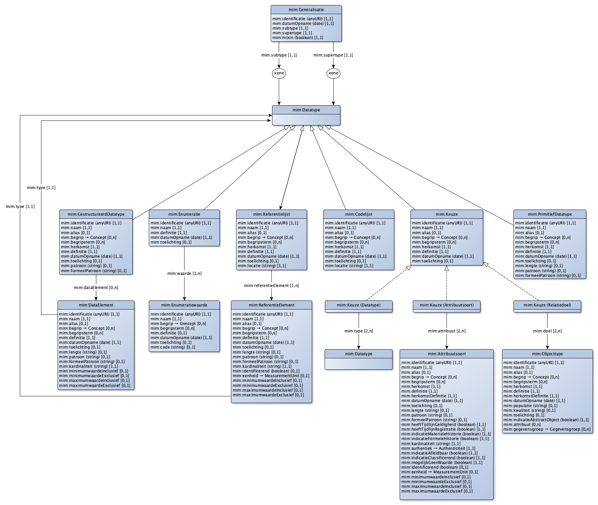
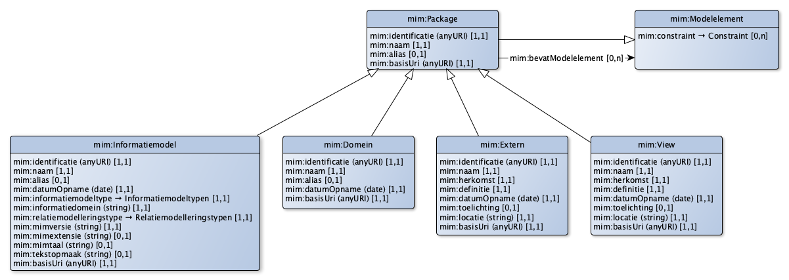

# Metamodel in Linked Data (LD)

## Ontologisch metamodel in LD

Het MIM uitgedrukt in LD houdt onder ander een ontologisch metamodel in. Dit betekent dat er voor elk van de modelelementen van het MIM een klasse en/of eigenschap gedefinieerd is in termen van RDF, RDFS en OWL. In de hierop volgende paragrafen wordt deze uitwerking geven.

Het MIM is een *metamodel*. Dit betekent dat in termen van het MIM een concreet informatiemodel kan worden uitgewerkt, bijvoorbeeld het informatiemodel Basisregistratie Adressen en Gebouwen. Het MIM is niet bedoeld om vervolgens in termen van dit informatiemodel een concrete dataset te vormen. Zie ook [Typen informatiemodellen](#typen-informatiemodellen): het MIM is niet beoogd voor een informatiemodel op niveau 4. Hiervoor is een transformatie nodig naar een (technisch) uitwisselings- of opslagmodel nodig.

Op diezelfde manier levert het toepassen van het MIM in RDF geen ontologie of vocabulaire waarin RDF kan worden uitgedrukt: slechts het informatiemodel zelf is op deze manier in RDF uitgedrukt. Voor de vertaalslag naar een ontologie is een afzonderlijke transformatie nodig.

Vanuit een Linked Data perspectief is dit bijzonder. Een kernmerk van Linked Data is namelijk dat een informatiemodel op niveau 3 *ook* direct, zonder aanpassingen, bruikbaar is als informatiemodel op niveau 4. Sterk: Linked Data modellen zijn ook bruikbaar op niveau 1 en 2. Dit is vanuit het MIM zelf niet mogelijk. Hiervoor is een vertaalslag nodig naar een "echte" Linked Data ontologie.

Zo leidt een MIM objecttype "Schip" tot de volgende weergave in RDF:

<pre class='ex-turtle'>
@prefix vb: &lt;http://bp4mc2.org/voorbeeld/> .
@prefix mim: &lt;http://bp4mc2.org/def/mim#> .

vb:Schip a mim:Objecttype;
  rdfs:label "Schip"@nl;
.
</pre>

`vb:Schip` is in dit voorbeeld een voorkomen van de klasse `mim:Objecttype`. dit voorkomen kent zelf geen voorkomens. Hiervoor is een vertaling nodig naar een `rdfs:Class`, bijvoorbeeld door:

<pre class='ex-turtle'>
@prefix vbo: &lt;http://bp4mc2.org/voorbeeld/def#>.

vbo:Schip a rdfs:Class;
  rdfs:seeAlso vb:Schip;  
.
vb:Pakjesboot12 a vbo:Schip.
</pre>

De transformatie van het MIM model naar deze RDF ontologie is opgenomen in [sectie 6.4](#transformatie-mim-rdfs-owl-shacl).

## Structuur metamodel in LD

Het RDF model is opgesplitst in twee delen. Zoals gebruikelijk in RDF zijn deze modeldelen via hun URL op het internet te benaderen:

1. de [RDF vocabulaire](media/mim.ttl), met de (meta)klassen en (meta)eigenschappen;
2. de [RDF Shapesgraph](media/mim-shapes.ttl), met "shapes", de structuur die gelden op het gebruik van de klassen en eigenschappen.

In onderstaande paragrafen wordt zowel de vocabulaire als de structuur gezamenlijk per modelelement besproken. Een RDF representatie in turtle wordt gegeven en daarnaast ook een grafische representatie. Hiervoor wordt de verbeelding gebruikt zoals beschreven op https://bp4mc2.org/20181107/#grafische-representatie.

Bij het opstellen van het MIM in RDF is gebruik gemaakt van de tekstuele beschrijving van het MIM. Er is een 1-op-1 omzetting gedaan, zonder enige aanpassing van de beschrijvingen. Dit maakt het mogelijk om een MIM informatiemodel om te zetten van de ene representatie (bijvoorbeeld in UML) naar de andere en weer terug, zonder verlies van informatie.

De volgende regels zijn gebruikt bij de omzetting van de MIM tekst naar RDF:

1. Elk voorkomen van een MIM «metaclass» is omgezet naar een voorkomen van een `owl:Class`;
2. Elk aspect van een MIM «metaclass» is omgezet naar een voorkomen van een `owl:DatatypeProperty`, voor zover sprake is van een aspect dat een waarde heeft die met een datatype is uit te drukken (zoals tekstuele, nummerieke of boolean aspecten);
3. Elk aspect van een MIM «metaclass» is omgezet naar een voorkomen van een `owl:ObjectProperty`, voor zover sprake is van een aspect waarbij de waarde verwijst naar een voorkomen van een andere MIM «metaclass»;
4. Een `rdfs:label` is opgenomen met de naam van de MIM «metaclass» c.q. het aspect;
5. Een `rdfs:comment` is opgenomen met de definitie van de MIM «metaclass» c.q. het aspect.

Voor de omzetting van de gegevensconstraints (zoals cardinaliteiten, datatypen en properties per klasse), is op de volgende manier een SHACL shape graph gemaakt:

1. Elk voorkomen van een MIM «metaclass» kent ook een `sh:NodeShape` met een `sh:name` die overeen komt de originele technische naam (UpperCamelCase);
2. Voor elk voorkomen van een MIM «metaclass» zijn `sh:PropertyShapes` aangemaakt om aan te geven welke aspecten zijn toegestaan voor een MIM «metaclass», de kardinaliteiten en het datatype c.q. de geassocieerde MIM «metaclass».

### Kern

Als prefix wordt voor de vocabulaire gebruik gemaakt van `mim`, met de namespace `http://bp4mc2.org/def/mim#`. Voor de shapes wordt als prefix gebruik gemaakt van `shape`, met als namespace `http://bp4mc2.org/def/mim-shapes#`.

| **MIM metaclass** | **Metaclass in RDF** | **Shape in RDF** | **Grondslag** |
|-------------------|----------------------|------------------|---------------|
| Objecttype        | [`mim:Objecttype`](http://bp4mc2.org/def/mim#Objecttype) | shape:Objecttype | [2.5.2](#objecttypen-en-attribuutsoorten) |
| Attribuutsoort    | [`mim:Attribuutsoort`](http://bp4mc2.org/def/mim#Attribuutsoort) | shape:Attribuutsoort | [2.5.3](#attribuutsoort-en-een-groepering-ervan)
| Gegevensgroep     | [`mim:Gegevensgroep`](http://bp4mc2.org/def/mim#Gegevensgroep) | shape:Gegevensgroep | [2.5.4](#gegevensgroep) |
| Gegevensgroeptype | [`mim:Gegevensgroeptype`](http://bp4mc2.org/def/mim#Gegevensgroeptype) | shape:Gegevensgroeptype | [2.5.5](#gegevensgroeptype) |
| Generalisatie     | [`mim:Generalisatie`](http://bp4mc2.org/def/mim#Generalisatie) | shape:Generalisatie | [2.6.1](#generalisatie) |
| Relatiesoort      | [`mim:Relatiesoort`](http://bp4mc2.org/def/mim#Relatiesoort) | shape:Relatiesoort | [2.6.2](#relatiesoort) |
| Relatieklasse     | [`mim:Relatieklasse`](http://bp4mc2.org/def/mim#Relatieklasse) | shape:Relatieklasse | [2.6.3](#relatieklasse) |

### Datatypen

| **MIM metaclass** | **Metaclass in RDF** | **Shape in RDF** | **Grondslag** |
|-------------------|----------------------|------------------|---------------|
| Datatype                | [`mim:Datatype`](http://bp4mc2.org/def/mim#Datatype) | shape:Datatype | [2.8](#datatype) |
| Primitief datatype      | [`mim:PrimitiefDatatype`](http://bp4mc2.org/def/mim#PrimitiefDatatype) |shape:PrimitiefDatatype | [2.8.1](#primitief-datatype) |
| Gestructureerd datatype | [`mim:GestructuurdDatatype`](http://bp4mc2.org/def/mim#GestructuurdDatatype) | shape:GestructuurdDatatype | [2.8.2](#gestructureerd-datatype) |
| Data element            | [`mim:DataElement`](http://bp4mc2.org/def/mim#DataElement) | shape:DataElement | [2.8.3](#data-element) |
| Enumeratie              | [`mim:Enumeratie`](http://bp4mc2.org/def/mim#Enumeratie) | shape:Enumeratie | [2.7.3](#enumeratie) |
| Enumeratiewaarde        | [`mim:Enumeratiewaarde`](http://bp4mc2.org/def/mim#Enumeratiewaarde) | shape:Enumeratiewaarde | [2.7.4](#enumeratiewaarde) |
| Referentielijst         | [`mim:Referentielijst`](http://bp4mc2.org/def/mim#Referentielijst) | shape:Referentielijst | [2.7.1](#referentielijst) |
| Referentie element      | [`mim:ReferentieElement`](http://bp4mc2.org/def/mim#ReferentieElement) | shape:ReferentieElement | [2.7.2](#referentie-element) |
| Codelijst                | [`mim:Codelijst`](http://bp4mc2.org/def/mim#Codelijst) | shape:Codelijst | [2.7.5](#codelijst) |

### Overige

*Constraint*

| **MIM metaclass** | **Metaclass in RDF** | **Shape in RDF** | **Grondslag** |
|-------------------|----------------------|------------------|---------------|
| Constraint        | [`mim:Constraint`](http://bp4mc2.org/def/mim#Constraint) | shape:Constraint | [2.10.1](#constraint) |
| Keuze             | [`mim:Keuze`](http://bp4mc2.org/def/mim#Keuze) | shape:Keuze | [2.10.2](#keuze) |

*Keuze*

De "keuze constructie" maakt een keuze mogelijk tussen meerdere attribuutsoorten, datatypen en relatiedoelen (objecttypen). Er mag aan één specifieke keuze maar één soort van deze drie worden verbonden. Indien dit datatype gekozen wordt voor een attribuutsoort of relatiedoel, dan heeft dit de volgende betekenis, afhankelijk van de verbonden soort:

- Attribuutsoort: een keuze tussen attribuutsoorten **in plaats van** de attribuutsoort die deze keuze als datatype heeft;
- Datatype: een keuze tussen datatypen **in plaats van** dit keuze datatype;
- Relatiedoel: een keuze tussen objecttypen als relatiedoel **in plaats van** het doel van de relatieroldoel

| **MIM metaclass** | **Metaclass in RDF** | **Shape in RDF** | **Grondslag** |
|-------------------|----------------------|------------------|---------------|
| Keuze             | [`mim:Keuze`](http://bp4mc2.org/def/mim#Keuze) | shape:Keuze | [2.10.2](#keuze) |
| Datatype          | [`mim:Datatype`](http://bp4mc2.org/def/mim#Datatype) | shape:Datatype | [2.8](#datatype) |
| Objecttype        | [`mim:Objecttype`](http://bp4mc2.org/def/mim#Objecttype) | shape:Objecttype | [2.5.2](#objecten-en-objecttype) |
| Attribuutsoort    | [`mim:Attribuutsoort`](http://bp4mc2.org/def/mim#Attribuutsoort) | shape:Attribuutsoort | [2.5.3](#attribuutsoort-en-een-groepering-ervan) |

*Relatierol*

| **MIM metaclass** | **Metaclass in RDF** | **Shape in RDF** | **Grondslag** |
|-------------------|----------------------|------------------|---------------|
| Relatierol (abstract) | [`Relatierol`](http://bp4mc2.org/def/mim#Relatierol) | shape:Relatierol | [2.6.5](#relatierol) |
| Relatierol bron       | [`RelatierolBron`](http://bp4mc2.org/def/mim#RelatierolBron) | shape:RelatierolBron | [2.6.5](#relatierol) |
| Relatierol doel       | [`RelatierolDoel`](http://bp4mc2.org/def/mim#RelatierolDoel) | shape:RelatierolDoel | [2.6.5](#relatierol) |

*Externe koppeling*

| **MIM metaclass** | **Metaclass in RDF** | **Shape in RDF** | **Grondslag** |
|-------------------|----------------------|------------------|---------------|
| Externe koppeling | [`mim:ExterneKoppeling`](http://bp4mc2.org/def/mim#ExterneKoppeling) | shape:ExterneKoppeling | [2.6.4](#externe-koppeling) |

*Packages*

| **MIM metaclass**     | **Metaclass in RDF** | **Shape in RDF** | **Grondslag** |
|-----------------------|----------------------|------------------|---------------|
| Package               | [`mim:Package`](http://bp4mc2.org/def/mim#Package) | shape:Package | [2.9](#packages) |
| Informatiemodel       | [`mim:Informatiemodel`](http://bp4mc2.org/def/mim#Informatiemodel) | shape:Informatiemodel | [2.9.1](#informatiemodel) |
| Domein (het eigen IM) | [`mim:Domein`](http://bp4mc2.org/def/mim#Domein) | shape:Domein | [2.9.2](#domein) |
| Extern                | [`mim:Extern`](http://bp4mc2.org/def/mim#Extern) | shape:Extern | [2.9.3](#extern) |
| View                  | [`mim:View`](http://bp4mc2.org/def/mim#View) | shape:View | [2.9.4](#view) |

## Nadere specificatie metagegevens in LD

Deze paragraaf is een aanvulling op de paragraaf *'Specificatie metagegevens'* in het hoofdstuk [Metamodel Algemeen](#metamodel-algemeen).

De betekenis van de metagegevens worden in LD gespecificeerd los van de klasse waartoe deze metagegevens behoren. Hieronder is een opsomming gegeven van alle metagegevens en de overeenkomstige meta-eigenschap in RDF. Ook is de definitie hier opgenomen voor zover aanwezig overgenomen uit eerdergenoemde algemene paragraaf.

De gegevensregels (structuur) voor de metagegevens zijn wel specifiek per klasse, en worden in de betreffende paragraaf behandeld.

| **MIM metagegeven** | **Meta-eigenschap in RDF** | **RDF type** | **Grondslag** |
|---------------------|----------------------------|--------------|---------------|
| aggregatietype | [`mim:aggregatietype`](http://bp4mc2.org/def/mim#aggregatietype) | owl:ObjectProperty | [2.12.20](#metagegeven-aggregatietype) |
| alias | [`mim:naam`](http://bp4mc2.org/def/mim#naam) | owl:DatatypeProperty | [2.12.3](#metagegeven-alias) |
| attribuut | [`mim:attribuut`](http://bp4mc2.org/def/mim#attribuut) | owl:ObjectProperty | [2.12.26](#metagegeven-attribuut) |
| authentiek | [`mim:authentiek`](http://bp4mc2.org/def/mim#authentiek) | owl:ObjectProperty | [2.12.13](#metagegeven-authentiek) |
| begrip | [`mim:begrip`](http://bp4mc2.org/def/mim#begrip) | owl:ObjectProperty | [2.12.5](#metagegeven-begrip) |
| begripsterm | [`mim:begripsterm`](http://bp4mc2.org/def/mim#begripsterm) | owl:DatatypeProperty | [2.12.5](#metagegeven-begrip) |
| bron | [`mim:bron`](http://bp4mc2.org/def/mim#bron) | owl:ObjectProperty | [2.12.17](#metagegeven-bron) |
| code | [`mim:code`](http://bp4mc2.org/def/mim#code) | owl:DatatypeProperty | [2.12.36](#metagegeven-code) |
| constraint | [`mim:constraint`](http://bp4mc2.org/def/mim#constraint) | owl:ObjectProperty | [2.12.35](#metagegeven-constraint) |
| data element | [`mim:dataElement`](http://bp4mc2.org/def/mim#dataElement) | owl:ObjectProperty | [2.12.29](#metagegeven-data-element) |
| datum opname | [`mim:datumOpname`](http://bp4mc2.org/def/mim#datumOpname) | owl:DatatypeProperty | [2.12.8](#metagegeven-datum-opname) |
| definitie | [`mim:definitie`](http://bp4mc2.org/def/mim#definitie) | owl:DatatypeProperty | [2.12.2](#metagegeven-definitie) |
| doel | [`mim:doel`](http://bp4mc2.org/def/mim#doel) | owl:ObjectProperty | [2.12.18](#metagegeven-doel) |
| formeel patroon | [`mim:formeelPatroon`](http://bp4mc2.org/def/mim#formeelPatroon) | owl:DatatypeProperty | [2.12.25](#metagegeven-formeel-patroon) |
| gegevensgroep | [`mim:gegevensgroep`](http://bp4mc2.org/def/mim#gegevensgroep) | owl:ObjectProperty | [2.12.27](#metagegeven-gegevensgroep) |
| groeptype | [`mim:groeptype`](http://bp4mc2.org/def/mim#groeptype) | owl:ObjectProperty | [2.12.28](#metagegeven-groeptype) |
| herkomst | [`mim:herkomst`](http://bp4mc2.org/def/mim#herkomst) | owl:DatatypeProperty | [2.12.6](#metagegeven-herkomst) |
| herkomst definitie | [`mim:herkomstDefinitie`](http://bp4mc2.org/def/mim#herkomstDefinitie) | owl:DatatypeProperty | [2.12.7](#metagegeven-herkomst-definitie) |
| identificerend | [`mim:identificerend`](http://bp4mc2.org/def/mim#identificerend) | owl:DatatypeProperty | [2.12.9](#metagegeven-identificerend) |
| indicatie abstract object | [`mim:indicatieAbstractObject`](http://bp4mc2.org/def/mim#indicatieAbstractObject) | owl:DatatypeProperty | [2.12.37(#metagegeven-indicatie-abstract-object)]|
| indicatie afleidbaar | [`mim:indicatieAfleidbaar`](http://bp4mc2.org/def/mim#indicatieAfleidbaar) | owl:DatatypeProperty | [2.12.14](#metagegeven-indicatie-afleidbaar) |
| indicatie classificerend | [`mim:indicatieClassificerend`](http://bp4mc2.org/def/mim#indicatieAfleidbaar) | owl:DatatypeProperty | [2.12.15](#metagegeven-indicatie-classificerend) |
| indicatie formele historie | [`mim:indicatieFormeleHistorie`](http://bp4mc2.org/def/mim#indicatieFormeleHistorie) | owl:DatatypeProperty | [2.12.11](#metagegeven-indicatie-formele-historie) |
| indicatie materiële historie | [`mim:indicatieMaterieleHistorie`](http://bp4mc2.org/def/mim#indicatieMaterieleHistorie) | owl:DatatypeProperty | [2.12.10](#metagegeven-indicatie-materiele-historie) |
| informatiedomein | [`mim:informatiedomein`](http://bp4mc2.org/def/mim#informatiedomein) | owl:DatatypeProperty | [2.11.1](#metagegeven-domein) |
| informatiemodeltype | [`mim:informatiemodeltype`](http://bp4mc2.org/def/mim#informatiemodeltype) | owl:ObjectProperty | [2.11.2](#metagegeven-informatiemodel-type) |
| kardinaliteit | [`mim:kardinaliteit`](http://bp4mc2.org/def/mim#kardinaliteit) | owl:DatatypeProperty | [2.12.12](#metagegeven-kardinaliteit)
| kwaliteit | [`mim:kwaliteit`](http://bp4mc2.org/def/mim#kwaliteit) | owl:DatatypeProperty | |
| lengte | [`mim:lengte`](http://bp4mc2.org/def/mim#lengte) | owl:DatatypeProperty | [2.12.23](#metagegeven-lengte-domein-van-een-waarde-van-een-gegeven) |
| locatie | [`mim:locatie`](http://bp4mc2.org/def/mim#locatie) | owl:DatatypeProperty | [2.12.21](#metagegeven-locatie) |
| mim extensie | [`mim:extensie`](http://bp4mc2.org/def/mim#extensie) | owl:DatatypeProperty | [2.11.5](#metagegeven-mim-extensie)
| mim taal | [`mim:taal`](http://bp4mc2.org/def/mim#taal) | owl:DatatypeProperty | [2.11.6](#metagegeven-mim-taal) |
| mim versie | [`mim:versie`](http://bp4mc2.org/def/mim#versie) | owl:DatatypeProperty | [2.11.4](#metagegeven-mim-versie) |
| mogelijk geen waarde | [`mim:mogelijkGeenWaarde`](http://bp4mc2.org/def/mim#mogelijkGeenWaarde) | owl:DatatypeProperty | [2.12.16](#metagegeven-mogelijk-geen-waarde) |
| naam | [`mim:naam`](http://bp4mc2.org/def/mim#naam) | owl:DatatypeProperty | [2.12.1](#metagegeven-naam) |
| patroon | [`mim:patroon`](http://bp4mc2.org/def/mim#patroon) | owl:DatatypeProperty | [2.12.24](#metagegeven-patroon) |
| populatie | [`mim:populatie`](http://bp4mc2.org/def/mim#populatie) | owl:DatatypeProperty | |
| referentie element | [`mim:referentieElement`](http://bp4mc2.org/def/mim#referentieElement) | owl:ObjectProperty | [2.12.31](#metagegeven-referentie-element) |
| relatiemodelleringstype | [`mim:relatiemodelleringstype`](http://bp4mc2.org/def/mim#relatiemodelleringstype) | owl:ObjectProperty | [2.11.3](#metagegeven-relatiemodelleringstype) |
| relatierol | [`mim:relatierol`](http://bp4mc2.org/def/mim#relatierol) | owl:ObjectProperty | |
| specificatie formeel | [`mim:specificatieFormeel`](http://bp4mc2.org/def/mim#specificatieFormeel) | owl:DatatypeProperty | |
| specificatie tekst | [`mim:specificatieTekst`](http://bp4mc2.org/def/mim#specificatieTekst) | owl:DatatypeProperty | |
| subtype | [`mim:subtype`](http://bp4mc2.org/def/mim#subtype) | owl:ObjectProperty | |
| supertype | [`mim:supertype`](http://bp4mc2.org/def/mim#supertype) | owl:ObjectProperty | |
| toelichting | [`mim:toelichting`](http://bp4mc2.org/def/mim#toelichting) | owl:DatatypeProperty | [2.12.4](#metagegeven-toelichting)
| type | [`mim:type`](http://bp4mc2.org/def/mim#type) | owl:ObjectProperty | [2.12.22](#metagegeven-type-domein-van-een-waarde-een-gegeven) |
| unidirectioneel | [`mim:unidirectioneel`](http://bp4mc2.org/def/mim#unidirectioneel) | owl:DatatypeProperty | [2.12.19](#metagegeven-unidirectioneel) |
| waarde | [`mim:waarde`](http://bp4mc2.org/def/mim#waarde) | owl:ObjectProperty | [2.12.30](#metagegeven-waarde) |

### Modellering metagegevens voor objecten en attributen in LD

**Specificatie voor mim:Objecttype**

De objecttypen worden naar de volgende aspecten gespecificeerd:

| **Aspect**                | **Eigenschap** | **Kardinaliteit** | **Datatype of klasse** |
|---------------------------|----------------|-------------------|--------------|
| Naam                      | [`mim:naam`](http://bp4mc2.org/def/mim#naam) | 1 | tekst |
| Alias                     | [`mim:alias`](http://bp4mc2.org/def/mim#alias) | 0..1 | tekst |
| Begrip                    | [`mim:begrip`](http://bp4mc2.org/def/mim#begrip) | 0..* | [`skos:Concept`](http://www.w3.org/2004/02/skos/core#Concept) |
| Begripsterm               | [`mim:begripsterm`](http://bp4mc2.org/def/mim#begripsterm) | 0..* | tekst |
| Herkomst                  | [`mim:herkomst`](http://bp4mc2.org/def/mim#herkomst) | 1 | tekst |
| Definitie                 | [`mim:definitie`](http://bp4mc2.org/def/mim#definitie) | 1 | tekst |
| Herkomst definitie        | [`mim:herkomstDefinitie`](http://bp4mc2.org/def/mim#herkomstDefinitie) | 1 | tekst |
| Datum opname              | [`mim:datumOpname`](http://bp4mc2.org/def/mim#datumOpname) | 1 | datum |
| Populatie                 | [`mim:populatie`](http://bp4mc2.org/def/mim#populatie) | 0..1 | tekst |
| Kwaliteit                 | [`mim:kwaliteit`](http://bp4mc2.org/def/mim#kwaliteit) | 0..1 | tekst |
| Toelichting               | [`mim:toelichting`](http://bp4mc2.org/def/mim#toelichting) | 0..1 | tekst |
| Indicatie abstract object | [`mim:indicatieAbstractObject`](http://bp4mc2.org/def/mim#indicatieAbstractObject) | 1 | boolean |
| Attribuut                 | [`mim:attribuut`](http://bp4mc2.org/def/mim#attribuut) | 0..n | [`mim:Attribuutsoort`](http://bp4mc2.org/def/mim#Attribuutsoort) |
| Gegevensgroep             | [`mim:gegevensgroep`](http://bp4mc2.org/def/mim#gegevensgroep) | 0..n | [`mim:Gegevensgroep`](http://bp4mc2.org/def/mim#Gegevensgroep) |
| Constraint                | [`mim:constraint`](http://bp4mc2.org/def/mim#constraint) | 0..n | [`mim:Constraint`](http://bp4mc2.org/def/mim#Constraint) |

**Specificatie voor mim:Attribuutsoort**

De attribuutsoorten worden naar de volgende aspecten gespecificeerd:

| **Aspect**                   | **Eigenschap** | **Kardinaliteit** | **Datatype of klasse** |
|------------------------------|----------------|-------------------|--------------|
| Naam                         | [`mim:naam`](http://bp4mc2.org/def/mim#naam) | 1 | tekst |
| Alias                        | [`mim:alias`](http://bp4mc2.org/def/mim#alias) | 0..1 | tekst |
| Begrip                    | [`mim:begrip`](http://bp4mc2.org/def/mim#begrip) | 0..* | [`skos:Concept`](http://www.w3.org/2004/02/skos/core#Concept) |
| Begripsterm               | [`mim:begripsterm`](http://bp4mc2.org/def/mim#begripsterm) | 0..* | tekst |
| Herkomst                     | [`mim:herkomst`](http://bp4mc2.org/def/mim#herkomst) | 1 | tekst |
| Definitie                    | [`mim:definitie`](http://bp4mc2.org/def/mim#definitie) | 1 | tekst |
| Herkomst definitie           | [`mim:herkomstDefinitie`](http://bp4mc2.org/def/mim#herkomstDefinitie) | 1 | tekst |
| Datum opname                 | [`mim:datumOpname`](http://bp4mc2.org/def/mim#datumOpname) | 1 | datum |
| Type                         | [`mim:type`](http://bp4mc2.org/def/mim#type) | 1 | [`mim:Datatype`](http://bp4mc2.org/def/mim#Datatype) |
| Lengte                       | [`mim:lengte`](http://bp4mc2.org/def/mim#lengte) | 0..1 | tekst |
| Patroon                      | [`mim:patroon`](http://bp4mc2.org/def/mim#patroon) | 0..1 | tekst |
| Formeel patroon              | [`mim:formeelPatroon`](http://bp4mc2.org/def/mim#formeelPatroon) | 0..1 | tekst |
| Indicatie materiële historie | [`mim:indicatieMaterieleHistorie`](http://bp4mc2.org/def/mim#indicatieMaterieleHistorie) | 1 | boolean |
| Indicatie formele historie   | [`mim:indicatieFormeleHistorie`](http://bp4mc2.org/def/mim#indicatieFormeleHistorie) | 1 | boolean |
| Kardinaliteit                | [`mim:kardinaliteit`](http://bp4mc2.org/def/mim#kardinaliteit) | 1 | tekst |
| Authentiek                   | [`mim:authentiek`](http://bp4mc2.org/def/mim#authentiek) | 1 | Authenticiteit |
| Toelichting                  | [`mim:toelichting`](http://bp4mc2.org/def/mim#toelichting) | 0..1 | tekst |
| Indicatie afleidbaar         | [`mim:indicatieAfleidbaar`](http://bp4mc2.org/def/mim#indicatieAfleidbaar) | 1 | boolean |
| Indicatie classificerend     | [`mim:indicatieAfleidbaar`](http://bp4mc2.org/def/mim#indicatieAfleidbaar) | 1 | boolean |
| Mogelijk geen waarde         | [`mim:mogelijkGeenWaarde`](http://bp4mc2.org/def/mim#mogelijkGeenWaarde) | 1 | boolean |
| Identificerend               | [`mim:identificerend`](http://bp4mc2.org/def/mim#identificerend) | 0..1 | tekst |

Het veld `mim:authentiek` verwijst naar één van de volgende mogelijke waarden:

| **Authenticiteit** | **Definitie** |
|--------------------|---------------|
| [`mim:Authentiek`](http://bp4mc2.org/def/mim#Authentiek) | Indien het een authentiek (landelijk) basisgegeven of een als relatiesoort gemodelleerd authentiek (landelijk) basisgegeven is. Basisgegevens zijn altijd gegevens afkomstig uit de landelijke registraties. |
| [`mim:Basisgegeven`](http://bp4mc2.org/def/mim#Basisgegeven) | Indien het een landelijk basisgegeven of een als relatiesoort gemodelleerd (landelijk) basisgegeven is in een landelijke registratie, maar in die registratie géén authentiek gegeven is. |
| [`mim:LandelijkKerngegeven`](http://bp4mc2.org/def/mim#LandelijkKerngegeven) | Indien het een gegeven of een als relatiesoort gemodelleerd gegeven is in een landelijk sector- en domein-overstijgend informatiemodel en geen authentiek gegeven en geen basisgegeven is. |
| [`mim:OverigeAuthenticiteit`](http://bp4mc2.org/def/mim#OverigeAuthenticiteit) | Indien het géén van de voorgaande categorieën betreft. Veelal gaat het dan om proces-, taakveld- of domeinspecifieke gegevens. |

**Specificatie voor mim:Gegevensgroep**

De gegevensgroepen worden naar de volgende aspecten gespecificeerd:

| **Aspect**                   | **Eigenschap** | **Kardinaliteit** | **Datatype of klasse** |
|------------------------------|----------------|-------------------|--------------|
| Naam                         | [`mim:naam`](http://bp4mc2.org/def/mim#naam) | 1 | tekst |
| Alias                        | [`mim:alias`](http://bp4mc2.org/def/mim#alias) | 0..1 | tekst |
| Begrip                    | [`mim:begrip`](http://bp4mc2.org/def/mim#begrip) | 0..* | [`skos:Concept`](http://www.w3.org/2004/02/skos/core#Concept) |
| Begripsterm               | [`mim:begripsterm`](http://bp4mc2.org/def/mim#begripsterm) | 0..* | tekst |
| Definitie                    | [`mim:definitie`](http://bp4mc2.org/def/mim#definitie) | 1 | tekst |
| Toelichting                  | [`mim:toelichting`](http://bp4mc2.org/def/mim#toelichting) | 0..1 | tekst |
| Gegevensgroeptype            | [`mim:gegevensgroeptype`](http://bp4mc2.org/def/mim#gegevensgroeptype) | 1 | [`mim:Gegevensgroeptype`](http://bp4mc2.org/def/mim#Gegevensgroeptype) |
| Herkomst                     | [`mim:herkomst`](http://bp4mc2.org/def/mim#herkomst) | 1 | tekst |
| Herkomst definitie           | [`mim:herkomstDefinitie`](http://bp4mc2.org/def/mim#herkomstDefinitie) | 1 | tekst |
| Datum opname                 | [`mim:datumOpname`](http://bp4mc2.org/def/mim#datumOpname) | 1 | datum |
| Indicatie materiële historie | [`mim:indicatieMaterieleHistorie`](http://bp4mc2.org/def/mim#indicatieMaterieleHistorie) | 1 | boolean |
| Indicatie formele historie   | [`mim:indicatieFormeleHistorie`](http://bp4mc2.org/def/mim#indicatieFormeleHistorie) | 1 | boolean |
| Kardinaliteit                | [`mim:kardinaliteit`](http://bp4mc2.org/def/mim#kardinaliteit) | 1 | tekst |
| Authentiek                   | [`mim:authentiek`](http://bp4mc2.org/def/mim#authentiek) | 1 | Authenticiteit |

**Specificatie voor mim:Gegevensgroeptype**

De gegevensgroeptypen worden naar de volgende aspecten gespecificeerd:

| **Aspect**                   | **Eigenschap** | **Kardinaliteit** | **Datatype of klasse** |
|------------------------------|----------------|-------------------|--------------|
| Naam                         | [`mim:naam`](http://bp4mc2.org/def/mim#naam) | 1 | tekst |
| Alias                        | [`mim:alias`](http://bp4mc2.org/def/mim#alias) | 0..1 | tekst |
| Begrip                    | [`mim:begrip`](http://bp4mc2.org/def/mim#begrip) | 0..* | [`skos:Concept`](http://www.w3.org/2004/02/skos/core#Concept) |
| Begripsterm               | [`mim:begripsterm`](http://bp4mc2.org/def/mim#begripsterm) | 0..* | tekst |
| Definitie                    | [`mim:definitie`](http://bp4mc2.org/def/mim#definitie) | 0..1 | tekst |
| Herkomst definitie           | [`mim:herkomstDefinitie`](http://bp4mc2.org/def/mim#herkomstDefinitie) | 0..1 | tekst |
| Toelichting                  | [`mim:toelichting`](http://bp4mc2.org/def/mim#toelichting) | 0..1 | tekst |
| Datum opname                 | [`mim:datumOpname`](http://bp4mc2.org/def/mim#datumOpname) | 1 | datum |
| Attribuut                 | [`mim:attribuut`](http://bp4mc2.org/def/mim#attribuut) | 0..n | [`mim:Attribuutsoort`](http://bp4mc2.org/def/mim#Attribuutsoort) |
| Gegevensgroep             | [`mim:gegevensgroep`](http://bp4mc2.org/def/mim#gegevensgroep) | 0..n | [`mim:Gegevensgroep`](http://bp4mc2.org/def/mim#Gegevensgroep) |
| Constraint                | [`mim:constraint`](http://bp4mc2.org/def/mim#constraint) | 0..n | [`mim:Constraint`](http://bp4mc2.org/def/mim#Constraint) |

### Specificatie metagegevens voor relaties

**Relatiesoort en relatierol**

Het metamodel heeft twee manieren om een relatie tussen twee objecttypen te
beschrijven. Deze keuze wordt aangegeven in de eigen extensie, zoals beschreven
in paragraaf 1.8. Alleen het gekozen alternatief is relevant voor de modellering
in uw informatiemodel. - Alternatief 1: Verplichte benoeming van de naam van de
relatie met de bijbehorende metagegevens\*\* - Alternatief 2: Verplichte
benoeming van de rol van het doel in een relatie met de bijbehorende
metagegevens en optioneel de benoeming van de naam van de relatie.

Beide alternatieven gebruiken relatiesoort en relatierol, maar met andere regels
voor gebruik.

#### Relatiesoort leidend (alternatief 1)

Relatiesoort is verplicht, met een naam en met een definitie en deze is leidend.
Metadata aspecten worden hierbij altijd vastgelegd. Het gebruik van relatierol
is optioneel (zowel bij bron en doel). Áls er een relatierol doel wordt
vastgelegd, dan is de metadata hierbij wel verplicht.

**Specificatie voor «Relatiesoort»**

De relatiesoorten worden naar de volgende aspecten gespecificeerd.

| **Aspect**                   | **Eigenschap** | **Kardinaliteit** | **Datatype of klasse** |
|------------------------------|----------------|-------------------|--------------|
| Naam                         | [`mim:naam`](http://bp4mc2.org/def/mim#naam) | 1 | tekst |
| Alias                        | [`mim:alias`](http://bp4mc2.org/def/mim#alias) | 0..1 | tekst |
| Begrip                       | [`mim:begrip`](http://bp4mc2.org/def/mim#begrip) | 0..* | [`skos:Concept`](http://www.w3.org/2004/02/skos/core#Concept) |
| Begripsterm                  | [`mim:begripsterm`](http://bp4mc2.org/def/mim#begripsterm) | 0..* | tekst |
| Unidirectioneel              | [`mim:unidirectioneel`](http://bp4mc2.org/def/mim#unidirectioneel) | 1 | boolean |
| Bron                         | [`mim:bron`](http://bp4mc2.org/def/mim#bron) | 1 | [`mim:Objecttype`](http://bp4mc2.org/def/mim#Objecttype) |
| Doel                         | [`mim:doel`](http://bp4mc2.org/def/mim#doel) | 1 | [`mim:Objecttype`](http://bp4mc2.org/def/mim#Objecttype) |
| Aggregatietype               | [`mim:aggregatietype`](http://bp4mc2.org/def/mim#aggregatietype) | 1 | Aggregatietype |
| Kardinaliteit                | [`mim:kardinaliteit`](http://bp4mc2.org/def/mim#kardinaliteit) | 1 | tekst |
| Herkomst                     | [`mim:herkomst`](http://bp4mc2.org/def/mim#herkomst) | 1 | tekst |
| Definitie                    | [`mim:definitie`](http://bp4mc2.org/def/mim#definitie) | 1 | tekst |
| Toelichting                  | [`mim:toelichting`](http://bp4mc2.org/def/mim#toelichting) | 0..1 | tekst |
| Herkomst definitie           | [`mim:herkomstDefinitie`](http://bp4mc2.org/def/mim#herkomstDefinitie) | 1 | tekst |
| Datum opname                 | [`mim:datumOpname`](http://bp4mc2.org/def/mim#datumOpname) | 1 | datum |
| Indicatie materiële historie | [`mim:indicatieMaterieleHistorie`](http://bp4mc2.org/def/mim#indicatieMaterieleHistorie) | 1 | boolean |
| Indicatie formele historie   | [`mim:indicatieFormeleHistorie`](http://bp4mc2.org/def/mim#indicatieFormeleHistorie) | 1 | boolean |
| Authentiek                   | [`mim:authentiek`](http://bp4mc2.org/def/mim#authentiek) | 1 | Authenticiteit |
| Indicatie afleidbaar         | [`mim:indicatieAfleidbaar`](http://bp4mc2.org/def/mim#indicatieAfleidbaar) | 1 | boolean |
| Mogelijk geen waarde         | [`mim:mogelijkGeenWaarde`](http://bp4mc2.org/def/mim#mogelijkGeenWaarde) | 1 | boolean |

Het veld `mim:aggregatietype` verwijst naar één van de volgende mogelijke waarden:

| **Aggregatietype** | **Definitie** |
|--------------------|---------------|
| [`mim:None`](http://bp4mc2.org/def/mim#None) | Er is geen sprake van een aggregate |
| [`mim:Composite`](http://bp4mc2.org/def/mim#Composite) | Compositie (gesloten wiebertje) |
| [`mim:Aggregate`](http://bp4mc2.org/def/mim#Aggregate) | Aggregatie (open wiebertje) |

**Specificatie voor mim:Relatierol**

Voor relatierollen worden naar de volgende aspecten gespecificeerd.

| **Aspect**                   | **Eigenschap** | **Kardinaliteit** | **Datatype of klasse** |
|------------------------------|----------------|-------------------|--------------|
| Naam                         | [`mim:naam`](http://bp4mc2.org/def/mim#naam) | 0..1 | tekst |
| Alias                        | [`mim:alias`](http://bp4mc2.org/def/mim#alias) | 0..1 | tekst |
| Begrip                    | [`mim:begrip`](http://bp4mc2.org/def/mim#begrip) | 0..* | [`skos:Concept`](http://www.w3.org/2004/02/skos/core#Concept) |
| Begripsterm               | [`mim:begripsterm`](http://bp4mc2.org/def/mim#begripsterm) | 0..* | tekst |
| Definitie                    | [`mim:definitie`](http://bp4mc2.org/def/mim#definitie) | 0..1 | tekst |

#### Relatierol is leidend (alternatief 2)

Verplichte benoeming van de rol van het doel in een relatie met de bijbehoren
de metagegevens en optioneel de benoeming van de naam van de relatie.

**Specificatie voor «Relatiesoort»**

De relatiesoorten worden naar de volgende aspecten gespecificeerd.

| **Aspect**                   | **Eigenschap** | **Kardinaliteit** | **Datatype of klasse** |
|------------------------------|----------------|-------------------|--------------|
| Naam                         | [`mim:naam`](http://bp4mc2.org/def/mim#naam) | 0..1 | tekst |
| Alias                        | [`mim:alias`](http://bp4mc2.org/def/mim#alias) | 0..1 | tekst |
| Begrip                    | [`mim:begrip`](http://bp4mc2.org/def/mim#begrip) | 0..* | [`skos:Concept`](http://www.w3.org/2004/02/skos/core#Concept) |
| Begripsterm               | [`mim:begripsterm`](http://bp4mc2.org/def/mim#begripsterm) | 0..* | tekst |
| Definitie                    | [`mim:definitie`](http://bp4mc2.org/def/mim#definitie) | 0..1 | tekst |

**Specificatie voor «Relatierol»**

Voor relatierol worden bij het doel rol van een relatiesoort de volgende
aspecten gespecificeerd.

| **Aspect**                   | **Eigenschap** | **Kardinaliteit** | **Datatype of klasse** |
|------------------------------|----------------|-------------------|--------------|
| Naam                         | [`mim:naam`](http://bp4mc2.org/def/mim#naam) | 1 | tekst |
| Alias                        | [`mim:alias`](http://bp4mc2.org/def/mim#alias) | 0..1 | tekst |
| Begrip                       | [`mim:begrip`](http://bp4mc2.org/def/mim#begrip) | 0..* | [`skos:Concept`](http://www.w3.org/2004/02/skos/core#Concept) |
| Begripsterm                  | [`mim:begripsterm`](http://bp4mc2.org/def/mim#begripsterm) | 0..* | tekst |
mim#Objecttype) |
| Kardinaliteit                | [`mim:kardinaliteit`](http://bp4mc2.org/def/mim#kardinaliteit) | 1 | tekst |
| Herkomst                     | [`mim:herkomst`](http://bp4mc2.org/def/mim#herkomst) | 1 | tekst |
| Definitie                    | [`mim:definitie`](http://bp4mc2.org/def/mim#definitie) | 1 | tekst |
| Toelichting                  | [`mim:toelichting`](http://bp4mc2.org/def/mim#toelichting) | 0..1 | tekst |
| Herkomst definitie           | [`mim:herkomstDefinitie`](http://bp4mc2.org/def/mim#herkomstDefinitie) | 1 | tekst |
| Datum opname                 | [`mim:datumOpname`](http://bp4mc2.org/def/mim#datumOpname) | 1 | datum |
| Indicatie materiële historie | [`mim:indicatieMaterieleHistorie`](http://bp4mc2.org/def/mim#indicatieMaterieleHistorie) | 1 | boolean |
| Indicatie formele historie   | [`mim:indicatieFormeleHistorie`](http://bp4mc2.org/def/mim#indicatieFormeleHistorie) | 1 | boolean |
| Authentiek                   | [`mim:authentiek`](http://bp4mc2.org/def/mim#authentiek) | 1 | Authenticiteit |
| Mogelijk geen waarde         | [`mim:mogelijkGeenWaarde`](http://bp4mc2.org/def/mim#mogelijkGeenWaarde) | 1 | boolean |

### Specificatie metagegevens voor overige relaties

**Specificatie voor mim:Generalisatie bij objecttypen**

De generalisaties worden naar het volgende aspect gespecificeerd:

| **Aspect**                   | **Eigenschap** | **Kardinaliteit** | **Datatype of klasse** |
|------------------------------|----------------|-------------------|--------------|
| Naam                         | [`mim:naam`](http://bp4mc2.org/def/mim#naam) | 0..1 | tekst |
| Alias                        | [`mim:alias`](http://bp4mc2.org/def/mim#alias) | 0..1 | tekst |
| Begrip                    | [`mim:begrip`](http://bp4mc2.org/def/mim#begrip) | 0..* | [`skos:Concept`](http://www.w3.org/2004/02/skos/core#Concept) |
| Begripsterm               | [`mim:begripsterm`](http://bp4mc2.org/def/mim#begripsterm) | 0..* | tekst |
| Subtype                      | [`mim:definitie`](http://bp4mc2.org/def/mim#subtype) | 1 | [`mim:Objecttype`](http://bp4mc2.org/def/mim#Objecttype) |
| Supertype                      | [`mim:definitie`](http://bp4mc2.org/def/mim#supertype) | 1 | [`mim:Objecttype`](http://bp4mc2.org/def/mim#Objecttype) |

**Specificatie voor mim:Generalisatie bij datatypen**

De generalisaties worden naar het volgende aspect gespecificeerd:

| **Aspect**                   | **Eigenschap** | **Kardinaliteit** | **Datatype of klasse** |
|------------------------------|----------------|-------------------|--------------|
| Naam                         | [`mim:naam`](http://bp4mc2.org/def/mim#naam) | 0..1 | tekst |
| Alias                        | [`mim:alias`](http://bp4mc2.org/def/mim#alias) | 0..1 | tekst |
| Begrip                    | [`mim:begrip`](http://bp4mc2.org/def/mim#begrip) | 0..* | [`skos:Concept`](http://www.w3.org/2004/02/skos/core#Concept) |
| Begripsterm               | [`mim:begripsterm`](http://bp4mc2.org/def/mim#begripsterm) | 0..* | tekst |
| Subtype                      | [`mim:definitie`](http://bp4mc2.org/def/mim#subtype) | 1 | [`mim:Datatype`](http://bp4mc2.org/def/mim#Datatype) |
| Supertype                      | [`mim:definitie`](http://bp4mc2.org/def/mim#supertype) | 1 | [`mim:Datatype`](http://bp4mc2.org/def/mim#Datatype) |

**Specificatie voor mim:Relatieklasse**

De relatieklassen worden naar de volgende aspecten gespecificeerd:

| **Aspect**                   | **Eigenschap** | **Kardinaliteit** | **Datatype of klasse** |
|------------------------------|----------------|-------------------|--------------|
| Naam                         | [`mim:naam`](http://bp4mc2.org/def/mim#naam) | 0..1 | tekst |
| Alias                        | [`mim:alias`](http://bp4mc2.org/def/mim#alias) | 0..1 | tekst |
| Begrip                    | [`mim:begrip`](http://bp4mc2.org/def/mim#begrip) | 0..* | [`skos:Concept`](http://www.w3.org/2004/02/skos/core#Concept) |
| Begripsterm               | [`mim:begripsterm`](http://bp4mc2.org/def/mim#begripsterm) | 0..* | tekst |
| Definitie                    | [`mim:definitie`](http://bp4mc2.org/def/mim#definitie) | 0..1 | tekst |
| Constraint                   | [`mim:constraint`](http://bp4mc2.org/def/mim#constraint) | 0..n | [`mim:Constraint`](http://bp4mc2.org/def/mim#Constraint) |

**Specificatie voor mim:Externe koppeling**

Externe koppelingen worden naar de volgende aspecten gespecificeerd.

| **Aspect**                   | **Eigenschap** | **Kardinaliteit** | **Datatype of klasse** |
|------------------------------|----------------|-------------------|--------------|
| Naam                         | [`mim:naam`](http://bp4mc2.org/def/mim#naam) | 1 | tekst |
| Alias                        | [`mim:alias`](http://bp4mc2.org/def/mim#alias) | 0..1 | tekst |
| Begrip                       | [`mim:begrip`](http://bp4mc2.org/def/mim#begrip) | 0..* | [`skos:Concept`](http://www.w3.org/2004/02/skos/core#Concept) |
| Begripsterm                  | [`mim:begripsterm`](http://bp4mc2.org/def/mim#begripsterm) | 0..* | tekst |
| Datum opname                 | [`mim:datumOpname`](http://bp4mc2.org/def/mim#datumOpname) | 1 | datum |
| Bron                         | [`mim:bron`](http://bp4mc2.org/def/mim#bron) | 1 | [`mim:Objecttype`](http://bp4mc2.org/def/mim#Objecttype) |
| Doel                         | [`mim:doel`](http://bp4mc2.org/def/mim#doel) | 1 | [`mim:Objecttype`](http://bp4mc2.org/def/mim#Objecttype) |
| Aggregatietype               | [`mim:aggregatietype`](http://bp4mc2.org/def/mim#aggregatietype) | 1 | Aggregatietype |
| Unidirectioneel              | [`mim:unidirectioneel`](http://bp4mc2.org/def/mim#unidirectioneel) | 1 | boolean |

### Specificatie metagegevens voor waardenlijsten

Waar in onderstaande specificaties sprake is van een locatie, wordt in Linked Data termen veronderstelt dat op deze locatie de waardenlijst te vinden is. Concreet betekent dit dat via content negotiation de waardenlijst in een specifieke serialisatie van Linked Data is op te halen (zoals: JSON-LD, RDF/XML, Turtle). Vervolgens wordt verondersteld dat de resources in dit bestand de afzonderlijke waarden van de waardenlijst zijn, of andere metagegevens van de waardenlijst. Zo ligt voor de hand dat het bestand een resource bevat met dezelfde URL als opgegeven in de locatie, waarmee nadere informatie kan worden aangegeven.

**Specificatie voor mim:Referentielijst**

Voor referentielijsten worden de volgende aspecten gespecificeerd:

| **Aspect**                   | **Eigenschap** | **Kardinaliteit** | **Datatype of klasse** |
|------------------------------|----------------|-------------------|--------------|
| Naam                         | [`mim:naam`](http://bp4mc2.org/def/mim#naam) | 1 | tekst |
| Alias                        | [`mim:alias`](http://bp4mc2.org/def/mim#alias) | 0..1 | tekst |
| Begrip                       | [`mim:begrip`](http://bp4mc2.org/def/mim#begrip) | 0..* | [`skos:Concept`](http://www.w3.org/2004/02/skos/core#Concept) |
| Begripsterm                  | [`mim:begripsterm`](http://bp4mc2.org/def/mim#begripsterm) | 0..* | tekst |
| Herkomst                     | [`mim:herkomst`](http://bp4mc2.org/def/mim#herkomst) | 1 | tekst |
| Definitie                    | [`mim:definitie`](http://bp4mc2.org/def/mim#definitie) | 1 | tekst |
| Herkomst definitie           | [`mim:herkomstDefinitie`](http://bp4mc2.org/def/mim#herkomstDefinitie) | 1 | tekst |
| Datum opname                 | [`mim:datumOpname`](http://bp4mc2.org/def/mim#datumOpname) | 1 | datum |
| Toelichting                  | [`mim:toelichting`](http://bp4mc2.org/def/mim#toelichting) | 0..1 | tekst |
| Locatie                      | [`mim:locatie`](http://bp4mc2.org/def/mim#locatie) | 1 | tekst |
| Referentie-element           | [`mim:referentieElement`](http://bp4mc2.org/def/mim#referentieElement) | 1..* | [`mim:ReferentieElement`](http://bp4mc2.org/def/mim#ReferentieElement) |

**Specificatie voor mim:ReferentieElement**

De referentie-elementen worden naar de volgende aspecten gespecificeerd:

| **Aspect**                   | **Eigenschap** | **Kardinaliteit** | **Datatype of klasse** |
|------------------------------|----------------|-------------------|--------------|
| Naam                         | [`mim:naam`](http://bp4mc2.org/def/mim#naam) | 1 | tekst |
| Alias                        | [`mim:alias`](http://bp4mc2.org/def/mim#alias) | 0..1 | tekst |
| Begrip                    | [`mim:begrip`](http://bp4mc2.org/def/mim#begrip) | 0..* | [`skos:Concept`](http://www.w3.org/2004/02/skos/core#Concept) |
| Begripsterm               | [`mim:begripsterm`](http://bp4mc2.org/def/mim#begripsterm) | 0..* | tekst |
| Definitie                    | [`mim:definitie`](http://bp4mc2.org/def/mim#definitie) | 1 | tekst |
| Datum opname                 | [`mim:datumOpname`](http://bp4mc2.org/def/mim#datumOpname) | 1 | datum |
| Type                         | [`mim:type`](http://bp4mc2.org/def/mim#type) | 1 | [`mim:Datatype`](http://bp4mc2.org/def/mim#Datatype) |
| Lengte                       | [`mim:lengte`](http://bp4mc2.org/def/mim#lengte) | 0..1 | tekst |
| Patroon                      | [`mim:patroon`](http://bp4mc2.org/def/mim#patroon) | 0..1 | tekst |
| Formeel patroon              | [`mim:formeelPatroon`](http://bp4mc2.org/def/mim#formeelPatroon) | 0..1 | tekst |
| Kardinaliteit                | [`mim:kardinaliteit`](http://bp4mc2.org/def/mim#kardinaliteit) | 1 | tekst |
| Identificerend               | [`mim:identificerend`](http://bp4mc2.org/def/mim#identificerend) | 0..1 | tekst |
| Toelichting                  | [`mim:toelichting`](http://bp4mc2.org/def/mim#toelichting) | 0..1 | tekst |

**Specificatie voor mim:codeLijst**

Voor codelijst worden de volgende aspecten gespecificeerd:

| **Aspect**                   | **Eigenschap** | **Kardinaliteit** | **Datatype of klasse** |
|------------------------------|----------------|-------------------|--------------|
| Naam                         | [`mim:naam`](http://bp4mc2.org/def/mim#naam) | 1 | tekst |
| Alias                        | [`mim:alias`](http://bp4mc2.org/def/mim#alias) | 0..1 | tekst |
| Begrip                    | [`mim:begrip`](http://bp4mc2.org/def/mim#begrip) | 0..* | [`skos:Concept`](http://www.w3.org/2004/02/skos/core#Concept) |
| Begripsterm               | [`mim:begripsterm`](http://bp4mc2.org/def/mim#begripsterm) | 0..* | tekst |
| Herkomst                     | [`mim:herkomst`](http://bp4mc2.org/def/mim#herkomst) | 1 | tekst |
| Definitie                    | [`mim:definitie`](http://bp4mc2.org/def/mim#definitie) | 1 | tekst |
| Datum opname                 | [`mim:datumOpname`](http://bp4mc2.org/def/mim#datumOpname) | 1 | datum |
| Toelichting                  | [`mim:toelichting`](http://bp4mc2.org/def/mim#toelichting) | 0..1 | tekst |
| Locatie                      | [`mim:locatie`](http://bp4mc2.org/def/mim#locatie) | 1 | tekst |

### Specificatie metagegevens voor datatypen

Het betreft metagegevens voor in het informatiemodel gedefinieerde datatypen,
oftewel exclusief datatypen die al buiten het model bestaan, zoals Integer,
DateTime, Surface.

**Specificatie voor mim:PrimitiefDatatype**

De datatypen worden naar de volgende aspecten gespecificeerd:

| **Aspect**                   | **Eigenschap** | **Kardinaliteit** | **Datatype of klasse** |
|------------------------------|----------------|-------------------|--------------|
| Naam                         | [`mim:naam`](http://bp4mc2.org/def/mim#naam) | 1 | tekst |
| Alias                        | [`mim:alias`](http://bp4mc2.org/def/mim#alias) | 0..1 | tekst |
| Begrip                    | [`mim:begrip`](http://bp4mc2.org/def/mim#begrip) | 0..* | [`skos:Concept`](http://www.w3.org/2004/02/skos/core#Concept) |
| Begripsterm               | [`mim:begripsterm`](http://bp4mc2.org/def/mim#begripsterm) | 0..* | tekst |
| Definitie                    | [`mim:definitie`](http://bp4mc2.org/def/mim#definitie) | 1 | tekst |
| Type                         | [`mim:type`](http://bp4mc2.org/def/mim#type) | 1 | [`mim:Datatype`](http://bp4mc2.org/def/mim#Datatype) |
| Lengte                       | [`mim:lengte`](http://bp4mc2.org/def/mim#lengte) | 0..1 | tekst |
| Patroon                      | [`mim:patroon`](http://bp4mc2.org/def/mim#patroon) | 0..1 | tekst |
| Formeel patroon              | [`mim:formeelPatroon`](http://bp4mc2.org/def/mim#formeelPatroon) | 0..1 | tekst |
| Herkomst                     | [`mim:herkomst`](http://bp4mc2.org/def/mim#herkomst) | 1 | tekst |
| Datum opname                 | [`mim:datumOpname`](http://bp4mc2.org/def/mim#datumOpname) | 1 | datum |

**Specificatie voor mim:GestructureerdDatatype**

Voor Gestructureerde datatypen worden de volgende aspecten gespecificeerd:

| **Aspect**                   | **Eigenschap** | **Kardinaliteit** | **Datatype of klasse** |
|------------------------------|----------------|-------------------|--------------|
| Naam                         | [`mim:naam`](http://bp4mc2.org/def/mim#naam) | 1 | tekst |
| Alias                        | [`mim:alias`](http://bp4mc2.org/def/mim#alias) | 0..1 | tekst |
| Begrip                    | [`mim:begrip`](http://bp4mc2.org/def/mim#begrip) | 0..* | [`skos:Concept`](http://www.w3.org/2004/02/skos/core#Concept) |
| Begripsterm               | [`mim:begripsterm`](http://bp4mc2.org/def/mim#begripsterm) | 0..* | tekst |
| Herkomst                     | [`mim:herkomst`](http://bp4mc2.org/def/mim#herkomst) | 1 | tekst |
| Definitie                    | [`mim:definitie`](http://bp4mc2.org/def/mim#definitie) | 1 | tekst |
| Patroon                      | [`mim:patroon`](http://bp4mc2.org/def/mim#patroon) | 0..1 | tekst |
| Formeel patroon              | [`mim:formeelPatroon`](http://bp4mc2.org/def/mim#formeelPatroon) | 0..1 | tekst |
| Datum opname                 | [`mim:datumOpname`](http://bp4mc2.org/def/mim#datumOpname) | 1 | datum |
| Data-element                 | [`mim:dataElement`](http://bp4mc2.org/def/mim#dataElement) | 0..* | [`mim:DataElement`](http://bp4mc2.org/def/mim#DataElement) |

**Specificatie voor mim:DataElement**

De data-elementen worden naar de volgende aspecten gespecificeerd:

| **Aspect**                   | **Eigenschap** | **Kardinaliteit** | **Datatype of klasse** |
|------------------------------|----------------|-------------------|--------------|
| Naam                         | [`mim:naam`](http://bp4mc2.org/def/mim#naam) | 1 | tekst |
| Alias                        | [`mim:alias`](http://bp4mc2.org/def/mim#alias) | 0..1 | tekst |
| Begrip                    | [`mim:begrip`](http://bp4mc2.org/def/mim#begrip) | 0..* | [`skos:Concept`](http://www.w3.org/2004/02/skos/core#Concept) |
| Begripsterm               | [`mim:begripsterm`](http://bp4mc2.org/def/mim#begripsterm) | 0..* | tekst |
| Definitie                    | [`mim:definitie`](http://bp4mc2.org/def/mim#definitie) | 1 | tekst |
| Type                         | [`mim:type`](http://bp4mc2.org/def/mim#type) | 1 | [`mim:Datatype`](http://bp4mc2.org/def/mim#Datatype) |
| Lengte                       | [`mim:lengte`](http://bp4mc2.org/def/mim#lengte) | 0..1 | tekst |
| Patroon                      | [`mim:patroon`](http://bp4mc2.org/def/mim#patroon) | 0..1 | tekst |
| Formeel patroon              | [`mim:formeelPatroon`](http://bp4mc2.org/def/mim#formeelPatroon) | 0..1 | tekst |
| Kardinaliteit                | [`mim:kardinaliteit`](http://bp4mc2.org/def/mim#kardinaliteit) | 1 | tekst |

**Specificatie voor mim:Union**

De unions worden naar de volgende aspecten gespecificeerd:

| **Aspect**                   | **Eigenschap** | **Kardinaliteit** | **Datatype of klasse** |
|------------------------------|----------------|-------------------|--------------|
| Naam                         | [`mim:naam`](http://bp4mc2.org/def/mim#naam) | 1 | tekst |
| Alias                        | [`mim:alias`](http://bp4mc2.org/def/mim#alias) | 0..1 | tekst |
| Herkomst                     | [`mim:herkomst`](http://bp4mc2.org/def/mim#herkomst) | 1 | tekst |
| Definitie                    | [`mim:definitie`](http://bp4mc2.org/def/mim#definitie) | 1 | tekst |
| Datum opname                 | [`mim:datumOpname`](http://bp4mc2.org/def/mim#datumOpname) | 1 | datum |
| Union-element                | [`mim:unionElement`](http://bp4mc2.org/def/mim#unionElement) | 2..* | [`mim:UnionElement`](http://bp4mc2.org/def/mim#UnionElement) |

**Specificatie voor mim:UnionElement**

De unionelementen worden naar de volgende aspecten gespecificeerd:

| **Aspect**                   | **Eigenschap** | **Kardinaliteit** | **Datatype of klasse** |
|------------------------------|----------------|-------------------|--------------|
| Naam                         | [`mim:naam`](http://bp4mc2.org/def/mim#naam) | 1 | tekst |
| Alias                        | [`mim:alias`](http://bp4mc2.org/def/mim#alias) | 0..1 | tekst |
| Begrip                    | [`mim:begrip`](http://bp4mc2.org/def/mim#begrip) | 0..* | [`skos:Concept`](http://www.w3.org/2004/02/skos/core#Concept) |
| Begripsterm               | [`mim:begripsterm`](http://bp4mc2.org/def/mim#begripsterm) | 0..* | tekst |
| Definitie                    | [`mim:definitie`](http://bp4mc2.org/def/mim#definitie) | 1 | tekst |
| Type                         | [`mim:type`](http://bp4mc2.org/def/mim#type) | 1 | [`mim:Datatype`](http://bp4mc2.org/def/mim#Datatype) |
| Lengte                       | [`mim:lengte`](http://bp4mc2.org/def/mim#lengte) | 0..1 | tekst |
| Patroon                      | [`mim:patroon`](http://bp4mc2.org/def/mim#patroon) | 0..1 | tekst |
| Formeel patroon              | [`mim:formeelPatroon`](http://bp4mc2.org/def/mim#formeelPatroon) | 0..1 | tekst |
| Kardinaliteit                | [`mim:kardinaliteit`](http://bp4mc2.org/def/mim#kardinaliteit) | 1 | tekst |

### Specificatie metagegevens voor packages

**Specificatie voor mim:Informatiemodel**

Informatiemodel packages worden naar de volgende aspecten gespecificeerd:

| **Aspect**                   | **Eigenschap** | **Kardinaliteit** | **Datatype of klasse** |
|------------------------------|----------------|-------------------|--------------|
| Naam                         | [`mim:naam`](http://bp4mc2.org/def/mim#naam) | 1 | tekst |
| Alias                        | [`mim:alias`](http://bp4mc2.org/def/mim#alias) | 0..1 | tekst |
| Definitie                    | [`mim:definitie`](http://bp4mc2.org/def/mim#definitie) | 1 | tekst |
| Herkomst                     | [`mim:herkomst`](http://bp4mc2.org/def/mim#herkomst) | 1 | tekst |
| MIM versie                   | [`mim:versie`](http://bp4mc2.org/def/mim#versie) | 1 | tekst |
| MIM extensie                 | [`mim:extensie`](http://bp4mc2.org/def/mim#extensie) | 0..1 | tekst |
| MIM taal                     | [`mim:taal`](http://bp4mc2.org/def/mim#taal) | 0..1 | tekst |
| Informatiedomein             | TODO | 1..1 | tekst |
| Informatiemodel type         | TODO | 1..1 | tekst |
| Relatiemodelleringtype       | TODO | 1..1 | tekst |

**Specificatie voor mim:Domein**

Domein packages worden naar de volgende aspecten gespecificeerd:

| **Aspect**                   | **Eigenschap** | **Kardinaliteit** | **Datatype of klasse** |
|------------------------------|----------------|-------------------|--------------|
| Naam                         | [`mim:naam`](http://bp4mc2.org/def/mim#naam) | 1 | tekst |
| Alias                        | [`mim:alias`](http://bp4mc2.org/def/mim#alias) | 0..1 | tekst |

**Specificatie voor mim:Extern**

Externe packages worden naar de volgende aspecten gespecificeerd:

| **Aspect**                   | **Eigenschap** | **Kardinaliteit** | **Datatype of klasse** |
|------------------------------|----------------|-------------------|--------------|
| Naam                         | [`mim:naam`](http://bp4mc2.org/def/mim#naam) | 1 | tekst |
| Alias                        | [`mim:alias`](http://bp4mc2.org/def/mim#alias) | 0..1 | tekst |
| Locatie                      | [`mim:locatie`](http://bp4mc2.org/def/mim#locatie) | 1 | tekst |
| Definitie                    | [`mim:definitie`](http://bp4mc2.org/def/mim#definitie) | 1 | tekst |
| Herkomst                     | [`mim:herkomst`](http://bp4mc2.org/def/mim#herkomst) | 1 | tekst |

**Specificatie voor mim:View**

Externe packages worden naar de volgende aspecten gespecificeerd:

| **Aspect**                   | **Eigenschap** | **Kardinaliteit** | **Datatype of klasse** |
|------------------------------|----------------|-------------------|--------------|
| Naam                         | [`mim:naam`](http://bp4mc2.org/def/mim#naam) | 1 | tekst |
| Alias                        | [`mim:alias`](http://bp4mc2.org/def/mim#alias) | 0..1 | tekst |
| Locatie                      | [`mim:locatie`](http://bp4mc2.org/def/mim#locatie) | 1 | tekst |
| Definitie                    | [`mim:definitie`](http://bp4mc2.org/def/mim#definitie) | 1 | tekst |
| Herkomst                     | [`mim:herkomst`](http://bp4mc2.org/def/mim#herkomst) | 1 | tekst |

### Specificatie metagegevens - overig

#### Specificatie voor Enumeratie

Enumeraties betreffen de metaclass Enumeration en worden naar de volgende
aspecten gespecificeerd:

| **Aspect**                   | **Eigenschap** | **Kardinaliteit** | **Datatype of klasse** |
|------------------------------|----------------|-------------------|--------------|
| Naam                         | [`mim:naam`](http://bp4mc2.org/def/mim#naam) | 1 | tekst |
| Alias                        | [`mim:alias`](http://bp4mc2.org/def/mim#alias) | 0..1 | tekst |
| Begrip                    | [`mim:begrip`](http://bp4mc2.org/def/mim#begrip) | 0..* | [`skos:Concept`](http://www.w3.org/2004/02/skos/core#Concept) |
| Begripsterm               | [`mim:begripsterm`](http://bp4mc2.org/def/mim#begripsterm) | 0..* | tekst |
| Definitie                    | [`mim:definitie`](http://bp4mc2.org/def/mim#definitie) | 1 | tekst |
| Waarde                       | [`mim:waarde`](http://bp4mc2.org/def/mim#Enumeratiewaarde) | 1..* | [`mim:Waarde`](http://bp4mc2.org/def/mim#Enumeratiewaarde)

#### Specificatie voor Enumeratiewaarde

De enumeratiewaarde zelf betreft de metaclass UML-EnumerationLiteral en kent
volgende aspecten:

| **Aspect**                   | **Eigenschap** | **Kardinaliteit** | **Datatype of klasse** |
|------------------------------|----------------|-------------------|--------------|
| Naam                         | [`mim:naam`](http://bp4mc2.org/def/mim#naam) | 1 | tekst |
| Definitie                    | [`mim:definitie`](http://bp4mc2.org/def/mim#definitie) | 0..1 | tekst |
| Code                         | [`mim:code`](http://bp4mc2.org/def/mim#code) | 0..1 | tekst |
| Begrip                       | [`mim:begrip`](http://bp4mc2.org/def/mim#begrip) | 0..* | [`skos:Concept`](http://www.w3.org/2004/02/skos/core#Concept) |
| Begripsterm                  | [`mim:begripsterm`](http://bp4mc2.org/def/mim#begripsterm) | 0..* | tekst |

Een enumeratiewaarde mag geen alias hebben, omdat in UML het alias-veld wordt gebruikt voor de mim:code. Mocht toch een `mim:alias` zijn opgegeven voor een enumeratiewaarde, dan dient deze gelezen te worden als een `mim:code`. In het RDF model is `mim:code` een subproperty van een `mim:alias`.

#### Specificatie voor een Constraint

De enumeratiewaarde zelf betreft de metaclass UML-EnumerationLiteral en kent
volgende aspecten:

| **Aspect**                   | **Eigenschap** | **Kardinaliteit** | **Datatype of klasse** |
|------------------------------|----------------|-------------------|--------------|
| Naam                         | [`mim:naam`](http://bp4mc2.org/def/mim#naam) | 1 | tekst |
| Specificatie-tekst           | [`mim:specificatieTekst`](http://bp4mc2.org/def/mim#specificatieTekst) | 0..1 | tekst |
| Specificatie-formeel         | [`mim:specificatieFormeel`](http://bp4mc2.org/def/mim#specificatieFormeel) | 0..1 | tekst |

# Linked Data Tooling

Het metamodel van MIM is specifiek voor het MIM opgesteld. Hiervoor zijn niet direct tools beschikbaar. Wel zijn er twee alternatieve opties die modelleurs kunnen volgen:

1. Modelleurs kunnen een MIM model met behulp van Enterprise Architect opstellen. Er is een tool *Imvertor*, waarmee het mogelijk is om een MIM Model opgesteld in Enterprise Architect te transformeren naar een Linked Data model. Deze tool is open source en is te vinden op [www.imvertor.org](http://www.imvertor.org).

2. Modelleurs kunnen ook direct in een Linked Data model (in OWL en SHACL) opstellen. Een dergelijk model kan, indien het voldoet aan de transformatieregels, gezien worden als een MIM informatiemodel. Om expliciet de link naar het MIM duidelijk te maken, kan gebruik worden gemaakt van deze [SPARQL constructieregels](media/rdf2mim.sparql), die feitelijk de terugvertaling uitvoeren zoals beschreven in [sectie 6.4](#transformatie-mim-rdfs-owl-shacl). Er zijn diverse tools beschikbaar om een dergelijk model op te stellen. De meest bekende tools zijn [Protege](https://protege.stanford.edu) (open source), [Topbraid Composer](https://www.topquadrant.com/topbraid-composer-install/) en [Poolparty](https://www.poolparty.biz) (de laatste twee zijn commerciële producten). Daarnaast zijn er ook veel modelleurs die gebruik maken van generieke IDE's voor het maken van Linked Data modellen, vaak op basis van de voor mensen leesbare [Turtle syntax](https://www.w3.org/TR/turtle).
