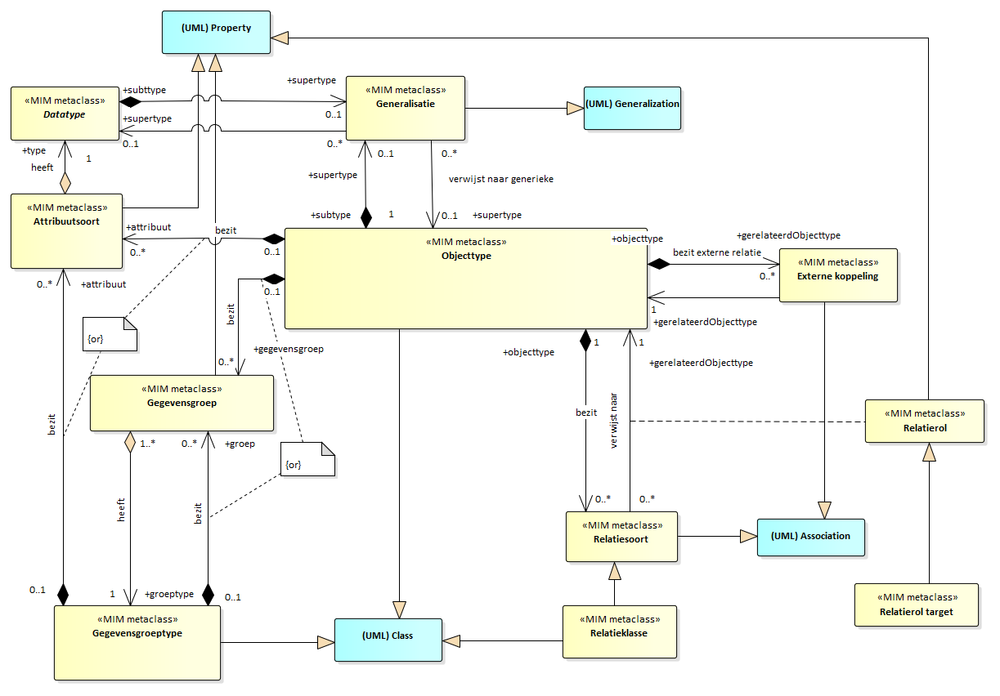
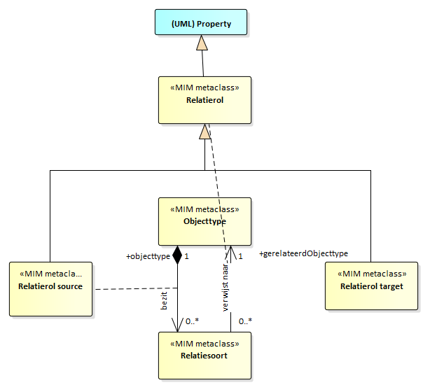

Metamodel in UML
================

Structuur metamodel in UML
--------------------------

De eerste paragraaf bevat diagrammen, in UML; elk biedt een eigen view op een
gedeelte van het model. Het geheel van diagrammen, in samenhang, is opgenomen in
de bijlage [Template naamgeving conventies](#template-naamgeving-conventies).

Uitgangspunten voor het metamodel in UML zijn: - UML 2.5 vormt de basis voor de
conceptuele beschrijving. - Gebruik te maken van de bestaande UML-modelelementen
conform UML van OMG. OMG noemt dit een UML metaclass. Een voorbeeld hiervan is
UML-Class. - Daar waar (semantisch) nodig extensiemechanismen toe te passen met
behoud van de betekenis van de UML-metaclasses. Er ontstaat dan een MIM
metaclass. Hoe deze zich verhouden tot UML is weergegeven in de bijlage. -
Modelelementen hebben één stereotype. Daarnaast hebben twee verschillende
stereotypen nooit dezelfde betekenis. Stereotypes worden toegepast als er een
verbijzondering van een UML constructie nodig is met behoud van de betekenis van
de UML-metaclass.

Elk modelelement heeft een MIM metaclass. Deze wordt in UML in een
informatiemodel gemodelleerd als een Metaclass van UML 2.5 en een bijbehorende
stereotype.

~~~~~~~~~~~~~~~~~~~~~~~~~~~~~~~~~~~~~~~~~~~~~~~~~~~~~~~~~~~~~~~~~~~~~~~~~~~~~~~~
De MIM metaclass Objecttype wordt gemodelleerd als een
UML-Class met stereotype «Objecttype». In Sparx EA wordt dit gemodelleerd met
een Class. Niet alle MIM metaclasses hebben een stereotype (nodig). In de kolom
staat dan ‘-‘.
~~~~~~~~~~~~~~~~~~~~~~~~~~~~~~~~~~~~~~~~~~~~~~~~~~~~~~~~~~~~~~~~~~~~~~~~~~~~~~~~

| **MIM metaclass** | **Stereotype** | **Metaclass UML 2.5z** | **In Sparx EA** |
|-------------------|----------------|------------------------|-----------------|
| Objecttype        | «Objecttype»   | (UML) Class            | Class           |

In de diagrammen zijn de UML metaclasses conform UML 2.5 aangeduid als UML
metaclass. Deze in opgenomen in het diagram als ‘blauw gekleurde’ metaclasses.

Bijna alle hebben een UML-metaclass als basis, deze is dan aangegeven. Dit is
ook opgenomen in diagram vorm, in de bijlage [Template naamgeving
conventies](#template-naamgeving-conventies).

### Kern

Kern zonder Metagegevens

| **MIM metaclass** | **Stereotype**      | **Metaclass UML 2.5**            | **In Sparx EA**  |
|-------------------|---------------------|----------------------------------|------------------|
| Objecttype        | «Objecttype»        | (UML) Class                      | Class            |
| Attribuutsoort    | «Attribuutsoort»    | (UML) Property                   | Attribute        |
| Gegevensgroep     | «Gegevensgroep»     | (UML) Property                   | Attribute        |
| Gegevensgroeptype | «Gegevensgroeptype» | (UML) Class                      | Class            |
| Generalisatie     | «Generalisatie»     | (UML) Generalization             | Generalization   |
| Relatiesoort      | «Relatiesoort»      | (UML) Association                | Association      |
| Relatieklasse     | «Relatieklasse»     | (UML) Association én (UML) Class | Associationclass |

### Datatypen

Datatypen zonder Metagegevens

View 2: Datatypen

| **MIM metaclass**       | **Stereotype**          | **Metaclass UML 2.5**    | **In Sparx EA**    |
|-------------------------|-------------------------|--------------------------|--------------------|
| Primitief datatype      | «Primitief datatype»    | (UML) Primitive Type     | Datatype           |
| Gestructureerd datatype | «Gestructuurd datatype» | (UML) Datatype           | Datatype           |
| Data element            | «Data element»          | (UML) Property           | Attribute          |
| Union                   | «Union»                 | (UML) Datatype           | Datatype           |
| Union element           | «Union element»         | (UML) Property           | Attribute          |
| Enumeratie              | \-                      | (UML) Enumeration        | Enumeration        |
| Enumeratiewaarde        | \-                      | (UML) EnumerationLiteral | EnumerationLiteral |
| Referentielijst         | «Referentielijst»       | (UML) Datatype           | Datatype           |
| Referentie element      | «Referentie element»    | (UML) Property           | Attribute          |
| Codelist                | «Codelist               | (UML) Datatype           | Datatype           |

*Nadere specificaties voor datatypen*

Voor enumeraties is geen stereotype gespecificeerd. In het metamodel maken we
gebruik van de bestaande UML-enumeration (metaclass) voor de specificaties van
een enumeratie.

Voor enumeratiewaarde is geen stereotype gespecificeerd. In het metamodel maken
we gebruik van de bestaande UML-enumerationLiteral (metaclass) voor de
specificaties van een enumeratiewaarde.

### Overige

Constraint

View 3a: Constraint

| **MIM metaclass** | **Stereotype** | **Metaclass UML 2.5** | **In Sparx EA** |
|-------------------|----------------|-----------------------|-----------------|
| Constraint        | \-             | (UML) Constraint      | Constraint      |

*Relatierol*

Relatierol

View 3b: Relatiesoort en relatierol

| **MIM metaclass**     | **Stereotype** | **Metaclass UML 2.5** | **In Sparx EA** |
|-----------------------|----------------|-----------------------|-----------------|
| Relatierol (abstract) | «Relatierol»   | Property              | AssociationEnd  |
| Relatierol source     | «Relatierol»   | Property              | AssociationEnd  |
| Relatierol target     | «Relatierol»   | Property              | AssociationEnd  |

*Externe koppeling*

| **MIM metaclass** | **Stereotype**      | **Metaclass UML 2.5** | **In Sparx EA** |
|-------------------|---------------------|-----------------------|-----------------|
| Externe koppeling | «Externe koppeling» | (UML) Association     | Association     |

View 3c: Groepering

*Packages*

| **MIM metaclass**     | **Stereotype**    | **Metaclass UML 2.5** | **In Sparx EA** |
|-----------------------|-------------------|-----------------------|-----------------|
| Informatiemodel       | «Informatiemodel» | (UML) Package         | Package         |
| Domein (het eigen IM) | «Domein»          | (UML) Package         | Package         |
| Extern                | «Extern»          | (UML) Package         | Package         |
| View                  | «View»            | (UML) Package         | Package         |

Nadere specificatie metagegevens in UML
---------------------------------------

Deze paragraaf is een aanvulling op de paragraaf *'Specificatie metagegevens'*
in het hoofdstuk [Metamodel Algemeen](#metamodel-algemeen).

>   **Alias**

De alternatieve weergave van de naam.

*Toelichting*

Verdere toelichting voor UML modellen:

-   De alias is te specificeren voor NamedElements (zoals UML-Class,
    UML-association, UML-UML-Datatype en UML-property). De alias is in UML
    gespecificeerd bij de metaclass [Element Import](#uml-n-6). In Enterprise
    Architect is de alternatieve weergave aan te zetten in de properties van een
    Diagram, via: use alias if available.

>   **Identificerend**

Als een attribuutsoort identificerend is, dan krijgt dit kenmerk in UML isId =
true.

Als een relatiesoort identificerend is, dan krijgt dit kenmerk in UML een
stereotype «id»

### Modellering metagegevens voor objecten en attributen in UML

**Specificatie voor «Objecttype»**

De objecttypen worden naar de volgende aspecten gespecificeerd:

| **Aspect** [Zie noot](#uml-n-1) | **Kardinaliteit** | **Toelichting**                                                                                                                                                                                                                                                                                                                          | **In UML 2.5** [Zie noot](#uml-n-2)      | **In EA** [Zie noot](#uml-n-3)                                                                                                                                  |
|---------------------------------|-------------------|------------------------------------------------------------------------------------------------------------------------------------------------------------------------------------------------------------------------------------------------------------------------------------------------------------------------------------------|------------------------------------------|-----------------------------------------------------------------------------------------------------------------------------------------------------------------|
| **Naam√**                       | 1                 | ALgemeen metagegeven [Zie noot](#uml-n-4).                                                                                                                                                                                                                                                                                               | *name van de metaclass Named element*    | *Name*                                                                                                                                                          |
| **Alias**                       | 0..1              | Algemeen metagegeven.                                                                                                                                                                                                                                                                                                                    |                                          | *Alias*                                                                                                                                                         |
| **Herkomst**                    | 1                 | Algemeen metagegeven.                                                                                                                                                                                                                                                                                                                    |                                          | *Tagged value*                                                                                                                                                  |
| **Definitie√**                  | 1                 | Algemeen metagegeven.                                                                                                                                                                                                                                                                                                                    | *Body van de metaclass Comment*          | *Notes*                                                                                                                                                         |
| **Herkomst definitie√**         | 1                 | Algemeen metagegeven.                                                                                                                                                                                                                                                                                                                    |                                          | *Tagged value*                                                                                                                                                  |
| **Datum opname**                | 1                 | Algemeen metagegeven.                                                                                                                                                                                                                                                                                                                    |                                          | *Tagged value*                                                                                                                                                  |
| **Unieke aanduiding√**          | 1                 | Voor objecttypen die deel uitmaken van een (basis)registratie of informatiemodel betreft dit de wijze waarop daarin voorkomende objecten (van dit type) uniek in de registratie worden aangeduid.                                                                                                                                        | *-*                                      | *isId bij attribuutsoort, --- of --- stereotype «isId» bij target role relatiesoort --- of --- een combinatie van deze twee, elk hiervan meer keren toepasbaar* |
| **Populatie√**                  | 0..1              | Voor objecttypen die deel uitmaken van een (basis)registratie betreft dit de beschrijving van de exemplaren van het gedefinieerde objecttype die in de desbetreffende (basis)­registratie voorhanden zijn.                                                                                                                               |                                          | *Tagged value*                                                                                                                                                  |
| **Kwaliteit√**                  | 0..1              | Voor objecttypen die deel uitmaken van een registratie betreft dit de waarborgen voor de juistheid van de in de registratie opgenomen objecten van het desbetreffende type.                                                                                                                                                              |                                          | *Tagged value*                                                                                                                                                  |
| **Toelichting√**                | 0..1              | Algemeen metagegeven.                                                                                                                                                                                                                                                                                                                    |                                          | *Tagged value*                                                                                                                                                  |
| **Indicatie abstract object**   | 1                 | Conceptueel model: indicatie dat het objecttype een generalisatie is, waarvan een object als specialisatie altijd voorkomt in de hoedanigheid van een (en slechts één) van de specialisaties van het betreffende objecttype. Logisch model: Indicatie dat er geen instanties (objecten) voor het betreffende objecttype mogen voorkomen. | *isAbstract bij de metaclass Classifier* | *Abstract*                                                                                                                                                      |

**Specificatie voor «Attribuutsoort»**

De attribuutsoorten worden naar de volgende aspecten gespecificeerd:

| **Aspect**                                  | **Kardinaliteit** | **Toelichting**                                                                                                                                                                                          | **In UML 2.5**                                                   | **In EA**      |
|---------------------------------------------|-------------------|----------------------------------------------------------------------------------------------------------------------------------------------------------------------------------------------------------|------------------------------------------------------------------|----------------|
| **Naam √**                                  | 1                 | Algemeen metagegeven.                                                                                                                                                                                    | *name van de metaclass Named element*                            | *Name*         |
| **Alias**                                   | 0..1              | Algemeen metagegeven.                                                                                                                                                                                    |                                                                  | *Alias*        |
| **Herkomst**                                | 1                 | Algemeen metagegeven.                                                                                                                                                                                    |                                                                  | *Tagged value* |
| **Definitie √**                             | 1                 | Algemeen metagegeven.                                                                                                                                                                                    | *Body van de metaclass Comment*                                  | *Notes*        |
| **Herkomst definitie √**                    | 1                 | Algemeen metagegeven.                                                                                                                                                                                    |                                                                  | *Tagged value* |
| **Datum opname**                            | 1                 | Algemeen metagegeven.                                                                                                                                                                                    |                                                                  | *Tagged value* |
| **Domein** *(aspecten van een waarde/data)* |                   | *Domein is zelf geen metadata aspect. Onder het kopje ‘domein’ vallen een aantal metadata aspecten die gelden voor een waarde, oftewel de eisen waaraan een waarde van een attribuutsoort moet voldoen.* |                                                                  |                |
| **- Type**                                  | 1                 | Algemeen metagegeven.                                                                                                                                                                                    |                                                                  | *Tagged value* |
| **- Lengte**                                | 0..1              | Algemeen metagegeven.                                                                                                                                                                                    |                                                                  | *Tagged value* |
| **- Patroon**                               | 0..1              | Algemeen metagegeven.                                                                                                                                                                                    |                                                                  | *Tagged value* |
| **- Formeel Patroon**                       | 0..1              | Algemeen metagegeven.                                                                                                                                                                                    |                                                                  | *Tagged value* |
| **Indicatie materiële historie √**          | 1                 | Algemeen metagegeven.                                                                                                                                                                                    |                                                                  | *Tagged value* |
| **Indicatie formele historie √**            | 1                 | Algemeen metagegeven.                                                                                                                                                                                    |                                                                  | *Tagged value* |
| **Kardinaliteit √**                         | 1                 | Algemeen metagegeven.                                                                                                                                                                                    | *lowerValue en upperValue van de metaclass Multiplicity Element* | *Multiplicity* |
| **Authentiek √**                            | 1                 | Algemeen metagegeven.                                                                                                                                                                                    |                                                                  | *Tagged value* |
| **Toelichting √**                           | 0..1              | Algemeen metagegeven.                                                                                                                                                                                    |                                                                  | *Tagged value* |
| **Indicatie afleidbaar**                    | 1                 | Algemeen metagegeven.                                                                                                                                                                                    | *isDerived bij metaclass Property*                               | *isDerived*    |
| **Mogelijk geen waarde**                    | 1                 | Algemeen metagegeven.                                                                                                                                                                                    |                                                                  | *Tagged value* |
| **Identificerend**                          | 0..1              | Algemeen metagegeven.                                                                                                                                                                                    | *isID bij de metaclass Property*                                 | *isID*         |

**Specificatie voor «Gegevensgroep»**

De gegevensgroepen worden naar de volgende aspecten gespecificeerd:

| **Aspect**                       | **Kardinaliteit** | **Toelichting**                                        | **In UML 2.5**                                                   | **In EA**                                                               |
|----------------------------------|-------------------|--------------------------------------------------------|------------------------------------------------------------------|-------------------------------------------------------------------------|
| **Naam**                         | 1                 | Algemeen metagegeven.                                  | *name van de metaclass Named element*                            | *Name*                                                                  |
| **Alias**                        | 0..1              | Algemeen metagegeven.                                  |                                                                  | *Alias*                                                                 |
| **Definitie**                    | 1                 | Algemeen metagegeven.                                  | *Body van de metaclass Comment*                                  | *Notes*                                                                 |
| **Toelichting**                  | 0..1              | Algemeen metagegeven.                                  |                                                                  | *Tagged value*                                                          |
| **Gegevensgroeptype**            | 1                 | De verwijzing naar het bijbehorende gegevensgroeptype. |                                                                  | *Type*                                                                  |
| **Herkomst**                     | 1                 | Algemeen metagegeven.                                  |                                                                  | *Tagged value*                                                          |
| **Herkomst definitie**           | 1                 | Algemeen metagegeven.                                  |                                                                  | *Tagged value*                                                          |
| **Datum opname**                 | 1                 | Algemeen metagegeven.                                  |                                                                  | *Tagged value*                                                          |
| **Indicatie materiële historie** | 1                 | Algemeen metagegeven.                                  |                                                                  | *Tagged value*                                                          |
| **Indicatie formele historie**   | 1                 | Algemeen metagegeven.                                  |                                                                  | *Tagged value*                                                          |
| **Kardinaliteit**                | 1                 | Algemeen metagegeven.                                  | *lowerValue en upperValue van de metaclass Multiplicity Element* | *Multiplicity van de source role van de bijbehorende composite relatie* |
| **Authentiek**                   | 1                 | Algemeen metagegeven.                                  |                                                                  | *Tagged value*                                                          |

**Specificatie voor «Gegevensgroeptype»**

De gegevensgroeptypen worden naar de volgende aspecten gespecificeerd:

| **Aspect**       | **Kardinaliteit** | **Toelichting**       | **In UML 2.5**                        | **In EA**      |
|------------------|-------------------|-----------------------|---------------------------------------|----------------|
| **Naam**         | 1                 | Algemeen metagegeven. | *name van de metaclass Named element* | *Name*         |
| **Alias**        | 0..1              | Algemeen metagegeven. |                                       | *Alias*        |
| **Datum opname** | 1                 | Algemeen metagegeven. |                                       | *Tagged value* |

### Specificatie metagegevens voor relaties

**Relatiesoort en relatierol**

Het metamodel heeft twee manieren om een relatie tussen twee objecttypen te
beschrijven. Deze keuze wordt aangegeven in de eigen extensie, zoals beschreven
in paragraaf 1.8. Alleen het gekozen alternatief is relevant voor de modellering
in uw informatiemodel. - Alternatief 1: Verplichte benoeming van de naam van de
relatie met de bijbehorende metagegevens\*\* - Alternatief 2: Verplichte
benoeming van de rol van de target in een relatie met de bijbehorende
metagegevens en optioneel de benoeming van de naam van de relatie.

Beide alternatieven gebruiken relatiesoort en relatierol, maar met andere regels
voor gebruik.

#### Relatiesoort leidend (alternatief 1)

Relatiesoort is verplicht, met een naam en met een definitie en deze is leidend.
Metadata aspecten worden hierbij altijd vastgelegd. Het gebruik van relatierol
is optioneel (zowel bij source en target). Áls er een relatierol target wordt
vastgelegd, dan is de metadata hierbij wel verplicht.

**Specificatie voor «Relatiesoort»**

De relatiesoorten worden naar de volgende aspecten gespecificeerd.

| **Aspect**                        | **Kardinaliteit** | **Toelichting**                                                                                                                                                                                                                             | **In UML 2.5**                                                  | **In EA**                                                           |
|-----------------------------------|-------------------|---------------------------------------------------------------------------------------------------------------------------------------------------------------------------------------------------------------------------------------------|-----------------------------------------------------------------|---------------------------------------------------------------------|
| **Naam√**                         | 1                 | Algemeen metagegeven.                                                                                                                                                                                                                       | *name van metaclass Named element*                              | *Name*                                                              |
| **Alias**                         | 0..1              | Algemeen metagegeven.                                                                                                                                                                                                                       |                                                                 | *Alias*                                                             |
| **Uni-directioneel**              | 1                 | Het gerelateerde objecttype (de target) waarvan het objecttype, die de eigenaar is van deze relatie (de source), kennis heeft. Alle relaties zijn altijd gericht van het objecttype (source) naar het gerelateerde objecttype (target).     |                                                                 | *Direction van de betreffende assiciation (van source naar target)* |
| **Objecttype**                    | 1                 | Het objecttype waarvan de relatie een eigenschap is.                                                                                                                                                                                        | */source: related Element bij Relationship Element*             | *Source*                                                            |
| **Gerelateerd objecttype**        | 1                 | Het objecttype waarmee een objecttype een logisch verband heeft                                                                                                                                                                             | */target: related Element bij Relationship Element*             | *Target*                                                            |
| **Type aggregatie**               | 1                 | Standaard betreft het geen aggregatie (None). Het type aggregatie mag ‘composite’ zijn. Dit wordt gedaan als er een afhankelijkheid is in die zin dat de target niet kan bestaan zonder de source: de target vervalt als de source vervalt. | *isComposite bij metaclass Property*                            | *Aggregation van de source role met waarde composite*               |
| **Kardinaliteit√**                | 1                 | Algemeen metagegeven.                                                                                                                                                                                                                       | *lowerValue en upperValue van de metaclass MultiplicityElement* | *Multiplicity van de target role*                                   |
| **Herkomst**                      | 1                 | Algemeen metagegeven.                                                                                                                                                                                                                       |                                                                 | *Tagged value*                                                      |
| **Definitie√**                    | 1                 | Algemeen metagegeven..                                                                                                                                                                                                                      | *Body van de metaclass Comment*                                 | *Notes*                                                             |
| **Toelichting√**                  | 0..1              | Algemeen metagegeven.                                                                                                                                                                                                                       |                                                                 | *Tagged value*                                                      |
| **Herkomst definitie√**           | 1                 | Algemeen metagegeven.                                                                                                                                                                                                                       |                                                                 | *Tagged value*                                                      |
| **Datum opname**                  | 1                 | Algemeen metagegeven.                                                                                                                                                                                                                       |                                                                 | *Tagged value*                                                      |
| **Indicatie materiële historie√** | 1                 | Algemeen metagegeven.                                                                                                                                                                                                                       |                                                                 | *Tagged value*                                                      |
| **Indicatie formele historie√**   | 1                 | Algemeen metagegeven.                                                                                                                                                                                                                       |                                                                 | *Tagged value*                                                      |
| **Authentiek√**                   | 1                 | Algemeen metagegeven.                                                                                                                                                                                                                       |                                                                 | *Tagged value*                                                      |
| **Indicatie afleidbaar**          | 1                 | Algemeen metagegeven.                                                                                                                                                                                                                       | *isDerived bij UML metaclass Assocation*                        | *isDerived*                                                         |
| **Mogelijk geen waarde**          | 1                 | Algemeen metagegeven.                                                                                                                                                                                                                       |                                                                 | *Tagged value*                                                      |

**Specificatie voor «Relatierol»**

Voor relatierollen worden naar de volgende aspecten gespecificeerd.

| **Aspect**    | **Kardinaliteit** | **Toelichting**       | **In UML 2.5**                       | **In EA** |
|---------------|-------------------|-----------------------|--------------------------------------|-----------|
| **Naam**      | 0..1              | Algemeen metagegeven. | *name van de metaclass Namedelement* | *Name*    |
| **Alias**     | 0..1              | Algemeen metagegeven. |                                      | *Alias*   |
| **Definitie** | 0..1              | Algemeen metagegeven. | *Body van de metaclass Comment*      | *Notes*   |

#### Relatierol is leidend (alternatief 2)

Verplichte benoeming van de rol van de target in een relatie met de bijbehoren
de metagegevens en optioneel de benoeming van de naam van de relatie.

**Specificatie voor «Relatiesoort»**

De relatiesoorten worden naar de volgende aspecten gespecificeerd.

| **Aspect**    | **Kardinaliteit** | **Toelichting**       | **In UML 2.5**                       | **In EA** |
|---------------|-------------------|-----------------------|--------------------------------------|-----------|
| **Naam**      | 0..1              | Algemeen metagegeven. | *name van de metaclass NamedElement* | *Name*    |
| **Alias**     | 0..1              | Algemeen metagegeven. |                                      | *Alias*   |
| **Definitie** | 0..1              | Algemeen metagegeven. | *Body van de metaclass Comment*      | *Notes*   |

**Specificatie voor «Relatierol»**

Voor relatierol worden bij de target rol van een relatiesoort de volgende
aspecten gespecificeerd.

| **Aspect**                        | **Kardinaliteit** | **Toelichting**       | **In UML 2.5**                                                   | **In EA**      |
|-----------------------------------|-------------------|-----------------------|------------------------------------------------------------------|----------------|
| **Naam**                          | 1                 | Algemeen metagegeven. | *name van de metaclass*                                          | *Name*         |
| **Alias**                         | 0..1              | Algemeen metagegeven. |                                                                  | *Alias*        |
| **Herkomst**                      | 1                 | Algemeen metagegeven. |                                                                  | *Tagged value* |
| **Definitie√ \***                 | 1                 | Algemeen metagegeven. | *Body van de metaclass Comment*                                  | *Notes*        |
| **Herkomst definitie√**           | 1                 | Algemeen metagegeven. |                                                                  | *Tagged value* |
| **Datum opname**                  | 1                 | Algemeen metagegeven. |                                                                  | *Tagged value* |
| **Kardinaliteit√**                | 1                 | Algemeen metagegeven. | *lowerValue en upperValue van de metaclass Multiplicity Element* | *Multiplicity* |
| **Indicatie materiële historie√** | 1                 | Algemeen metagegeven. |                                                                  | *Tagged value* |
| **Indicatie formele historie√**   | 1                 | Algemeen metagegeven. |                                                                  | *Tagged value* |
| **Authentiek√ \***                | 1                 | Algemeen metagegeven. |                                                                  | *Tagged value* |
| **Mogelijk geen waarde**          | 1                 | Algemeen metagegeven. |                                                                  | *Tagged value* |
| **Toelichting√ \***               | 0..1              | Algemeen metagegeven. |                                                                  | *Tagged value* |

**Specificatie voor «Generalisatie» tussen objecttypes**

De generalisaties worden naar het volgende aspect gespecificeerd:

| **Aspect**    | **Kardina liteit** | **Toelichting**                                                     | **In UML 2.5**                                      | **In EA** |
|---------------|--------------------|---------------------------------------------------------------------|-----------------------------------------------------|-----------|
| **Naam**      | 0..1               | Algemeen metagegeven. *Standaard ‘is specialisatie van’.*           | *name van de etaclass Named element*                | *Name*    |
| **Alias**     | 0..1               | Algemeen metagegeven.                                               |                                                     | *Alias*   |
| **Subtype**   | 1                  | Het objecttype dat een specialisatie is van een (ander) objecttype. | */source: related Element bij Relationship Element* | *Source*  |
| **Supertype** | 1                  | Het objecttype dat de generalisatie is van een (ander) objecttype.  | */target: related Element bij Relationship Element* | *Target*  |

**Specificatie voor «Generalisatie» tussen datatypes**

De generalisaties worden naar het volgende aspect gespecificeerd:

| **Aspect**    | **Kardinaliteit** | **Toelichting**                                                 | **In UML 2.5**                                      | **In EA** |
|---------------|-------------------|-----------------------------------------------------------------|-----------------------------------------------------|-----------|
| **Naam**      | 0..1              | Algemeen metagegeven.                                           | *name van de metaclass Named element*               | *Name*    |
| **Alias**     | 0..1              | Algemeen metagegeven.                                           |                                                     | *Alias*   |
| **Suptype**   | 1                 | Het datatype dat een specialisatie is van een (ander) datatype. | */source: related Element bij Relationship Element* | *Source*  |
| **Supertype** | 1                 | Het datatype dat de generalisatie is van een (ander) datatype.  | */target: related Element bij Relationship Element* | *Target*  |

**Specificatie voor «Relatieklasse»**

De relatieklassen worden naar de volgende aspecten gespecificeerd:

| **Aspect**    | **Kardinaliteit** | **Toelichting**       | **In UML 2.5**                        | **In EA** |
|---------------|-------------------|-----------------------|---------------------------------------|-----------|
| **Naam**      | 1                 | Algemeen metagegeven. | *name van de metaclass Named element* | *Name*    |
| **Alias**     | 0..1              | Algemeen metagegeven. |                                       | *Alias*   |
| **Definitie** | 1                 | Algemeen metagegeven. | *Body van de metaclass Comment*       | *Notes*   |

**Specificatie voor «Externe koppeling»**

Externe koppelingen worden naar de volgende aspecten gespecificeerd.

| **Aspect**                 | **Kardi naliteit** | **Toelichting**                                                                                                                                                                                                                                                                                                                  | **In UML 2.5**                                      | **In EA**                            |
|----------------------------|--------------------|----------------------------------------------------------------------------------------------------------------------------------------------------------------------------------------------------------------------------------------------------------------------------------------------------------------------------------|-----------------------------------------------------|--------------------------------------|
| **Naam**                   | 0..1               | Algemeen metagegeven. Standaard ‘betreft’.                                                                                                                                                                                                                                                                                       | *name van de metaclass Named element*               | *Name*                               |
| **Alias**                  | 0..1               | Algemeen metagegeven.                                                                                                                                                                                                                                                                                                            |                                                     | *Alias*                              |
| **Datum opname**           | 1                  | Algemeen metagegeven.                                                                                                                                                                                                                                                                                                            |                                                     | *Tagged value*                       |
| **Objecttype**             | 1                  | Het objecttype waarvan de relatie een eigenschap is.                                                                                                                                                                                                                                                                             | */source: related Element bij Relationship Element* | *Source*                             |
| **Type aggregatie**        | 1                  | Aanduiding dat het een compositie relatie is. Waarde is altijd Composite.                                                                                                                                                                                                                                                        | *isComposite van Property*                          | *Aggregation in de Source role*      |
| **Gerelateerd objecttype** | 1                  | Het objecttype uit een extern informatiemodel waarmee een objecttype een logische verbinding heeft.                                                                                                                                                                                                                              | */target: related Element bij Relationship Element* | *Target*                             |
| **Uni-directioneel**       | 1                  | Het gerelateerde objecttype uit een extern informatiemodel (de target) waarvan het objecttype die de eigenaar van deze relatie is (de source) kennis heeft. Het aggregation type van de source is altijd ‘composition’. Alle relaties zijn altijd gericht van het objecttype (source) naar het gerelateerde objecttype (target). |                                                     | *Direction (van source naar target)* |

### Specificatie metagegevens voor waardenlijsten

**Specificatie voor «Referentielijst»**

Voor referentielijsten worden de volgende aspecten gespecificeerd:

| **Aspect**       | **Kardinaliteit** | **Toelichting**                            | **In UML 2.5**                       | **In EA**      |
|------------------|-------------------|--------------------------------------------|--------------------------------------|----------------|
| **Naam**         | 1                 | Algemeen metagegeven.                      | *name van de metaclass Namedelement* | *Name*         |
| **Alias**        | 0..1              | Algemeen metagegeven.                      |                                      | *Alias*        |
| **Herkomst**     | 1                 | Algemeen metagegeven. [Zie noot](#uml-n-5) |                                      | *Tagged value* |
| **Definitie**    | 1                 | Algemeen metagegeven.                      | *Body van de metaclass Comment*      | *Notes*        |
| **Datum opname** | 1                 | Algemeen metagegeven.                      |                                      | *Tagged value* |
| **Toelichting**  | 0..1              | Algemeen metagegeven.                      |                                      | *Tagged value* |
| **Locatie**      | 1..1              | Algemeen metagegeven.                      |                                      | *Tagged value* |

**Specificatie voor «Referentie element»**

De referentie-elementen worden naar de volgende aspecten gespecificeerd:

| **Aspect**                                  | **Kardi naliteit** | **Toelichting**       | **In UML 2.5**                                                   | **In EA**                            |
|---------------------------------------------|--------------------|-----------------------|------------------------------------------------------------------|--------------------------------------|
| **Naam**                                    | 1                  | Algemeen metagegeven. | *name van de metaclass Named element*                            | *Name*                               |
| **Alias**                                   | 0..1               | Algemeen metagegeven. |                                                                  | *Alias*                              |
| **Definitie**                               | 1                  | Algemeen metagegeven. | *Body van de metaclass Comment*                                  | *Notes*                              |
| **Datum opname**                            | 1                  | Algemeen metagegeven. |                                                                  | *Tagged value*                       |
| **Domein** *(aspecten van een waarde/data)* |                    |                       |                                                                  |                                      |
| **- Type**                                  | 1                  | Algemeen metagegeven. |                                                                  | *Type*                               |
| **- Lengte**                                | 0..1               | Algemeen metagegeven. |                                                                  | *Tagged value*                       |
| **- Patroon**                               | 0..1               | Algemeen metagegeven. |                                                                  | *Tagged value*                       |
| **- Formeel patroon**                       | 0..1               | Algemeen metagegeven. |                                                                  | *Tagged value*                       |
| **Kardinaliteit**                           | 1                  | Algemeen metagegeven. | *lowerValue en upperValue van de metaclass Multiplicity Element* | *Multiplicity van de de target role* |
| **Identificerend**                          | 0..1               | Algemeen metagegeven. | *isID van de metaclass Property*                                 | *isID bij de betreffende class*      |
| **Toelichting**                             | 0..1               | Algemeen metagegeven. |                                                                  | *Tagged value*                       |

**Specificatie voor «codeList»**

Voor codelist worden de volgende aspecten gespecificeerd:

| **Aspect**       | **Kardinaliteit** | **Toelichting**                                                                                                                                                                                                                                  | **In UML 2.5**                        | **In EA**      |
|------------------|-------------------|--------------------------------------------------------------------------------------------------------------------------------------------------------------------------------------------------------------------------------------------------|---------------------------------------|----------------|
| **Naam**         | 1                 | Algemeen metagegeven. *De naam van de lijst zoals gespecificeerd in de catalogus van de desbetreffende registratie dan wel, indien het een door de eigen organisatie toegevoegde lijst betreft, de door de eigen organisatie vastgestelde naam.* | *name van de metaclass Named element* | *Name*         |
| **Alias**        | 0..1              | Algemeen metagegeven.                                                                                                                                                                                                                            | *Alias*                               |                |
| **Herkomst**     | 1                 | Algemeen metagegeven. 11                                                                                                                                                                                                                         |                                       | *tagged value* |
| **Definitie**    | 1                 | Algemeen metagegeven.                                                                                                                                                                                                                            | *Body van de metaclass Comment*       | *Notes*        |
| **Datum opname** | 1                 | Algemeen metagegeven.                                                                                                                                                                                                                            |                                       | *tagged value* |
| **Toelichting**  | 0..1              | Algemeen metagegeven.                                                                                                                                                                                                                            |                                       | *tagged value* |
| **Locatie**      | 1..1              | Algemeen metagegeven.                                                                                                                                                                                                                            |                                       | *tagged value* |

### Specificatie metagegevens voor datatypen

Het betreft metagegevens voor in het informatiemodel gedefinieerde datatypen,
oftewel exclusief datatypen die al buiten het model bestaan, zoals Integer,
DateTime, Surface.

**Specificatie voor «Primitief datatype»**

De datatypen worden naar de volgende aspecten gespecificeerd:

| **Aspect**                                  | **Kardinaliteit** | **Toelichting**       | **In UML 2.5**                        | **In EA**      |
|---------------------------------------------|-------------------|-----------------------|---------------------------------------|----------------|
| **Naam**                                    | 1                 | Algemeen metagegeven. | *name van de metaclass Named element* | *Name*         |
| **Definitie**                               | 0..1              | Algemeen metagegeven. | *Body van de metaclass Comment*       | *Notes*        |
| **Domein** *(aspecten van een waarde/data)* |                   |                       |                                       |                |
| **- Lengte**                                | 0..1              | Algemeen metagegeven. |                                       | *Tagged value* |
| **- Patroon**                               | 0..1              | Algemeen metagegeven. |                                       | *Tagged value* |
| **- Formeel patroon**                       | 0..1              | Algemeen metagegeven. |                                       | *Tagged value* |
| **Herkomst**                                | 1                 | Algemeen metagegeven. |                                       | *Tagged value* |
| **Datum opname**                            | 1                 | Algemeen metagegeven. |                                       | *Tagged value* |

**Specificatie voor «Gestructureerd datatype»**

Voor Gestructureerde datatypen worden de volgende aspecten gespecificeerd:

| **Aspect**          | **Kardinaliteit** | **Toelichting**       | **In UML 2.5**                        | **In EA**      |
|---------------------|-------------------|-----------------------|---------------------------------------|----------------|
| **Naam**            | 1                 | Algemeen metagegeven. | *name van de metaclass Named element* | *Name*         |
| **Herkomst**        | 1                 | Algemeen metagegeven. |                                       | *Tagged value* |
| **Definitie**       | 1                 | Algemeen metagegeven. | *Body van de metaclass Comment*       | *Notes*        |
| **Patroon**         | 0..1              | Algemeen metagegeven. |                                       | *Tagged value* |
| **Formeel patroon** | 0..1              | Algemeen metagegeven. |                                       | *Tagged value* |
| **Datum opname**    | 1                 | Algemeen metagegeven. |                                       | *Tagged value* |

**Specificatie voor «Data element»**

De data-elementen worden naar de volgende aspecten gespecificeerd:

| **Aspect**                                  | **Kardinaliteit** | **Toelichting**       | **In UML 2.5**                                                  | **In EA**      |
|---------------------------------------------|-------------------|-----------------------|-----------------------------------------------------------------|----------------|
| **Naam**                                    | 1                 | Algemeen metagegeven. | *name van de metaclass Named element*                           | *Name*         |
| **Definitie**                               | 0..1              | Algemeen metagegeven. | *Body van de metaclass Comment*                                 | *Notes*        |
| **Domein** *(aspecten van een waarde/data)* |                   |                       |                                                                 |                |
| **- Type**                                  | 1                 | Algemeen metagegeven. |                                                                 | *Type*         |
| **- Lengte**                                | 0..1              | Algemeen metagegeven. |                                                                 | *Tagged value* |
| **- Patroon**                               | 0..1              | Algemeen metagegeven. |                                                                 | *Tagged value* |
| **- Formeel patroon**                       | 0..1              | Algemeen metagegeven. |                                                                 | *Tagged value* |
| **Kardinaliteit**                           | 1                 | Algemeen metagegeven. | *lowerValue en upperValue van de metaclass MultiplicityElement* | *Multiplicity* |

**Specificatie voor «Union»**

De unions worden naar de volgende aspecten gespecificeerd:

| **Aspect**       | **Kardinaliteit** | **Toelichting**       | **In UML 2.5**                       | **InEA**       |
|------------------|-------------------|-----------------------|--------------------------------------|----------------|
| **Naam**         | 1                 | Algemeen metagegeven. | *name van de metaclass Namedelement* | *Name*         |
| **Herkomst**     | 1                 | Algemeen metagegeven. |                                      | *Tagged value* |
| **Definitie**    | 1                 | Algemeen metagegeven. | *Body van de metaclass Comment*      | *Notes*        |
| **Datum opname** | 1                 | Algemeen metagegeven. |                                      | *Tagged value* |

**Specificatie voor «Union element»**

De unionelementen worden naar de volgende aspecten gespecificeerd:

| **Aspect**            | **Kardinaliteit** | **Toelichting**                                                            | **In UML 2.5**                                                  | **In EA**      |
|-----------------------|-------------------|----------------------------------------------------------------------------|-----------------------------------------------------------------|----------------|
| **Naam**              | 1                 | Algemeen metagegeven.                                                      | *name van de metaclass Named element*                           | *Name*         |
| **Definitie**         | 0..1              | Algemeen metagegeven.                                                      | *Body van de metaclass Comment*                                 | *Notes*        |
| **- Type**            | 1                 | Algemeen metagegeven.                                                      |                                                                 | *Type*         |
| **- Patroon**         | 0..1              | Algemeen metagegeven.                                                      |                                                                 | *Tagged value* |
| **- Formeel patroon** | 0..1              | Algemeen metagegeven.                                                      |                                                                 | *Tagged value* |
| **Kardinaliteit**     | 1                 | Algemeen metagegeven. *De kardinaliteit van een unionelement is altijd 1.* | *lowerValue en upperValue van de metaclass MultiplicityElement* | *Multiplicity* |

### Specificatie metagegevens voor packages

**Specificatie voor «Extern»**

Externe packages worden naar de volgende aspecten gespecificeerd:

| **Aspect**      | **Kardinaliteit** | **Toelichting**                                                                                                                                        | **In UML 2.5**                       | **In EA**      |
|-----------------|-------------------|--------------------------------------------------------------------------------------------------------------------------------------------------------|--------------------------------------|----------------|
| **Naam**        | 1                 | Algemeen metagegeven. *De naam van het externe package zoals gespecificeerd door de externe instantie.*                                                | *name van de metaclass Namedelement* | *Name*         |
| **Locatie**     | 1                 | Algemeen metagegeven.                                                                                                                                  |                                      | *Tagged value* |
| **Definitie**   | 1                 | Algemeen metagegeven. *De beschrijving van de betekenis van het package, gezien vanuit het eigen informatiemodel. Bijvoorbeeld: bron van definities.*  | *Body van de metaclass Comment*      | *Notes*        |
| **Herkomst \*** | 1                 | Algemeen metagegeven. *De registratie of het informatiemodel waaraan het package ontleend is. Bij een view is de herkomst nooit de eigen organisatie.* |                                      | *Tagged value* |

**Specificatie voor «View»**

View packages worden naar de volgende aspecten gespecificeerd, analoog aan
«Extern»:

| **Aspect**      | **Kardinaliteit** | **Toelichting**                                                                                                                                        | **In UML 2.5**                        | **In EA?**     |
|-----------------|-------------------|--------------------------------------------------------------------------------------------------------------------------------------------------------|---------------------------------------|----------------|
| **Naam**        | 1                 | Algemeen metagegeven. *Deze is, indien mogelijk, analoog aan de naamgeving in het externe schema waar de view over gaat, eventueel met een prefix.*    | *name van de metaclass Named element* | *Name*         |
| **Locatie**     | 1                 | Algemeen metagegeven.                                                                                                                                  |                                       | *Tagged value* |
| **Definitie**   | 1                 | Algemeen metagegeven.                                                                                                                                  | *Body van de metaclass Comment*       | *Notes*        |
| **Herkomst \*** | 1                 | Algemeen metagegeven. *De registratie of het informatiemodel waaraan het package ontleend is. Bij een view is de herkomst nooit de eigen organisatie.* |                                       | *Tagged value* |

### Specificatie metagegevens - overig

#### Specificatie voor Enumeratie

Enumeraties betreffen de metaclass Enumeration en worden naar de volgende
aspecten gespecificeerd:

| **Aspect**    | **Kardinaliteit** | **Toelichting**       | **In UML 2.5**                        | **In EA** |
|---------------|-------------------|-----------------------|---------------------------------------|-----------|
| **Naam**      | 1                 | Algemeen metagegeven. | *name van de metaclass Named element* | *Name*    |
| **Definitie** | 1                 | Algemeen metagegeven. | *Body van de metaclass Comment*       | *Notes*   |

#### Specificatie voor Enumeratiewaarde

De enumeratiewaarde zelf betreft de metaclass UML-EnumerationLiteral en kent
volgende aspecten:

| **Aspect**    | **Kardinaliteit** | **Toelichting**                                                                                                                                          | **In UML 2.5**                          | **In EA** |
|---------------|-------------------|----------------------------------------------------------------------------------------------------------------------------------------------------------|-----------------------------------------|-----------|
| **Naam**      | 1                 | Algemeen metagegeven.                                                                                                                                    | *name van de metaclass Named element*   | *Name*    |
| **Definitie** | 0..1              | Algemeen metagegeven. *De beschrijving van de betekenis van de enumeratiewaarde zoals gespecificeerd in de catalogus van de desbetreffende registratie.* | *Body van de metaclass Comment*         | *Notes*   |
| **Code**      | 0..1              | De in een registratie of informatiemodel aan de enumeratiewaarde toegekend unieke code (niet te verwarren met alias, zoals bedoeld in 2.6.1).            | *Alias van de metaclass Element Import* | *Alias*   |

#### Specificatie voor een Constraint

Constraint betreft de metaclass UML Constraint en wordt naar de volgende
aspecten gespecificeerd:

| **Aspect**               | **Kardinaliteit** | **Toelichting**                                                           | **In UML 2.5**                        | **In EA**                  |
|--------------------------|-------------------|---------------------------------------------------------------------------|---------------------------------------|----------------------------|
| **Naam√**                | 1                 | Algemeen metagegeven.                                                     | *name van de metaclass Named element* | *Name*                     |
| **Specificatie tekst**   | 0..1              | De specificatie van de constraint in normale tekst.                       |                                       | *Notes (type = invariant)* |
| **Specificatie formeel** | 0..1              | De beschrijving van de constraint in een formele specificatietaal, in OCL |                                       | *Notes (type =OCL)*        |

UML Tooling
===========

Er is een metamodel *profiel* gemaakt in Sparx Enterprise Architect, dat
gebruikt kan worden bij het modelleren van een informatiemodel. Dit profiel kan
je inladen en daarna kan je kiezen uit de metamodel elementen. Het profiel is
faciliterend en zorgt dat (de meeste) modelelementen van het informatiemodel
automatisch voldoen aan dit metamodel. Het is niet vereist om dit profiel te
gebruiken. Het is niet toegestaan om het profiel te wijzigen. Het is wel
toegestaan om het profiel uit te breiden, naar de behoefte van de eigen
organisatie.

Er is een tool *Imvertor*, die kan controleren of een informatiemodel voldoet
aan dit metamodel en zo niet, wat de reden daarvan is. Deze tool is open source
en is te vinden op [www.imvertor.org](http://www.imvertor.org).

**Voetnoten**

~~~~~~~~~~~~~~~~~~~~~~~~~~~~~~~~~~~~~~~~~~~~~~~~~~~~~~~~~~~~~~~~~~~~~~~~~~~~~~~~
In de kolom **UML2.5** is opgenomen hoe het element in UML2.5 is benoemd. Het
betreft veelal overerving van een gegeven van een UML metaclass die niet in dit
document is benoemd.
~~~~~~~~~~~~~~~~~~~~~~~~~~~~~~~~~~~~~~~~~~~~~~~~~~~~~~~~~~~~~~~~~~~~~~~~~~~~~~~~

~~~~~~~~~~~~~~~~~~~~~~~~~~~~~~~~~~~~~~~~~~~~~~~~~~~~~~~~~~~~~~~~~~~~~~~~~~~~~~~~
**Aspect** met aanduiding √ is conform stelselafspraken voor basisregistraties.
Een \* is conform de stelselcatalogus. Die ook de paragraaf in H3 hierover.
~~~~~~~~~~~~~~~~~~~~~~~~~~~~~~~~~~~~~~~~~~~~~~~~~~~~~~~~~~~~~~~~~~~~~~~~~~~~~~~~

~~~~~~~~~~~~~~~~~~~~~~~~~~~~~~~~~~~~~~~~~~~~~~~~~~~~~~~~~~~~~~~~~~~~~~~~~~~~~~~~
Rode tekst in de kolom ‘In EA’ betreft een standaard element binnen Sparx
EA. Zwarte tekst in de kolom ‘in EA’ betreft uitbreiding op UML Metamodel, via
tagged values of aanvullende stereotypes.
~~~~~~~~~~~~~~~~~~~~~~~~~~~~~~~~~~~~~~~~~~~~~~~~~~~~~~~~~~~~~~~~~~~~~~~~~~~~~~~~

~~~~~~~~~~~~~~~~~~~~~~~~~~~~~~~~~~~~~~~~~~~~~~~~~~~~~~~~~~~~~~~~~~~~~~~~~~~~~~~~
In (basis) registraties is dit meestal gespecificeerd in een catalogus van
objecten en begrippen. Deze opmerking geldt voor elk metadata aspect naam van de
andere modelelementen. Indien het modelelement niet voorkomt in een dergelijke
catalogus is dan kiest u uiteraard een eigen naam.
~~~~~~~~~~~~~~~~~~~~~~~~~~~~~~~~~~~~~~~~~~~~~~~~~~~~~~~~~~~~~~~~~~~~~~~~~~~~~~~~

~~~~~~~~~~~~~~~~~~~~~~~~~~~~~~~~~~~~~~~~~~~~~~~~~~~~~~~~~~~~~~~~~~~~~~~~~~~~~~~~
Deze specificatie is toegevoegd t.o.v. de registratiecatalogus aangezien
het hier niet om een registratie gaat maar wel duidelijk moet zijn in welke
registratie de (verwijzing naar de) lijst voorkomt (indien van toepassing).
~~~~~~~~~~~~~~~~~~~~~~~~~~~~~~~~~~~~~~~~~~~~~~~~~~~~~~~~~~~~~~~~~~~~~~~~~~~~~~~~

~~~~~~~~~~~~~~~~~~~~~~~~~~~~~~~~~~~~~~~~~~~~~~~~~~~~~~~~~~~~~~~~~~~~~~~~~~~~~~~~
Element import wordt in UML ingezet voor het importeren van een NamedElement uit een ander package. 
In dit metamodel wordt de alias (nog) niet zo gebruikt.
~~~~~~~~~~~~~~~~~~~~~~~~~~~~~~~~~~~~~~~~~~~~~~~~~~~~~~~~~~~~~~~~~~~~~~~~~~~~~~~~
