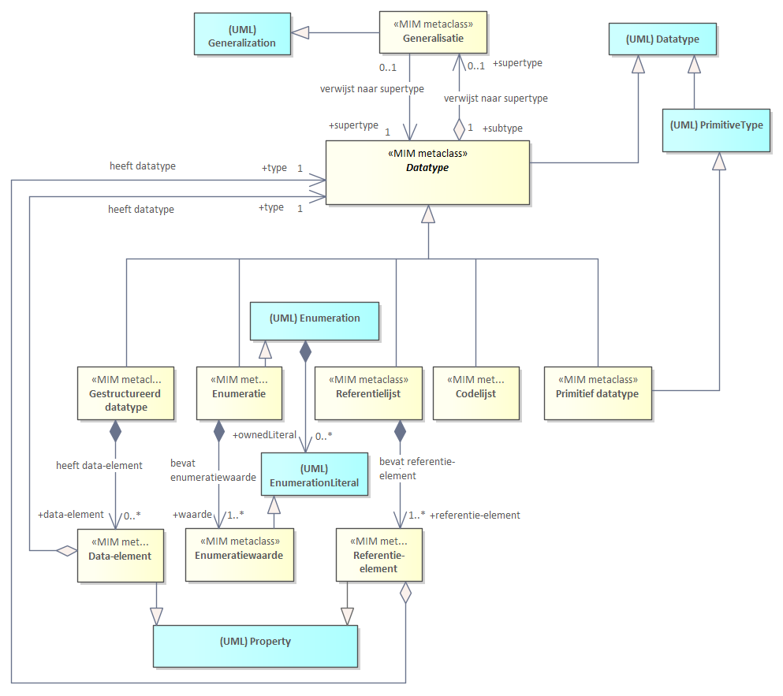
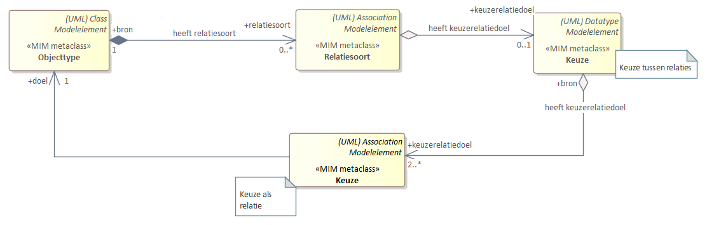

# Metamodel in UML

## Structuur metamodel in UML

Dit hoofdstuk beschrijft hoe je een informatiemodel kan maken in UML, oftewel hoe de modelelementen uit het hoofdstuk Algemeen worden uitgedrukt in UML.

De eerste paragraaf bevat diagrammen, in UML. Elk diagram geeft een aantal modelelementen weer.
Het geheel van diagrammen, in samenhang, is opgenomen in de bijlage [Template naamgeving conventies](#template-naamgeving-conventies).

Uitgangspunten voor het metamodel in UML zijn:

- UML 2.5 vormt de basis voor de conceptuele beschrijving.
- Gebruik te maken van de bestaande UML-modelelementen conform UML van OMG. OMG noemt dit een UML metaclass. Een voorbeeld hiervan is
  UML-Class.
- Daar waar (semantisch) nodig extensiemechanismen toe te passen met
  behoud van de betekenis van de UML-metaclasses. Het modelelement is dan een MIM
  metaclass. Hoe deze zich verhouden tot UML is weergegeven in de bijlage.
- Modelelementen hebben één stereotype. Daarnaast hebben twee verschillende
  stereotypen nooit dezelfde betekenis. Stereotypes worden toegepast als er een
  verbijzondering van een UML constructie nodig is met behoud van de betekenis van
  de UML-metaclass.

Elk modelelement heeft een MIM metaclass. Deze wordt in UML in een
informatiemodel gemodelleerd als een extensie van een Metaclass van UML 2.5 en een bijbehorende
stereotype.

<aside class='example'>
Het MIM modelelement Objecttype wordt gemodelleerd als een UML-Class met
stereotype «Objecttype».

Niet alle MIM metaclasses hebben een stereotype (nodig). In de kolom staat dan ‘-‘.
</aside>

| **MIM metaclass** | **Stereotype** | **Metaclass UML 2.5** |      | **In EA** | **In ...** |
| ----------------- | -------------- | --------------------- | ---- | --------- | ---------- |
| Objecttype        | «Objecttype»   | (UML) Class           |      | Class     |            |

De links kolom bevat het MIM modelelement, zoals bedoeld in het hoofdstuk [Metamodel Algemeen].
De 2e en 3e kolom bevatten de uitdrukking van het MIM in UML, versie 2.5.
De 2e en 5e kolom bevatten de uitdrukking van het MIM in Sparx Enterprise Architect. Deze gebruikt Class (i.p.v. UML-Class). Deze UML tool is (uiteraard) geen onderdeel van de MIM specificatie. Het is zeker niet verplicht om deze te gebruiken, u kunt uw eigen tool gebruiken. Deze kolom staat erbij om illustratief aan te geven dat het soms nodig kan zijn om, afhankelijk van de tool, net iets specifieker aan te geven hoe het MIM in de tool exact uitgedrukt wordt. In de 6e kolom is ruimte gereserveerd om gebruik van een andere tool te duiden.

Bijna alle hebben een UML-metaclass (UML 2.5) als basis, deze is dan aangegeven als ‘blauw gekleurde’ metaclasse. Dit is
ook opgenomen in diagramvorm, in de bijlage [Template naamgeving
conventies](#template-naamgeving-conventies).

De ten opzichte van MIM versie 1.0.1 gewijzigde modelelementen zijn in rood aangegeven.

### Kern

Kern zonder Metagegevens

| **MIM metaclass** | **Stereotype**      | **Metaclass UML 2.5**            |      | **In EA**        | **In ...** |
| ----------------- | ------------------- | -------------------------------- | ---- | ---------------- | ---------- |
| Objecttype        | «Objecttype»        | (UML) Class                      |      | Class            |            |
| Attribuutsoort    | «Attribuutsoort»    | (UML) Property                   |      | Attribute        |            |
| Gegevensgroep     | «Gegevensgroep»     | (UML) Property                   |      | Attribute        |            |
| Gegevensgroeptype | «Gegevensgroeptype» | (UML) Class                      |      | Class            |            |
| Generalisatie     | «Generalisatie»     | (UML) Generalization             |      | Generalization   |            |
| Relatiesoort      | «Relatiesoort»      | (UML) Association                |      | Association      |            |
| Relatieklasse     | «Relatieklasse»     | (UML) Association én (UML) Class |      | Associationclass |            |

Datatype behoort ook tot de kern, zoals aangegeven in het diagram en is in het diagram bedoeld als een abstract modelelement. 
Er bestaat in de UML uitwerking echter geen stereotype «Datatype», daarom is het modelelement Datatype niet opgenomen in de tabel. 
Datatype is in de volgende paragraaf concreet uitgewerkt in verschillende verschijningsvormen met elk een eigen stereotype. 

### Datatypen

Datatypen zonder Metagegevens

View 2: Datatypen

| **MIM metaclass**       | **Stereotype**          | **Metaclass UML 2.5**    |      | **In EA**          | **In ...** |
| ----------------------- | ----------------------- | ------------------------ | ---- | ------------------ | ---------- |
| Primitief datatype      | «Primitief datatype»    | (UML) Primitive Type     |      | Datatype           |            |
| Gestructureerd datatype | «Gestructuurd datatype» | (UML) Datatype           |      | Datatype           |            |
| Data element            | «Data element»          | (UML) Property           |      | Attribute          |            |
| Enumeratie              | \-                      | (UML) Enumeration        |      | Enumeration        |            |
| Enumeratiewaarde        | \-                      | (UML) EnumerationLiteral |      | EnumerationLiteral |            |
| Referentielijst         | «Referentielijst»       | (UML) Datatype           |      | Datatype           |            |
| Referentie element      | «Referentie element»    | (UML) Property           |      | Attribute          |            |
| Codelijst               | «Codelijst»             | (UML) Datatype           |      | Datatype           |            |

### Overige

Constraint

*Constraint*

View 3a: Constraint

| **MIM metaclass** | **Stereotype** | **Metaclass UML 2.5** |      | **In EA**  | **In ...** |
| ----------------- | -------------- | --------------------- | ---- | ---------- | ---------- |
| Constraint        | \-             | (UML) Constraint      |      | Constraint |            |

*Keuze*

Er zijn vier situaties waarin een keuze toegepast wordt: 

- Use case 1: een keuze tussen datatypen
- Use case 2: een keuze tussen 2 of meer attribuutsoorten
- Use case 3: een keuze tussen meerdere manieren om 1 betekenisvol attribuutsoort in te vullen
- Use case 4: een keuze tussen relatiedoelen, als nadere invulling van 1 betekenisvolle relatiesoort

Voor elk geldt een eigen subset van het metamodel.

De 'keuze constructie' maakt een keuze mogelijk tussen meerdere datatypen, attribuutsoorten, en relatiedoelen. In UML behouden we dezelfde modellering, een datatype blijft dus een datatype, een attribuutsoort een attribuutsoort en een relatiesoort een relatiesoort. De UML elementen die het stereotype keuze krijgen zijn zelf geen datatype, attribuutsoort of relatiedoel.

Merk op dat de diagrammen op metamodel niveau zijn gemodelleerd. Hoe dit op informatiemodel niveau uitpakt is onder het diagram beschreven in tekst. 

*Keuze tussen datatypen*

Modellering van deze Keuze in een informatiemodel: 
- Modelleer een _UML-Datatype_ met stereotype _keuze_. 
- Modelleer hierin 2 of meer MIM-Datatypes: neem hiervoor eerst een _UML-attribute_ met stereotype _keuze_ op in de Keuze zoals gemodelleerd in punt 1, dit UML-attribute krijgt als typering het gewenste (MIM) Datatype. Merk op dat dit extra UML-attribute is zelf geen keuze mogelijkheid is, de keuze is immers tussen de datatypes. 

Gebruik de Keuze voor een (MIM) Attrituutsoort: 
- Kies een _MIM-Attribuutsoort_ en koppel de hiervoor gemodelleerde Keuze hieraan via een typering, zoals gebruikelijk. 

*Keuze tussen 2 of meer attribuutsoorten*

Modellering van het Keuze in een informatiemodel: 
- Modelleer in UML een _UML-Class_ met stereotype _keuze_. 
- Modelleer hierin 2 of meer MIM-Attribuutsoorten: elk (MIM) Attribuutsoort wordt gemodelleerd zoals gebruikelijk, door een _UML-Property_ (attribute) met stereotype _attribuutsoort_ (en deze UML-Property (attribute) heeft zelf weer als typering een MIM-Datatype). 

Gebruik de Keuze voor het (MIM) Objecttype of het (MIM) Gegevensgroeptype: 
- Modelleer in een (MIM) Objecttype of in een (MIM) Gegevensgroeptype een _UML-Property (attribute) met stereotype _keuze_ en koppel de hiervoor gemodelleerde Keuze hieraan, via een typering, zoals gebruikelijk. Aan dit stereotype _keuze_ is te zien dat deze _UML-Property_ zelf **geen** (MIM) Attribuutsoort is van het objecttype. Immers, alleen de met stereotype Attribuutsoort aangeduide UML-properties (attributes) zijn een (MIM) Attribuutsoort.  

Er is hier voor de aankoppeling gekozen voor een UML-Attribute en niet voor een UML-Association in navolging van de modellering van de gegevensgroep en het gegevensgroeptype. 

*Keuze tussen meerdere manieren om 1 betekenisvol attribuutsoort in te vullen*

Modellering van de Keuze in een informatiemodel: 
- Modelleer in UML een _UML-Class_ met stereotype _keuze_. 
- Modelleer hierin 2 of meer keuze mogelijkheden door voor elke keuze mogelijkheid een UML-Property (attribute) te modelleren met stereotype _keuze_ (en deze UML-Property heeft als datatype een MIM-Datatype). Aan dit stereotype _keuze_ is te zien dat deze _UML-Property (attribute)_ zelf **geen** (MIM) Attribuutsoort is van het objecttype. Immers, alleen een met stereotype Attribuutsoort aangeduid UML-attribute is een (MIM) Attribuutsoort. 

Gebruik de Keuze voor de (MIM) Attribuutsoort: 
- Modelleer in een (MIM) Objecttype of in een (MIM) Gegevensgroeptype een MIM-Attribuutsoort zoals gebruikelijk, en koppel de hiervoor gemodelleerde Keuze hieraan, via een typering, zoals gebruikelijk.  

*Keuze tussen relatiedoelen, als nadere invulling van 1 betekenisvolle relatiesoort*

Modellering van het Keuze in een informatiemodel: 
- Modelleer in UML een _UML-Class_ met stereotype _keuze_. 
- Modelleer hierin 2 of meer MIM-Relatiesoorten die elk een relatiedoel hebben. Elke (MIM) Relatiesoort wordt gemodelleerd zoals gebruikelijk, door een _UML-Property_ (association) met stereotype _relatiesoort_ of _externe koppeling_ en met een relatiedoel (een relatierol aan de doel/target kan van de relatie).  

Gebruik de Keuze voor het (MIM) Objecttype of het (MIM) Gegevensgroeptype: 
- Modelleer in een (MIM) Objecttype of in een (MIM) Gegevensgroeptype een _UML-Association_ met stereotype _keuze_ en koppel de hiervoor gemodelleerde Keuze hieraan, als target van de UML-association, zoals gebruikelijk. Aan dit stereotype _keuze_ is te zien dat deze _UML-Association_ zelf **geen** relatiesoort of externe koppeling is. 

**De modellering van een Keuze in UML**

Er zijn drie metaklassen met de naam Keuze maar elke keer als extensie van een andere UML metaklasse, waar ook uit blijkt om welke variant van de keuze het gaat. 

| **MIM metaclass** | **Stereotype** | **Metaclass UML 2.5** |      | **In EA**    | **In ...** |
| ----------------- | -------------- | --------------------- | ---- | ------------ | ---------- |
| Keuze             | Keuze          | (UML) Class           |      | Class        |            |
| Keuze             | Keuze          | (UML) Datatype        |      | Datatype     |            |
| Keuze             | Keuze          | (UML) Property        |      | Attribute    |            |

- Als een UML Class met stereotype keuze is gebruikt, dan zitten hierin alleen attribuutsoorten en/of relatiesdoelen, de attribuutsoorten en relatiedoelen waaruit gekozen kan worden. 
- Als een UML Datatype met stereotype keuze is gebruikt, dan zitten hierin alleen datatypes, de datatypes waaruit gekozen kan worden. 
- Als een UML Property met stereotype keuze is gebruikt, dan is er sprake van een hulpconstructie om het modelelement Keuze aan te koppelen aan het MIM-modelelement waarvoor de keuze geldt.

Merk op dat deze tabel niet gaat over de modelelementen waaruit een keuze gemaakt moet worden. Dat zijn immers de modelelementen datatype, attribuutsoort en relatiesoort. Deze tabel gaat over de modellering van Keuze in UML oftewel de extra hulpconstructies die in UML nodig zijn om de modelelementen waaruit een keuze gemaakt moet worden aan te koppelen aan het MIM-modelelement waarvoor de keuze geldt. Deze extra hulpconstructies krijgen als stereotype _keuze_ en dit geeft aan dat de betekenis hiervan anders is dan de betekenis van de MIM-elementen datatype, attirbuutsoort en relatiesoort. 

*Relatierol*

Relatierol

View 3b: Relatiesoort en relatierol

| **MIM metaclass**     | **Stereotype** | **Metaclass UML 2.5** |      | **In EA**      | **In ...** |
| --------------------- | -------------- | --------------------- | ---- | -------------- | ---------- |
| Relatierol (abstract) | «Relatierol»   | Property              |      | AssociationEnd |            |
| Relatierol source     | «Relatierol»   | Property              |      | AssociationEnd |            |
| Relatierol target     | «Relatierol»   | Property              |      | AssociationEnd |            |

*Externe koppeling*

| **MIM metaclass** | **Stereotype**      | **Metaclass UML 2.5** |      | **In EA**   | **In ...** |
| ----------------- | ------------------- | --------------------- | ---- | ----------- | ---------- |
| Externe koppeling | «Externe koppeling» | (UML) Association     |      | Association |            |

View 3c: Groepering

*Packages*

| **MIM metaclass**     | **Stereotype**    | **Metaclass UML 2.5** |      | **In EA** | **In ...** |
| --------------------- | ----------------- | --------------------- | ---- | --------- | ---------- |
| Informatiemodel       | «Informatiemodel» | (UML) Package         |      | Package   |            |
| Domein (het eigen IM) | «Domein»          | (UML) Package         |      | Package   |            |
| Extern                | «Extern»          | (UML) Package         |      | Package   |            |
| View                  | «View»            | (UML) Package         |      | Package   |            |

## Nadere specificatie metagegevens in UML

Deze paragraaf is een aanvulling op de paragraaf *'Specificatie metagegevens'*
in het hoofdstuk [Metamodel Algemeen](#metamodel-algemeen).

>   **Alias**

De alternatieve weergave van de naam.

*Toelichting*

Verdere toelichting voor UML modellen:

-   De alias is te specificeren voor NamedElements (zoals UML-Class, ML-association, UML-UML-Datatype en
    UML-property). De alias is in UML gespecificeerd bij de metaclass **Element Import]**.
    Element import wordt in UML ingezet voor het importeren van een NamedElement uit een ander package.
    In dit metamodel wordt de alias (nog) niet zo gebruikt.  

In Enterprise Architect is de alternatieve weergave aan te zetten in de properties van een Diagram,
via: use alias if available.

>   **Identificerend**

Als een attribuutsoort identificerend is, dan krijgt dit kenmerk in UML isId =
true.

Als een relatiesoort identificerend is, dan krijgt dit kenmerk in UML een
stereotype «id»

<pre class='note'>
In de hierna volgende paragrafen worden de metagegevens per modelelement gespecificeerd in tabellen. Per metagegeven zijn de volgende onderdelen gespecificeerd:
- Aspect: Het benoemde metagegeven. Met aanduiding √ is conform stelselafspraken voor basisregistraties. Een * is conform de stelselcatalogus. Zie ook de paragraaf in H3 hierover.  
- Kardinaliteit: Aantal maal dat een metagegeven opgenomen kan worden bij dit
modelelement.
- Toelichting: Nadere uitleg over het metagegeven.
- In UML 2.5: De naam waarmee het metagegeven in UML2.5 is benoemd. Het betreft veelal overerving van een metagegeven van een UML metaclass die niet in dit document is benoemd.
- In EA: Aanduiding hoe het metagegeven in Sparx Enterprise Architect (EA) is aangegeven.
Rode tekst betreft een standaardelement binnen EA. Zwarte tekst in de kolom betreft een uitbreiding op het UML Metamodel, via tagged values of aanvullende stereotypes.
</pre>

### Modellering metagegevens voor objecten en attributen in UML

**Specificatie voor «Objecttype»**

De objecttypen worden naar de volgende aspecten gespecificeerd:

| **Aspect**                       | **Kardina-liteit** | **Toelichting**                | **In UML 2.5**                        |    | **In EA**      | **In ...** |
| -------------------------------- | -------- | ---------------------------------------- | ------------------------------------- | -- | -------------- | -------- |
| **Naam√**            | 1            | Algemeen metagegeven. | *name van de metaclass Named element* |    | *Name*         |     |
| **Alias**            | 0..1         | Algemeen metagegeven. | *UML-Property*                        |    | *Alias*        |     |
| **Herkomst**         | 1            | Algemeen metagegeven. |                                       |    | *tagged value* |     |
| **Begrip**           | 0..\*        | Algemeen metagegeven. |                                       |    | *Tagged value* |     |
| **Definitie√**       | 1            | Algemeen metagegeven. | *Body van de metaclass Comment*       |    | *Notes*        |     |
| **Herkomst definitie√** | 1         | Algemeen metagegeven. |                                       |    | *Tagged value* |     |
| **Toelichting√**     | 0..1         | Algemeen metagegeven. |                                       |    | *Tagged value* |     |
| **Datum opname**     | 1            | Algemeen metagegeven. |                                       |    | *Tagged value* |     |
| **Unieke aanduiding√**  | 1         | De identificerende kenmerken een object die een instantie van het objecttype uniek identificeren. Deze kenmerken worden in UML gemodelleerd als attribuutsoort en/of relatie dus dit metagegeven hoeft niet apart te worden gespecificeerd bij een objecttype, het is afleidbaar. Voor objecttypen die deel uitmaken van een (basis)registratie of informatiemodel betreft dit de wijze waarop daarin voorkomende objecten (van dit type) uniek in de registratie worden aangeduid. | UML isID                                      |      | *isId bij attribuutsoort, --- of --- stereotype «isId» bij target role relatiesoort --- of --- een combinatie van deze twee, elk hiervan meer keren toepasbaar* |            |
| **Populatie√**                | 0..1               | Voor objecttypen die deel uitmaken van een (basis)registratie betreft dit de beschrijving van de exemplaren van het gedefinieerde objecttype die in de desbetreffende (basis)­registratie voorhanden zijn. |                                          |      | *Tagged value*                                               |            |
| **Kwaliteit√**                | 0..1               | Beschrijving van de mate waarin in de registratie opgenomen objecten van het desbetreffende type volledig, juist, actueel, nauwkeurig en betrouwbaar zijn. |                                          |      | *Tagged value*                                               |            |
| **Indicatie abstract object** | 1                  | Conceptueel model: indicatie dat het objecttype een generalisatie is, waarvan een object als specialisatie altijd voorkomt in de hoedanigheid van een (en slechts één) van de specialisaties van het betreffende objecttype. Logisch model: Indicatie dat er geen instanties (objecten) voor het betreffende objecttype mogen voorkomen. | *isAbstract bij de metaclass Classifier* |     | *Abstract*                                                   |            |
| **heeft attribuut** / **attribuut**   | 0..*       | Binding aan een attribuutsoort.                | *owned element* = UML-property     |    | *attribute*          |     |
| **heeft gegevensgroep** / **gegevensgroep**  | 0..*       | Binding aan een gegevensgroep.                 | *owned element* = UML-property     |    | *attribute*          |     |
| **heeft relatiesoort** / **relatiesoort** | 0..*       | Binding aan een relatiesoort of relatieklasse. | *owned element* = UML-Relationship |    | *association*        |     |
| **heeft externe koppeling** / **externe koppeling**  | 0..*    | Binding aan een externe koppeling.             | *owned element* = UML-Relationship |    | *association*        |     |
| **verwijst naar supertype** / **supertype** | 0..*    | Binding aan een generalisatie (naar een ander objecttype).                 | *owned element* = UML-Relationship |    | *association*        |     |

**Specificatie voor «Attribuutsoort»**

De attribuutsoorten worden naar de volgende aspecten gespecificeerd:

| **Aspect**                       | **Kardina-liteit** | **Toelichting**                | **In UML 2.5**                        |    | **In EA**      | **In ...** |
| -------------------------------- | -------- | ---------------------------------------- | ------------------------------------- | -- | -------------- | -------- |
| **Naam√**            | 1            | Algemeen metagegeven. | *name van de metaclass Named element* |    | *Name*         |     |
| **Alias**            | 0..1         | Algemeen metagegeven. | *UML-Property*                        |    | *Alias*        |     |
| **Herkomst**         | 1            | Algemeen metagegeven. |                                       |    | *tagged value* |     |
| **Begrip**           | 0..\*        | Algemeen metagegeven. |                                       |    | *Tagged value* |     |
| **Definitie√**       | 1            | Algemeen metagegeven. | *Body van de metaclass Comment*       |    | *Notes*        |     |
| **Herkomst definitie√** | 1         | Algemeen metagegeven. |                                       |    | *Tagged value* |     |
| **Toelichting√**     | 0..1         | Algemeen metagegeven. |                                       |    | *Tagged value* |     |
| **Datum opname**     | 1            | Algemeen metagegeven. |                                       |    | *Tagged value* |     |
| **Domein** *(aspecten van een waarde/data)* |                    | *Domein is zelf geen metadata aspect. Onder het kopje ‘domein’ vallen een aantal metadata aspecten die gelden voor een waarde, oftewel de eisen waaraan een waarde van een attribuutsoort moet voldoen.* |                                                              |      |                |            |
| **- Lengte**                                | 0..1               | Algemeen metagegeven.                                        |                                                              |      | *Tagged value* |            |
| **- Patroon**                               | 0..1               | Algemeen metagegeven.                                        |                                                              |      | *Tagged value* |            |
| **- Formeel Patroon**                       | 0..1               | Algemeen metagegeven.                                        |                                                              |      | *Tagged value* |            |
| **Indicatie materiële historie √**          | 1                  | Algemeen metagegeven.                                        |                                                              |      | *Tagged value* |            |
| **Indicatie formele historie √**            | 1                  | Algemeen metagegeven.                                        |                                                              |      | *Tagged value* |            |
| **Kardinaliteit √**                         | 1                  | Algemeen metagegeven.                                        | *lowerValue en upperValue van de metaclass Multiplicity Element* |      | *Multiplicity* |            |
| **Authentiek √**                            | 1                  | Algemeen metagegeven.                                        |                                                              |      | *Tagged value* |            |
| **Indicatie afleidbaar**                    | 1                  | Algemeen metagegeven.                                        | *isDerived bij metaclass Property*                           |      | *isDerived* |            |
| **Indicatie classificerend**                | 1                  | Algemeen metagegeven.                                        |                           |      | *Tagged value*    |            |
| **Mogelijk geen waarde**                    | 1                  | Algemeen metagegeven.                                        |                                                              |      | *Tagged value* |            |
| **Identificerend**                          | 0..1               | Algemeen metagegeven.                                        | *isID bij de metaclass Property*                             |      | *isID*         |            |
| **heeft datatype**   | 1       | Binding aan een datatype.     | *datatype* = UML-datatype |    | *type* = datatype          |     |

**Specificatie voor «Gegevensgroep»**

De gegevensgroepen worden naar de volgende aspecten gespecificeerd:

| **Aspect**                  | **Kardina-liteit** | **Toelichting**                | **In UML 2.5**                        |    | **In EA**      | **In ...** |
| -------------------------------- | -------- | ---------------------------------------- | ------------------------------------- | -- | -------------- | -------- |
| **Naam**             | 1            | Algemeen metagegeven. | *name van de metaclass Named element* |    | *Name*         |     |
| **Alias**            | 0..1         | Algemeen metagegeven. | *UML-Property*                        |    | *Alias*        |     |
| **Herkomst**         | 1            | Algemeen metagegeven. |                                       |    | *tagged value* |     |
| **Begrip**           | 0..\*        | Algemeen metagegeven. |                                       |    | *Tagged value* |     |
| **Definitie**        | 1            | Algemeen metagegeven. | *Body van de metaclass Comment*       |    | *Notes*        |     |
| **Herkomst definitie** | 1          | Algemeen metagegeven. |                                       |    | *Tagged value* |     |
| **Toelichting√**     | 0..1         | Algemeen metagegeven. |                                       |    | *Tagged value* |     |
| **Datum opname**     | 1            | Algemeen metagegeven. |                                       |    | *Tagged value* |     |
| **Kardinaliteit**    | 1                  | Algemeen metagegeven.                                  | *lowerValue en upperValue van de metaclass Multiplicity Element* |      | *Multiplicity van de source role van de bijbehorende composite relatie* |            |
| **Authentiek**                   | 1                  | Algemeen metagegeven.                                  |                                                              |      | *Tagged value*                                               |            |
| **heeft gegevensgroeptype**   | 1       | Binding aan een gegevensgroeptype.     | *owned element* = UML-Class |    | *type* = Class          |     |

**Specificatie voor «Gegevensgroeptype»**

De gegevensgroeptypen worden naar de volgende aspecten gespecificeerd:

| **Aspect**                  | **Kardina-liteit** | **Toelichting**                | **In UML 2.5**                        |    | **In EA**      | **In ...** |
| -------------------------------- | -------- | ---------------------------------------- | ------------------------------------- | -- | -------------- | -------- |
| **Naam**             | 1            | Algemeen metagegeven. | *name van de metaclass Named element* |    | *Name*         |     |
| **Alias**            | 0..1         | Algemeen metagegeven. | *UML-Property*                        |    | *Alias*        |     |
| **Herkomst**         | 1            | Algemeen metagegeven. |                                       |    | *tagged value* |     |
| **Begrip**           | 0..\*        | Algemeen metagegeven. |                                       |    | *Tagged value* |     |
| **Definitie**        | 1            | Algemeen metagegeven. | *Body van de metaclass Comment*       |    | *Notes*        |     |
| **Herkomst definitie** | 1          | Algemeen metagegeven. |                                       |    | *Tagged value* |     |
| **Toelichting√**     | 0..1         | Algemeen metagegeven. |                                       |    | *Tagged value* |     |
| **Datum opname**     | 1            | Algemeen metagegeven. |                                       |    | *Tagged value* |     |
| **heeft attribuut**      | 0..*     | Binding aan een attribuutsoort.                | *owned element* = UML-property     |    | *attribute*          |     |
| **heeft gegevensgroep**  | 0..*     | Binding aan een gegevensgroep.                 | *owned element* = UML-property     |    | *attribute*          |     |
| **heeft relatiesoort**   | 0..*     | Binding aan een relatiesoort of relatieklasse. | *owned element* = UML-Relationship |    | *association*        |     |
| **heeft externe koppeling** | 0..*  | Binding aan een externe koppeling.             | *owned element* = UML-Relationship |    | *association*        |     |
| **verwijst naar supertype** | 0..*  | Binding aan een generalisatie (naar een ander gegevensgroeptype).  | *owned element* = UML-Relationship |    | *association*        |     |

### Specificatie metagegevens voor relaties

**Relatiesoort en relatierol**

Het metamodel heeft twee manieren om een relatie tussen twee objecttypen te
beschrijven. Deze keuze wordt aangegeven in de eigen extensie, zoals beschreven
in paragraaf [alternatieven](#alternatieven). Alleen het gekozen alternatief is relevant voor de modellering in uw informatiemodel.

- Alternatief 1: Verplichte benoeming van de naam van de relatie met de bijbehorende metagegevens;
- Alternatief 2: Verplichte benoeming van de rol van de target in een relatie met de bijbehorende metagegevens en optioneel de benoeming van de naam van de relatie.

Beide alternatieven gebruiken relatiesoort en relatierol, maar met andere regels
voor gebruik.

#### Relatiesoort is leidend (alternatief 1)

Relatiesoort is verplicht, met een naam en met een definitie en deze is leidend.
Metadata aspecten worden hierbij altijd vastgelegd. Het gebruik van relatierol
is optioneel (zowel bij source en target). Áls er een relatierol target wordt
vastgelegd, dan is de metadata hierbij wel verplicht.

**Specificatie voor «Relatiesoort»**

De relatiesoorten worden naar de volgende aspecten gespecificeerd.

| **Aspect**                  | **Kardina-liteit** | **Toelichting**                | **In UML 2.5**                        |    | **In EA**      | **In ...** |
| -------------------------------- | -------- | ---------------------------------------- | ------------------------------------- | -- | -------------- | -------- |
| **Naam√**             | 1            | Algemeen metagegeven. | *name van de metaclass Named element* |    | *Name*         |     |
| **Alias**            | 0..1         | Algemeen metagegeven. | *UML-Property*                        |    | *Alias*        |     |
| **Herkomst**         | 1            | Algemeen metagegeven. |                                       |    | *tagged value* |     |
| **Begrip**           | 0..\*        | Algemeen metagegeven. |                                       |    | *Tagged value* |     |
| **Definitie√**       | 1            | Algemeen metagegeven. | *Body van de metaclass Comment*       |    | *Notes*        |     |
| **Herkomst definitie√** | 1         | Algemeen metagegeven. |                                       |    | *Tagged value* |     |
| **Toelichting√**     | 0..1         | Algemeen metagegeven. |                                       |    | *Tagged value* |     |
| **Datum opname**     | 1            | Algemeen metagegeven. |                                       |    | *Tagged value* |     |
| **Identificerend**   | 0..1         | Algemeen metagegeven. | *isID bij de metaclass Property*      |    | *isID*         |     |
| **Unidirectioneel**               | 1                  | Algemeen metagegeven. |                                                              |      | *Direction van de betreffende assiciation (van source naar target)* |            |
| **Relatie eigenaar**              | 1                  | Algemeen metagegeven. | */source: related Element bij Relationship Element*          |      | *Source*                                                     |            |
| **Relatie doel**                  | 1                  | Algemeen metagegeven. | */target: related Element bij Relationship Element*          |      | *Target*                                                     |            |
| **Aggregatietype**                | 1                  | Algemeen metagegeven. | *AggregationKind bij metaclass Property*                     |      | *Aggregation van de source role met waarde composite of shared* |            |
| **Kardinaliteit√**                | 1                  | Algemeen metagegeven. | *lowerValue en upperValue van de metaclass MultiplicityElement* /target |      | *Multiplicity van de target role*                            |            |
| **Kardinaliteit relatie eigenaar**  | 1                  | Algemeen metagegeven. | *lowerValue en upperValue van de metaclass MultiplicityElement* /source |      | *Multiplicity van de source role*                            |            |
| **Indicatie materiële historie√** | 1                  | Algemeen metagegeven. |                                                              |      | *Tagged value*                                               |            |
| **Indicatie formele historie√**   | 1                  | Algemeen metagegeven. |                                                              |      | *Tagged value*                                               |            |
| **Authentiek√**                   | 1                  | Algemeen metagegeven. |                                                              |      | *Tagged value*                                               |            |
| **Indicatie afleidbaar**          | 1                  | Algemeen metagegeven. | *isDerived bij UML metaclass Assocation*                     |      | *isDerived*                                                  |            |
| **Mogelijk geen waarde**          | 1                  | Algemeen metagegeven. |                                                              |      | *Tagged value*                                               |            |
| **verwijst naar relatiedoel**   | 0..*  | Binding aan een objecttype. | */target: related Element bij Relationship Element* = UML-Class |    | *association target* = Class       |     |

**Specificatie voor «Relatierol»**

Voor relatierollen worden naar de volgende aspecten gespecificeerd.

| **Aspect**                  | **Kardina-liteit** | **Toelichting**                | **In UML 2.5**                        |    | **In EA**      | **In ...** |
| -------------------------------- | -------- | ---------------------------------------- | ------------------------------------- | -- | -------------- | -------- |
| **Naam**             | 1            | Algemeen metagegeven. | *name van de metaclass Named element* |    | *Name*         |     |
| **Alias**            | 0..1         | Algemeen metagegeven. | *UML-Property*                        |    | *Alias*        |     |
| **Herkomst**         | 1            | Algemeen metagegeven. |                                       |    | *tagged value* |     |
| **Begrip**           | 0..\*        | Algemeen metagegeven. |                                       |    | *Tagged value* |     |
| **Definitie**        | 1            | Algemeen metagegeven. | *Body van de metaclass Comment*       |    | *Notes*        |     |
| **Herkomst definitie** | 1          | Algemeen metagegeven. |                                       |    | *Tagged value* |     |
| **Toelichting**      | 0..1         | Algemeen metagegeven. |                                       |    | *Tagged value* |     |
| **Datum opname**     | 1            | Algemeen metagegeven. |                                       |    | *Tagged value* |     |

#### Relatierol is leidend (alternatief 2)

Verplichte benoeming van de rol van de target in een relatie met de bijbehoren
de metagegevens en optioneel de benoeming van de naam van de relatie.

**Specificatie voor «Relatiesoort»**

De relatiesoorten worden naar de volgende aspecten gespecificeerd.

| **Aspect**                  | **Kardina-liteit** | **Toelichting**                | **In UML 2.5**                        |    | **In EA**      | **In ...** |
| -------------------------------- | -------- | ---------------------------------------- | ------------------------------------- | -- | -------------- | -------- |
| **Naam**             | 1            | Algemeen metagegeven. | *name van de metaclass Named element* |    | *Name*         |     |
| **Alias**            | 0..1         | Algemeen metagegeven. | *UML-Property*                        |    | *Alias*        |     |
| **Herkomst**         | 1            | Algemeen metagegeven. |                                       |    | *tagged value* |     |
| **Begrip**           | 0..\*        | Algemeen metagegeven. |                                       |    | *Tagged value* |     |
| **Definitie**        | 1            | Algemeen metagegeven. | *Body van de metaclass Comment*       |    | *Notes*        |     |
| **Herkomst definitie** | 1          | Algemeen metagegeven. |                                       |    | *Tagged value* |     |
| **Toelichting**      | 0..1         | Algemeen metagegeven. |                                       |    | *Tagged value* |     |
| **Datum opname**     | 1            | Algemeen metagegeven. |                                       |    | *Tagged value* |     |
| **verwijst naar relatiedoel**   | 0..*  | Binding aan een objecttype. | */target: related Element bij Relationship Element* = UML-Class |    | *association target* = Class       |     |

**Specificatie voor «Relatierol»**

Voor relatierol worden bij de target rol van een relatiesoort de volgende
aspecten gespecificeerd.

| **Aspect**                  | **Kardina-liteit** | **Toelichting**                | **In UML 2.5**                        |    | **In EA**      | **In ...** |
| -------------------------------- | -------- | ---------------------------------------- | ------------------------------------- | -- | -------------- | -------- |
| **Naam√**            | 1            | Algemeen metagegeven. | *name van de metaclass Named element* |    | *Name*         |     |
| **Alias**            | 0..1         | Algemeen metagegeven. | *UML-Property*                        |    | *Alias*        |     |
| **Herkomst**         | 1            | Algemeen metagegeven. |                                       |    | *tagged value* |     |
| **Begrip**           | 0..\*        | Algemeen metagegeven. |                                       |    | *Tagged value* |     |
| **Definitie√**       | 1            | Algemeen metagegeven. | *Body van de metaclass Comment*       |    | *Notes*        |     |
| **Herkomst definitie√** | 1         | Algemeen metagegeven. |                                       |    | *Tagged value* |     |
| **Toelichting√**     | 0..1         | Algemeen metagegeven. |                                       |    | *Tagged value* |     |
| **Datum opname**     | 1            | Algemeen metagegeven. |                                       |    | *Tagged value* |     |
| **Identificerend**   | 0..1         | Algemeen metagegeven. | *isID bij de metaclass Property*      |    | *isID*         |     |
| **Kardinaliteit√**   | 1            | Algemeen metagegeven. | *lowerValue en upperValue van de metaclass Multiplicity Element* |      | *Multiplicity* |            |
| **Kardinaliteit relatie eigenaar** | 1 | Algemeen metagegeven. | *lowerValue en upperValue van de metaclass MultiplicityElement*  |      | *Multiplicity* | | 
| **Indicatie materiële historie√** | 1                  | Algemeen metagegeven. |                                                              |      | *Tagged value* |            |
| **Indicatie formele historie√**   | 1                  | Algemeen metagegeven. |                                                              |      | *Tagged value* |            |
| **Authentiek√ \***                | 1                  | Algemeen metagegeven. |                                                              |      | *Tagged value* |            |
| **Mogelijk geen waarde**          | 1                  | Algemeen metagegeven. |                                                              |      | *Tagged value* |            |

**Specificatie voor «Generalisatie» tussen objecttypes**

De generalisaties worden naar het volgende aspect gespecificeerd:

| **Aspect**                  | **Kardina-liteit** | **Toelichting**                | **In UML 2.5**                        |    | **In EA**      | **In ...** |
| -------------------------------- | -------- | ---------------------------------------- | ------------------------------------- | -- | -------------- | -------- |
| **Subtype**   | 1                  | De generalisatie relatie kent twee kanten, de bron kant (source) van de relatie en de doel kant (target) van de relatie. De bron kant van deze generalisatie relatie specificeert een _objecttype_ die een subtype/specialisatie is van het via deze generalisatie relatie aangegeven supertype (zie verwijst naar supertype). Kortweg, het subtype is een specialisatie van het supertype. Het objecttype dat het subtype is van deze generalisatie is verbonden met deze generalisatie. | */source: related Element bij Relationship Element* |      | *Source*  |            |
| **verwijst naar supertype** | 1    | Binding van deze generalisatie aan een objecttype. De generalisatie relatie kent twee kanten, de bron kant (source) van de relatie en de doel kant (target) van de relatie. De doel kant van deze generalisatie relatie specificeert een _objecttype_ die het supertype/de generalisatie is van het via deze generalisatie aangegeven subtype. Kortweg, het supertype is een generalisatie van het subtype. | */target: related Element bij Relationship Element* = UML-Class |      | *Target*  |                 |
| **Datum opname** | 1               | Algemeen metagegeven                                         |                     |      | *Tagged value* |            |

**Specificatie voor «Generalisatie» tussen datatypes**

De generalisaties worden naar het volgende aspect gespecificeerd:

| **Aspect**                  | **Kardina-liteit** | **Toelichting**                | **In UML 2.5**                        |    | **In EA**      | **In ...** |
| -------------------------------- | -------- | ---------------------------------------- | ------------------------------------- | -- | -------------- | -------- |
| **Subtype**   | 1                  | De generalisatie relatie kent twee kanten, de bron kant (source) van de relatie en de doel kant (target) van de relatie. De bron kant van deze generalisatie relatie specificeert een _datatype_ die een subtype/specialisatie is van het via deze generalisatie relatie aangegeven supertype (zie verwijst naar supertype). Kortweg, het subtype is een specialisatie van het supertype. Het datatype dat het subtype is van deze generalisatie is verbonden met deze generalisatie. 
 | */source: related Element bij Relationship Element* |      |      | *Source*  |            |
| **verwijst naar supertype** | 1    | Binding van deze generalisatie aan een datatype. De generalisatie relatie kent twee kanten, de bron kant (source) van de relatie en de doel kant (target) van de relatie. De doel kant van deze generalisatie relatie specificeert een _datatype_ die het supertype/de generalisatie is van het via deze generalisatie aangegeven subtype. Kortweg, het supertype is een generalisatie van het subtype. | */target: related Element bij Relationship Element* = UML-datatype |      |      | *Target*  |                 |
| **Datum opname** | 1               | Algemeen metagegeven                                         |                     |      | *Tagged value* |            |

**Specificatie voor «Relatieklasse»**

De relatieklassen worden naar de volgende aspecten gespecificeerd:

| **Aspect**                  | **Kardina-liteit** | **Toelichting**                | **In UML 2.5**                        |    | **In EA**      | **In ...** |
| -------------------------------- | -------- | ---------------------------------------- | ------------------------------------- | -- | -------------- | -------- |
| **Naam√**            | 1            | Algemeen metagegeven. | *name van de metaclass Named element* |    | *Name*         |     |
| **Alias**            | 0..1         | Algemeen metagegeven. | *UML-Property*                        |    | *Alias*        |     |
| **Herkomst**         | 1            | Algemeen metagegeven. |                                       |    | *tagged value* |     |
| **Begrip**           | 0..\*        | Algemeen metagegeven. |                                       |    | *Tagged value* |     |
| **Definitie√**       | 1            | Algemeen metagegeven. | *Body van de metaclass Comment*       |    | *Notes*        |     |
| **Herkomst definitie√** | 1         | Algemeen metagegeven. |                                       |    | *Tagged value* |     |
| **Toelichting√**     | 0..1         | Algemeen metagegeven. |                                       |    | *Tagged value* |     |
| **Datum opname**     | 1            | Algemeen metagegeven. |                                       |    | *Tagged value* |     |
| **Unidirectioneel**               | 1                  | Algemeen metagegeven. |                                                              |      | *Direction van de betreffende assiciation (van source naar target)* |            |
| **Relatie eigenaar**              | 1                  | Algemeen metagegeven. | */source: related Element bij Relationship Element*          |      | *Source*                                                     |            |
| **Relatie doel**                  | 1                  | Algemeen metagegeven. | */target: related Element bij Relationship Element*          |      | *Target*                                                     |            |
| **Aggregatietype**                | 1                  | Algemeen metagegeven. | *AggregationKind bij metaclass Property*                     |      | *Aggregation van de source role met waarde composite of shared* |            |
| **Kardinaliteit√**                | 1                  | Algemeen metagegeven. | *lowerValue en upperValue van de metaclass MultiplicityElement* |      | *Multiplicity van de target role*                            |            |
| **Indicatie materiële historie√** | 1                  | Algemeen metagegeven. |                                                              |      | *Tagged value*                                               |            |
| **Indicatie formele historie√**   | 1                  | Algemeen metagegeven. |                                                              |      | *Tagged value*                                               |            |
| **Authentiek√**                   | 1                  | Algemeen metagegeven. |                                                              |      | *Tagged value*                                               |            |
| **Indicatie afleidbaar**          | 1                  | Algemeen metagegeven. | *isDerived bij UML metaclass Assocation*                     |      | *isDerived*                                                  |            |
| **Mogelijk geen waarde**          | 1                  | Algemeen metagegeven. |                                                              |      | *Tagged value*                                               |            |
| **heeft attribuut** / **attribuut**   | 0..*       | Binding aan een attribuutsoort.                | *owned element* = UML-property     |    | *attribute*          |     |
| **verwijst naar relatiedoel** / **relatiedoel**  | 0..*  | Binding aan een objecttype. | */target: related Element bij Relationship Element* = UML-Class |    | *association target* = Class       |     |

**Specificatie voor «Externe koppeling»**

Externe koppelingen worden naar de volgende aspecten gespecificeerd.

| **Aspect**                  | **Kardina-liteit** | **Toelichting**                | **In UML 2.5**                        |    | **In EA**      | **In ...** |
| -------------------------------- | -------- | ---------------------------------------- | ------------------------------------- | -- | -------------- | -------- |
| **Naam√**             | 1            | Algemeen metagegeven. | *name van de metaclass Named element* |    | *Name*         |     |
| **Alias**            | 0..1         | Algemeen metagegeven. | *UML-Property*                        |    | *Alias*        |     |
| **Herkomst**         | 1            | Algemeen metagegeven. |                                       |    | *tagged value* |     |
| **Begrip**           | 0..\*        | Algemeen metagegeven. |                                       |    | *Tagged value* |     |
| **Definitie√**       | 1            | Algemeen metagegeven. | *Body van de metaclass Comment*       |    | *Notes*        |     |
| **Herkomst definitie√** | 1         | Algemeen metagegeven. |                                       |    | *Tagged value* |     |
| **Toelichting√**      | 0..1         | Algemeen metagegeven. |                                       |    | *Tagged value* |     |
| **Datum opname**     | 1            | Algemeen metagegeven. |                                       |    | *Tagged value* |     |
| **Unidirectioneel**               | 1                  | Algemeen metagegeven. |                                                              |      | *Direction van de betreffende assiciation (van source naar target)* |            |
| **Relatie eigenaar**              | 1                  | Algemeen metagegeven. | */source: related Element bij Relationship Element*          |      | *Source*                                                     |            |
| **Relatie doel**                  | 1                  | Algemeen metagegeven. | */target: related Element bij Relationship Element*          |      | *Target*                                                     |            |
| **Aggregatietype**                | 1                  | Algemeen metagegeven. | *AggregationKind bij metaclass Property*                     |      | *Aggregation van de source role met waarde composite of shared* |            |
| **Kardinaliteit√**                | 1                  | Algemeen metagegeven. | *lowerValue en upperValue van de metaclass MultiplicityElement* |      | *Multiplicity van de target role*                            |            |
| **Indicatie materiële historie√** | 1                  | Algemeen metagegeven. |                                                              |      | *Tagged value*                                               |            |
| **Indicatie formele historie√**   | 1                  | Algemeen metagegeven. |                                                              |      | *Tagged value*                                               |            |
| **Authentiek√**                   | 1                  | Algemeen metagegeven. |                                                              |      | *Tagged value*                                               |            |
| **Indicatie afleidbaar**          | 1                  | Algemeen metagegeven. | *isDerived bij UML metaclass Assocation*                     |      | *isDerived*                                                  |            |
| **Mogelijk geen waarde**          | 1                  | Algemeen metagegeven. |                                                              |      | *Tagged value*                                               |            |
| **verwijst naar relatiedoel**     | 0..*       | Binding aan een objecttype. | */target: related Element bij Relationship Element* = UML-Class |    | *association target* = Class       |     |

### Specificatie metagegevens voor waardenlijsten

**Specificatie voor «Referentielijst»**

Voor referentielijsten worden de volgende aspecten gespecificeerd:

| **Aspect**                  | **Kardina-liteit** | **Toelichting**                | **In UML 2.5**                        |    | **In EA**      | **In ...** |
| -------------------------------- | -------- | ---------------------------------------- | ------------------------------------- | -- | -------------- | -------- |
| **Naam**             | 1            | Algemeen metagegeven. | *name van de metaclass Named element* |    | *Name*         |     |
| **Alias**            | 0..1         | Algemeen metagegeven. | *UML-Property*                        |    | *Alias*        |     |
| **Herkomst**         | 1            | Algemeen metagegeven. |                                       |    | *tagged value* |     |
| **Begrip**           | 0..\*        | Algemeen metagegeven. |                                       |    | *Tagged value* |     |
| **Definitie**        | 1            | Algemeen metagegeven. | *Body van de metaclass Comment*       |    | *Notes*        |     |
| **Herkomst definitie**  | 1         | Algemeen metagegeven. |                                       |    | *Tagged value* |     |
| **Toelichting**      | 0..1         | Algemeen metagegeven. |                                       |    | *Tagged value* |     |
| **Datum opname**     | 1            | Algemeen metagegeven. |                                       |    | *Tagged value* |     |
| **Locatie**          | 1..1         | Algemeen metagegeven. |                                       |    | *Tagged value* |     |
| **bevat referentie element** | 1..* | Binding aan een referentie element. | *owned element* = UML-property  | | *attribute*   | |
| **verwijst naar supertype** | 0..*    | Binding aan een generalisatie (naar een andere referentie lijst). | *owned element* = UML-Relationship |    | *association*   |   |

**Specificatie voor «Referentie element»**

De referentie-elementen worden naar de volgende aspecten gespecificeerd:

| **Aspect**                  | **Kardina-liteit** | **Toelichting**                | **In UML 2.5**                        |    | **In EA**      | **In ...** |
| -------------------------------- | -------- | ---------------------------------------- | ------------------------------------- | -- | -------------- | -------- |
| **Naam**             | 1            | Algemeen metagegeven. | *name van de metaclass Named element* |    | *Name*         |     |
| **Alias**            | 0..1         | Algemeen metagegeven. | *UML-Property*                        |    | *Alias*        |     |
| **Herkomst**         | 1            | Algemeen metagegeven. |                                       |    | *tagged value* |     |
| **Begrip**           | 0..\*        | Algemeen metagegeven. |                                       |    | *Tagged value* |     |
| **Definitie**        | 1            | Algemeen metagegeven. | *Body van de metaclass Comment*       |    | *Notes*        |     |
| **Herkomst definitie**  | 1         | Algemeen metagegeven. |                                       |    | *Tagged value* |     |
| **Toelichting**      | 0..1         | Algemeen metagegeven. |                                       |    | *Tagged value* |     |
| **Datum opname**     | 1            | Algemeen metagegeven. |                                       |    | *Tagged value* |     |
| **Domein** *(aspecten van een waarde/data)* |     |            |                              |      |             |            |
| **- Lengte**                                | 0..1               | Algemeen metagegeven. |                                                              |      | *Tagged value*                       |            |
| **- Patroon**                               | 0..1               | Algemeen metagegeven. |                                                              |      | *Tagged value*                       |            |
| **- Formeel patroon**                       | 0..1               | Algemeen metagegeven. |                                                              |      | *Tagged value*                       |            |
| **Kardinaliteit**                           | 1                  | Algemeen metagegeven. | *lowerValue en upperValue van de metaclass Multiplicity Element* |      | *Multiplicity van de de target role* |            |
| **Identificerend**                          | 0..1               | Algemeen metagegeven. | *isID van de metaclass Property*                             |      | *isID bij de betreffende class*      |            |
| **heeft datatype**   | 1       | Binding aan een datatype.     | *datatype* = UML-datatype |    | *type* = datatype          |     |

**Specificatie voor «codelijst»**

Voor codelijst worden de volgende aspecten gespecificeerd:

| **Aspect**                  | **Kardina-liteit** | **Toelichting**                | **In UML 2.5**                        |    | **In EA**      | **In ...** |
| -------------------------------- | -------- | ---------------------------------------- | ------------------------------------- | -- | -------------- | -------- |
| **Naam**         | 1                  | Algemeen metagegeven. *De naam van de lijst zoals gespecificeerd in de catalogus van de desbetreffende registratie dan wel, indien het een door de eigen organisatie toegevoegde lijst betreft, de door de eigen organisatie vastgestelde naam.* | *name van de metaclass Named element* |      | *Name*         |      |
| **Alias**        | 0..1               | Algemeen metagegeven.    | *UML-Property* |      | *Alias*        |            |
| **Herkomst**     | 1                  | Algemeen metagegeven.    |                |      | *tagged value* |            |
| **Begrip**       | 0..\*              | Algemeen metagegeven.    |                |      | *Tagged value* |            |
| **Definitie**    | 1                  | Algemeen metagegeven.    | *Body van de metaclass Comment*  |  | *Notes*    |  |
| **Herkomst definitie**  | 1        | Algemeen metagegeven.    |                |      | *Tagged value* |            |
| **Toelichting**  | 0..1               | Algemeen metagegeven.    |                |      | *tagged value* |            |
| **Datum opname** | 1                  | Algemeen metagegeven.    |                |      | *tagged value* |            |
| **Locatie**      | 1..1               | Algemeen metagegeven.    |                |      | *tagged value* |            |

### Specificatie metagegevens voor datatypen

Het betreft metagegevens voor in het informatiemodel gedefinieerde datatypen,
oftewel exclusief datatypen die al buiten het model bestaan, zoals Integer,
DateTime, Surface.

**Specificatie voor «Primitief datatype»**

De datatypen worden naar de volgende aspecten gespecificeerd:

| **Aspect**                  | **Kardina-liteit** | **Toelichting**                | **In UML 2.5**                        |    | **In EA**      | **In ...** |
| -------------------------------- | -------- | ---------------------------------------- | ------------------------------------- | -- | -------------- | -------- |
| **Naam**         | 1          | Algemeen metagegeven.    | *name van de metaclass Named element* | | *Name*  | |
| **Alias**        | 0..1       | Algemeen metagegeven.    | *UML-Property* |      | *Alias*        |            |
| **Herkomst**     | 0..1       | Algemeen metagegeven.    |                |      | *tagged value* |            |
| **Begrip**       | 0..\*      | Algemeen metagegeven.    |                |      | *Tagged value* |            |
| **Definitie**    | 0..1       | Algemeen metagegeven.    | *Body van de metaclass Comment*  |  | *Notes*    |  |
| **Herkomst definitie** | 0..1 | Algemeen metagegeven.    |                |      | *Tagged value* |            |
| **Toelichting**  | 0..1       | Algemeen metagegeven.    |                |      | *tagged value* |            |
| **Datum opname** | 1          | Algemeen metagegeven.    |                |      | *tagged value* |            |
| **Domein** *(aspecten van een waarde/data)* |    |       |                |      |                |            |
| **- Lengte**                                | 0..1               | Algemeen metagegeven, in principe wordt dit metagegeven bij het attribuutsoort gespecificeerd, behalve als het generiek gespecificeerd moet worden. |                                       |      | *Tagged value* |            |
| **- Patroon**                               | 0..1               | Algemeen metagegeven, in principe wordt dit metagegeven bij het attribuutsoort gespecificeerd, behalve als het generiek gespecificeerd moet worden. |                                       |      | *Tagged value* |            |
| **- Formeel patroon**                       | 0..1               | Algemeen metagegeven, in principe wordt dit metagegeven bij het attribuutsoort gespecificeerd, behalve als het generiek gespecificeerd moet worden. |                                       |      | *Tagged value* |            |

**Specificatie voor «Gestructureerd datatype»**

Voor Gestructureerde datatypen worden de volgende aspecten gespecificeerd:

| **Aspect**                  | **Kardina-liteit** | **Toelichting**                | **In UML 2.5**                        |    | **In EA**      | **In ...** |
| -------------------------------- | -------- | ---------------------------------------- | ------------------------------------- | -- | -------------- | -------- |
| **Naam**         | 1             | Algemeen metagegeven. *De naam van het domein package.* | *name van de metaclass Namedelement* |      | *Name*    |            |
| **Alias**        | 0..1          | Algemeen metagegeven.    | *UML-Property* |      | *Alias*        |            |
| **Herkomst**     | 0..1          | Algemeen metagegeven.    |                |      | *tagged value* |            |
| **Begrip**       | 0..\*         | Algemeen metagegeven.    |                |      | *Tagged value* |            |
| **Definitie**    | 0..1          | Algemeen metagegeven.    | *Body van de metaclass Comment*  |  | *Notes*    |  |
| **Herkomst definitie**  | 0..1   | Algemeen metagegeven.    |                |      | *Tagged value* |            |
| **Toelichting**  | 0..1          | Algemeen metagegeven.    |                |      | *tagged value* |            |
| **Datum opname** | 1             | Algemeen metagegeven.    |                |      | *tagged value* |            |
| **Patroon**      | 0..1          | Algemeen metagegeven.    |                |      | *Tagged value* |            |
| **Formeel patroon**      | 0..1  | Algemeen metagegeven.    |                |      | *Tagged value* |            |
| **bevat data element**   | 0..*  | Binding aan een data element, 2 of meer tenzij via generalisatie verkregen. | *owned element* = UML-property     |  | *attribute* |   |

**Specificatie voor «Data element»**

De data-elementen worden naar de volgende aspecten gespecificeerd:

| **Aspect**                  | **Kardina-liteit** | **Toelichting**                | **In UML 2.5**                        |    | **In EA**      | **In ...** |
| -------------------------------- | -------- | ---------------------------------------- | ------------------------------------- | -- | -------------- | -------- |
| **Naam**         | 1             | Algemeen metagegeven. *De naam van het domein package.* | *name van de metaclass Namedelement* |      | *Name*    |            |
| **Alias**        | 0..1          | Algemeen metagegeven.    | *UML-Property* |      | *Alias*        |            |
| **Herkomst**     | 0..1          | Algemeen metagegeven.    |                |      | *tagged value* |            |
| **Begrip**       | 0..\*         | Algemeen metagegeven.    |                |      | *Tagged value* |            |
| **Definitie**    | 0..1          | Algemeen metagegeven.    | *Body van de metaclass Comment*  |  | *Notes*    |  |
| **Herkomst definitie**  | 0..1   | Algemeen metagegeven.    |                |      | *Tagged value* |            |
| **Toelichting**  | 0..1          | Algemeen metagegeven.    |                |      | *tagged value* |            |
| **Datum opname** | 1             | Algemeen metagegeven.    |                |      | *tagged value* |            |
| **Domein** *(aspecten van een waarde/data)* |         |     |                |      |                |            |
| **- Lengte**     | 0..1          | Algemeen metagegeven. |                                                                 |      | *Tagged value*    |     |
| **- Patroon**    | 0..1          | Algemeen metagegeven. |                                                                 |      | *Tagged value*    |     |
| **- Formeel patroon**  | 0..1    | Algemeen metagegeven. |                                                                 |      | *Tagged value*    |     |
| **Kardinaliteit**      | 1       | Algemeen metagegeven. | *lowerValue en upperValue van de metaclass MultiplicityElement* |      | *Multiplicity*    |     |
| **heeft datatype**     | 1       | Binding aan een datatype.  | *datatype* = UML-datatype       |      | *type* = datatype |     |

**Specificatie voor «Keuze»**

Een Keuze worden naar de volgende aspecten gespecificeerd:

| **Aspect**                  | **Kardina-liteit** | **Toelichting**                | **In UML 2.5**                        |    | **In EA**      | **In ...** |
| -------------------------------- | -------- | ---------------------------------------- | ------------------------------------- | -- | -------------- | -------- |
| **Naam**         | 1             | Algemeen metagegeven. *De naam van het domein package.* | *name van de metaclass Namedelement* |      | *Name*    |            |
| **Alias**        | 0..1          | Algemeen metagegeven.    | *UML-Property* |      | *Alias*        |            |
| **Herkomst**     | 0..1          | Algemeen metagegeven.    |                |      | *tagged value* |            |
| **Begrip**       | 0..\*         | Algemeen metagegeven.    |                |      | *Tagged value* |            |
| **Definitie**    | 0..1          | Algemeen metagegeven.    | *Body van de metaclass Comment* |  | *Notes*   |    |
| **Herkomst definitie**  | 0..1   | Algemeen metagegeven.    |                |      | *Tagged value* |            |
| **Toelichting**  | 0..1          | Algemeen metagegeven.    |                |      | *tagged value* |            |
| **Datum opname** | 1             | Algemeen metagegeven.    |                |      | *tagged value* |            |
| **heeft datatypekeuze**    | 0..* | Binding van een datatype, in UML via een additionale UML-property met stereotype keuze | *owned element* = UML-property en deze heeft en *datatype*     |   | *attribute*          |     |
| **heeft attribuutkeuze**   | 0..* | Binding aan een attribuutsoort.  | *owned element* = UML-Property     |    | *attribute*          |     |
| **heeft relatiedoelkeuze** | 0..* | Binding aan een relatiesoort.    | *owned element* = UML-Relationship |    | *association*        |     |

*Opmerking: de modelelementen waaruit gekozen kan worden heten sinds MIM 1.1 geen keuze elementen meer. Keuze element is komen te vervallen.*

### Specificatie metagegevens voor packages

**Specificatie voor «Informatiemodel»**

Informatiemodel packages worden naar de volgende aspecten gespecificeerd:

| **Aspect**                  | **Kardina-liteit** | **Toelichting**                | **In UML 2.5**                        |    | **In EA**      | **In ...** |
| -------------------------------- | -------- | ---------------------------------------- | ------------------------------------- | -- | -------------- | -------- |
| **Naam**         | 1          | Algemeen metagegeven.    | *name van de metaclass Named element* | | *Name*  | |
| **Alias**        | 0..1       | Algemeen metagegeven.    | *UML-Property* |      | *Alias*        |            |
| **Herkomst**     | 1          | Algemeen metagegeven.    |                |      | *tagged value* |            |
| **Definitie**    | 1          | Algemeen metagegeven.    | *Body van de metaclass Comment*  |  | *Notes*    |  |
| **Herkomst definitie**  | 1   | Algemeen metagegeven.    |                |      | *Tagged value* |            |
| **Toelichting**  | 0..1       | Algemeen metagegeven.    |                |      | *tagged value* |            |
| **Datum opname** | 1          | Algemeen metagegeven.    |                |      | *tagged value* |            |
| **Informatiemodel type**   | 1                  | Algemeen metagegeven. *De beschrijving van de aard van het informatiemodel: conceptueel, logisch, technisch.* |                                      |      | *Tagged value* |            |
| **Informatiedomein**       | 1                  | Algemeen metagegeven. *Aanduiding van het functionele domein waartoe het informatiemodel behoort.* |                                      |      | *Tagged value* |            |
| **MIM versie**             | 1                  | *De versie van de MIM specificatie die gebruikt is om het informatiemodel in uit te drukken.* |                                      |      | *Tagged value* |            |
|                            |                    | *Bijvoorbeeld: 1.0.1 of 1.1*                                 |                                      |      |                |            |
| **MIM extensie**           | 0..1               | *De aanduiding van een extensie op MIM.*                     |                                      |      | *Tagged value* |            |
|                            |                    | *Bijvoorbeeld: Kadaster of NEN3610:2020*                     |                                      |      |                |            |
| **MIM taal**               | 0..1               | *De aanduiding van de taal die gebruikt is voor de modelelementen.*  *Bijvoorbeeld: EN of NL* |                                      |      | *Tagged value* |            |
| **Relatiemodelleringtype** | 1                  | Algemeen metagegeven.    Toelichting Type informatiemodel: zoals bedoeld in paragraaf 1.5. Alle packages, oftewel «Domein» en «View», binnen het informatiemodel hebben hetzelfde type als het informatiemodel zelf. |                                      |      | *Tagged value* |            |

**Specificatie voor «Domein»**

Domein packages worden naar de volgende aspecten gespecificeerd:

| **Aspect**                  | **Kardina-liteit** | **Toelichting**                | **In UML 2.5**                        |    | **In EA**      | **In ...** |
| -------------------------------- | -------- | ---------------------------------------- | ------------------------------------- | -- | -------------- | -------- |
| **Naam**         | 1             | Algemeen metagegeven. *De naam van het domein package.* | *name van de metaclass Namedelement* |      | *Name*    |            |
| **Alias**        | 0..1          | Algemeen metagegeven.    | *UML-Property* |      | *Alias*        |            |
| **Herkomst**     | 1             | Algemeen metagegeven.    |                |      | *tagged value* |            |
| **Definitie**    | 1             | Algemeen metagegeven.    | *Body van de metaclass Comment* |  | *Notes*   |    |
| **Herkomst definitie**  | 1      | Algemeen metagegeven.    |                |      | *Tagged value* |            |
| **Toelichting**  | 0..1          | Algemeen metagegeven.    |                |      | *tagged value* |            |
| **Datum opname** | 1             | Algemeen metagegeven.    |                |      | *tagged value* |            |

**Specificatie voor «Extern»**

Externe packages worden naar de volgende aspecten gespecificeerd:

| **Aspect**                  | **Kardina-liteit** | **Toelichting**                | **In UML 2.5**                        |    | **In EA**      | **In ...** |
| -------------------------------- | -------- | ---------------------------------------- | ------------------------------------- | -- | -------------- | -------- |
| **Naam**         | 1             | Algemeen metagegeven. *De naam van het domein package.* | *name van de metaclass Namedelement* |      | *Name*    |            |
| **Alias**        | 0..1          | Algemeen metagegeven.    | *UML-Property* |      | *Alias* |            |
| **Herkomst**     | 1             | Algemeen metagegeven.    | *Bij een view is de herkomst nooit de eigen organisatie.* |      | *tagged value* |            |
| **Definitie**    | 1             | Algemeen metagegeven.    | *Body van de metaclass Comment* |  | *Notes*   |    |
| **Herkomst definitie**  | 1      | Algemeen metagegeven.    |                |      | *Tagged value* |            |
| **Toelichting**  | 0..1          | Algemeen metagegeven.    |                |      | *tagged value* |            |
| **Datum opname** | 1             | Algemeen metagegeven.    |                |      | *tagged value* |            |
| **Locatie**      | 1             | Algemeen metagegeven.    |                |      | *Tagged value* |            |

**Specificatie voor «View»**

View packages worden naar de volgende aspecten gespecificeerd, analoog aan
«Extern»:

| **Aspect**                  | **Kardina-liteit** | **Toelichting**                | **In UML 2.5**                        |    | **In EA**      | **In ...** |
| -------------------------------- | -------- | ---------------------------------------- | ------------------------------------- | -- | -------------- | -------- |
| **Naam**        | 1                  | Algemeen metagegeven. *Deze is, indien mogelijk, analoog aan de naamgeving in het externe schema waar de view over gaat, eventueel met een prefix.* | *name van de metaclass Named element* |      | *Name*         |            |
| **Alias**        | 0..1          | Algemeen metagegeven.    | *UML-Property* |      | *Alias*        |            |
| **Herkomst**     | 1             | Algemeen metagegeven.    |                |      | *tagged value* |            |
| **Definitie**    | 1             | Algemeen metagegeven.    | *Body van de metaclass Comment* |  | *Notes*   |    |
| **Herkomst definitie**  | 1      | Algemeen metagegeven.    |                |      | *Tagged value* |            |
| **Toelichting**  | 0..1          | Algemeen metagegeven.    |                |      | *tagged value* |            |
| **Datum opname** | 1             | Algemeen metagegeven.    |                |      | *tagged value* |            |
| **Locatie**      | 1             | Algemeen metagegeven.    |                |      | *Tagged value* |            |

### Specificatie metagegevens - overig

#### Specificatie voor Enumeratie

Enumeraties betreffen de metaclass Enumeration en worden naar de volgende
aspecten gespecificeerd:

| **Aspect**                  | **Kardina-liteit** | **Toelichting**                | **In UML 2.5**                        |    | **In EA**      | **In ...** |
| -------------------------------- | -------- | ---------------------------------------- | ------------------------------------- | -- | -------------- | -------- |
| **Naam**         | 1          | Algemeen metagegeven.    | *name van de metaclass Named element* |      | *Name*         | |
| **Alias**        | 0..1       | Algemeen metagegeven.    | *UML-Property*                        |      | *Alias*        | |
| **Herkomst**     | 1          | Algemeen metagegeven.    |                                       |      | *tagged value* | |
| **Begrip**       | 0..\*      | Algemeen metagegeven.    |                                       |      | *Tagged value* | |
| **Definitie**    | 1          | Algemeen metagegeven.    | *Body van de metaclass Comment*       |      | *Notes*        | |
| **Herkomst definitie** | 1    | Algemeen metagegeven.    |                                       |      | *Tagged value* | |
| **Toelichting**  | 0..1       | Algemeen metagegeven.    |                                       |      | *tagged value* | |
| **Datum opname** | 1          | Algemeen metagegeven.    |                                       |      | *tagged value* | |
| **bevat enumeratiewaarde** | 1..* | Binding van een enumeratiewaarde. | *owned element* = UML-EnumerationLiteral |    | *association*        |     |

#### Specificatie voor Enumeratiewaarde

De enumeratiewaarde zelf betreft de metaclass UML-EnumerationLiteral en kent
volgende aspecten:

| **Aspect**                  | **Kardina-liteit** | **Toelichting**                | **In UML 2.5**                        |    | **In EA**      | **In ...** |
| -------------------------------- | -------- | ---------------------------------------- | ------------------------------------- | -- | -------------- | -------- |
| **Naam**         | 1          | Algemeen metagegeven.    | *name van de metaclass Named element* | | *Name*  | |
| **Code**      | 0..1          | De in een registratie of informatiemodel aan de enumeratiewaarde toegekend unieke code (niet te verwarren met alias, zoals bedoeld in 2.8.2). | *Alias van de metaclass Element Import* |      | *Alias*   |            |
| **Herkomst**     | 0..1       | Algemeen metagegeven.    |                |      | *tagged value* |            |
| **Begrip**       | 0..\*      | Algemeen metagegeven.    |                |      | *Tagged value* |            |
| **Definitie**    | 0..1       | Algemeen metagegeven.    | *Body van de metaclass Comment*  |  | *Notes*    |  |
| **Herkomst definitie** | 0..1 | Algemeen metagegeven.    |                |      | *Tagged value* |            |
| **Toelichting**  | 0..1       | Algemeen metagegeven.    |                |      | *tagged value* |            |
| **Datum opname** | 1          | Algemeen metagegeven.    |                |      | *tagged value* |            |

#### Specificatie voor een Constraint

Constraint betreft de metaclass UML Constraint en wordt naar de volgende
aspecten gespecificeerd:

| **Aspect**                  | **Kardina-liteit** | **Toelichting**                | **In UML 2.5**                        |    | **In EA**      | **In ...** |
| -------------------------------- | -------- | ---------------------------------------- | ------------------------------------- | -- | -------------- | -------- |
| **Naam√**                  | 1         | Algemeen metagegeven.                    | *name van de metaclass Named element* |    | *Name*         |          |
| **Specificatie tekst**     | 0..1      | De specificatie van de constraint in normale tekst.                       |      |    | *Notes (type = invariant)*  |          |
| **Specificatie formeel**   | 0..1      | De beschrijving van de constraint in een formele specificatietaal, in OCL |      |    | *Notes (type =OCL)*         |          |
| **van toepassing op objecttype**        | 0..1  | Binding van aan een objecttype      |                     |    |                |          |
| **van toepassing op gegevensgroeptype** | 0..1  | Binding aan een gegevensgroeptype                 |                     |    |                |          |
| **van toepassing op relatieklasse**     | 0..1  | Binding aan een relatieklasse                     |                     |    |                |          |

## UML Tooling

### Profielen voor UML tooling  

Er is door de MIM beheerder een metamodel *profiel* gemaakt in Sparx Enterprise Architect, dat
gebruikt kan worden bij het modelleren van een informatiemodel. Dit profiel kan
je inladen en daarna kan je kiezen uit de metamodel elementen. Het profiel is
faciliterend en zorgt dat (de meeste) modelelementen van het informatiemodel
automatisch voldoen aan dit metamodel. Dit profiel is te vinden op [MIM profiel - toolbox voor EA](https://register.geostandaarden.nl/informatiemodel/mim/).  

Het is niet vereist om dit profiel te gebruiken. Het is ook toegestaan om het profiel uit te breiden, naar de behoefte van de eigen
organisatie. Maar, het is niet toegestaan om het profiel te wijzigen, dan wordt niet meer aan MIM voldaan. De reden hiervoor is dat 
een dergelijk aanpassing niet beheerd kan worden door de MIM-beheerder en er ambiguiteit zal ontstaan bij de interpretatie van het model.  

Voor andere UML tools kan ook een MIM profiel gemaakt worden. 

### Conformiteit check 

Er is een tool *Imvertor*, die kan controleren of een informatiemodel voldoet
aan dit metamodel en zo niet, wat de reden daarvan is. Deze tool is open source
en is te vinden op [www.imvertor.org](http://www.imvertor.org). 
