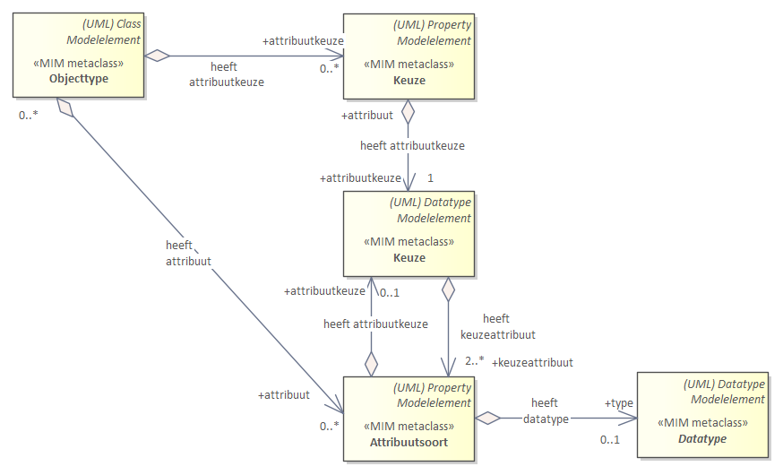
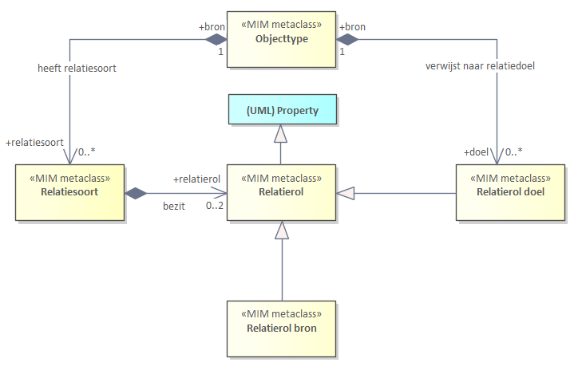

# Metamodel in UML

## Structuur metamodel in UML

Dit hoofdstuk beschrijft hoe je een informatiemodel kan maken in UML, oftewel hoe de modelelementen uit het hoofdstuk Algemeen worden uitgedrukt in UML.

De eerste paragraaf bevat diagrammen, in UML. Elk diagram geeft een aantal modelelementen weer.
Het geheel van diagrammen, in samenhang, is opgenomen in de bijlage [Template naamgeving conventies](#template-naamgeving-conventies).

Uitgangspunten voor het metamodel in UML zijn:

- UML 2.5 vormt de basis voor de conceptuele beschrijving.
- Gebruik te maken van de bestaande UML-modelelementen conform UML van OMG. OMG noemt dit een UML metaclass. Een voorbeeld hiervan is
  UML-Class.
- Daar waar (semantisch) nodig extensiemechanismen toe te passen met
  behoud van de betekenis van de UML-metaclasses. Het modelelement is dan een MIM
  metaclass. Hoe deze zich verhouden tot UML is weergegeven in de bijlage.
- Modelelementen hebben één stereotype. Daarnaast hebben twee verschillende
  stereotypen nooit dezelfde betekenis. Stereotypes worden toegepast als er een
  verbijzondering van een UML constructie nodig is met behoud van de betekenis van
  de UML-metaclass.

Elk modelelement heeft een MIM metaclass. Deze wordt in UML in een
informatiemodel gemodelleerd als een extensie van een Metaclass van UML 2.5 en een bijbehorende
stereotype.

<aside class='example'>
Het MIM modelelement Objecttype wordt gemodelleerd als een UML-Class met
stereotype «Objecttype».

Niet alle MIM metaclasses hebben een stereotype (nodig). In de kolom staat dan ‘-‘.
</aside>

| **MIM metaclass** | **Stereotype** | **Metaclass UML 2.5** |      | **In EA** | **In ...** |
| ----------------- | -------------- | --------------------- | ---- | --------- | ---------- |
| Objecttype        | «Objecttype»   | (UML) Class           |      | Class     |            |

De links kolom bevat het MIM modelelement, zoals bedoeld in het hoofdstuk [Metamodel Algemeen].
De 2e en 3e kolom bevatten de uitdrukking van het MIM in UML, versie 2.5.
De 2e en 5e kolom bevatten de uitdrukking van het MIM in Sparx Enterprise Architect. Deze gebruikt Class (i.p.v. UML-Class). Deze UML tool is (uiteraard) geen onderdeel van de MIM specificatie. Het is zeker niet verplicht om deze te gebruiken, u kunt uw eigen tool gebruiken. Deze kolom staat erbij om illustratief aan te geven dat het soms nodig kan zijn om, afhankelijk van de tool, net iets specifieker aan te geven hoe het MIM in de tool exact uitgedrukt wordt. In de 6e kolom is ruimte gereserveerd om gebruik van een andere tool te duiden.

Bijna alle hebben een UML-metaclass (UML 2.5) als basis, deze is dan aangegeven als ‘blauw gekleurde’ metaclasse. Dit is
ook opgenomen in diagramvorm, in de bijlage [Template naamgeving
conventies](#template-naamgeving-conventies).

De ten opzichte van MIM versie 1.0.1 gewijzigde modelelementen zijn in rood aangegeven.

### Kern

Kern zonder Metagegevens

| **MIM metaclass** | **Stereotype**      | **Metaclass UML 2.5**            |      | **In EA**        | **In ...** |
| ----------------- | ------------------- | -------------------------------- | ---- | ---------------- | ---------- |
| Objecttype        | «Objecttype»        | (UML) Class                      |      | Class            |            |
| Attribuutsoort    | «Attribuutsoort»    | (UML) Property                   |      | Attribute        |            |
| Gegevensgroep     | «Gegevensgroep»     | (UML) Property                   |      | Attribute        |            |
| Gegevensgroeptype | «Gegevensgroeptype» | (UML) Class                      |      | Class            |            |
| Generalisatie     | «Generalisatie»     | (UML) Generalization             |      | Generalization   |            |
| Relatiesoort      | «Relatiesoort»      | (UML) Association                |      | Association      |            |
| Relatieklasse     | «Relatieklasse»     | (UML) Association én (UML) Class |      | Associationclass |            |

### Datatypen

Datatypen zonder Metagegevens

View 2: Datatypen

| **MIM metaclass**       | **Stereotype**          | **Metaclass UML 2.5**    |      | **In EA**          | **In ...** |
| ----------------------- | ----------------------- | ------------------------ | ---- | ------------------ | ---------- |
| Primitief datatype      | «Primitief datatype»    | (UML) Primitive Type     |      | Datatype           |            |
| Gestructureerd datatype | «Gestructuurd datatype» | (UML) Datatype           |      | Datatype           |            |
| Data element            | «Data element»          | (UML) Property           |      | Attribute          |            |
| Enumeratie              | \-                      | (UML) Enumeration        |      | Enumeration        |            |
| Enumeratiewaarde        | \-                      | (UML) EnumerationLiteral |      | EnumerationLiteral |            |
| Referentielijst         | «Referentielijst»       | (UML) Datatype           |      | Datatype           |            |
| Referentie element      | «Referentie element»    | (UML) Property           |      | Attribute          |            |
| Codelijst               | «Codelijst»             | (UML) Datatype           |      | Datatype           |            |

*Nadere specificaties voor datatypen*

Voor enumeraties is geen stereotype gespecificeerd. In het metamodel maken we
gebruik van de bestaande UML-enumeration (metaclass) voor de specificaties van
een enumeratie.

Voor enumeratiewaarde is geen stereotype gespecificeerd. In het metamodel maken
we gebruik van de bestaande UML-enumerationLiteral (metaclass) voor de
specificaties van een enumeratiewaarde.

### Overige

Constraint

*Constraint*

View 3a: Constraint

| **MIM metaclass** | **Stereotype** | **Metaclass UML 2.5** |      | **In EA**  | **In ...** |
| ----------------- | -------------- | --------------------- | ---- | ---------- | ---------- |
| Constraint        | \-             | (UML) Constraint      |      | Constraint |            |

*Keuze*
Er zijn vier situaties waarin een keuze toegepast wordt:
Keuze tussen:

- datatypen
- attribuutsoorten binnen een objecttype
- attribuutsoorten binnen een attribuutsoort
- relatiedoelen

Voor elk geldt een eigens subset van het metamodel.

*Keuze tussen datatypen*

*Keuze tussen attribuutsoorten*

*Keuze tussen attribuutsoorten binnen een attribuutsoort*

*Keuze tussen relatiedoelen*

De 'keuze constructie' maakt een keuze mogelijk tussen meerdere attribuutsoorten, datatypen en relatiedoelen. Er zijn drie metaklassen met de naam Keuze maar elke keer als extensie van een andere UML metaklasse. Ook is er de metaklasse datatype als extensie van de uml metaklasse property. Een attribuut kan hiermee als keuze attribuut getypeerd worden.

| **MIM metaclass** | **Stereotype** | **Metaclass UML 2.5** |      | **In EA**    | **In ...** |
| ----------------- | -------------- | --------------------- | ---- | ------------ | ---------- |
| Keuze             | Keuze          | (UML) Datatype        |      | Datatype     |            |
| Keuze             | Keuze          | (UML) Property        |      | Attribute    |            |
| Keuze             | Keuze          | (UML) Association     |      | Association  |            |
| Datatype          | Datatype       | (UML) Property        |      | nn Attribute |            |

*Relatierol*

Relatierol

View 3b: Relatiesoort en relatierol

| **MIM metaclass**     | **Stereotype** | **Metaclass UML 2.5** |      | **In EA**      | **In ...** |
| --------------------- | -------------- | --------------------- | ---- | -------------- | ---------- |
| Relatierol (abstract) | «Relatierol»   | Property              |      | AssociationEnd |            |
| Relatierol source     | «Relatierol»   | Property              |      | AssociationEnd |            |
| Relatierol target     | «Relatierol»   | Property              |      | AssociationEnd |            |

*Externe koppeling*

| **MIM metaclass** | **Stereotype**      | **Metaclass UML 2.5** |      | **In EA**   | **In ...** |
| ----------------- | ------------------- | --------------------- | ---- | ----------- | ---------- |
| Externe koppeling | «Externe koppeling» | (UML) Association     |      | Association |            |

View 3c: Groepering

*Packages*

| **MIM metaclass**     | **Stereotype**    | **Metaclass UML 2.5** |      | **In EA** | **In ...** |
| --------------------- | ----------------- | --------------------- | ---- | --------- | ---------- |
| Informatiemodel       | «Informatiemodel» | (UML) Package         |      | Package   |            |
| Domein (het eigen IM) | «Domein»          | (UML) Package         |      | Package   |            |
| Extern                | «Extern»          | (UML) Package         |      | Package   |            |
| View                  | «View»            | (UML) Package         |      | Package   |            |

## Nadere specificatie metagegevens in UML

Deze paragraaf is een aanvulling op de paragraaf *'Specificatie metagegevens'*
in het hoofdstuk [Metamodel Algemeen](#metamodel-algemeen).

>   **Alias**

De alternatieve weergave van de naam.

*Toelichting*

Verdere toelichting voor UML modellen:

-   De alias is te specificeren voor NamedElements (zoals UML-Class, ML-association, UML-UML-Datatype en
    UML-property). De alias is in UML gespecificeerd bij de metaclass **Element Import]**.
    Element import wordt in UML ingezet voor het importeren van een NamedElement uit een ander package.
    In dit metamodel wordt de alias (nog) niet zo gebruikt.  

In Enterprise Architect is de alternatieve weergave aan te zetten in de properties van een Diagram,
via: use alias if available.

>   **Identificerend**

Als een attribuutsoort identificerend is, dan krijgt dit kenmerk in UML isId =
true.

Als een relatiesoort identificerend is, dan krijgt dit kenmerk in UML een
stereotype «id»

<pre class='note'>
In de hierna volgende paragrafen worden de metagegevens per modelelement gespecificeerd in tabellen. Per metagegeven zijn de volgende onderdelen gespecificeerd:
- Aspect: Het benoemde metagegeven. Met aanduiding √ is conform stelselafspraken voor basisregistraties. Een * is conform de stelselcatalogus. Zie ook de paragraaf in H3 hierover.  
- Kardinaliteit: Aantal maal dat een metagegeven opgenomen kan worden bij dit
modelelement.
- Toelichting: Nadere uitleg over het metagegeven.
- In UML 2.5: De naam waarmee het metagegeven in UML2.5 is benoemd. Het betreft veelal overerving van een metagegeven van een UML metaclass die niet in dit document is benoemd.
- In EA: Aanduiding hoe het metagegeven in Sparx Enterprise Architect (EA) is aangegeven.
Rode tekst betreft een standaardelement binnen EA. Zwarte tekst in de kolom betreft een uitbreiding op het UML Metamodel, via tagged values of aanvullende stereotypes.
</pre>

### Modellering metagegevens voor objecten en attributen in UML

**Specificatie voor «Objecttype»**

De objecttypen worden naar de volgende aspecten gespecificeerd:

| **Aspect**                    | **Kardi-naliteit** | **Toelichting**                                              | **In  UML 2.5**                          |      | **In EA**                                                    | **In ...** |
| ----------------------------- | ------------------ | ------------------------------------------------------------ | ---------------------------------------- | ---- | ------------------------------------------------------------ | ---------- |
| **Naam√**                     | 1                  | Algemeen metagegeven .                                       | *name van de metaclass Named element*    |      | *Name*                                                       |            |
| **Begrip**                    | 0..\*              | Algemeen metagegeven.                                        |                                          |      | *Tagged value*                                               |            |
| **Alias**                     | 0..1               | Algemeen metagegeven.                                        |                                          |      | *Alias*                                                      |            |
| **Herkomst**                  | 1                  | Algemeen metagegeven.                                        |                                          |      | *Tagged value*                                               |            |
| **Definitie√**                | 1                  | Algemeen metagegeven.                                        | *Body van de metaclass Comment*          |      | *Notes*                                                      |            |
| **Herkomst definitie√**       | 1                  | Algemeen metagegeven.                                        |                                          |      | *Tagged value*                                               |            |
| **Datum opname**              | 1                  | Algemeen metagegeven.                                        |                                          |      | *Tagged value*                                               |            |
| **Unieke aanduiding√**        | 1                  | Voor objecttypen die deel uitmaken van een (basis)registratie of informatiemodel betreft dit de wijze waarop daarin voorkomende objecten (van dit type) uniek in de registratie worden aangeduid. | *-*                                      |      | *isId bij attribuutsoort, --- of --- stereotype «isId» bij target role relatiesoort --- of --- een combinatie van deze twee, elk hiervan meer keren toepasbaar* |            |
| **Populatie√**                | 0..1               | Voor objecttypen die deel uitmaken van een (basis)registratie betreft dit de beschrijving van de exemplaren van het gedefinieerde objecttype die in de desbetreffende (basis)­registratie voorhanden zijn. |                                          |      | *Tagged value*                                               |            |
| **Kwaliteit√**                | 0..1               | Beschrijving van de mate waarin in de registratie opgenomen objecten van het desbetreffende type volledig, juist, actueel, nauwkeurig en betrouwbaar zijn. |                                          |      | *Tagged value*                                               |            |
| **Toelichting√**              | 0..1               | Algemeen metagegeven.                                        |                                          |      | *Tagged value*                                               |            |
| **Indicatie abstract object** | 1                  | Conceptueel model: indicatie dat het objecttype een generalisatie is, waarvan een object als specialisatie altijd voorkomt in de hoedanigheid van een (en slechts één) van de specialisaties van het betreffende objecttype. Logisch model: Indicatie dat er geen instanties (objecten) voor het betreffende objecttype mogen voorkomen. | *isAbstract bij de metaclass Classifier* |      | *Abstract*                                                   |            |

**Specificatie voor «Attribuutsoort»**

De attribuutsoorten worden naar de volgende aspecten gespecificeerd:

| **Aspect**                                  | **Kardi-naliteit** | **Toelichting**                                              | **In UML 2.5**                                               |      | **In EA**      | **In ...** |
| ------------------------------------------- | ------------------ | ------------------------------------------------------------ | ------------------------------------------------------------ | ---- | -------------- | ---------- |
| **Naam √**                                  | 1                  | Algemeen metagegeven.                                        | *name van de metaclass Named element*                        |      | *Name*         |            |
| **Begrip**                                  | 0..\*              | Algemeen metagegeven.                                        |                                                              |      | *Tagged value* |            |
| **Alias**                                   | 0..1               | Algemeen metagegeven.                                        |                                                              |      | *Alias*        |            |
| **Herkomst**                                | 1                  | Algemeen metagegeven.                                        |                                                              |      | *Tagged value* |            |
| **Definitie √**                             | 1                  | Algemeen metagegeven.                                        | *Body van de metaclass Comment*                              |      | *Notes*        |            |
| **Herkomst definitie √**                    | 1                  | Algemeen metagegeven.                                        |                                                              |      | *Tagged value* |            |
| **Datum opname**                            | 1                  | Algemeen metagegeven.                                        |                                                              |      | *Tagged value* |            |
| **Domein** *(aspecten van een waarde/data)* |                    | *Domein is zelf geen metadata aspect. Onder het kopje ‘domein’ vallen een aantal metadata aspecten die gelden voor een waarde, oftewel de eisen waaraan een waarde van een attribuutsoort moet voldoen.* |                                                              |      |                |            |
| **- Type**                                  | 1                  | Algemeen metagegeven.                                        |                                                              |      | *Tagged value* |            |
| **- Lengte**                                | 0..1               | Algemeen metagegeven.                                        |                                                              |      | *Tagged value* |            |
| **- Patroon**                               | 0..1               | Algemeen metagegeven.                                        |                                                              |      | *Tagged value* |            |
| **- Formeel Patroon**                       | 0..1               | Algemeen metagegeven.                                        |                                                              |      | *Tagged value* |            |
| **Indicatie materiële historie √**          | 1                  | Algemeen metagegeven.                                        |                                                              |      | *Tagged value* |            |
| **Indicatie formele historie √**            | 1                  | Algemeen metagegeven.                                        |                                                              |      | *Tagged value* |            |
| **Kardinaliteit √**                         | 1                  | Algemeen metagegeven.                                        | *lowerValue en upperValue van de metaclass Multiplicity Element* |      | *Multiplicity* |            |
| **Authentiek √**                            | 1                  | Algemeen metagegeven.                                        |                                                              |      | *Tagged value* |            |
| **Toelichting √**                           | 0..1               | Algemeen metagegeven.                                        |                                                              |      | *Tagged value* |            |
| **Indicatie afleidbaar**                    | 1                  | Algemeen metagegeven.                                        | *isDerived bij metaclass Property*                           |      | *isDerived* |            |
| **Indicatie classificerend**                | 1                  | Algemeen metagegeven.                                        |                            |                                          | *Tagged value* |            |
| **Mogelijk geen waarde**                    | 1                  | Algemeen metagegeven.                                        |                                                              |      | *Tagged value* |            |
| **Identificerend**                          | 0..1               | Algemeen metagegeven.                                        | *isID bij de metaclass Property*                             |      | *isID*         |            |

**Specificatie voor «Gegevensgroep»**

De gegevensgroepen worden naar de volgende aspecten gespecificeerd:

| **Aspect**                       | **Kardi-naliteit** | **Toelichting**                                        | **In UML 2.5**                                               |      | **In EA**                                                    | **In ...** |
| -------------------------------- | ------------------ | ------------------------------------------------------ | ------------------------------------------------------------ | ---- | ------------------------------------------------------------ | ---------- |
| **Naam**                         | 1                  | Algemeen metagegeven.                                  | *name van de metaclass Named element*                        |      | *Name*                                                       |            |
| **Begrip**                       | 0..\*              | Algemeen metagegeven.                                  |                                                              |      | *Tagged value*                                               |            |
| **Alias**                        | 0..1               | Algemeen metagegeven.                                  |                                                              |      | *Alias*                                                      |            |
| **Definitie**                    | 1                  | Algemeen metagegeven.                                  | *Body van de metaclass Comment*                              |      | *Notes*                                                      |            |
| **Toelichting**                  | 0..1               | Algemeen metagegeven.                                  |                                                              |      | *Tagged value*                                               |            |
| **Gegevensgroeptype**            | 1                  | De verwijzing naar het bijbehorende gegevensgroeptype. |                                                              |      | *Type*                                                       |            |
| **Herkomst**                     | 1                  | Algemeen metagegeven.                                  |                                                              |      | *Tagged value*                                               |            |
| **Herkomst definitie**           | 1                  | Algemeen metagegeven.                                  |                                                              |      | *Tagged value*                                               |            |
| **Datum opname**                 | 1                  | Algemeen metagegeven.                                  |                                                              |      | *Tagged value*                                               |            |
| **Indicatie materiële historie** | 1                  | Algemeen metagegeven.                                  |                                                              |      | *Tagged value*                                               |            |
| **Indicatie formele historie**   | 1                  | Algemeen metagegeven.                                  |                                                              |      | *Tagged value*                                               |            |
| **Kardinaliteit**                | 1                  | Algemeen metagegeven.                                  | *lowerValue en upperValue van de metaclass Multiplicity Element* |      | *Multiplicity van de source role van de bijbehorende composite relatie* |            |
| **Authentiek**                   | 1                  | Algemeen metagegeven.                                  |                                                              |      | *Tagged value*                                               |            |

**Specificatie voor «Gegevensgroeptype»**

De gegevensgroeptypen worden naar de volgende aspecten gespecificeerd:

| **Aspect**             | **Kardi-naliteit** | **Toelichting**       | **In UML 2.5**                        |      | **In EA**      | **In ...** |
| ---------------------- | ------------------ | --------------------- | ------------------------------------- | ---- | -------------- | ---------- |
| **Naam**               | 1                  | Algemeen metagegeven. | *name van de metaclass Named element* |      | *Name*         |            |
| **Begrip**             | 0..\*              | Algemeen metagegeven. |                                       |      | *Tagged value* |            |
| **Alias**              | 0..1               | Algemeen metagegeven. |                                       |      | *Alias*        |            |
| **Definitie**          | 0..1               | Algemeen metagegeven. | *Body van de metaclass Comment*       |      | *Notes*        |            |
| **Herkomst definitie** | 0..1               | Algemeen metagegeven. |                                       |      | *Tagged value* |            |
| **Toelichting**        | 0..1               | Algemeen metagegeven. |                                       |      | *Tagged value* |            |
| **Datum opname**       | 1                  | Algemeen metagegeven. |                                       |      | *Tagged value* |            |

### Specificatie metagegevens voor relaties

**Relatiesoort en relatierol**

Het metamodel heeft twee manieren om een relatie tussen twee objecttypen te
beschrijven. Deze keuze wordt aangegeven in de eigen extensie, zoals beschreven
in paragraaf [alternatieven](#alternatieven). Alleen het gekozen alternatief is relevant voor de modellering in uw informatiemodel.

- Alternatief 1: Verplichte benoeming van de naam van de relatie met de bijbehorende metagegevens;
- Alternatief 2: Verplichte benoeming van de rol van de target in een relatie met de bijbehorende metagegevens en optioneel de benoeming van de naam van de relatie.

Beide alternatieven gebruiken relatiesoort en relatierol, maar met andere regels
voor gebruik.

#### Relatiesoort is leidend (alternatief 1)

Relatiesoort is verplicht, met een naam en met een definitie en deze is leidend.
Metadata aspecten worden hierbij altijd vastgelegd. Het gebruik van relatierol
is optioneel (zowel bij source en target). Áls er een relatierol target wordt
vastgelegd, dan is de metadata hierbij wel verplicht.

**Specificatie voor «Relatiesoort»**

De relatiesoorten worden naar de volgende aspecten gespecificeerd:

| **Aspect**                        | **Kardi-naliteit** | **Toelichting**       | **In UML 2.5**                                               |      | **In  EA**                                                   | **In ...** |
| --------------------------------- | ------------------ | --------------------- | ------------------------------------------------------------ | ---- | ------------------------------------------------------------ | ---------- |
| **Naam√**                         | 1                  | Algemeen metagegeven. | *name van metaclass Named element*                           |      | *Name*                                                       |            |
| **Begrip**                        | 0..\*              | Algemeen metagegeven. |                                                              |      | *Tagged value*                                               |            |
| **Alias**                         | 0..1               | Algemeen metagegeven. |                                                              |      | *Alias*                                                      |            |
| **Unidirectioneel**               | 1                  | Algemeen metagegeven. |                                                              |      | *Direction van de betreffende assiciation (van source naar target)* |            |
| **Relatie eigenaar**              | 1                  | Algemeen metagegeven. | */source: related Element bij Relationship Element*          |      | *Source*                                                     |            |
| **Relatie doel**                  | 1                  | Algemeen metagegeven. | */target: related Element bij Relationship Element*          |      | *Target*                                                     |            |
| **Aggregatietype**                | 1                  | Algemeen metagegeven. | *AggregationKind bij metaclass Property*                     |      | *Aggregation van de source role met waarde composite of shared* |            |
| **Kardinaliteit√**                | 1                  | Algemeen metagegeven. | *lowerValue en upperValue van de metaclass MultiplicityElement* |      | *Multiplicity van de target role*                            |            |
| **Herkomst**                      | 1                  | Algemeen metagegeven. |                                                              |      | *Tagged value*                                               |            |
| **Definitie√**                    | 1                  | Algemeen metagegeven. | *Body van de metaclass Comment*                              |      | *Notes*                                                      |            |
| **Toelichting√**                  | 0..1               | Algemeen metagegeven. |                                                              |      | *Tagged value*                                               |            |
| **Herkomst definitie√**           | 1                  | Algemeen metagegeven. |                                                              |      | *Tagged value*                                               |            |
| **Datum opname**                  | 1                  | Algemeen metagegeven. |                                                              |      | *Tagged value*                                               |            |
| **Indicatie materiële historie√** | 1                  | Algemeen metagegeven. |                                                              |      | *Tagged value*                                               |            |
| **Indicatie formele historie√**   | 1                  | Algemeen metagegeven. |                                                              |      | *Tagged value*                                               |            |
| **Authentiek√**                   | 1                  | Algemeen metagegeven. |                                                              |      | *Tagged value*                                               |            |
| **Indicatie afleidbaar**          | 1                  | Algemeen metagegeven. | *isDerived bij UML metaclass Assocation*                     |      | *isDerived*                                                  |            |
| **Mogelijk geen waarde**          | 1                  | Algemeen metagegeven. |                                                              |      | *Tagged value*                                               |            |
| **Identificerend**                | 0..1               | Algemeen metagegeven. |                                                              |      | *Tagged value*|                     |

**Specificatie voor «Relatierol»**

Voor relatierollen worden naar de volgende aspecten gespecificeerd:

| **Aspect**    | **Kardi-naliteit** | **Toelichting**       | **In UML 2.5**                       |      | **In EA**      | **In ...** |
| ------------- | ------------------ | --------------------- | ------------------------------------ | ---- | -------------- | ---------- |
| **Naam**      | 0..1               | Algemeen metagegeven. | *name van de metaclass Namedelement* |      | *Name*         |            |
| **Begrip**    | 0..\*              | Algemeen metagegeven. |                                      |      | *Tagged value* |            |
| **Alias**     | 0..1               | Algemeen metagegeven. |                                      |      | *Alias*        |            |
| **Definitie** | 0..1               | Algemeen metagegeven. | *Body van de metaclass Comment*      |      | *Notes*        |            |

#### Relatierol is leidend (alternatief 2)

Verplichte benoeming van de rol van de target in een relatie met de bijbehoren
de metagegevens en optioneel de benoeming van de naam van de relatie.

**Specificatie voor «Relatiesoort»**

De relatiesoorten worden naar de volgende aspecten gespecificeerd:

| **Aspect**    | **Kardi-naliteit** | **Toelichting**       | **In UML 2.5**                       |      | **In EA**      | **In ...** |
| ------------- | ------------------ | --------------------- | ------------------------------------ | ---- | -------------- | ---------- |
| **Naam**      | 0..1               | Algemeen metagegeven. | *name van de metaclass NamedElement* |      | *Name*         |            |
| **Begrip**    | 0..\*              | Algemeen metagegeven. |                                      |      | *Tagged value* |            |
| **Alias**     | 0..1               | Algemeen metagegeven. |                                      |      | *Alias*        |            |
| **Definitie** | 0..1               | Algemeen metagegeven. | *Body van de metaclass Comment*      |      | *Notes*        |            |

**Specificatie voor «Relatierol»**

Voor relatierol worden bij de target rol van een relatiesoort de volgende
aspecten gespecificeerd:

| **Aspect**                        | **Kardi-naliteit** | **Toelichting**       | **In UML 2.5**                                               |      | **In EA**      | **In ...** |
| --------------------------------- | ------------------ | --------------------- | ------------------------------------------------------------ | ---- | -------------- | ---------- |
| **Naam**                          | 1                  | Algemeen metagegeven. | *name van de metaclass*                                      |      | *Name*         |            |
| **Begrip**                        | 0..\*              | Algemeen metagegeven. |                                                              |      | *Tagged value* |            |
| **Alias**                         | 0..1               | Algemeen metagegeven. |                                                              |      | *Alias*        |            |
| **Herkomst**                      | 1                  | Algemeen metagegeven. |                                                              |      | *Tagged value* |            |
| **Definitie√ \***                 | 1                  | Algemeen metagegeven. | *Body van de metaclass Comment*                              |      | *Notes*        |            |
| **Herkomst definitie√**           | 1                  | Algemeen metagegeven. |                                                              |      | *Tagged value* |            |
| **Datum opname**                  | 1                  | Algemeen metagegeven. |                                                              |      | *Tagged value* |            |
| **Kardinaliteit√**                | 1                  | Algemeen metagegeven. | *lowerValue en upperValue van de metaclass Multiplicity Element* |      | *Multiplicity* |            |
| **Indicatie materiële historie√** | 1                  | Algemeen metagegeven. |                                                              |      | *Tagged value* |            |
| **Indicatie formele historie√**   | 1                  | Algemeen metagegeven. |                                                              |      | *Tagged value* |            |
| **Authentiek√ \***                | 1                  | Algemeen metagegeven. |                                                              |      | *Tagged value* |            |
| **Mogelijk geen waarde**          | 1                  | Algemeen metagegeven. |                                                              |      | *Tagged value* |            |
| **Toelichting√ \***               | 0..1               | Algemeen metagegeven. |                                                              |      | *Tagged value* |            |
| **Identificerend**                | 0..1               | Algemeen metagegeven. | *isID bij de metaclass Property*                             |      | *Tagged value* |            |

**Specificatie voor «Generalisatie» tussen objecttypes**

De generalisaties worden naar het volgende aspect gespecificeerd:

| **Aspect**    | **Kardi-naliteit** | **Toelichting**                                              | **In UML 2.5**                                      |      | **In EA** | **In ...** |
| ------------- | ------------------ | ------------------------------------------------------------ | --------------------------------------------------- | ---- | --------- | ---------- |
| **Subtype**   | 1                  | Het objecttype dat een specialisatie is van een (ander) objecttype. | */source: related Element bij Relationship Element* |      | *Source*  |            |
| **Supertype** | 1                  | Het objecttype dat de generalisatie is van een (ander) objecttype. | */target: related Element bij Relationship Element* |      | *Target*  |            |

**Specificatie voor «Generalisatie» tussen datatypes**

De generalisaties worden naar het volgende aspect gespecificeerd:

| **Aspect**       | **Kardi-naliteit** | **Toelichting**                                              | **In UML 2.5**                                      |      | **In EA**      | **In ...** |
| ---------------- | ------------------ | ------------------------------------------------------------ | --------------------------------------------------- | ---- | -------------- | ---------- |
| **Naam**         | 0..1               | Algemeen metagegeven.                                        | *name van de metaclass Named element*               |      | *Name*         |            |
| **Begrip**       | 0..\*              | Algemeen metagegeven.                                        |                                                     |      | *Tagged value* |            |
| **Alias**        | 0..1               | Algemeen metagegeven.                                        |                                                     |      | *Alias*        |            |
| **Subtype**      | 1                  | Het datatype dat een specialisatie is van een (ander) datatype. | */source: related Element bij Relationship Element* |      | *Source*       |            |
| **Supertype**    | 1                  | Het datatype dat de generalisatie is van een (ander) datatype. | */target: related Element bij Relationship Element* |      | *Target*       |            |
| **Datum opname** | 1                  | Algemeen metagegeven                                         |                                                     |      | *Tagged value* |            |

**Specificatie voor «Relatieklasse»**

WAS in MIM 1.0

De relatieklassen worden naar de volgende aspecten gespecificeerd:

| **Aspect**       | **Kardi-naliteit** | **Toelichting**       | **In UML 2.5**                        |      | **In EA**      |      |
| ---------------- | ------------------ | --------------------- | ------------------------------------- | ---- | -------------- | ---- |
| **Naam**         | 1                  | Algemeen metagegeven. | *name van de metaclass Named element* |      | *Name*         |      |
| **Begrip**       | 0..\*              | Algemeen metagegeven. |                                       |      | *Tagged value* |      |
| **Alias**        | 0..1               | Algemeen metagegeven. |                                       |      | *Alias*        |      |
| **Definitie**    | 1                  | Algemeen metagegeven. | *Body van de metaclass Comment*       |      | *Notes*        |      |
| **Datum opname** | 1                  | Algemeen metagegeven. |                                       |      | *Tagged value* |      |

WORDT in MIM 1.1

De metaklasse Relatieklasse is een specialisatie van de metaklasse Relatiesoort en overerft alle metagegevens.

| **Aspect**                        | **Kardi-naliteit** | **Toelichting**       | **In UML 2.5**                                               |      | **In  EA**                                                   | **In ...** |
| --------------------------------- | ------------------ | --------------------- | ------------------------------------------------------------ | ---- | ------------------------------------------------------------ | ---------- |
| **Naam√**                         | 1                  | Algemeen metagegeven. | *name van metaclass Named element*                           |      | *Name*                                                       |            |
| **Begrip**                        | 0..\*              | Algemeen metagegeven. |                                                              |      | *Tagged value*                                               |            |
| **Alias**                         | 0..1               | Algemeen metagegeven. |                                                              |      | *Alias*                                                      |            |
| **Unidirectioneel**               | 1                  | Algemeen metagegeven. |                                                              |      | *Direction van de betreffende assiciation (van source naar target)* |            |
| **Relatie eigenaar**              | 1                  | Algemeen metagegeven. | */source: related Element bij Relationship Element*          |      | *Source*                                                     |            |
| **Relatie doel**                  | 1                  | Algemeen metagegeven. | */target: related Element bij Relationship Element*          |      | *Target*                                                     |            |
| **Aggregatietype**                | 1                  | Algemeen metagegeven. | *AggregationKind bij metaclass Property*                     |      | *Aggregation van de source role met waarde composite of shared* |            |
| **Kardinaliteit√**                | 1                  | Algemeen metagegeven. | *lowerValue en upperValue van de metaclass MultiplicityElement* |      | *Multiplicity van de target role*                            |            |
| **Herkomst**                      | 1                  | Algemeen metagegeven. |                                                              |      | *Tagged value*                                               |            |
| **Definitie√**                    | 1                  | Algemeen metagegeven. | *Body van de metaclass Comment*                              |      | *Notes*                                                      |            |
| **Toelichting√**                  | 0..1               | Algemeen metagegeven. |                                                              |      | *Tagged value*                                               |            |
| **Herkomst definitie√**           | 1                  | Algemeen metagegeven. |                                                              |      | *Tagged value*                                               |            |
| **Datum opname**                  | 1                  | Algemeen metagegeven. |                                                              |      | *Tagged value*                                               |            |
| **Indicatie materiële historie√** | 1                  | Algemeen metagegeven. |                                                              |      | *Tagged value*                                               |            |
| **Indicatie formele historie√**   | 1                  | Algemeen metagegeven. |                                                              |      | *Tagged value*                                               |            |
| **Authentiek√**                   | 1                  | Algemeen metagegeven. |                                                              |      | *Tagged value*                                               |            |
| **Indicatie afleidbaar**          | 1                  | Algemeen metagegeven. | *isDerived bij UML metaclass Assocation*                     |      | *isDerived*                                                  |            |
| **Mogelijk geen waarde**          | 1                  | Algemeen metagegeven. |                                                              |      | *Tagged value*                                               |            |
| **Identificerend**                | 0..1               | Algemeen metagegeven. |                                                              |      | *Tagged value*|                     |

**Specificatie voor «Externe koppeling»**

Externe koppelingen worden naar de volgende aspecten gespecificeerd:

| **Aspect**           | **Kardi-naliteit** | **Toelichting**                            | **In UML 2.5**                                      |      | **In EA**                                                    | **In ...** |
| -------------------- | ------------------ | ------------------------------------------ | --------------------------------------------------- | ---- | ------------------------------------------------------------ | ---------- |
| **Naam**             | 0..1               | Algemeen metagegeven. Standaard ‘betreft’. | *name van de metaclass Named element*               |      | *Name*                                                       |            |
| **Begrip**           | 0..\*              | Algemeen metagegeven.                      |                                                     |      | *Tagged value*                                               |            |
| **Alias**            | 0..1               | Algemeen metagegeven.                      | *UML-Property*                                      |      | *Alias*                                                      |            |
| **Datum opname**     | 1                  | Algemeen metagegeven.                      |                                                     |      | *Tagged value*                                               |            |
| **Unidirectioneel**  | 1                  | Algemeen metagegeven.                      |                                                     |      | *Direction van de betreffende assiciation (van source naar target)* |            |
| **Relatie eigenaar** | 1                  | Algemeen metagegeven.                      | */source: related Element bij Relationship Element* |      | *Source*                                                     |            |
| **Relatie doel**     | 1                  | Algemeen metagegeven.                      | */target: related Element bij Relationship Element* |      | *Target*                                                     |            |
| **Aggregatietype**   | 1                  | Algemeen metagegeven.                      | *AggregationKind bij metaclass Property*            |      | *Aggregation van de source role met waarde composite of shared* |            |
| **Identificerend**   | 0..1               | Algemeen metagegeven.                      |                                                     |      | *Tagged value*         |            |

### Specificatie metagegevens voor waardenlijsten

**Specificatie voor «Referentielijst»**

Voor referentielijsten worden de volgende aspecten gespecificeerd:

| **Aspect**       | **Kardi-naliteit** | **Toelichting**       | **In UML 2.5**                       |      | **In EA**      | **In ...** |
| ---------------- | ------------------ | --------------------- | ------------------------------------ | ---- | -------------- | ---------- |
| **Naam**         | 1                  | Algemeen metagegeven. | *name van de metaclass Namedelement* |      | *Name*         |            |
| **Begrip**       | 0..\*              | Algemeen metagegeven. |                                      |      | *Tagged value* |            |
| **Alias**        | 0..1               | Algemeen metagegeven. |                                      |      | *Alias*        |            |
| **Herkomst**     | 1                  | Algemeen metagegeven. |                                      |      | *Tagged value* |            |
| **Definitie**    | 1                  | Algemeen metagegeven. | *Body van de metaclass Comment*      |      | *Notes*        |            |
| **Datum opname** | 1                  | Algemeen metagegeven. |                                      |      | *Tagged value* |            |
| **Toelichting**  | 0..1               | Algemeen metagegeven. |                                      |      | *Tagged value* |            |
| **Locatie**      | 1..1               | Algemeen metagegeven. |                                      |      | *Tagged value* |            |

**Specificatie voor «Referentie element»**

De referentie-elementen worden naar de volgende aspecten gespecificeerd:

| **Aspect**                                  | **Kardi-naliteit** | **Toelichting**       | **In UML 2.5**                                               |      | **In EA**                            | **In ...** |
| ------------------------------------------- | ------------------ | --------------------- | ------------------------------------------------------------ | ---- | ------------------------------------ | ---------- |
| **Naam**                                    | 1                  | Algemeen metagegeven. | *name van de metaclass Named element*                        |      | *Name*                               |            |
| **Begrip**                                  | 0..\*              | Algemeen metagegeven. |                                                              |      | *Tagged value*                       |            |
| **Alias**                                   | 0..1               | Algemeen metagegeven. |                                                              |      | *Alias*                              |            |
| **Definitie**                               | 1                  | Algemeen metagegeven. | *Body van de metaclass Comment*                              |      | *Notes*                              |            |
| **Datum opname**                            | 1                  | Algemeen metagegeven. |                                                              |      | *Tagged value*                       |            |
| **Domein** *(aspecten van een waarde/data)* |                    |                       |                                                              |      |                                      |            |
| **- Type**                                  | 1                  | Algemeen metagegeven. |                                                              |      | *Type*                               |            |
| **- Lengte**                                | 0..1               | Algemeen metagegeven. |                                                              |      | *Tagged value*                       |            |
| **- Patroon**                               | 0..1               | Algemeen metagegeven. |                                                              |      | *Tagged value*                       |            |
| **- Formeel patroon**                       | 0..1               | Algemeen metagegeven. |                                                              |      | *Tagged value*                       |            |
| **Kardinaliteit**                           | 1                  | Algemeen metagegeven. | *lowerValue en upperValue van de metaclass Multiplicity Element* |      | *Multiplicity van de de target role* |            |
| **Identificerend**                          | 0..1               | Algemeen metagegeven. | *isID van de metaclass Property*                             |      | *isID*      |            |
| **Toelichting**                             | 0..1               | Algemeen metagegeven. |                                                              |      | *Tagged value*                       |            |

**Specificatie voor «codeList»**

Voor codelijst worden de volgende aspecten gespecificeerd:

| **Aspect**       | **Kardi-naliteit** | **Toelichting**                                              | **In UML 2.5**                        |      | **In EA**      | **In ...** |
| ---------------- | ------------------ | ------------------------------------------------------------ | ------------------------------------- | ---- | -------------- | ---------- |
| **Naam**         | 1                  | Algemeen metagegeven. *De naam van de lijst zoals gespecificeerd in de catalogus van de desbetreffende registratie dan wel, indien het een door de eigen organisatie toegevoegde lijst betreft, de door de eigen organisatie vastgestelde naam.* | *name van de metaclass Named element* |      | *Name*         |            |
| **Begrip**       | 0..\*              | Algemeen metagegeven.                                        |                                       |      | *Tagged value* |            |
| **Alias**        | 0..1               | Algemeen metagegeven.                                        | *Alias*                               |      |                |            |
| **Herkomst**     | 1                  | Algemeen metagegeven. 11                                     |                                       |      | *tagged value* |            |
| **Definitie**    | 1                  | Algemeen metagegeven.                                        | *Body van de metaclass Comment*       |      | *Notes*        |            |
| **Datum opname** | 1                  | Algemeen metagegeven.                                        |                                       |      | *tagged value* |            |
| **Toelichting**  | 0..1               | Algemeen metagegeven.                                        |                                       |      | *tagged value* |            |
| **Locatie**      | 1..1               | Algemeen metagegeven.                                        |                                       |      | *tagged value* |            |

### Specificatie metagegevens voor datatypen

Het betreft metagegevens voor in het informatiemodel gedefinieerde datatypen,
oftewel exclusief datatypen die al buiten het model bestaan, zoals Integer,
DateTime, Surface.

**Specificatie voor «Primitief datatype»**

De datatypen worden naar de volgende aspecten gespecificeerd:

| **Aspect**                                  | **Kardi-naliteit** | **Toelichting**       | **In UML 2.5**                        |      | **In EA**      | **In ...** |
| ------------------------------------------- | ------------------ | --------------------- | ------------------------------------- | ---- | -------------- | ---------- |
| **Naam**                                    | 1                  | Algemeen metagegeven. | *name van de metaclass Named element* |      | *Name*         |            |
| **Begrip**                                  | 0..\*              | Algemeen metagegeven. |                                       |      | *Tagged value* |            |
| **Definitie**                               | 0..1               | Algemeen metagegeven. | *Body van de metaclass Comment*       |      | *Notes*        |            |
| **Domein** *(aspecten van een waarde/data)* |                    |                       |                                       |      |                |            |
| **- Lengte**                                | 0..1               | Algemeen metagegeven. |                                       |      | *Tagged value* |            |
| **- Patroon**                               | 0..1               | Algemeen metagegeven. |                                       |      | *Tagged value* |            |
| **- Formeel patroon**                       | 0..1               | Algemeen metagegeven. |                                       |      | *Tagged value* |            |
| **Herkomst**                                | 1                  | Algemeen metagegeven. |                                       |      | *Tagged value* |            |
| **Datum opname**                            | 1                  | Algemeen metagegeven. |                                       |      | *Tagged value* |            |

**Specificatie voor «Gestructureerd datatype»**

Voor Gestructureerde datatypen worden de volgende aspecten gespecificeerd:

| **Aspect**          | **Kardi-naliteit** | **Toelichting**       | **In UML 2.5**                        |      | **In EA**      | **In ...** |
| ------------------- | ------------------ | --------------------- | ------------------------------------- | ---- | -------------- | ---------- |
| **Naam**            | 1                  | Algemeen metagegeven. | *name van de metaclass Named element* |      | *Name*         |            |
| **Begrip**          | 0..\*              | Algemeen metagegeven. |                                       |      | *Tagged value* |            |
| **Herkomst**        | 1                  | Algemeen metagegeven. |                                       |      | *Tagged value* |            |
| **Definitie**       | 1                  | Algemeen metagegeven. | *Body van de metaclass Comment*       |      | *Notes*        |            |
| **Patroon**         | 0..1               | Algemeen metagegeven. |                                       |      | *Tagged value* |            |
| **Formeel patroon** | 0..1               | Algemeen metagegeven. |                                       |      | *Tagged value* |            |
| **Datum opname**    | 1                  | Algemeen metagegeven. |                                       |      | *Tagged value* |            |

**Specificatie voor «Data element»**

De data-elementen worden naar de volgende aspecten gespecificeerd:

| **Aspect**                                  | **Kardi-naliteit** | **Toelichting**       | **In UML 2.5**                                               |      | **In EA**      | **In ...** |
| ------------------------------------------- | ------------------ | --------------------- | ------------------------------------------------------------ | ---- | -------------- | ---------- |
| **Naam**                                    | 1                  | Algemeen metagegeven. | *name van de metaclass Named element*                        |      | *Name*         |            |
| **Begrip**                                  | 0..\*              | Algemeen metagegeven. |                                                              |      | *Tagged value* |            |
| **Definitie**                               | 0..1               | Algemeen metagegeven. | *Body van de metaclass Comment*                              |      | *Notes*        |            |
| **Domein** *(aspecten van een waarde/data)* |                    |                       |                                                              |      |                |            |
| **- Type**                                  | 1                  | Algemeen metagegeven. |                                                              |      | *Type*         |            |
| **- Lengte**                                | 0..1               | Algemeen metagegeven. |                                                              |      | *Tagged value* |            |
| **- Patroon**                               | 0..1               | Algemeen metagegeven. |                                                              |      | *Tagged value* |            |
| **- Formeel patroon**                       | 0..1               | Algemeen metagegeven. |                                                              |      | *Tagged value* |            |
| **Kardinaliteit**                           | 1                  | Algemeen metagegeven. | *lowerValue en upperValue van de metaclass MultiplicityElement* |      | *Multiplicity* |            |

**Specificatie voor «Keuze»**

Een Keuze worden naar de volgende aspecten gespecificeerd:

| **Aspect**       | **Kardi-naliteit** | **Toelichting**       | **In UML 2.5**                       |      | **In EA**      | **In ...** |
| ---------------- | ------------------ | --------------------- | ------------------------------------ | ---- | -------------- | ---------- |
| **Naam**         | 1                  | Algemeen metagegeven. | *name van de metaclass Namedelement* |      | *Name*         |            |
| **Begrip**       | 0..\*              | Algemeen metagegeven. |                                      |      | *Tagged value* |            |
| **Herkomst**     | 1                  | Algemeen metagegeven. |                                      |      | *Tagged value* |            |
| **Definitie**    | 1                  | Algemeen metagegeven. | *Body van de metaclass Comment*      |      | *Notes*        |            |
| **Datum opname** | 1                  | Algemeen metagegeven. |                                      |      | *Tagged value* |            |

*Opmerking: de modelelementen waaruit gekozen kan worden heten sinds MIM 1.1 geen keuze elementen meer. Keuze element is komen te vervallen.*

### Specificatie metagegevens voor packages

**Specificatie voor «Informatiemodel»**

Informatiemodel packages worden naar de volgende aspecten gespecificeerd:

| **Aspect**                 | **Kardi-naliteit** | **Toelichting**                                              | **In UML 2.5**                       |      | **In EA**      | **In ...** |
| -------------------------- | ------------------ | ------------------------------------------------------------ | ------------------------------------ | ---- | -------------- | ---------- |
| **Naam**                   | 1                  | Algemeen metagegeven. *De naam van het informatiemodel package.* | *name van de metaclass Namedelement* |      | *Name*         |            |
| **Definitie**              | 1                  | Algemeen metagegeven. *De beschrijving van betekenis en inhoud van het informatiemodel. Bijvoorbeeld: informatiemodel van het geografisch domein luchtkwaliteit.* | *Body van de metaclass Comment*      |      | *Notes*        |            |
| **Herkomst \***            | 1                  | Algemeen metagegeven. *De beheerorganisatie, registratie of andere referentie die herleidt tot de bron van het informatiemodel.* |                                      |      | *Tagged value* |            |
| **Informatiemodel type**   | 1                  | Algemeen metagegeven. *De beschrijving van de aard van het informatiemodel: conceptueel, logisch, technisch.* |                                      |      | *Tagged value* |            |
| **Informatiedomein**       | 1                  | Algemeen metagegeven. *Aanduiding van het functionele domein waartoe het informatiemodel behoort.* |                                      |      | *Tagged value* |            |
| **MIM versie**             | 1                  | *De versie van de MIM specificatie die gebruikt is om het informatiemodel in uit te drukken.* |                                      |      | *Tagged value* |            |
|                            |                    | *Bijvoorbeeld: 1.0.1 of 1.1*                                 |                                      |      |                |            |
| **MIM extensie**           | 0..1               | *De aanduiding van een extensie op MIM.*                     |                                      |      | *Tagged value* |            |
|                            |                    | *Bijvoorbeeld: Kadaster of NEN3610:2020*                     |                                      |      |                |            |
| **MIM taal**               | 0..1               | *De aanduiding van de taal die gebruikt is voor de modelelementen.*  *Bijvoorbeeld: EN of NL* |                                      |      | *Tagged value* |            |
| **Relatiemodelleringtype** | 1                  | Algemeen metagegeven.    Toelichting Type informatiemodel: zoals bedoeld in paragraaf 1.5. Alle packages, oftewel «Domein» en «View», binnen het informatiemodel hebben hetzelfde type als het informatiemodel zelf. |                                      |      | *Tagged value* |            |

**Specificatie voor «Domein»**

Domein packages worden naar de volgende aspecten gespecificeerd:

| **Aspect** | **Kardi-naliteit** | **Toelichting**                                         | **In UML 2.5**                       |      | **In EA** | **In ...** |
| ---------- | ------------------ | ------------------------------------------------------- | ------------------------------------ | ---- | --------- | ---------- |
| **Naam**   | 1                  | Algemeen metagegeven. *De naam van het domein package.* | *name van de metaclass Namedelement* |      | *Name*    |            |

**Specificatie voor «Extern»**

Externe packages worden naar de volgende aspecten gespecificeerd:

| **Aspect**      | **Kardi-naliteit** | **Toelichting**                                              | **In UML 2.5**                       |      | **In EA**      | **In ...** |
| --------------- | ------------------ | ------------------------------------------------------------ | ------------------------------------ | ---- | -------------- | ---------- |
| **Naam**        | 1                  | Algemeen metagegeven. *De naam van het externe package zoals gespecificeerd door de externe instantie.* | *name van de metaclass Namedelement* |      | *Name*         |            |
| **Locatie**     | 1                  | Algemeen metagegeven.                                        |                                      |      | *Tagged value* |            |
| **Definitie**   | 1                  | Algemeen metagegeven. *De beschrijving van de betekenis van het package, gezien vanuit het eigen informatiemodel. Bijvoorbeeld: bron van definities.* | *Body van de metaclass Comment*      |      | *Notes*        |            |
| **Herkomst \*** | 1                  | Algemeen metagegeven. *De registratie of het informatiemodel waaraan het package ontleend is. Bij een view is de herkomst nooit de eigen organisatie.* |                                      |      | *Tagged value* |            |

**Specificatie voor «View»**

View packages worden naar de volgende aspecten gespecificeerd, analoog aan
«Extern»:

| **Aspect**      | **Kardi-naliteit** | **Toelichting**                                              | **In UML 2.5**                        |      | **In EA**      | **In ...** |
| --------------- | ------------------ | ------------------------------------------------------------ | ------------------------------------- | ---- | -------------- | ---------- |
| **Naam**        | 1                  | Algemeen metagegeven. *Deze is, indien mogelijk, analoog aan de naamgeving in het externe schema waar de view over gaat, eventueel met een prefix.* | *name van de metaclass Named element* |      | *Name*         |            |
| **Locatie**     | 1                  | Algemeen metagegeven.                                        |                                       |      | *Tagged value* |            |
| **Definitie**   | 1                  | Algemeen metagegeven.                                        | *Body van de metaclass Comment*       |      | *Notes*        |            |
| **Herkomst \*** | 1                  | Algemeen metagegeven. *De registratie of het informatiemodel waaraan het package ontleend is. Bij een view is de herkomst nooit de eigen organisatie.* |                                       |      | *Tagged value* |            |

### Specificatie metagegevens - overig

#### Specificatie voor Enumeratie

Enumeraties betreffen de metaclass Enumeration en worden naar de volgende
aspecten gespecificeerd:

| **Aspect**    | **Kardi-naliteit** | **Toelichting**       | **In UML 2.5**                        |      | **In EA**      | **In ...** |
| ------------- | ------------------ | --------------------- | ------------------------------------- | ---- | -------------- | ---------- |
| **Naam**      | 1                  | Algemeen metagegeven. | *name van de metaclass Named element* |      | *Name*         |            |
| **Begrip**    | 0..\*              | Algemeen metagegeven. |                                       |      | *Tagged value* |            |
| **Definitie** | 1                  | Algemeen metagegeven. | *Body van de metaclass Comment*       |      | *Notes*        |            |

#### Specificatie voor Enumeratiewaarde

De enumeratiewaarde zelf betreft de metaclass UML-EnumerationLiteral en kent
volgende aspecten:

| **Aspect**    | **Kardi-naliteit** | **Toelichting**                                              | **In UML 2.5**                          |      | **In EA** | **In ...** |
| ------------- | ------------------ | ------------------------------------------------------------ | --------------------------------------- | ---- | --------- | ---------- |
| **Naam**      | 1                  | Algemeen metagegeven.                                        | *name van de metaclass Named element*   |      | *Name*    |            |
| **Definitie** | 0..1               | Algemeen metagegeven. *De beschrijving van de betekenis van de enumeratiewaarde zoals gespecificeerd in de catalogus van de desbetreffende registratie.* | *Body van de metaclass Comment*         |      | *Notes*   |            |
| **Code**      | 0..1               | De in een registratie of informatiemodel aan de enumeratiewaarde toegekend unieke code (niet te verwarren met alias, zoals bedoeld in 2.6.1). | *Alias van de metaclass Element Import* |      | *Alias*   |            |

#### Specificatie voor een Constraint

Constraint betreft de metaclass UML Constraint en wordt naar de volgende
aspecten gespecificeerd:

| **Aspect**               | **Kardi-naliteit** | **Toelichting**                                              | **In UML 2.5**                        |      | **In EA**                  | **In ...** |
| ------------------------ | ------------------ | ------------------------------------------------------------ | ------------------------------------- | ---- | -------------------------- | ---------- |
| **Naam√**                | 1                  | Algemeen metagegeven.                                        | *name van de metaclass Named element* |      | *Name*                     |            |
| **Specificatie tekst**   | 0..1               | De specificatie van de constraint in normale tekst.          |                                       |      | *Notes (type = invariant)* |            |
| **Specificatie formeel** | 0..1               | De beschrijving van de constraint in een formele specificatietaal, in OCL |                                       |      | *Notes (type =OCL)*        |            |

## UML Tooling

Er is een metamodel *profiel* gemaakt in Sparx Enterprise Architect, dat
gebruikt kan worden bij het modelleren van een informatiemodel. Dit profiel kan
je inladen en daarna kan je kiezen uit de metamodel elementen. Het profiel is
faciliterend en zorgt dat (de meeste) modelelementen van het informatiemodel
automatisch voldoen aan dit metamodel. Het is niet vereist om dit profiel te
gebruiken. Het is niet toegestaan om het profiel te wijzigen. Het is wel
toegestaan om het profiel uit te breiden, naar de behoefte van de eigen
organisatie.

Er is een tool *Imvertor*, die kan controleren of een informatiemodel voldoet
aan dit metamodel en zo niet, wat de reden daarvan is. Deze tool is open source
en is te vinden op [www.imvertor.org](http://www.imvertor.org).
