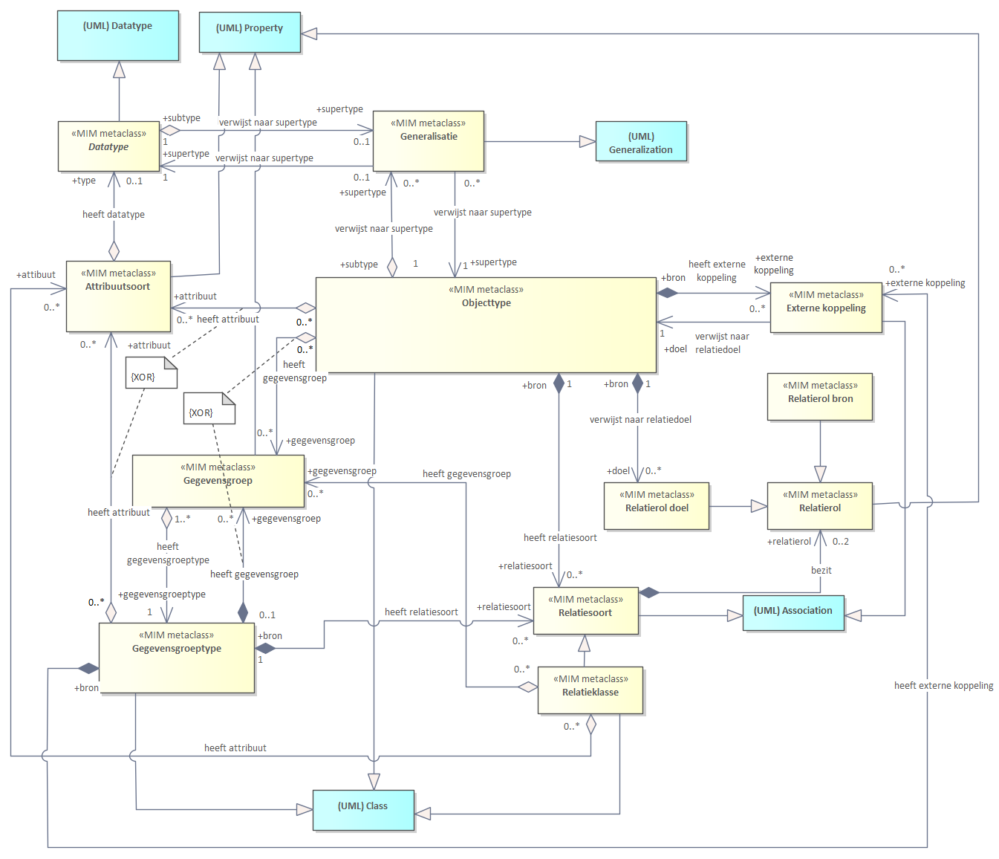
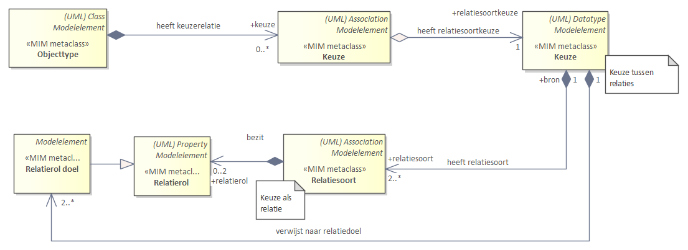

# Metamodel in UML

Dit hoofdstuk beschrijft hoe je met de modelelementen uit het hoofdstuk [Metamodel Algemeen](#metamodel-algemeen) een informatiemodel maakt in UML.

## Structuur metamodel in UML

De eerste paragraaf bevat UML-diagrammen. Elk diagram toont een aantal modelelementen. Het geheel van diagrammen, in samenhang, is opgenomen in bijlage [[[#diagrammen]]]. Uitgangspunten voor het metamodel in UML zijn:

 - UML 2.5 als de basis voor de conceptuele beschrijving.
 - Gebruik maken van de bestaande UML-modelelementen conform UML van OMG. OMG noemt dit een UML metaclass. Een voorbeeld hiervan is UML-Class.
 - Daar waar (semantisch) nodig extensiemechanismen toepassen met
  behoud van de betekenis van de UML-metaklassen. Het modelelement is dan een MIM-metaklasse. Hoe deze zich verhouden tot UML is weergegeven in bijlage [[[#diagrammen]]].
 - Eén stereotype per modelelement hanteren.
 - Twee verschillende stereotypen hebben nooit dezelfde betekenis. 
 - Stereotypes worden toegepast als er een verbijzondering van een UML-constructie nodig is met behoud van de betekenis van de UML-metaklasse.
 - Elk modelelement heeft een MIM metaclass. Deze wordt met UML in een
informatiemodel gemodelleerd als een extensie van een Metaclass van UML 2.5 en een bijbehorende
stereotype.

<aside class='example' title="Objecttype als UML-Class">
  

    Het MIM-modelelement <code>«Objecttype»</code> wordt gemodelleerd als een <code>UML-Class</code> met stereotype <code>«Objecttype»</code>. Niet alle MIM-metaklassen hebben een stereotype (nodig). In de kolom staat dan: <code>-</code>.
  

  <table>
    <tr>
      <th><strong>MIM metaclass</strong></th>
      <th><strong>Stereotype</strong></th>
      <th><strong>Metaclass UML 2.5</strong></th>
      <th><strong></strong></th>
      <th><strong>In EA</strong></th>
      <th><strong>In ...</strong></th>
    </tr>
    <tr>
      <td>Objecttype</td>
      <td>«Objecttype»</td>
      <td>(UML) Class</td>
      <td></td>
      <td>Class</td>
      <td></td>
    </tr>
  </table>
  

    De linker kolom bevat het MIM-modelelement, zoals bedoeld in [[[#metamodel-algemeen]]]. De 2e en 3e kolom bevatten de uitdrukking van het MIM in UML, versie 2.5. De 2e en 5e kolom bevatten de uitdrukking van het MIM in Sparx Enterprise Architect. Deze gebruikt Class (i.p.v. UML-Class). Deze UML tool is (uiteraard) geen onderdeel van de MIM-specificatie. Het is zeker niet verplicht om deze te gebruiken, u kunt uw eigen tool gebruiken. Deze kolom staat erbij om illustratief aan te geven dat het soms nodig kan zijn om, afhankelijk van de tool, net iets specifieker aan te geven hoe het MIM in de tool exact uitgedrukt wordt. In de 6e kolom is ruimte gereserveerd om gebruik van een andere tool te duiden.
  

</aside>

Bijna alle modelelementen hebben een UML-metaclass (UML 2.5) als basis. In de navolgende diagrammen heeft een UML-metaclass een lichtblauwe kleur. Dit is ook opgenomen in diagramvorm. Een overzicht van de diagrammen met metadata is beschikbaar in bijlage [[[#diagrammen]]].

### Kern

<figure id="KernZonderMetagegevens">
  
  <figcaption>Diagram: Kern zonder metagegevens</figcaption>
</figure>

Kern zonder Metagegevens

| **MIM metaclass** | **Stereotype**      | **Metaclass UML 2.5**            |      | **In EA**        | **In ...** |
| ----------------- | ------------------- | -------------------------------- | ---- | ---------------- | ---------- |
| Objecttype        | «Objecttype»        | (UML) Class                      |      | Class            |            |
| Attribuutsoort    | «Attribuutsoort»    | (UML) Property                   |      | Attribute        |            |
| Gegevensgroep     | «Gegevensgroep»     | (UML) Property                   |      | Attribute        |            |
| Gegevensgroeptype | «Gegevensgroeptype» | (UML) Class                      |      | Class            |            |
| Generalisatie     | «Generalisatie»     | (UML) Generalization             |      | Generalization   |            |
| Relatiesoort      | «Relatiesoort»      | (UML) Association                |      | Association      |            |
| Relatieklasse     | «Relatieklasse»     | (UML) Association én (UML) Class |      | Associationclass |            |

<aside class="note" title="Stereotype «Datatype» afwezig in UML">
  
Ook <code>Datatype</code> behoort ook tot de kern en is zoals aangegeven in het diagram bedoeld als een abstract modelelement. Er bestaat in de UML-uitwerking geen stereotype <code>«Datatype»</code>, daarom is het modelelement <code>Datatype</code> niet opgenomen in de tabel. <code>Datatype</code> is in de volgende paragraaf concreet uitgewerkt in verschillende verschijningsvormen met elk een eigen stereotype.

</aside> 

### Datatypen

<figure id="DatatypenZonderMetagegevens">
  
  <figcaption>Diagram: Datatypen zonder metagegevens</figcaption>
</figure>

Datatypen zonder Metagegevens

_Datatypen_

| **MIM metaclass**       | **Stereotype**          | **Metaclass UML 2.5**    |      | **In EA**          | **In ...** |
| ----------------------- | ----------------------- | ------------------------ | ---- | ------------------ | ---------- |
| Primitief datatype      | «Primitief datatype»    | (UML) Primitive Type     |      | Datatype           |            |
| Gestructureerd datatype | «Gestructuurd datatype» | (UML) Datatype           |      | Datatype           |            |
| Data-element            | «Data-element»          | (UML) Property           |      | Attribute          |            |
| Enumeratie              | \-                      | (UML) Enumeration        |      | Enumeration        |            |
| Enumeratiewaarde        | \-                      | (UML) EnumerationLiteral |      | EnumerationLiteral |            |
| Referentielijst         | «Referentielijst»       | (UML) Datatype           |      | Datatype           |            |
| Referentie-element      | «Referentie-element»    | (UML) Property           |      | Attribute          |            |
| Codelijst               | «Codelijst»             | (UML) Datatype           |      | Datatype           |            |

### Overige

#### Constraint

<figure id="ConstraintsZonderMetagegevens">
  
  <figcaption>Diagram: Constraint zonder metagegevens</figcaption>
</figure>

_Constraint_

| **MIM metaclass** | **Stereotype** | **Metaclass UML 2.5** |      | **In EA**  | **In ...** |
| ----------------- | -------------- | --------------------- | ---- | ---------- | ---------- |
| Constraint        | \-             | (UML) Constraint      |      | Constraint |            |

#### Keuze

Er zijn vijf situaties waarin een keuze toegepast wordt: 

- Use case 1: een keuze tussen datatypen
- Use case 2: een keuze tussen twee of meer attribuutsoorten
- Use case 3: een keuze tussen meerdere manieren om één betekenisvol attribuutsoort in te vullen
- Use case 4: een keuze tussen relatiedoelen, als nadere invulling van één betekenisvolle relatiesoort
- Use case 5: een keuze tussen relatiesoorten/relatierollen (elk afzonderlijk betekenisvol)

Voor elke toepassing geldt een aparte subset van het metamodel. De keuzeconstructie maakt een keuze mogelijk tussen meerdere datatypen, attribuutsoorten en relatiedoelen. In UML behouden we dezelfde modellering: een datatype blijft dus een datatype, een attribuutsoort een attribuutsoort en een relatiesoort een relatiesoort. De UML-elementen die het stereotype keuze krijgen zijn zelf geen datatype, attribuutsoort of relatiedoel. Merk op dat de diagrammen op metamodelniveau zijn gemodelleerd. Hoe dit op informatiemodelniveau uitpakt is onder het diagram beschreven in tekst. 

**Use case 1: Keuze tussen datatypen**

Dit UML is uitgewerkt voor Objecttype. Voor Gegevensgroeptype en Relatieklasse geldt hetzelfde patroon.

<figure id="KeuzeDatatype1UML">
  
  <figcaption>Diagram: Keuze tussen datatypen met UML</figcaption>
</figure>

Modellering van deze Keuze in een informatiemodel: 
- Modelleer een _UML-Datatype_ met stereotype _keuze_. 
- Modelleer hierin 2 of meer MIM-Datatypen: neem hiervoor eerst een _UML-attribute_ met stereotype _keuze_ op in de Keuze zoals gemodelleerd in punt 1, dit UML-attribute krijgt als typering het gewenste (MIM) Datatype. Merk op dat dit extra UML-attribute is zelf geen keuze mogelijkheid is, de keuze is immers tussen de datatypen. 

Gebruik de Keuze voor een (MIM) Attrituutsoort: 
- Kies een _MIM-Attribuutsoort_ en koppel de hiervoor gemodelleerde Keuze hieraan via een typering, zoals gebruikelijk. 

**Use case 2: Keuze tussen 2 of meer attribuutsoorten**

Dit UML is uitgewerkt voor Objecttype. Voor Gegevensgroeptype en Relatieklasse geldt hetzelfde patroon.

<figure id="KeuzeAttribuutsoort2UML">
  
  <figcaption>Diagram: Keuze tussen twee of meer attribuutsoorten</figcaption>
</figure>

Modellering van deze Keuze in een informatiemodel: 
- Modelleer in UML een _UML-Class_ met stereotype _keuze_. 
- Modelleer hierin 2 of meer MIM-Attribuutsoorten: elk (MIM) Attribuutsoort wordt gemodelleerd zoals gebruikelijk, door een _UML-Property_ (attribute) met stereotype _attribuutsoort_ (en deze UML-Property (attribute) heeft zelf weer als typering een MIM-Datatype). 

Gebruik de Keuze voor het (MIM) Objecttype of het (MIM) Gegevensgroeptype: 
- Modelleer in een (MIM) Objecttype of in een (MIM) Gegevensgroeptype een _UML-Property (attribute) met stereotype _keuze_ en koppel de hiervoor gemodelleerde Keuze hieraan, via een typering, zoals gebruikelijk. Aan dit stereotype _keuze_ is te zien dat deze _UML-Property_ zelf **geen** (MIM) Attribuutsoort is van het objecttype. Immers, alleen de met stereotype Attribuutsoort aangeduide UML-properties (attributes) zijn een (MIM) Attribuutsoort.  

Er is hier voor de aankoppeling gekozen voor een UML-Attribute en niet voor een UML-Association in navolging van de modellering van de gegevensgroep en het gegevensgroeptype. 

**Use case 3: Keuze tussen meerdere manieren om 1 betekenisvol attribuutsoort in te vullen**

Dit UML is uitgewerkt voor Objecttype. Voor Gegevensgroeptype en Relatieklasse geldt hetzelfde patroon.

<figure id="KeuzeAttribuutsoort3UML">
  
  <figcaption>Diagram: Keuze tussen meerdere manieren om één betekenisvol attribuutsoort in te vullen</figcaption>
</figure>

Modellering van deze Keuze in een informatiemodel: 
- Modelleer in UML een _UML-Class_ met stereotype _keuze_. 
- Modelleer hierin twee of meer keuze mogelijkheden door voor elke keuze mogelijkheid een UML-Property (attribute) te modelleren met stereotype _keuze_ (en deze UML-Property heeft als datatype een MIM-Datatype). Aan dit stereotype _keuze_ is te zien dat deze _UML-Property (attribute)_ zelf **geen** (MIM) Attribuutsoort is van het objecttype. Immers, alleen een met stereotype Attribuutsoort aangeduid UML-attribute is een (MIM) Attribuutsoort. 

Gebruik de Keuze voor de (MIM) Attribuutsoort: 
- Modelleer in een (MIM) Objecttype of in een (MIM) Gegevensgroeptype een MIM-Attribuutsoort zoals gebruikelijk, en koppel de hiervoor gemodelleerde Keuze hieraan, via een typering, zoals gebruikelijk.  

**Use case 4: Keuze tussen relatiedoelen, als nadere invulling van 1 betekenisvolle relatiesoort**

Dit UML is uitgewerkt voor Objecttype. Voor Gegevensgroeptype geldt hetzelfde patroon, behalve dat een Gegevensgroeptype geen doel mag zijn van een Relatiesoort.

<figure id="KeuzeRelatiedoel4UML">
  
  <figcaption>Diagram: Keuze tussen relatiedoelen, als nadere invulling van één betekenisvolle relatiesoort</figcaption>
</figure>

Modellering van deze Keuze in een informatiemodel: 
- Modelleer in UML een _UML-Class_ met stereotype _Keuze_. 
- Modelleer hierin 2 of meer uitgaande _UML-Association_ met stereotype _Keuze_ die elk een (MIM) Objecttype als relatiedoel hebben. Aan dit stereotype _Keuze_ is te zien dat deze _UML-Association_ zelf **geen** relatiesoort of externe koppeling is.

Gebruik de Keuze voor het (MIM) Objecttype of het (MIM) Gegevensgroeptype: 
- Modelleer in een (MIM) Objecttype of in een (MIM) Gegevensgroeptype een (MIM) Relatiesoort of (MIM) Externe koppeling. Deze worden gemodelleerd zoals gebruikelijk.

**Use case 5: Keuze tussen relatiesoorten/relatierollen (elk afzonderlijk betekenisvol)**

Dit UML is uitgewerkt voor Objecttype. Voor Gegevensgroeptype geldt hetzelfde patroon, behalve dat een Gegevensgroeptype geen doel mag zijn van een Relatiesoort.

<figure id="KeuzeRelatiedoel5UML">
  
  <figcaption>Diagram: Keuze tussen relatiedoelen, als nadere invulling van één betekenisvolle relatiesoort</figcaption>
</figure>

Modellering van deze Keuze in een informatiemodel: 
- Modelleer in UML een _UML-Class_ met stereotype _keuze_. 
- Modelleer hierin 2 of meer MIM-Relatiesoorten die elk een relatiedoel hebben. Elke (MIM) Relatiesoort wordt gemodelleerd zoals gebruikelijk, door een _UML-Property_ (association) met stereotype _relatiesoort_ of _externe koppeling_ en met een relatiedoel (een relatierol aan de doel/target kan van de relatie).  

Gebruik de Keuze voor het (MIM) Objecttype of het (MIM) Gegevensgroeptype: 
- Modelleer in een (MIM) Objecttype of in een (MIM) Gegevensgroeptype een _UML-Association_ met stereotype _keuze_ en koppel de hiervoor gemodelleerde Keuze hieraan, als target van de UML-association, zoals gebruikelijk. Aan dit stereotype _keuze_ is te zien dat deze _UML-Association_ zelf **geen** relatiesoort of externe koppeling is.

**De modellering van een Keuze in UML**

Er zijn drie metaklassen met de naam Keuze maar elke keer als extensie van een andere UML metaklasse, waar ook uit blijkt om welke variant van de keuze het gaat. 

| **MIM metaclass** | **Stereotype** | **Metaclass UML 2.5** |      | **In EA**    | **In ...** |
| ----------------- | -------------- | --------------------- | ---- | ------------ | ---------- |
| Keuze             | Keuze          | (UML) Class           |      | Class        |            |
| Keuze             | Keuze          | (UML) Datatype        |      | Datatype     |            |
| Keuze             | Keuze          | (UML) Property        |      | Attribute    |            |

- Als een UML Class met stereotype keuze is gebruikt, dan zitten hierin alleen attribuutsoorten en/of relatiedoelen, de attribuutsoorten en relatiedoelen waaruit gekozen kan worden. 
- Als een UML Datatype met stereotype keuze is gebruikt, dan zitten hierin alleen datatypen, de datatypen waaruit gekozen kan worden. 
- Als een UML Property met stereotype keuze is gebruikt, dan is er sprake van een hulpconstructie om het modelelement Keuze aan te koppelen aan het MIM-modelelement waarvoor de keuze geldt.

Merk op dat deze tabel niet gaat over de modelelementen waaruit een keuze gemaakt moet worden. Dat zijn immers de modelelementen datatype, attribuutsoort en relatiesoort. Deze tabel gaat over de modellering van Keuze in UML oftewel de extra hulpconstructies die in UML nodig zijn om de modelelementen waaruit een keuze gemaakt moet worden aan te koppelen aan het MIM-modelelement waarvoor de keuze geldt. Deze extra hulpconstructies krijgen als stereotype _keuze_ en dit geeft aan dat de betekenis hiervan anders is dan de betekenis van de MIM-elementen datatype, attribuutsoort en relatiesoort. 

#### Relatierol

<figure id="AssociatierollenZonderMetagegevens">
  
  <figcaption>Diagram: Associatierollen zonder metagegevens</figcaption>
</figure>

_Relatiesoort en relatierol_

| **MIM metaclass**     | **Stereotype** | **Metaclass UML 2.5** |      | **In EA**      | **In ...** |
| --------------------- | -------------- | --------------------- | ---- | -------------- | ---------- |
| Relatierol (abstract) | «Relatierol»   | Property              |      | AssociationEnd |            |
| Relatierol source     | «Relatierol»   | Property              |      | AssociationEnd |            |
| Relatierol target     | «Relatierol»   | Property              |      | AssociationEnd |            |

#### Externe koppeling

_Externe koppeling_

| **MIM metaclass** | **Stereotype**      | **Metaclass UML 2.5** |      | **In EA**   | **In ...** |
| ----------------- | ------------------- | --------------------- | ---- | ----------- | ---------- |
| Externe koppeling | «Externe koppeling» | (UML) Association     |      | Association |            |

#### Packages

<figure id="PackagesZonderMetagegevens">
  
  <figcaption>Diagram: Packages zonder metagegevens</figcaption>
</figure>

_Packages_

| **MIM metaclass**     | **Stereotype**    | **Metaclass UML 2.5** |      | **In EA** | **In ...** |
| --------------------- | ----------------- | --------------------- | ---- | --------- | ---------- |
| Informatiemodel       | «Informatiemodel» | (UML) Package         |      | Package   |            |
| Domein (het eigen IM) | «Domein»          | (UML) Package         |      | Package   |            |
| Extern                | «Extern»          | (UML) Package         |      | Package   |            |
| View                  | «View»            | (UML) Package         |      | Package   |            |

## Specificatie metagegevens in UML

Deze paragraaf is een aanvulling op [[[#specificatie-metagegevens]]]. In de hierna volgende paragrafen worden de metagegevens per modelelement gespecificeerd in tabellen. Per metagegeven zijn de volgende onderdelen gespecificeerd:

 - **Aspect**: Het benoemde metagegeven. De aanduiding `√ `betekent: conform stelselafspraken voor basisregistraties. Een `*` betekent: conform de stelselcatalogus. Zie ook de paragraaf in H3 hierover. 
 - **Kardinaliteit**: Aantal maal dat een metagegeven opgenomen kan worden bij dit modelelement.
 - **Toelichting**: Nadere uitleg over het metagegeven.
 - **In UML 2.5**: De naam waarmee het metagegeven in UML 2.5 is benoemd. Het betreft veelal overerving van een metagegeven van een UML metaclass die niet in dit document is benoemd.
 - **In EA**: Aanduiding hoe het metagegeven in Sparx Enterprise Architect (EA) is aangegeven.

Rode tekst betreft een standaardelement binnen EA. Zwarte tekst in de kolom betreft een uitbreiding op het UM-metamodel, via _tagged values_ of aanvullende stereotypes.

<aside class="note" title="Nadere toelichting op het metagegeven Alias">
  

    De `Alias` is te specificeren voor `NamedElements` (zoals `UML-Class`, `UML-association`, `UML-Datatype` en `UML-property`). De `Alias` is in UML gespecificeerd bij de metaclass `Element Import`. Dit wordt in UML ingezet voor het importeren van een `NamedElement` uit een ander package. In dit metamodel wordt de `Alias` (nog) niet zo gebruikt. In Enterprise Architect is de alternatieve weergave aan te zetten in de <i>properties</i> van een <i>Diagram</i>, via: `use alias if available`. Voor de definitie van en algemene toelichting op `Alias`, zie: [[[#metagegeven-alias]]].
  

</aside>

<aside class="note" title="Nadere toelichting op het metagegeven Identficerend">
  

    Als een attribuutsoort identificerend is, dan krijgt dit kenmerk in UML `isId = true`. Als een <code>«<a>Relatiesoort</a>»</code> identificerend is, dan krijgt dit kenmerk in UML een stereotype `«id»`. Voor de definitie van en algemene toelichting op `Identificerend`, zie: [[[#metagegeven-identificerend]]].
  

</aside>

### Objecten en attributen in UML

#### «Objecttype»

De objecttypen worden naar de volgende aspecten gespecificeerd:

| **Aspect**                       | **Kardinaliteit** | **Toelichting**                | **In UML 2.5**                        |    | **In EA**      | **In ...** |
| -------------------------------- | -------- | ---------------------------------------- | ------------------------------------- | -- | -------------- | -------- |
| **Modelelementidentificatie**                           | 1         | Identificerend metagegeven. |                                       |    |  *Tagged value* |     |
| **Naam√**            | 1            | Algemeen metagegeven. | *name van de metaclass Named element* |    | *Name*         |     |
| **Alias**            | 0..1         | Algemeen metagegeven. | *UML-Property*                        |    | *Alias*        |     |
| **Herkomst**         | 1            | Algemeen metagegeven. |                                       |    | *tagged value* |     |
| **Is gedefinieerd in** | 1       | Algemeen metagegeven. |                                       |    | *Tagged value* |     |
| **Begrip**           | 0..\*        | Algemeen metagegeven. |                                       |    | *Tagged value* |     |
| **Definitie√**       | 1            | Algemeen metagegeven. | *Body van de metaclass Comment*       |    | *Notes*        |     |
| **Herkomst definitie√** | 1         | Algemeen metagegeven. |                                       |    | *Tagged value* |     |
| **Toelichting√**     | 0..1         | Algemeen metagegeven. |                                       |    | *Tagged value* |     |
| **Datum opname**     | 1            | Algemeen metagegeven. |                                       |    | *Tagged value* |     |
| **Unieke aanduiding√**  | 1         | De identificerende kenmerken een object die een instantie van het objecttype uniek identificeren. Deze kenmerken worden in UML gemodelleerd als attribuutsoort en/of relatie dus dit metagegeven hoeft niet apart te worden gespecificeerd bij een objecttype, het is afleidbaar. Voor objecttypen die deel uitmaken van een (basis)registratie of informatiemodel betreft dit de wijze waarop daarin voorkomende objecten (van dit type) uniek in de registratie worden aangeduid. | UML isID                                      |      | *isId bij attribuutsoort, --- of --- stereotype «isId» bij target role relatiesoort --- of --- een combinatie van deze twee, elk hiervan meer keren toepasbaar* |            |
| **Populatie√**                | 0..1               | Voor objecttypen die deel uitmaken van een (basis)registratie betreft dit de beschrijving van de exemplaren van het gedefinieerde objecttype die in de desbetreffende (basis)­registratie voorhanden zijn. |                                          |      | *Tagged value*                                               |            |
| **Kwaliteit√**                | 0..1               | Beschrijving van de mate waarin in de registratie opgenomen objecten van het desbetreffende type volledig, juist, actueel, nauwkeurig en betrouwbaar zijn. |                                          |      | *Tagged value*                                               |            |
| **Indicatie abstract object** | 1                  | Conceptueel model: indicatie dat het objecttype een generalisatie is, waarvan een object als specialisatie altijd voorkomt in de hoedanigheid van een (en slechts één) van de specialisaties van het betreffende objecttype. Logisch model: Indicatie dat er geen instanties (objecten) voor het betreffende objecttype mogen voorkomen. | *isAbstract bij de metaclass Classifier* |     | *Abstract*                                                   |            |
| heeft **attribuut** /         | 0..*       | Binding aan een attribuutsoort.                | *owned element* = UML-property     |    | *attribute*          |     |
| heeft **gegevensgroep**       | 0..*       | Binding aan een gegevensgroep.                 | *owned element* = UML-property     |    | *attribute*          |     |
| heeft **relatiesoort**        | 0..*       | Binding aan een relatiesoort of relatieklasse. | *owned element* = UML-Relationship |    | *association*        |     |
| heeft **externe koppeling**   | 0..*    | Binding aan een externe koppeling.             | *owned element* = UML-Relationship |    | *association*        |     |
| verwijst naar **supertype** * | 0..*    | Binding aan een generalisatie (naar een ander objecttype).                 | *owned element* = UML-Relationship |    | *association*        |     |
| heeft **Constraint** | 0..* | Binding aan een constraint. |   | | *Constraint* | | 

#### «Attribuutsoort»

De attribuutsoorten worden naar de volgende aspecten gespecificeerd:

| **Aspect**                       | **Kardinaliteit** | **Toelichting**                | **In UML 2.5**                        |    | **In EA**      | **In ...** |
| -------------------------------- | -------- | ---------------------------------------- | ------------------------------------- | -- | -------------- | -------- |
| **Modelelementidentificatie**                           | 1         | Identificerend metagegeven. |                                       |    |  *Tagged value* |     |
| **Naam√**            | 1            | Algemeen metagegeven. | *name van de metaclass Named element* |    | *Name*         |     |
| **Alias**            | 0..1         | Algemeen metagegeven. | *UML-Property*                        |    | *Alias*        |     |
| **Herkomst**         | 1            | Algemeen metagegeven. |                                       |    | *tagged value* |     |
| **Is gedefinieerd in** | 1       | Algemeen metagegeven. |                                       |    | *Tagged value* |     |
| **Begrip**           | 0..\*        | Algemeen metagegeven. |                                       |    | *Tagged value* |     |
| **Definitie√**       | 1            | Algemeen metagegeven. | *Body van de metaclass Comment*       |    | *Notes*        |     |
| **Herkomst definitie√** | 1         | Algemeen metagegeven. |                                       |    | *Tagged value* |     |
| **Toelichting√**     | 0..1         | Algemeen metagegeven. |                                       |    | *Tagged value* |     |
| **Datum opname**     | 1            | Algemeen metagegeven. |                                       |    | *Tagged value* |     |
| **Domein** *(aspecten van een waarde/data)* |                    | *Domein is zelf geen metadata aspect. Onder het kopje ‘domein’ vallen een aantal metadata aspecten die gelden voor een waarde, oftewel de eisen waaraan een waarde van een attribuutsoort moet voldoen.* |                                                              |      |                |            |
| **- Lengte**                                | 0..1               | Algemeen metagegeven.                                        |                                                              |      | *Tagged value* |            |
| **- Patroon**                               | 0..1               | Algemeen metagegeven.                                        |                                                              |      | *Tagged value* |            |
| **- Formeel Patroon**                       | 0..1               | Algemeen metagegeven.                                        |                                                              |      | *Tagged value* |            |
| **Heeft tijdlijn geldigheid √**          | 1                  | Algemeen metagegeven.                                        |                                                              |      | *Tagged value* |            |
| **Indicatie materiële historie √**          | 1                  | Algemeen metagegeven.                                        |                                                              |      | *Tagged value* |            |
| **Heeft tijdlijn registratie √**          | 1                  | Algemeen metagegeven.                                        |                                                              |      | *Tagged value* |            |
| **Indicatie formele historie √**            | 1                  | Algemeen metagegeven.                                        |                                                              |      | *Tagged value* |            |
| **Kardinaliteit √**                         | 1                  | Algemeen metagegeven.                                        | *lowerValue en upperValue van de metaclass Multiplicity Element* |      | *Multiplicity* |            |
| **Authentiek √**                            | 1                  | Algemeen metagegeven.                                        |                                                              |      | *Tagged value* |            |
| **Indicatie afleidbaar**                    | 1                  | Algemeen metagegeven.                                        | *isDerived bij metaclass Property*                           |      | *isDerived* |            |
| **Indicatie classificerend**                | 1                  | Algemeen metagegeven.                                        |                           |      | *Tagged value*    |            |
| **Mogelijk geen waarde**                    | 1                  | Algemeen metagegeven.                                        |                                                              |      | *Tagged value* |            |
| **Identificerend**                          | 0..1               | Algemeen metagegeven.                                        | *isID bij de metaclass Property*                             |      | *isID*         |            |
| **Minimumwaarde inclusief** | 0..1          | Algemeen metagegeven. Een attribuutsoort mag of een metagegeven **Minimumwaarde inclusief** of **Minimumwaarde exclusief** hebben, niet beide. | |  | _Tagged value_ |            |
| **Minimumwaarde exclusief** | 0..1          | Algemeen metagegeven. Een attribuutsoort mag of een metagegeven **Minimumwaarde inclusief** of **Minimumwaarde exclusief** hebben, niet beide. | |  | _Tagged value_ |            |
| **Maximumwaarde inclusief** | 0..1          | Algemeen metagegeven. Een attribuutsoort mag of een metagegeven **Maximumwaarde inclusief** of **Maximumwaarde exclusief** hebben, niet beide. | |  | _Tagged value_ |            |
| **Maximumwaarde exclusief** | 0..1          | Algemeen metagegeven. Een attribuutsoort mag of een metagegeven **Maximumwaarde inclusief** of **Maximumwaarde exclusief** hebben, niet beide. | |  | _Tagged value_ |            |
| **Eenheid**  |0..1      | Toevoegen als het attribuutsoort een waarde betreft en de eenheid als metagegeven opgenomen moet worden.    | |    | *Tagged value*          |     |
| heeft **datatype**  | 1       | Binding aan een datatype.     | *datatype* = UML-datatype |    | *type* = datatype          |     |
| heeft **Constraint** | 0..* | Binding aan een constraint. |   | | *Constraint* | | 

#### «Gegevensgroep»

De gegevensgroepen worden naar de volgende aspecten gespecificeerd:

| **Aspect**                  | **Kardinaliteit** | **Toelichting**                | **In UML 2.5**                        |    | **In EA**      | **In ...** |
| -------------------------------- | -------- | ---------------------------------------- | ------------------------------------- | -- | -------------- | -------- |
| **Modelelementidentificatie**                           | 1         | Identificerend metagegeven. |                                       |    |  *Tagged value* |     |
| **Naam**             | 1            | Algemeen metagegeven. | *name van de metaclass Named element* |    | *Name*         |     |
| **Alias**            | 0..1         | Algemeen metagegeven. | *UML-Property*                        |    | *Alias*        |     |
| **Herkomst**         | 0..1         | Algemeen metagegeven. |                                       |    | *tagged value* |     |
| **Is gedefinieerd in** | 1       | Algemeen metagegeven. |                                       |    | *Tagged value* |     |
| **Begrip**           | 0..\*        | Algemeen metagegeven. |                                       |    | *Tagged value* |     |
| **Definitie**        | 1            | Algemeen metagegeven. | *Body van de metaclass Comment*       |    | *Notes*        |     |
| **Herkomst definitie** | 1          | Algemeen metagegeven. |                                       |    | *Tagged value* |     |
| **Toelichting√**     | 0..1         | Algemeen metagegeven. |                                       |    | *Tagged value* |     |
| **Datum opname**     | 1            | Algemeen metagegeven. |                                       |    | *Tagged value* |     |
| **Kardinaliteit**    | 1            | Algemeen metagegeven. | *lowerValue en upperValue van de metaclass Multiplicity Element* |      | *Multiplicity van de source role van de bijbehorende composite relatie* |            |
| **Authentiek**       | 1            | Algemeen metagegeven. |                                       |    | *Tagged value* |     |
| heeft **gegevensgroeptype**   | 1   | Binding aan een gegevensgroeptype. | *owned element* = UML-Class | | *type* = Class |     |
| heeft **Constraint** | 0..* | Binding aan een constraint. |   | | *Constraint* | | 

Alleen toevoegen als het attribuutsoort een waarde van een meting of waarnemimg betreft en de eenheid als metagegeven opgenomen moet worden.

| **Aspect**                       | **Kardinaliteit** | **Toelichting**                | **In UML 2.5**                        |    | **In EA**      | **In ...** |
| -------------------------------- | -------- | ---------------------------------------- | ------------------------------------- | -- | -------------- | -------- |
| **Eenheid**  |0..1      | Alleen opnemen bij een meetgegeven of waarneming     | |    | *Tagged value*          |     |

#### «Gegevensgroeptype»

De gegevensgroeptypen worden naar de volgende aspecten gespecificeerd:

| **Aspect**                        | **Kardinaliteit**  | **Toelichting**                                                    | **In UML 2.5**                                                  |     | **In EA**      | **In ...** |
| --------------------------------- | ------------------ | ------------------------------------------------------------------ | --------------------------------------------------------------- | --- | -------------- | ---------- |
| **Modelelementidentificatie**                           | 1               | Identificerend metagegeven.                                        |                                                                 |     |  *Tagged value* |            |
| **Naam**                          | 1                  | Algemeen metagegeven.                                              | *name van de metaclass Named element*                           |     | *Name*         |            |
| **Alias**                         | 0..1               | Algemeen metagegeven.                                              | *UML-Property*                                                  |     | *Alias*        |            |
| **Herkomst**                      | 1                  | Algemeen metagegeven.                                              |                                                                 |     | *tagged value* |            |
| **Is gedefinieerd in** | 1               | Algemeen metagegeven. |                                       |    | *Tagged value* |     |
| **Begrip**                        | 0..\*              | Algemeen metagegeven.                                              |                                                                 |     | *Tagged value* |            |
| **Definitie**                     | 1                  | Algemeen metagegeven.                                              | *Body van de metaclass Comment*                                 |     | *Notes*        |            |
| **Herkomst definitie**            | 1                  | Algemeen metagegeven.                                              |                                                                 |     | *Tagged value* |            |
| **Toelichting√**                  | 0..1               | Algemeen metagegeven.                                              |                                                                 |     | *Tagged value* |            |
| **Datum opname**                  | 1                  | Algemeen metagegeven.                                              |                                                                 |     | *Tagged value* |            |
| **Kardinaliteit**                 | 1                  | Algemeen metagegeven.                                              | *lowerValue en upperValue van metaclass Multiplicity Element*   |     | *Multiplicity van de source role van de bijbehorende composite relatie* |            |
| **Authentiek**                    | 1                  | Algemeen metagegeven.                                              |                                                                 |     | *Tagged value* |            |
| heeft **gegevensgroeptype**       | 1                  | Binding aan een gegevensgroeptype.                                 | *owned element* = UML-Class                                     |     | *type* = Class |            |
| heeft **attribuut**               | 0..*               | Binding aan een attribuutsoort.                                    | *owned element* = UML-property                                  |     | *attribute*    |            |
| heeft **gegevensgroep**           | 0..*               | Binding aan een gegevensgroep.                                     | *owned element* = UML-property                                  |     | *attribute*    |            |
| heeft **relatiesoort**            | 0..*               | Binding aan een relatiesoort of relatieklasse.                     | *owned element* = UML-Relationship                              |     | *association*  |            |
| heeft **externe koppeling**       | 0..*               | Binding aan een externe koppeling.                                 | *owned element* = UML-Relationship                              |     | *association*  |            |
| verwijst naar **supertype**       | 0..*               | Binding aan een generalisatie (naar een ander gegevensgroeptype).  | *owned element* = UML-Relationship                              |     | *association*  |            |
| heeft **Constraint** | 0..* | Binding aan een constraint. |   | | *Constraint* | | 

### Relaties in UML

<aside class="note" title="Aanvullen met uitleg Generalisatie">
  
Deze paragraaf bevat de specificaties van <code>«Relatiesoort»</code>, <code>«Relatierol»</code>, <code>«Relatieklasse»</code> en <code>«Generalisatie»</code>, maar onderstaande alinea's vertellen enkel iets over alternatieven met betrekking tot <code>«Relatiesoort»</code> en <code>«Relatierol»</code>. Je verwacht hier ook iets van uitleg over de toepassing van andere stereotypen (of een verwijzing ernaar).
  

</aside> 

Het metamodel heeft twee manieren om een relatie tussen twee objecttypen te
beschrijven. Deze keuze wordt aangegeven in de eigen extensie, zoals beschreven
in [[[#alternatieven]]]. Alleen het gekozen alternatief is relevant voor de modellering in uw informatiemodel. Welke alternatief je ook kiest: beide hanteren <code>«Relatiesoort»</code> en <code>«Relatierol»</code>, maar met andere regels voor gebruik.

**Alternatief 1: Relatiesoort is leidend**

Relatiesoort is verplicht, met een naam en met een definitie en deze is leidend.
Metadata aspecten worden hierbij altijd vastgelegd. Het gebruik van relatierol
is optioneel (zowel bij source en target). Áls er een relatierol target wordt
vastgelegd, dan is de metadata hierbij wel verplicht.

**Alternatief 2: Relatierol is leidend**

Verplichte benoeming van de rol van de target in een relatie met de bijbehoren
de metagegevens en optioneel de benoeming van de naam van de relatie.

#### «Relatiesoort» (alt 1: soort leidend)

De relatiesoorten worden naar de volgende aspecten gespecificeerd.

| **Aspect**                  | **Kardinaliteit** | **Toelichting**                | **In UML 2.5**                        |    | **In EA**      | **In ...** |
| -------------------------------- | -------- | ---------------------------------------- | ------------------------------------- | -- | -------------- | -------- |
| **Modelelementidentificatie**                           | 1         | Identificerend metagegeven.  |                                      |    |  *Tagged value* |     |
| **Naam√**             | 1            | Algemeen metagegeven. | *name van de metaclass Named element* |    | *Name*         |     |
| **Alias**            | 0..1         | Algemeen metagegeven. | *UML-Property*                        |    | *Alias*        |     |
| **Herkomst**         | 1            | Algemeen metagegeven. |                                       |    | *tagged value* |     |
| **Is gedefinieerd in** | 1       | Algemeen metagegeven. |                                       |    | *Tagged value* |     |
| **Begrip**           | 0..\*        | Algemeen metagegeven. |                                       |    | *Tagged value* |     |
| **Definitie√**       | 1            | Algemeen metagegeven. | *Body van de metaclass Comment*       |    | *Notes*        |     |
| **Herkomst definitie√** | 1         | Algemeen metagegeven. |                                       |    | *Tagged value* |     |
| **Toelichting√**     | 0..1         | Algemeen metagegeven. |                                       |    | *Tagged value* |     |
| **Datum opname**     | 1            | Algemeen metagegeven. |                                       |    | *Tagged value* |     |
| **Identificerend**   | 0..1         | Algemeen metagegeven. | *isID bij de metaclass Property*      |    | *isID*         |     |
| **Unidirectioneel**               | 1                  | Algemeen metagegeven. |                                                              |      | *Direction van de betreffende assiciation (van source naar target)* |            |
| **Relatie eigenaar**              | 1                  | Algemeen metagegeven. | */source: related Element bij Relationship Element*          |      | *Source*                                                     |            |
| **Relatie doel**                  | 1                  | Algemeen metagegeven. | */target: related Element bij Relationship Element*          |      | *Target*                                                     |            |
| **Aggregatietype**                | 1                  | Algemeen metagegeven. | *AggregationKind bij metaclass Property*                     |      | *Aggregation van de source role met waarde composite of shared* |            |
| **Kardinaliteit√**                | 1                  | Algemeen metagegeven. | *lowerValue en upperValue van de metaclass MultiplicityElement* /target |      | *Multiplicity van de target role*                            |            |
| **Kardinaliteit relatie bron**  | 1                  | Algemeen metagegeven. | *lowerValue en upperValue van de metaclass MultiplicityElement* /source |      | *Multiplicity van de source role*                            |            |
| **Heeft tijdlijn geldigheid √**          | 1                  | Algemeen metagegeven.                                        |                                                              |      | *Tagged value* |            |
| **Indicatie materiële historie √**          | 1                  | Algemeen metagegeven.                                        |                                                              |      | *Tagged value* |            |
| **Heeft tijdlijn registratie √**          | 1                  | Algemeen metagegeven.                                        |                                                              |      | *Tagged value* |            |
| **Indicatie formele historie √**            | 1                  | Algemeen metagegeven.                                        |                                                              |      | *Tagged value* |            |
| **Authentiek√**                   | 1                  | Algemeen metagegeven. |                                                              |      | *Tagged value*                                               |            |
| **Indicatie afleidbaar**          | 1                  | Algemeen metagegeven. | *isDerived bij UML metaclass Assocation*                     |      | *isDerived*                                                  |            |
| **Mogelijk geen waarde**          | 1                  | Algemeen metagegeven. |                                                              |      | *Tagged value*                                               |            |
| verwijst naar **relatiedoel**   | 0..*  | Binding aan een objecttype. | */target: related Element bij Relationship Element* = UML-Class |    | *association target* = Class       |     |
| heeft **Constraint** | 0..* | Binding aan een constraint. |   | | *Constraint* | | 

#### «Relatiesoort» (alt 2: rol leidend)

De relatiesoorten worden naar de volgende aspecten gespecificeerd.

| **Aspect**                  | **Kardinaliteit** | **Toelichting**                | **In UML 2.5**                        |    | **In EA**      | **In ...** |
| -------------------------------- | -------- | ---------------------------------------- | ------------------------------------- | -- | -------------- | -------- |
| **Modelelementidentificatie**                           | 1         | Identificerend metagegeven. |                                       |    |  *Tagged value* |     |
| **Naam**             | 1            | Algemeen metagegeven. | *name van de metaclass Named element* |    | *Name*         |     |
| **Alias**            | 0..1         | Algemeen metagegeven. | *UML-Property*                        |    | *Alias*        |     |
| **Herkomst**         | 1            | Algemeen metagegeven. |                                       |    | *tagged value* |     |
| **Is gedefinieerd in** | 1       | Algemeen metagegeven. |                                       |    | *Tagged value* |     |
| **Begrip**           | 0..\*        | Algemeen metagegeven. |                                       |    | *Tagged value* |     |
| **Definitie**        | 1            | Algemeen metagegeven. | *Body van de metaclass Comment*       |    | *Notes*        |     |
| **Herkomst definitie** | 1          | Algemeen metagegeven. |                                       |    | *Tagged value* |     |
| **Toelichting**      | 0..1         | Algemeen metagegeven. |                                       |    | *Tagged value* |     |
| **Datum opname**     | 1            | Algemeen metagegeven. |                                       |    | *Tagged value* |     |
| verwijst naar **relatiedoel** | 0..*  | Binding aan een objecttype. | */target: related Element bij Relationship Element* = UML-Class |    | *association target* = Class       |     |
| heeft **Constraint** | 0..* | Binding aan een constraint. |   | | *Constraint* | | 

#### «Relatierol» (alt 1: soort leidend)

Voor relatierollen worden naar de volgende aspecten gespecificeerd.

| **Aspect**                  | **Kardinaliteit** | **Toelichting**                | **In UML 2.5**                        |    | **In EA**      | **In ...** |
| -------------------------------- | -------- | ---------------------------------------- | ------------------------------------- | -- | -------------- | -------- |
| **Modelelementidentificatie**                           | 1         | Identificerend metagegeven. |                                       |    |  *Tagged value* |     |
| **Naam**             | 1            | Algemeen metagegeven. De default naam is gelijk aan de naam van het doel-objecttype. | *name van de metaclass Named element* |    | *Name*         |     |
| **Alias**            | 0..1         | Algemeen metagegeven. | *UML-Property*                        |    | *Alias*        |     |
| **Herkomst**         | 1            | Algemeen metagegeven. |                                       |    | *tagged value* |     |
| **Is gedefinieerd in** | 1       | Algemeen metagegeven. |                                       |    | *Tagged value* |     |
| **Begrip**           | 0..\*        | Algemeen metagegeven. |                                       |    | *Tagged value* |     |
| **Definitie**        | 1            | Algemeen metagegeven. | *Body van de metaclass Comment*       |    | *Notes*        |     |
| **Herkomst definitie** | 1          | Algemeen metagegeven. |                                       |    | *Tagged value* |     |
| **Toelichting**      | 0..1         | Algemeen metagegeven. |                                       |    | *Tagged value* |     |
| **Datum opname**     | 1            | Algemeen metagegeven. |                                       |    | *Tagged value* |     |
| heeft **Constraint** | 0..* | Binding aan een constraint. |   | | *Constraint* | | 

#### «Relatierol» (alt 2: rol leidend)

Voor relatierol worden bij de target rol van een relatiesoort de volgende
aspecten gespecificeerd.

| **Aspect**                  | **Kardinaliteit** | **Toelichting**                | **In UML 2.5**                        |    | **In EA**      | **In ...** |
| -------------------------------- | -------- | ---------------------------------------- | ------------------------------------- | -- | -------------- | -------- |
| **Modelelementidentificatie**                           | 1         | Identificerend metagegeven. |                                       |    |  *Tagged value* |     |
| **Naam√**            | 1            | Algemeen metagegeven.  De default naam is gelijk aan de naam van het doel-objecttype. | *name van de metaclass Named element* |    | *Name*         |     |
| **Alias**            | 0..1         | Algemeen metagegeven. | *UML-Property*                        |    | *Alias*        |     |
| **Herkomst**         | 1            | Algemeen metagegeven. |                                       |    | *tagged value* |     |
| **Is gedefinieerd in** | 1       | Algemeen metagegeven. |                                       |    | *Tagged value* |     |
| **Begrip**           | 0..\*        | Algemeen metagegeven. |                                       |    | *Tagged value* |     |
| **Definitie√**       | 1            | Algemeen metagegeven. | *Body van de metaclass Comment*       |    | *Notes*        |     |
| **Herkomst definitie√** | 1         | Algemeen metagegeven. |                                       |    | *Tagged value* |     |
| **Toelichting√**     | 0..1         | Algemeen metagegeven. |                                       |    | *Tagged value* |     |
| **Datum opname**     | 1            | Algemeen metagegeven. |                                       |    | *Tagged value* |     |
| **Identificerend**   | 0..1         | Algemeen metagegeven. | *isID bij de metaclass Property*      |    | *isID*         |     |
| **Kardinaliteit√**   | 1            | Algemeen metagegeven. | *lowerValue en upperValue van de metaclass Multiplicity Element* |      | *Multiplicity* |            |
| **Kardinaliteit relatie bron** | 1 | Algemeen metagegeven. | *lowerValue en upperValue van de metaclass MultiplicityElement*  |      | *Multiplicity* | | 
| **Heeft tijdlijn geldigheid √**          | 1                  | Algemeen metagegeven.                                        |                                                              |      | *Tagged value* |            |
| **Indicatie materiële historie √**          | 1                  | Algemeen metagegeven.                                        |                                                              |      | *Tagged value* |            |
| **Heeft tijdlijn registratie √**          | 1                  | Algemeen metagegeven.                                        |                                                              |      | *Tagged value* |            |
| **Indicatie formele historie √**            | 1                  | Algemeen metagegeven.                                        |                                                              |      | *Tagged value* |            |
| **Authentiek√ \***                | 1                  | Algemeen metagegeven. |                                                              |      | *Tagged value* |            |
| **Mogelijk geen waarde**          | 1                  | Algemeen metagegeven. |                                                              |      | *Tagged value* |            |
| heeft **Constraint** | 0..* | Binding aan een constraint. |   | | *Constraint* | | 

#### «Generalisatie» tussen objecttypes

De generalisaties worden naar het volgende aspect gespecificeerd:

| **Aspect**                  | **Kardinaliteit** | **Toelichting**                | **In UML 2.5**                        |    | **In EA**      | **In ...** |
| -------------------------------- | -------- | ---------------------------------------- | ------------------------------------- | -- | -------------- | -------- |
| **Subtype**   | 1                  | De generalisatie relatie kent twee kanten, de bron kant (source) van de relatie en de doel kant (target) van de relatie. De bron kant van deze generalisatie relatie specificeert een _objecttype_ die een subtype/specialisatie is van het via deze generalisatie relatie aangegeven supertype (zie verwijst naar supertype). Kortweg, het subtype is een specialisatie van het supertype. Het objecttype dat het subtype is van deze generalisatie is verbonden met deze generalisatie. | */source: related Element bij Relationship Element* |      | *Source*  |            |
| verwijst naar **supertype**  | 1    | Binding van deze generalisatie aan een objecttype. De generalisatie relatie kent twee kanten, de bron kant (source) van de relatie en de doel kant (target) van de relatie. De doel kant van deze generalisatie relatie specificeert een _objecttype_ die het supertype/de generalisatie is van het via deze generalisatie aangegeven subtype. Kortweg, het supertype is een generalisatie van het subtype. | */target: related Element bij Relationship Element* = UML-Class |      | *Target*  |                 |
| **Datum opname** | 1               | Algemeen metagegeven                                         |                     |      | *Tagged value* |            |
| heeft **Constraint** | 0..* | Binding aan een constraint. |   | | *Constraint* | | 
| **Mixin** | 0..1               | Alleen bij MIM niveau 3, logische modellen                                         |                     |      | *Tagged value* |            |

#### «Generalisatie» tussen datatypen

De generalisaties worden naar het volgende aspect gespecificeerd:

| **Aspect**                  | **Kardinaliteit** | **Toelichting**                | **In UML 2.5**                        |    | **In EA**      | **In ...** |
| -------------------------------- | -------- | ---------------------------------------- | ------------------------------------- | -- | -------------- | -------- |
| **Subtype**   | 1                  | De generalisatie relatie kent twee kanten, de bron kant (source) van de relatie en de doel kant (target) van de relatie. De bron kant van deze generalisatie relatie specificeert een _datatype_ die een subtype/specialisatie is van het via deze generalisatie relatie aangegeven supertype (zie verwijst naar supertype). Kortweg, het subtype is een specialisatie van het supertype. Het datatype dat het subtype is van deze generalisatie is verbonden met deze generalisatie. 
 | */source: related Element bij Relationship Element* |      |      | *Source*  |            |
| verwijst naar **supertype**  | 1    | Binding van deze generalisatie aan een datatype. De generalisatie relatie kent twee kanten, de bron kant (source) van de relatie en de doel kant (target) van de relatie. De doel kant van deze generalisatie relatie specificeert een _datatype_ die het supertype/de generalisatie is van het via deze generalisatie aangegeven subtype. Kortweg, het supertype is een generalisatie van het subtype. | */target: related Element bij Relationship Element* = UML-datatype |      |      | *Target*  |                 |
| **Datum opname** | 1               | Algemeen metagegeven                                         |                     |      | *Tagged value* |            |
| heeft **Constraint** | 0..* | Binding aan een constraint. |   | | *Constraint* | | 

#### «Relatieklasse»

De relatieklassen worden naar de volgende aspecten gespecificeerd:

| **Aspect**                        | **Kardinaliteit** | **Toelichting**                  | **In UML 2.5**                        |    | **In EA**      | **In ...** |
| --------------------------------- | ----------------- | -------------------------------- | ------------------------------------- | -- | -------------- | ---------- |
| **Modelelementidentificatie**                           | 1              | Identificerend metagegeven.      |                                       |    |  *Tagged value* |            |
| **Naam√**                         | 1                 | Algemeen metagegeven.            | *name van de metaclass Named element* |    | *Name*         |            |
| **Alias**                         | 0..1              | Algemeen metagegeven.            | *UML-Property*                        |    | *Alias*        |            |
| **Herkomst**                      | 1                 | Algemeen metagegeven.            |                                       |    | *tagged value* |            |
| **Is gedefinieerd in** | 1              | Algemeen metagegeven.            |                                       |    | *Tagged value* |            |
| **Begrip**                        | 0..\*             | Algemeen metagegeven.            |                                       |    | *Tagged value* |            |
| **Definitie√**                    | 1                 | Algemeen metagegeven.            | *Body van de metaclass Comment*       |    | *Notes*        |            |
| **Toelichting√**                  | 0..1              | Algemeen metagegeven.            |                                       |    | *Tagged value* |            |
| **Datum opname**                  | 1                 | Algemeen metagegeven.            |                                       |    | *Tagged value* |            |
| **Herkomst definitie√**           | 1                 | Algemeen metagegeven.            |                                       |    | *Tagged value* |            |
| **Unidirectioneel**               | 1                 | Algemeen metagegeven.            |                                                              |      | *Direction van de betreffende assiciation (van source naar target)* ||
| **Relatie eigenaar**              | 1                 | Algemeen metagegeven.            | */source: related Element bij Relationship Element*          |      | *Source*                                                     ||
| **Relatie doel**                  | 1                 | Algemeen metagegeven.            | */target: related Element bij Relationship Element*          |      | *Target*                                                     ||
| **Aggregatietype**                | 1                 | Algemeen metagegeven.            | *AggregationKind bij metaclass Property*                     |      | *Aggregation van de source role met waarde composite of shared* ||
| **Kardinaliteit√**                | 1                 | Algemeen metagegeven.            | *lowerValue en upperValue van de metaclass MultiplicityElement* |      | *Multiplicity van de target role*                            ||
| **Kardinaliteit relatie bron**    | 1                 | Algemeen metagegeven.            | *lowerValue en upperValue van de metaclass MultiplicityElement* /source |      | *Multiplicity van de source role*                            ||
| **Indicatie materiële historie√** | 1                 | Algemeen metagegeven.            |                                                              |      | *Tagged value*                                               ||
| **Indicatie formele historie√**   | 1                 | Algemeen metagegeven.            |                                                              |      | *Tagged value*                                               ||
| **Authentiek√**                   | 1                 | Algemeen metagegeven.            |                                                              |      | *Tagged value*                                               ||
| **Indicatie afleidbaar**          | 1                 | Algemeen metagegeven.            | *isDerived bij UML metaclass Assocation*                     |      | *isDerived*                                                  ||
| **Mogelijk geen waarde**          | 1                 | Algemeen metagegeven.            |                                                              |      | *Tagged value*                                               ||
| **heeft attribuut**               | 0..*              | Binding aan een attribuutsoort.  | *owned element* = UML-property     |    | *attribute*           |     |
| **verwijst naar relatiedoel**     | 0..*              | Binding aan een objecttype.      | */target: related Element bij Relationship Element* = UML-Class |    | *association target* = Class       ||
| **heeft gegegevensgroep**         | 0..*              | Binding aan gegevensgroep.       | *owned element* = UML-property|                                 | *attribute*    ||
| heeft **Constraint** | 0..* | Binding aan een constraint. |   | | *Constraint* | | 

#### «Externe koppeling»

Externe koppelingen worden naar de volgende aspecten gespecificeerd.

| **Aspect**                  | **Kardinaliteit** | **Toelichting**                | **In UML 2.5**                        |    | **In EA**      | **In ...** |
| -------------------------------- | -------- | ---------------------------------------- | ------------------------------------- | -- | -------------- | -------- |
| **Modelelementidentificatie**                           | 1         | Identificerend metagegeven. |                                       |    |  *Tagged value* |     |
| **Naam√**             | 1            | Algemeen metagegeven. | *name van de metaclass Named element* |    | *Name*         |     |
| **Alias**            | 0..1         | Algemeen metagegeven. | *UML-Property*                        |    | *Alias*        |     |
| **Herkomst**         | 1            | Algemeen metagegeven. |                                       |    | *tagged value* |     |
| **Is gedefinieerd in** | 1       | Algemeen metagegeven. |                                       |    | *Tagged value* |     |
| **Begrip**           | 0..\*        | Algemeen metagegeven. |                                       |    | *Tagged value* |     |
| **Definitie√**       | 1            | Algemeen metagegeven. | *Body van de metaclass Comment*       |    | *Notes*        |     |
| **Herkomst definitie√** | 1         | Algemeen metagegeven. |                                       |    | *Tagged value* |     |
| **Toelichting√**      | 0..1         | Algemeen metagegeven. |                                       |    | *Tagged value* |     |
| **Datum opname**     | 1            | Algemeen metagegeven. |                                       |    | *Tagged value* |     |
| **Unidirectioneel**               | 1                  | Algemeen metagegeven. |                                                              |      | *Direction van de betreffende assiciation (van source naar target)* |            |
| **Relatie eigenaar**              | 1                  | Algemeen metagegeven. | */source: related Element bij Relationship Element*          |      | *Source*                                                     |            |
| **Relatie doel**                  | 1                  | Algemeen metagegeven. | */target: related Element bij Relationship Element*          |      | *Target*                                                     |            |
| **Aggregatietype**                | 1                  | Algemeen metagegeven. | *AggregationKind bij metaclass Property*                     |      | *Aggregation van de source role met waarde composite of shared* |            |
| **Kardinaliteit√**                | 1                  | Algemeen metagegeven. | *lowerValue en upperValue van de metaclass MultiplicityElement* |      | *Multiplicity van de target role*                            |            |
| **Kardinaliteit relatie bron**  | 1                  | Algemeen metagegeven. | *lowerValue en upperValue van de metaclass MultiplicityElement* /source |      | *Multiplicity van de source role*                            |            |
| **Indicatie materiële historie√** | 1                  | Algemeen metagegeven. |                                                              |      | *Tagged value*                                               |            |
| **Indicatie formele historie√**   | 1                  | Algemeen metagegeven. |                                                              |      | *Tagged value*                                               |            |
| **Authentiek√**                   | 1                  | Algemeen metagegeven. |                                                              |      | *Tagged value*                                               |            |
| **Indicatie afleidbaar**          | 1                  | Algemeen metagegeven. | *isDerived bij UML metaclass Assocation*                     |      | *isDerived*                                                  |            |
| **Mogelijk geen waarde**          | 1                  | Algemeen metagegeven. |                                                              |      | *Tagged value*                                               |            |
| verwijst naar **relatiedoel**     | 0..*       | Binding aan een objecttype. | */target: related Element bij Relationship Element* = UML-Class |    | *association target* = Class       |     |
| heeft **Constraint** | 0..* | Binding aan een constraint. |   | | *Constraint* | | 

### Waardelijsten in UML

#### «Codelijst»

Voor codelijst worden de volgende aspecten gespecificeerd:

| **Aspect**                  | **Kardinaliteit** | **Toelichting**                | **In UML 2.5**                        |    | **In EA**      | **In ...** |
| -------------------------------- | -------- | ---------------------------------------- | ------------------------------------- | -- | -------------- | -------- |
| **Modelelementidentificatie**                           | 1               | Identificerend metagegeven.    |                |      |  *Tagged value* |            |
| **Naam**         | 1                  | Algemeen metagegeven. *De naam van de lijst zoals gespecificeerd in de catalogus van de desbetreffende registratie dan wel, indien het een door de eigen organisatie toegevoegde lijst betreft, de door de eigen organisatie vastgestelde naam.* | *name van de metaclass Named element* |      | *Name*         |      |
| **Alias**        | 0..1               | Algemeen metagegeven.    | *UML-Property* |      | *Alias*        |            |
| **Herkomst**     | 1                  | Algemeen metagegeven.    |                |      | *tagged value* |            |
| **Is gedefinieerd in** | 1         | Algemeen metagegeven.    |                |      | *Tagged value* |            |
| **Begrip**       | 0..\*              | Algemeen metagegeven.    |                |      | *Tagged value* |            |
| **Definitie**    | 1                  | Algemeen metagegeven.    | *Body van de metaclass Comment*  |  | *Notes*    |  |
| **Herkomst definitie**  | 1        | Algemeen metagegeven.    |                |      | *Tagged value* |            |
| **Toelichting**  | 0..1               | Algemeen metagegeven.    |                |      | *tagged value* |            |
| **Datum opname** | 1                  | Algemeen metagegeven.    |                |      | *tagged value* |            |
| **Locatie**      | 1..1               | Algemeen metagegeven.    |                |      | *tagged value* |            |
| **Doelformaat**  | 1..1               | Algemeen metagegeven.    |                |      | *tagged value* |            |
| **Datatype**     | 1..1               | Algemeen metagegeven.    |                |      | *tagged value* |            |
| **Waarde-item**  | 0..1               | Algemeen metagegeven.    |                |      | *tagged value* |            |
| **Profielspecificatie**      | 0..1               | Algemeen metagegeven.    |                |      | *tagged value* |            |
| heeft **Constraint** | 0..* | Binding aan een constraint. |   | | *Constraint* | | 

#### «Enumeratie»

Enumeraties betreffen de metaclass `Enumeration` en worden naar de volgende
aspecten gespecificeerd:

| **Aspect**                  | **Kardinaliteit** | **Toelichting**                | **In UML 2.5**                        |    | **In EA**      | **In ...** |
| -------------------------------- | -------- | ---------------------------------------- | ------------------------------------- | -- | -------------- | -------- |
| **Modelelementidentificatie**                           | 1       | Identificerend metagegeven.    |                                       |      |  *Tagged value* | |
| **Naam**         | 1          | Algemeen metagegeven.    | *name van de metaclass Named element* |      | *Name*         | |
| **Alias**        | 0..1       | Algemeen metagegeven.    | *UML-Property*                        |      | *Alias*        | |
| **Herkomst**     | 1          | Algemeen metagegeven.    |                                       |      | *tagged value* | |
| **Is gedefinieerd in** | 1 | Algemeen metagegeven.    |                                       |      | *Tagged value* | |
| **Begrip**       | 0..\*      | Algemeen metagegeven.    |                                       |      | *Tagged value* | |
| **Definitie**    | 1          | Algemeen metagegeven.    | *Body van de metaclass Comment*       |      | *Notes*        | |
| **Herkomst definitie** | 1    | Algemeen metagegeven.    |                                       |      | *Tagged value* | |
| **Toelichting**  | 0..1       | Algemeen metagegeven.    |                                       |      | *tagged value* | |
| **Datum opname** | 1          | Algemeen metagegeven.    |                                       |      | *tagged value* | |
| bevat **enumeratiewaarde** | 1..* | Binding van een enumeratiewaarde. | *owned element* = UML-EnumerationLiteral |    | *association*        |     |
| heeft **Constraint** | 0..* | Binding aan een constraint. |   | | *Constraint* | | 

#### «Enumeratiewaarde»

De enumeratiewaarde zelf betreft de metaclass `UML-EnumerationLiteral` en kent de volgende aspecten:

| **Aspect**                  | **Kardinaliteit** | **Toelichting**                | **In UML 2.5**                        |    | **In EA**      | **In ...** |
| -------------------------------- | -------- | ---------------------------------------- | ------------------------------------- | -- | -------------- | -------- |
| **Modelelementidentificatie**                           | 1       | Identificerend metagegeven.    |                                       | |  *Tagged value* |     |
| **Naam**         | 1          | Algemeen metagegeven.    | *name van de metaclass Named element* | | *Name*  | |
| **Code**      | 0..1          | De in een registratie of informatiemodel aan de enumeratiewaarde toegekend unieke code (niet te verwarren met alias, zoals bedoeld in 2.8.2). | *Alias van de metaclass Element Import* |      | *Alias*   |            |
| **Herkomst**     | 0..1       | Algemeen metagegeven.    |                |      | *tagged value* |            |
| **Is gedefinieerd in** | 1 | Algemeen metagegeven.    |                |      | *Tagged value* |            |
| **Begrip**       | 0..\*      | Algemeen metagegeven.    |                |      | *Tagged value* |            |
| **Definitie**    | 0..1       | Algemeen metagegeven.    | *Body van de metaclass Comment*  |  | *Notes*    |  |
| **Herkomst definitie** | 0..1 | Algemeen metagegeven.    |                |      | *Tagged value* |            |
| **Toelichting**  | 0..1       | Algemeen metagegeven.    |                |      | *tagged value* |            |
| **Datum opname** | 1          | Algemeen metagegeven.    |                |      | *tagged value* |            |
| heeft **Constraint** | 0..* | Binding aan een constraint. |   | | *Constraint* | | 

#### «Referentielijst»

Voor referentielijsten worden de volgende aspecten gespecificeerd:

| **Aspect**                  | **Kardinaliteit** | **Toelichting**                | **In UML 2.5**                        |    | **In EA**      | **In ...** |
| -------------------------------- | -------- | ---------------------------------------- | ------------------------------------- | -- | -------------- | -------- |
| **Modelelementidentificatie**                           | 1         | Identificerend metagegeven. |                                       |    |  *Tagged value* |     |
| **Naam**             | 1            | Algemeen metagegeven. | *name van de metaclass Named element* |    | *Name*         |     |
| **Alias**            | 0..1         | Algemeen metagegeven. | *UML-Property*                        |    | *Alias*        |     |
| **Herkomst**         | 1            | Algemeen metagegeven. |                                       |    | *tagged value* |     |
| **Is gedefinieerd in** | 1       | Algemeen metagegeven. |                                       |    | *Tagged value* |     |
| **Begrip**           | 0..\*        | Algemeen metagegeven. |                                       |    | *Tagged value* |     |
| **Definitie**        | 1            | Algemeen metagegeven. | *Body van de metaclass Comment*       |    | *Notes*        |     |
| **Herkomst definitie**  | 1         | Algemeen metagegeven. |                                       |    | *Tagged value* |     |
| **Toelichting**      | 0..1         | Algemeen metagegeven. |                                       |    | *Tagged value* |     |
| **Datum opname**     | 1            | Algemeen metagegeven. |                                       |    | *Tagged value* |     |
| **Locatie**          | 1..1         | Algemeen metagegeven. |                                       |    | *Tagged value* |     |
| bevat **referentie-element** | 1..* | Binding aan een referentie-element. | *owned element* = UML-property  | | *attribute*   | |
| verwijst naar **supertype**  | 0..* | Binding aan een generalisatie (naar een andere referentie lijst). | *owned element* = UML-Relationship |    | *association*   |   |
| heeft **Constraint** | 0..* | Binding aan een constraint. |   | | *Constraint* | | 

#### «Referentie-element»

De referentie-elementen worden naar de volgende aspecten gespecificeerd:

| **Aspect**                  | **Kardinaliteit** | **Toelichting**                | **In UML 2.5**                        |    | **In EA**      | **In ...** |
| -------------------------------- | -------- | ---------------------------------------- | ------------------------------------- | -- | -------------- | -------- |
| **Modelelementidentificatie**                           | 1         | Identificerend metagegeven. |                                       |    |  *Tagged value* |     |
| **Naam**             | 1            | Algemeen metagegeven. | *name van de metaclass Named element* |    | *Name*         |     |
| **Alias**            | 0..1         | Algemeen metagegeven. | *UML-Property*                        |    | *Alias*        |     |
| **Herkomst**         | 1            | Algemeen metagegeven. |                                       |    | *tagged value* |     |
| **Is gedefinieerd in** | 1       | Algemeen metagegeven. |                                       |    | *Tagged value* |     |
| **Begrip**           | 0..\*        | Algemeen metagegeven. |                                       |    | *Tagged value* |     |
| **Definitie**        | 1            | Algemeen metagegeven. | *Body van de metaclass Comment*       |    | *Notes*        |     |
| **Herkomst definitie**  | 1         | Algemeen metagegeven. |                                       |    | *Tagged value* |     |
| **Toelichting**      | 0..1         | Algemeen metagegeven. |                                       |    | *Tagged value* |     |
| **Datum opname**     | 1            | Algemeen metagegeven. |                                       |    | *Tagged value* |     |
| **Domein** *(aspecten van een waarde/data)* |     |            |                              |      |             |            |
| **- Lengte**                                | 0..1               | Algemeen metagegeven. |                                                              |      | *Tagged value*                       |            |
| **- Patroon**                               | 0..1               | Algemeen metagegeven. |                                                              |      | *Tagged value*                       |            |
| **- Formeel patroon**                       | 0..1               | Algemeen metagegeven. |                                                              |      | *Tagged value*                       |            |
| **Kardinaliteit**                           | 1                  | Algemeen metagegeven. | *lowerValue en upperValue van de metaclass Multiplicity Element* |      | *Multiplicity van de de target role* |            |
| **Identificerend**                          | 0..1               | Algemeen metagegeven. | *isID van de metaclass Property*                             |      | *isID bij de betreffende class*      |            |
| **Minimumwaarde inclusief** | 0..1          | Algemeen metagegeven. Een referentie-element mag of een metagegeven **Minimumwaarde inclusief** of **Minimumwaarde exclusief** hebben, niet beide. | |  | _Tagged value_ |            |
| **Minimumwaarde exclusief** | 0..1          | Algemeen metagegeven. Een referentie-element mag of een metagegeven **Minimumwaarde inclusief** of **Minimumwaarde exclusief** hebben, niet beide. | |  | _Tagged value_ |            |
| **Maximumwaarde inclusief** | 0..1          | Algemeen metagegeven. Een referentie-element mag of een metagegeven **Maximumwaarde inclusief** of **Maximumwaarde exclusief** hebben, niet beide. | |  | _Tagged value_ |            |
| **Maximumwaarde exclusief** | 0..1          | Algemeen metagegeven. Een referentie-element mag of een metagegeven **Maximumwaarde inclusief** of **Maximumwaarde exclusief** hebben, niet beide. | |  | _Tagged value_ |            |
| **Eenheid**  |0..1      | Toevoegen als het referentie-element een waarde betreft en de eenheid als metagegeven opgenomen moet worden.
| heeft **datatype**       | 1       | Binding aan een datatype.     | *datatype* = UML-datatype |    | *type* = datatype          |     |
| heeft **Constraint** | 0..* | Binding aan een constraint. |   | | *Constraint* | | 

### Datatypen in UML

Het betreft metagegevens voor in het informatiemodel gedefinieerde datatypen,
oftewel exclusief datatypen die al buiten het model bestaan, zoals Integer,
DateTime, Surface.

#### «Primitief datatype»

De datatypen worden naar de volgende aspecten gespecificeerd:

| **Aspect**                  | **Kardinaliteit** | **Toelichting**                | **In UML 2.5**                        |    | **In EA**      | **In ...** |
| -------------------------------- | -------- | ---------------------------------------- | ------------------------------------- | -- | -------------- | -------- |
| **Modelelementidentificatie**                           | 1       | Identificerend metagegeven.    |                |      |  *Tagged value* |            |
| **Naam**         | 1          | Algemeen metagegeven.    | *name van de metaclass Named element* | | *Name*  | |
| **Alias**        | 0..1       | Algemeen metagegeven.    | *UML-Property* |      | *Alias*        |            |
| **Herkomst**     | 0..1       | Algemeen metagegeven.    |                |      | *tagged value* |            |
| **Is gedefinieerd in** | 1 | Algemeen metagegeven.    |                |      | *Tagged value* |            |
| **Begrip**       | 0..\*      | Algemeen metagegeven.    |                |      | *Tagged value* |            |
| **Definitie**    | 0..1       | Algemeen metagegeven.    | *Body van de metaclass Comment*  |  | *Notes*    |  |
| **Herkomst definitie** | 0..1 | Algemeen metagegeven.    |                |      | *Tagged value* |            |
| **Toelichting**  | 0..1       | Algemeen metagegeven.    |                |      | *tagged value* |            |
| **Datum opname** | 1          | Algemeen metagegeven.    |                |      | *tagged value* |            |
| **Domein** *(aspecten van een waarde/data)* |    |       |                |      |                |            |
| **- Lengte**                                | 0..1               | Algemeen metagegeven, in principe wordt dit metagegeven bij het attribuutsoort gespecificeerd, behalve als het generiek gespecificeerd moet worden. |                                       |      | *Tagged value* |            |
| **- Patroon**                               | 0..1               | Algemeen metagegeven, in principe wordt dit metagegeven bij het attribuutsoort gespecificeerd, behalve als het generiek gespecificeerd moet worden. |                                       |      | *Tagged value* |            |
| **- Formeel patroon**                       | 0..1               | Algemeen metagegeven, in principe wordt dit metagegeven bij het attribuutsoort gespecificeerd, behalve als het generiek gespecificeerd moet worden. |                                       |      | *Tagged value* |            |
| heeft **Constraint** | 0..* | Binding aan een constraint. |   | | *Constraint* | | 

#### «Gestructureerd datatype»

Voor Gestructureerde datatypen worden de volgende aspecten gespecificeerd:

| **Aspect**                  | **Kardinaliteit** | **Toelichting**                | **In UML 2.5**                        |    | **In EA**      | **In ...** |
| -------------------------------- | -------- | ---------------------------------------- | ------------------------------------- | -- | -------------- | -------- |
| **Modelelementidentificatie**                           | 1          | Identificerend metagegeven.    |                |      |  *Tagged value* |            |
| **Naam**         | 1             | Algemeen metagegeven. *De naam van het domein package.* | *name van de metaclass Namedelement* |      | *Name*    |            |
| **Alias**        | 0..1          | Algemeen metagegeven.    | *UML-Property* |      | *Alias*        |            |
| **Herkomst**     | 0..1          | Algemeen metagegeven.    |                |      | *tagged value* |            |
| **Is gedefinieerd in** | 1    | Algemeen metagegeven.    |                |      | *Tagged value* |            |
| **Begrip**       | 0..\*         | Algemeen metagegeven.    |                |      | *Tagged value* |            |
| **Definitie**    | 0..1          | Algemeen metagegeven.    | *Body van de metaclass Comment*  |  | *Notes*    |  |
| **Herkomst definitie**  | 0..1   | Algemeen metagegeven.    |                |      | *Tagged value* |            |
| **Toelichting**  | 0..1          | Algemeen metagegeven.    |                |      | *tagged value* |            |
| **Datum opname** | 1             | Algemeen metagegeven.    |                |      | *tagged value* |            |
| **Patroon**      | 0..1          | Algemeen metagegeven.    |                |      | *Tagged value* |            |
| **Formeel patroon**      | 0..1  | Algemeen metagegeven.    |                |      | *Tagged value* |            |
| bevat **data-element**   | 0..*  | Binding aan een data-element, 2 of meer tenzij via generalisatie verkregen. | *owned element* = UML-property     |  | *attribute* |   |
| heeft **Constraint** | 0..* | Binding aan een constraint. |   | | *Constraint* | | 

#### «Data-element»

De data-elementen worden naar de volgende aspecten gespecificeerd:

| **Aspect**                  | **Kardinaliteit** | **Toelichting**                | **In UML 2.5**                        |    | **In EA**      | **In ...** |
| -------------------------------- | -------- | ---------------------------------------- | ------------------------------------- | -- | -------------- | -------- |
| **Modelelementidentificatie**                           | 1          | Identificerend metagegeven.    |                |      |  *Tagged value* |            |
| **Naam**         | 1             | Algemeen metagegeven. *De naam van het domein package.* | *name van de metaclass Namedelement* |      | *Name*    |            |
| **Alias**        | 0..1          | Algemeen metagegeven.    | *UML-Property* |      | *Alias*        |            |
| **Herkomst**     | 0..1          | Algemeen metagegeven.    |                |      | *tagged value* |            |
| **Is gedefinieerd in** | 1    | Algemeen metagegeven.    |                |      | *Tagged value* |            |
| **Begrip**       | 0..\*         | Algemeen metagegeven.    |                |      | *Tagged value* |            |
| **Definitie**    | 0..1          | Algemeen metagegeven.    | *Body van de metaclass Comment*  |  | *Notes*    |  |
| **Herkomst definitie**  | 0..1   | Algemeen metagegeven.    |                |      | *Tagged value* |            |
| **Toelichting**  | 0..1          | Algemeen metagegeven.    |                |      | *tagged value* |            |
| **Datum opname** | 1             | Algemeen metagegeven.    |                |      | *tagged value* |            |
| **Domein** *(aspecten van een waarde/data)* |         |     |                |      |                |            |
| **- Lengte**     | 0..1          | Algemeen metagegeven. |                                                                 |      | *Tagged value*    |     |
| **- Patroon**    | 0..1          | Algemeen metagegeven. |                                                                 |      | *Tagged value*    |     |
| **- Formeel patroon**  | 0..1    | Algemeen metagegeven. |                                                                 |      | *Tagged value*    |     |
| **Kardinaliteit**      | 1       | Algemeen metagegeven. | *lowerValue en upperValue van de metaclass MultiplicityElement* |      | *Multiplicity*    |     |
| **Minimumwaarde inclusief** | 0..1 | Algemeen metagegeven. Een data-element mag of een metagegeven **Minimumwaarde inclusief** of **Minimumwaarde exclusief** hebben, niet beide. | | | _Tagged value_ | |
| **Minimumwaarde exclusief** | 0..1 | Algemeen metagegeven. Een data-element mag of een metagegeven **Minimumwaarde inclusief** of **Minimumwaarde exclusief** hebben, niet beide. | | | _Tagged value_ | |
| **Maximumwaarde inclusief** | 0..1 | Algemeen metagegeven. Een data-element mag of een metagegeven **Maximumwaarde inclusief** of **Maximumwaarde exclusief** hebben, niet beide. | | | _Tagged value_ | |
| **Maximumwaarde exclusief** | 0..1 | Algemeen metagegeven. Een data-element mag of een metagegeven **Maximumwaarde inclusief** of **Maximumwaarde exclusief** hebben, niet beide. | | | _Tagged value_ | |
| heeft **datatype**     | 1       | Binding aan een datatype.  | *datatype* = UML-datatype       |      | *type* = datatype |     |
| heeft **Constraint** | 0..* | Binding aan een constraint. |   | | *Constraint* | | 

#### «Keuze»

Een Keuze worden naar de volgende aspecten gespecificeerd:

| **Aspect**                  | **Kardinaliteit** | **Toelichting**                | **In UML 2.5**                        |    | **In EA**      | **In ...** |
| -------------------------------- | -------- | ---------------------------------------- | ------------------------------------- | -- | -------------- | -------- |
| **Naam**         | 1             | Algemeen metagegeven. *De naam van het domein package.* | *name van de metaclass Namedelement* |      | *Name*    |            |
| **Alias**        | 0..1          | Algemeen metagegeven.    | *UML-Property* |      | *Alias*        |            |
| **Herkomst**     | 0..1          | Algemeen metagegeven.    |                |      | *tagged value* |            |
| **Is gedefinieerd in** | 1    | Algemeen metagegeven.    |                |      | *Tagged value* |            |
| **Begrip**       | 0..\*         | Algemeen metagegeven.    |                |      | *Tagged value* |            |
| **Definitie**    | 0..1          | Algemeen metagegeven.    | *Body van de metaclass Comment* |  | *Notes*   |    |
| **Herkomst definitie**  | 0..1   | Algemeen metagegeven.    |                |      | *Tagged value* |            |
| **Toelichting**  | 0..1          | Algemeen metagegeven.    |                |      | *tagged value* |            |
| **Datum opname** | 1             | Algemeen metagegeven.    |                |      | *tagged value* |            |
| **heeft datatypekeuze**   | 0..* | Binding van een datatype, in UML via een additionale UML-property met stereotype keuze | *owned element* = UML-property en deze heeft en *datatype*     |   | *attribute*          |     |
| heeft **attribuutkeuze**  | 0..* | Binding aan een attribuutsoort.  | *owned element* = UML-Property     |    | *attribute*          |     |
| heeft **relatiedoelkeuze**| 0..* | Binding aan een relatiesoort.    | *owned element* = UML-Relationship |    | *association*        |     |
| heeft **Constraint** | 0..* | Binding aan een constraint. |   | | *Constraint* | | 

*Opmerking: de modelelementen waaruit gekozen kan worden heten sinds MIM 1.1 geen keuze-elementen meer. Keuze-element is komen te vervallen.*

### Packages in UML

#### «Domein»

Domein packages worden naar de volgende aspecten gespecificeerd:

| **Aspect**                  | **Kardinaliteit** | **Toelichting**                | **In UML 2.5**                        |    | **In EA**      | **In ...** |
| -------------------------------- | -------- | ---------------------------------------- | ------------------------------------- | -- | -------------- | -------- |
| **Modelelementidentificatie**                           | 1          | Identificerend metagegeven.    |                |      |  *Tagged value* |            |
| **Naam**         | 1             | Algemeen metagegeven. *De naam van het domein package.* | *name van de metaclass Namedelement* |      | *Name*    |            |
| **Alias**        | 0..1          | Algemeen metagegeven.    | *UML-Property* |      | *Alias*        |            |
| **Herkomst**     | 1             | Algemeen metagegeven.    |                |      | *tagged value* |            |
| **Definitie**    | 1             | Algemeen metagegeven.    | *Body van de metaclass Comment* |  | *Notes*   |    |
| **Herkomst definitie**  | 1      | Algemeen metagegeven.    |                |      | *Tagged value* |            |
| **Toelichting**  | 0..1          | Algemeen metagegeven.    |                |      | *tagged value* |            |
| **Datum opname** | 1             | Algemeen metagegeven.    |                |      | *tagged value* |            |
| heeft **Constraint** | 0..* | Binding aan een constraint. |   | | *Constraint* | | 
| **Basis-URI**    | 0..1          | Algemeen metagegeven. *Het niet-unieke deel van de URI van ieder modelelement in deze package* |                |      | *Tagged value* |            |

#### «Extern»

Externe packages worden naar de volgende aspecten gespecificeerd:

| **Aspect**                  | **Kardinaliteit** | **Toelichting**                | **In UML 2.5**                        |    | **In EA**      | **In ...** |
| -------------------------------- | -------- | ---------------------------------------- | ------------------------------------- | -- | -------------- | -------- |
| **Modelelementidentificatie**                           | 1          | Identificerend metagegeven.    |                |      | *Tagged value* |            |
| **Naam**         | 1             | Algemeen metagegeven. *De naam van het domein package.* | *name van de metaclass Namedelement* |      | *Name*    |            |
| **Alias**        | 0..1          | Algemeen metagegeven.    | *UML-Property* |      | *Alias* |            |
| **Herkomst**     | 1             | Algemeen metagegeven.    | *Bij een view is de herkomst nooit de eigen organisatie.* |      | *tagged value* |            |
| **Definitie**    | 1             | Algemeen metagegeven.    | *Body van de metaclass Comment* |  | *Notes*   |    |
| **Herkomst definitie**  | 1      | Algemeen metagegeven.    |                |      | *Tagged value* |            |
| **Toelichting**  | 0..1          | Algemeen metagegeven.    |                |      | *tagged value* |            |
| **Datum opname** | 1             | Algemeen metagegeven.    |                |      | *tagged value* |            |
| **Locatie**      | 1             | Algemeen metagegeven.    |                |      | *Tagged value* |            |
| heeft **Constraint** | 0..* | Binding aan een constraint. |   | | *Constraint* | | 
| **Basis-URI**    | 0..1          | Algemeen metagegeven. *Het niet-unieke deel van de URI van ieder modelelement in deze package* |                |      | *Tagged value* |            |

#### «Informatiemodel»

Informatiemodel packages worden naar de volgende aspecten gespecificeerd:

| **Aspect**                  | **Kardinaliteit** | **Toelichting**                | **In UML 2.5**                        |    | **In EA**      | **In ...** |
| -------------------------------- | -------- | ---------------------------------------- | ------------------------------------- | -- | -------------- | -------- |
| **Modelelementidentificatie**                           | 1       | Identificerend metagegeven.    |                |      |  *Tagged value* |            |
| **Naam**         | 1          | Algemeen metagegeven.    | *name van de metaclass Named element* | | *Name*  | |
| **Alias**        | 0..1       | Algemeen metagegeven.    | *UML-Property* |      | *Alias*        |            |
| **Herkomst**     | 1          | Algemeen metagegeven.    |                |      | *tagged value* |            |
| **Definitie**    | 1          | Algemeen metagegeven.    | *Body van de metaclass Comment*  |  | *Notes*    |  |
| **Herkomst definitie**  | 1   | Algemeen metagegeven.    |                |      | *Tagged value* |            |
| **Toelichting**  | 0..1       | Algemeen metagegeven.    |                |      | *tagged value* |            |
| **Datum opname** | 1          | Algemeen metagegeven.    |                |      | *tagged value* |            |
| **Informatiemodeltype**   | 1                  | Algemeen metagegeven. *De beschrijving van de aard van het informatiemodel: conceptueel, logisch, technisch.* |                                      |      | *Tagged value* |            |
| **Informatiedomein**       | 1                  | Algemeen metagegeven. *Aanduiding van het functionele domein waartoe het informatiemodel behoort.* |                                      |      | *Tagged value* |            |
| **MIM versie**             | 1                  | *De versie van de MIM specificatie die gebruikt is om het informatiemodel in uit te drukken.* |                                      |      | *Tagged value* |            |
|                            |                    | *Bijvoorbeeld: 1.0.1 of 1.1*                                 |                                      |      |                |            |
| **MIM extensie**           | 0..1               | *De aanduiding van een extensie op MIM.*                     |                                      |      | *Tagged value* |            |
|                            |                    | *Bijvoorbeeld: Kadaster of NEN3610:2020*                     |                                      |      |                |            |
| **MIM taal**               | 0..1               | *De aanduiding van de taal die gebruikt is voor de modelelementen.*  *Bijvoorbeeld: EN of NL* |                                      |      | *Tagged value* |            |
| **Relatiemodelleringstype** | 1                  | Algemeen metagegeven.    Toelichting Type informatiemodel: zoals bedoeld in [[[#typering-van-modellen-gekoppeld-aan-beschouwingsniveaus]]]. Alle packages, oftewel «Domein» en «View», binnen het informatiemodel hebben hetzelfde type als het informatiemodel zelf. |                                      |      | *Tagged value* |            |
| **Tekstopmaak**               | 0..1               | *Geldt voor hele model, voor de metagegevens die beschreven zijn het het metagegeven tekstopmaak.*|                                      |      | *Tagged value* |            |
| heeft **Constraint** | 0..* | Binding aan een constraint. |   | | *Constraint* | | 
| **Basis-URI**    | 0..1    | Algemeen metagegeven. *Het niet-unieke deel van de URI van ieder modelelement in deze package* |                |      | *Tagged value* |            |                                      |      | *Tagged value* |            |

#### «View»

View packages worden naar de volgende aspecten gespecificeerd, analoog aan
«Extern»:

| **Aspect**                  | **Kardinaliteit** | **Toelichting**                | **In UML 2.5**                        |    | **In EA**      | **In ...** |
| -------------------------------- | -------- | ---------------------------------------- | ------------------------------------- | -- | -------------- | -------- |
| **Modelelementidentificatie**                           | 1          | Identificerend metagegeven.    |                |      |  *Tagged value* |            |
| **Naam**        | 1                  | Algemeen metagegeven. *Deze is, indien mogelijk, analoog aan de naamgeving in het externe schema waar de view over gaat, eventueel met een prefix.* | *name van de metaclass Named element* |      | *Name*         |            |
| **Alias**        | 0..1          | Algemeen metagegeven.    | *UML-Property* |      | *Alias*        |            |
| **Herkomst**     | 1             | Algemeen metagegeven.    |                |      | *tagged value* |            |
| **Definitie**    | 1             | Algemeen metagegeven.    | *Body van de metaclass Comment* |  | *Notes*   |    |
| **Herkomst definitie**  | 1      | Algemeen metagegeven.    |                |      | *Tagged value* |            |
| **Toelichting**  | 0..1          | Algemeen metagegeven.    |                |      | *tagged value* |            |
| **Datum opname** | 1             | Algemeen metagegeven.    |                |      | *tagged value* |            |
| **Locatie**      | 1             | Algemeen metagegeven.    |                |      | *Tagged value* |            |
| heeft **Constraint** | 0..* | Binding aan een constraint. |   | | *Constraint* | | 
| **Basis-URI**    | 0..1          | Algemeen metagegeven. *Het niet-unieke deel van de URI van ieder modelelement in deze package* |                |      | *Tagged value* |            |

### Overige modelelementen in UML

#### «Constraint»

<a>Constraint</a> betreft de metaclass UML Constraint en wordt naar de volgende
aspecten gespecificeerd:

| **Aspect**                                      | **Kardinaliteit** | **Toelichting**                                                                   | **In UML 2.5**                        |    | **In EA**                    | **In ...**  |
| ----------------------------------------------- | ----------------- | ----------------------------------------------------------------------------------| ------------------------------------- | -- | ---------------------------- | ----------- |
| **Naam√**                                       | 1                 | Algemeen metagegeven.                                                             | *name van de metaclass Named element* |    | *Name*                       |             |
| **Specificatie tekst**                          | 0..1              | De specificatie van de Constraint in normale tekst.                               |                                       |    | *Notes (type = invariant)*   |             |
| **Specificatie formeel**                        | 0..1              | De beschrijving van de Constraint in een formele specificatietaal, in OCL.        |                                       |    | *Notes (type =OCL)*          |             |
| van toepassing op **Objecttype**                | 0..1              | Binding aan een Objecttype                                                     |                                       |    |                              |             |
| van toepassing op **Attribuutsoort**            | 0..1              | Binding aan een Attribuutsoort                                                 |                                       |    |                              |             |
| van toepassing op **Gegevensgroep**             | 0..1              | Binding aan een Gegevensgroep                                                  |                                       |    |                              |             |
| van toepassing op **Gegevensgroeptype**         | 0..1              | Binding aan een Gegevensgroeptype                                              |                                       |    |                              |             |
| van toepassing op **Relatiesoort**              | 0..1              | Binding aan een Relatiesoort                                                   |                                       |    |                              |             |
| van toepassing op **Relatierol**                | 0..1              | Binding aan een Relatierol                                                     |                                       |    |                              |             |
| van toepassing op **Generalisatie**             | 0..1              | Binding aan een Generalisatie                                                  |                                       |    |                              |             |
| van toepassing op **Relatieklasse**             | 0..1              | Binding aan een Relatieklasse                                                  |                                       |    |                              |             |
| van toepassing op **Externe koppeling**         | 0..1              | Binding aan een Externe koppeling                                              |                                       |    |                              |             |
| van toepassing op **Codelijst**                 | 0..1              | Binding aan een Codelijst                                                      |                                       |    |                              |             | 
| van toepassing op **Enumeratie**                | 0..1              | Binding aan een Enumeratie                                                     |                                       |    |                              |             |
| van toepassing op **Enumeratiewaarde**          | 0..1              | Binding aan een Enumeratiewaarde                                               |                                       |    |                              |             |
| van toepassing op **Referentielijst**           | 0..1              | Binding aan een Referentielijst                                                |                                       |    |                              |             |
| van toepassing op **Referentie-element**        | 0..1              | Binding aan een Referentie-element                                             |                                       |    |                              |             |
| van toepassing op **Primitief datatype**        | 0..1              | Binding aan een Primitief datatype                                             |                                       |    |                              |             |
| van toepassing op **Gestructureerd datatype**   | 0..1              | Binding aan een Gestructureerd datatype                                        |                                       |    |                              |             |
| van toepassing op **Data-element**              | 0..1              | Binding aan een Data-element                                                   |                                       |    |                              |             |
| van toepassing op **Keuze**                     | 0..1              | Binding aan een Keuze                                                          |                                       |    |                              |             |
| van toepassing op **Domein**                    | 0..1              | Binding aan een Domein                                                         |                                       |    |                              |             |
| van toepassing op **Extern**                    | 0..1              | Binding aan een Extern                                                         |                                       |    |                              |             |
| van toepassing op **Informatiemodel**           | 0..1              | Binding aan een Informatiemodel                                                |                                       |    |                              |             |
| van toepassing op **View**                      | 0..1              | Binding aan een View                                                           |                                       |    |                              |             |

## UML Tooling

### MIM-toolbox 
Er is door de MIM-beheerder een metamodel *profiel* gemaakt in Sparx Enterprise Architect, dat gebruikt kan worden bij het modelleren van een informatiemodel. Dit profiel kan je inladen en daarna kan je kiezen uit de metamodelelementen. Het profiel is faciliterend en zorgt dat (de meeste) modelelementen van het informatiemodel automatisch voldoen aan dit metamodel. Dit profiel is te vinden op [MIM profiel - toolbox voor EA](https://register.geostandaarden.nl/informatiemodel/mim/).  

### Extensie op MIM-toolbox
Het is niet vereist om dit profiel te gebruiken. Bovendien is het ook mogelijk om het profiel uit te breiden, naar de behoefte van de eigen organisatie. Maar, het is niet toegestaan om het profiel te wijzigen; dan wordt niet meer aan MIM voldaan. De reden hiervoor is dat een dergelijk aanpassing niet beheerd kan worden door de MIM-beheerder en er ambiguïteit zal ontstaan bij de interpretatie van het model. Voor andere UML tools kan ook een MIM-profiel gemaakt worden. 

### Imvertor
Er is een tool *Imvertor*, waarmee je onder andere kunt controleren of een informatiemodel voldoet aan het MIM en zo niet, wat de reden daarvan is. Deze tool is open source en is te vinden op [www.imvertor.org](https://github.com/Imvertor/Imvertor-Maven).
