# HANDLEIDING MIM-PROFIEL, -TOOLBOX, -MDG GENEREREN

 - _Enterprise 15.2_
 - _SVN 1.14.1_
 - _GitHub_

## Inhoud
 1. Beschrijving doel etc.
 1. Benodigde bestanden
 1. Voorbereiding (todo)
 1. Aanpassingen (todo)
 1. Settings (versienummer, quick linker, etc.)
 1. Profielen genereren
 1. MDG genereren
 1. Resultaat controleren
 1. QuickLinker maken of bewerken (todo)

## Beschrijving
Deze handleiding beschrijft het proces voor het genereren van een customized toolbox voor modelleren met Enterprise Architect. Het gaat specifiek in op het maken van de _MIM-toolbox_. Maar ook voor het genereren customized toolboxen in het algemeen, biedt deze beschrijving een handig overzicht van de benodigde stappen. Een inhoudelijke beschrijving voor het maken van de benodigde profielen, vind je hier ([linkOpnemen](url)). De meest actuele versie van MIM kun je hier ([linkOpnemen](url)) raadplegen.

Er zijn drie stappen in het proces. Het kan zijn dat je 
 1. Voorbereiding
 1. Profiel publiceren
 1. MDG Technology genereren (toolbox)

```diff
NOG VERWERKEN
+ In deze bexchrijving gaan we ervan uit dat de inhoud voor de toolbox al is aangemaakt
+ en dat deze in de juiste packages en dito structuur is opgenomen.
+ Beschrijving inhoudelijke informatie voor het maken van _profile packages_
+ (zelf schrijven en/of verwijzen naar _Sparx_/_profile helpers_)?
```

## 1 | Voorbereiding
Controleer voordat je (MIM-)profielen gaat genereren eerst de volgende zaken:

 - Beschik je over de [benodigde bestanden](#benodigde-bestanden)?
 - Zijn de [benodigde profielen](#benodigde-profielen) aanwezig?
 - Is het [versienummer correct ingevuld](#versienummer-toolbox)?

### 1.1 | Benodigde bestanden
Controleer of je beschikt over alle benodigde bestanden:

 - **EA-bestand** met MIM profile packages voor het genereren van de profiles en mdg technology ([Create MDG Technology File](https://sparxsystems.com/enterprise_architect_user_guide/15.2/modeling/creatingmdgtechnologies.html)), hiertoe behoort ten minste één package per stereotype: `«profile»`, `«diagram profile»` en `«toolbox profile»` (zie voor meer informatie over ... ([linkOpnemenNaarWelkePackagesPubliceren](url)).
 - **MTS-bestand** met MIM properties voor het genereren van MDG Technology ([Working with MTS Files](https://sparxsystems.com/enterprise_architect_user_guide/16.0/modeling_frameworks/working_with_mts_files.html )) 
 - **CSV-bestand** met definities van de quick linkers ([Quick Linker Definition Format](https://sparxsystems.com/enterprise_architect_user_guide/16.0/modeling_frameworks/quick_linker_definition_format.html))

Het MTS- en CSV-bestand vind je [hier](https://github.com/Geonovum/MIM-Werkomgeving/tree/master/UML%20profieltooling/werkversie1.1.1) (zie ook: onderstaande afbeelding).

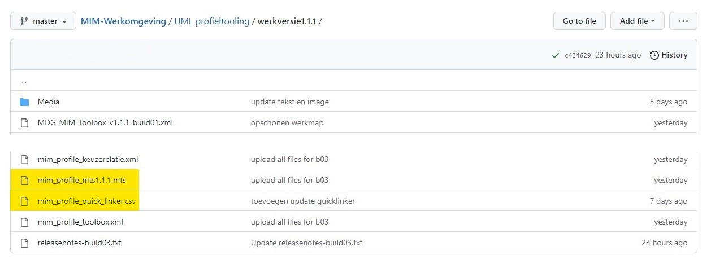

### 1.2| Benodigde profielen
Controleer of je beschikt over alle benodigde profielen:

 - Open met Enterprise Architect het project met de MIM-profielen.
 - Ga in de project browser naar het package `MIM-UMLprofiel`.
 - Controleer of daarin de benodigde _profile packages_ aanwezig zijn:

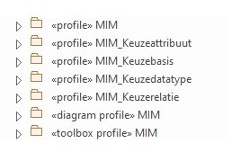

 - Controleer of in het _package_ `«profile» MIM` het element `«document» QuickLinker` aanwezig is.


> **NOTE**: Het CSV-bestand van de QuickLinker is een kopie van de informatie die in dit element is opgeslagen. Als je wijzigingen wilt aanbrengen in de QuickLinker, of als er in het model wijzingen zijn doorgevoerd die van invloed zijn op de QuickLinker, kun je die met behulp van het CSV-bestand aanpassen (hier [linkOpnemenNaarQuickLinkerMakenOfBewerken](url) lees je hoe dat moet).

Indien de profielen al in XML-formaat beschikbaar zijn (zie: ([linkOpnemenNaarPackagePublicerenAlsProfiel](url)), klik dan hier ([linkOpnemenGenererenToolbox](url)) om de volgende stap over te slaan en direct te beginnen met het genereren van de toolbox.

### 1.3 | Versienummer Toolbox

Het is handig om een toolbox een versienummer mee te geven. Hiervoor zijn verschillende manieren. Bovendien is het mogelijk om te kiezen hoever je deze nummering doorvoert. Hieronder wordt uitgelegd op welke manier de MIM-toolbox van een versienummer wordt voorzien.  belangrijkste uitgangspunt is dat het versienummer van de MIM-toolbox correspondeert met het versienummer van de MIM-dataspecificatie.

**Format**: `MIM<spatie>#.#.#`

Voor de MIM-toolbox is besloten om het versienummer op verschillende plekken mee te geven:

 - bij [het genereren van de _toolbox_](#131--versienummer-mdg-technology-toolbox)
 - bij [het genereren van het _profile_](#132--versienummer-profiel)
 - als [alias van het _package_](#133--versienummer-package)
 - als [alias van de _toolbox pages_](#134--versienummer-toolbox-pages)
 - _optioneel_: [stereotype in diagram](#135--versienummer-diagram). Let op: als je dit veranderd, moet je ook het csv-bestand van de _Quick Linker_ aanpassen ([linkOpnemenNaarQuickLinkerMakenOfBewerken](url)).

#### 1.3.1 | Versienummer _MDG Technology_ (Toolbox)

Dit is het originele versienummer. Als een gebruiker de toolbox importeerd, kan dit teruggevonden worden onder `Specialize` > `Manage Tech`. In het venster dat dan verschijnt zoek je `MIM` op in de kolom _Technology_. In het subvenster rechtsboven vind je het versienummer terug.

#### 1.3.2 | Versienummer _profile_

Profielen waaruit de toolbox gegenereerd wordt, hebben ook een versienummer. Dit nummer is o.a. terug te vinden in XML-bestand. Dit is wellicht niet strikt noodzakelijk maar zeker handig om te doen, omdat er in de loop van de tijd meerdere profielen gemaakt zullen worden. Mocht je willen weten welk profiel aan een toolbox ten grondslag ligt, kun je dat in het XML-bestand van het profiel terugvinden.

#### 1.3.3 | Versienummer _package_

Door in het veld `Alias` van elk package het versienummer mee te geven kan een gebruiker van de toolbox in één oogopslag in het _properties-venster_ zien met welke versie van de toolbox een modelelement is gemaakt. Dit is vooral handig in het dagelijks gebruik. Ook als je twee (versies van) MIM-modellen wilt vergelijken, geef je de gebruiker via deze plek snel inzicht in de gebruikte MIM-versie.

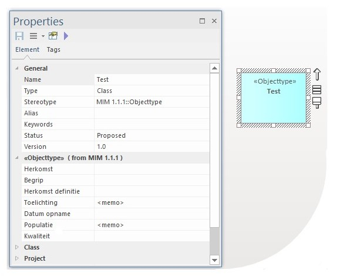

#### 1.3.4 | Versienummer _toolbox pages_

De _toolbox pages_ krijgen eveneens een versienummer. Hiervoor vouw je het package met het stereotype `toolbox profile` uit. Voor elke toolbox page is een element met het stereotype: `stereotype`.

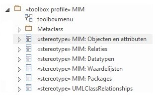

Controleer of bij elk element het versienummer klopt.

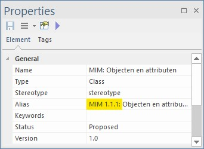

Hierdoor ziet de gebruiker van de toolbox in één oogopslag met welke versie er gewerkt wordt.

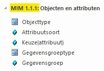

#### 1.3.5 | Versienummer _diagram_

In MIM heeft dit onderdeel geen versienummer; het is immers een hulpmiddel. De MIM-dataspecificatie zegt daarom ook niets over een diagram. Maar, indien gewenst zou dat via de naam van dit stereotype kunnen. 

> **LET OP**: Indien je hiervoor kiest, moet de nieuwe diagramnaam ook worden doorgevoerd in het _Quick Linker_-element (lees [hier](linkOpnemenNaarQuickLinkerMakenOfBewerken) hoe dat werkt).


## 2 | Profiel publiceren

### 2.1 Publiceer _package_ als UML-profiel

> **NOTE**: Tussenkoppen toevoegen

 - Navigeer naar het package `MIM-UMLprofiel`.
 - Selecteer vervolgens één van de bovengenoemde profielen (bijv. `«profile» MIM`).
 - Ga naar: _Specialize_.
 - Kies _Publish Package as UML Profile_.
 - En klik op: _Publish Pack As UML profile_.
 - Er verschijnt nu een nieuw venster.

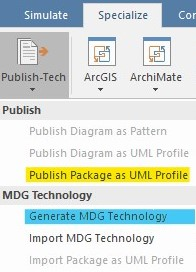

 - Voer _profile name_ in: _MIM_.
 - Kies de locatie waar je het profiel wilt opslaan en geef het bestand een herkenbare naam 
 - Voer het versienummer van de corresponderende MIM-dataspecificatie in (bijv.:`1.1.1`).

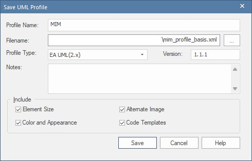

Let op er zijn twee belangrijke voorwaarden:
1. De _profile name_ moet overeenkomenm met de naam van het _package_.
2. De namen van de packages met de stereotypen `«profile»`, `«profile diagram»` en `«profile toolbox»` moeten exact hetzelfde zijn.

> **Opmerking**: Dat er daarnaast packages zijn met een andere naam, maakt niet uit, zoals bijv. `MIM_Keuzebasis`, zo lang de drie voorgenoemde packages maar hetzelfde zijn. Wel is het zo dat de prefix die in het MIM-toolbox

3. De naam van een package moet overeenkomen met de prefix van een toolbox-element (zie: afbeelding).

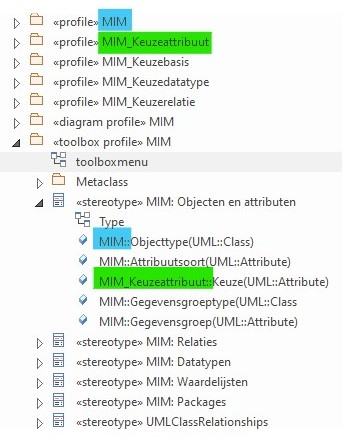

> **Opmerking**: Een toolbox-element verwijst naar de het package met het bijbehorende profiel. Als je de packagenaam van een profiel aanpast, verandert de naam van het toolbox-element niet automatisch mee. In de uiteindelijke toolbox zul je dit element dan niet kunnen gebruiken.

 - Controleer of aan deze voorwaarden voldaan wordt.
 - Klik: 'Save'
 - Herhaal deze stappen voor alle profielen
 - Ga daarna door na de volgende stap om op basis van de profielen een toolbox te genereren.

## 3 | Genereer MDG Technologie

Doorloop voor het genereren van een toolbox de volgende stappen in de _Generate MDG Technology Wizard_. 

### 3.1 | Selecteer package

 - Selecteer het package waaronder alle subpackages vallen, in dit geval: `MIM-UMLprofiel`.

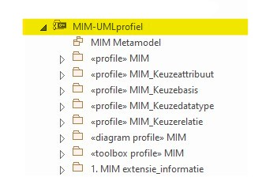

### 3.2 | Open wizard

 - Klik op 'Specialize' in de _ribbon_.
 - Kies: 'Publish Package'.
 - Kies: 'Generate MDG Technology'.

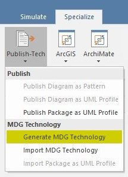

### 3.3 | Selecteer MTS-bestand

 - Kies 'Volgende'.
 - Kies 'Open an existing MTS file'.
 - Negeer de melding.
 
 > **Opm**: Het MTS-bestand vult een aantal standaard configuraties vooraf in, maar je kunt deze tijdens het proces nog aanpassen. Dit is een handig bestand. Het kan voorkomen dat je na het genereren van de toolbox aanpassingen wilt maken. Als je na het aanpassen van de gegevens opnieuw de toolbox wilt genereren, is het fijn als je deze gegevens niet opnieuw hoeft in te vullen.

### 3.4 | Controleer gegevens
 
Vanuit het MTS-bestand wordt het volgende venster al ingevuld
 - Technology: `MIM`
 - Filename: (kies een naam en locatie)
 - ID: build + build number (bijv.: `build03`)
 - Version: `1.1.1`

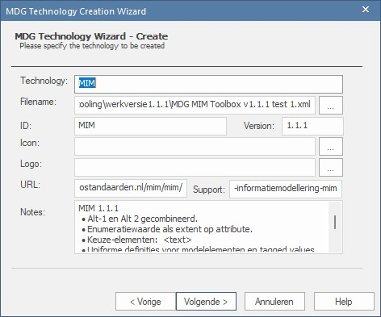

> **Toelichting**
> 1. Icon en logo: deze velden blijven vooralsnog leeg.
> 1. URL: link naar corresponderende MIM-documentatie op GitHub/ReSpec.
> 1. Support: link naar website Geonovum.
> 1. Notes: Vul in het notes veld kort in wat is er in deze versie nieuw is.

 - Klik 'Volgende'.

### 3.5 | Controleer instellingen

 - Controleer of _Profiles_, _Diagram Types_ en _Toolboxes_ zijn geselecteerd
 - Wijzig indien nodig de instellingen 
 - Klik op 'Ok'


### 3.6 | Selecteer _profiles_

 - Alle configuraties kun je laden vanuit de MTF file.
 - Voor de eerste keer kun je ook een MTS-bestand genereren.
 - Select:  'Files To Be Included As **Profiles**'.
 - Kies hier alle XML-bestanden, behalve de toolboxprofile.
 - Klik 'Volgende'.

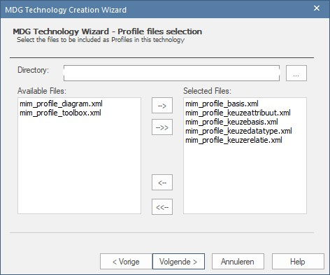

### 3.7 | Selecteer _diagrams_

 - Select: 'Files To Be Included As **Diagram definitions**'
 - Kies hier het diagramprofiel
 - Klik 'Volgende'.

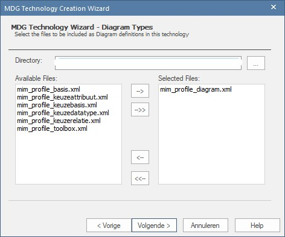

### 3.8 | Selecteer _Toolboxes_

 - Select: 'Files To Be Included As **Toolbox Definitions**'
 - Kies hier het toolboxprofiel
 - Klik 'Volgende'.

 - In de volgende stap selecteer je tot slot het toolbox profiel.

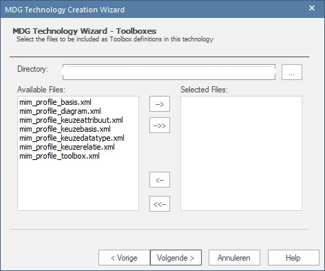

### 3.9 | Controleer gegevens en voltooi proces

 - Klik 'Volgende'.
 - Check de box 'Save to MTS' en klik op 'Voltooien'
 - Indien je wijzigingen in de configuratie hebt aangebracht:
 - Kies checkbox  'Save To MTS'


 - Klik: 'Voltooien'

## 4 | Test de Toolbox
 - Laad het MIM-profiel via "Resources"
 - maar er is een EAP-testf file
 - Verschillende manieren om de nieuwe toolbox te testen
 - Een model bouwen met alle MIM-mogelijkheden erin
 - Of: een nieuwe toolbox laden en update van het bestaande model uitvoeren
 - En dat kan door MIM metaklassen te slepen
 - Of door gebruik te maken va "Sync Tagged Values And Constraints"
 - Deze laatste optie vind je terug in het "Resources" menu

## 5 | MIM MDG
 - profile helpers, model wizard: https://sparxsystems.com/enterprise_architect_user_guide/15.2/modeling/using_the_profile_helpers.html
 - Create Diagram Profiles using the Profile Helpers:https://sparxsystems.com/enterprise_architect_user_guide/15.2/modeling/create_diagram_profiles_using_.html
 - Morgen weer verder!

## X | Aandachtspunten
 - Tekstveld voor teolichting, niet initial value, maar notes veld als datatype
 - Uitgebreide toelichting wordt afgekapt vanwege maximale lengte.
 - Profiel niet elke keer opnieuw moeten laden door het kopppelen aan een (std.) diagram
 - MIM 1.1 build 1
 - Vorige versie had ook zo'n naam, dit kun je op website of github terugvinden. gaat om de naam van de het XML

## Nog plaatsen

#### Regels
 - `«profile»`, `«diagram profile»` en `«toolbox profile»` moeten dezelfde naam dragen
 - Bij het genereren van een profiel, moet _profile name_ gelijk zijn aan de naam die het profiel draagt
 - Binnen een package mogen elementen niet dezelfde naam hebben, maar MIM kent verschillende elementen met de naam '_Keuze_'. Om dit mogelijk te maken in de toolbox, zijn voor de keuze-elementen aparte aanvullende packages gemaakt. Vandaar dat er meerdere packages `«profile»` zijn. 

#### Quicklinker
 - CSV-bestand nodig
 - In Nederlandse versies van OS, is scheidingsteken een puntkomma: ";"
 - Voor Enterprise heb je een komma (",") nodig als scheidingsteken. 
 - Ook iets zeggen over werken in excel, kan ook in EAP, maar werkt onoverzichtelijk

#### Afbeeldingen


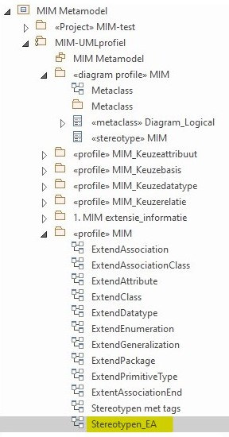

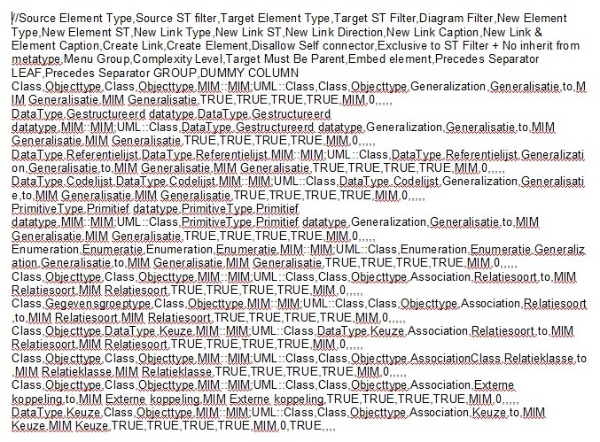

