# Handleiding voor het importeren en toepassen van de MIM-toolbox in Enterprise Architect

MIM-versie: 1.1.1

Enterprise Architect versie: 15.2

Update 24 juni 2022

Versienummer toegevoegd, zodat uit de naam van de toolbox duidelijk blijkt wat de versie is. Tevens is dit doorgevoerd naar de modelelementen. Zodat je bij de properties van het modelelement direct kunt zien met welke MIM-versie het element is aangemaakt

## Inhoud
 1. [Importeren MIM-toolbox](#1-importeren-mim-toolbox)
 1. [Toepassen MIM-diagram](#2-toepassen-mim-diagram)
 1. [Toepassen Quick Linker](#3-toepassen-quick-linker)
 1. [Toepassen toolbox-item 'Relatierol'](#4-toepassen-toolbox-item-relatierol)
 1. [Verwijderen oudere toolbox](#5-verwijderen-oudere-toolbox)
 1. [Toolboxen beheren](#6-toolboxen-beheren)

## 1: Importeren MIM-toolbox

 - [Download het XML-bestand](https://register.geostandaarden.nl/informatiemodel/mim/1.1.1/) van de MIM-toolbox: `MDG_MIM_Toolbox_v1.1.1_build01.xml`.
 - Verwijder eventueel eerst de oudere versie van de toolbox als je die niet meer nodig hebt ([Toolbox verwijderen](#5--verwijderen-oudere-toolbox)).
 - Open Enterprise Architect
 - Open '_Resources_'
    - Kies rechts in beeld op '_Portals_'
    - Selecteer in het dropdown-menu '_Windows_'
    - Kies '_Resources_' (onder '_Explore_')

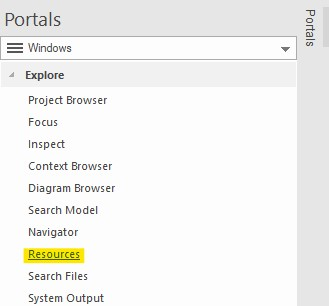

 - Klik op '_MDG Technologies_'

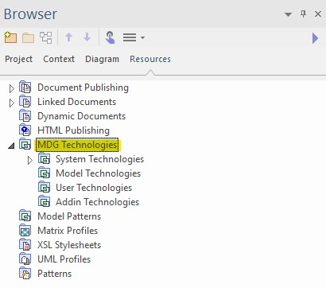

 > **Let op**: hier moet je de keuze maken of je de toolbox op model- of gebruikersniveau importeert. Beide hebben voor- en nadelen: 
 >  - **Model**: alleen te gebruiken in het huidige EA-project. Voor elke nieuw project moet je de toolbox opnieuw importeren. Indien je dit project met een andere gebruiker deelt, beschikt deze gebruiker ook over de toolbox.
 >  - **User**: te gebruiken in alle EA-projecten. Je hoeft de toolbox slechts éénmalig te importeren. Het nadeel is dat bij het delen van projecten de toolbox niet mee komt. Bovendien kunnen er conflicten tussen toolboxen ontstaan, indien er meerdere MIM-toolboxen aanwezig zijn (zie: onderstaande tip).

 > **Tip!** Indien binnen jouw EA-omgeving ook een toolbox van een extensie op het MIM aanwezig is (bijvoorbeeld voor de BRO), dan is het raadzaam om de toolboxen alleen op model-niveau te importeren. Indien tenminste één van de twee op user-niveau is geïmporteerd, kan dit bij het toewijzen van stereotypen verwarring opleveren. Veel stereotypen hebben exact dezelfde naam en voor EA is het dan onduidelijk welke _MDG Technology_ het moet kiezen. De bovenstaande aanpak houdt de werkwijze zuiverder.

 - Klik met de rechtermuisknop op '_Model Technologies_' of '_User Technologies_'.

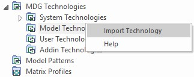

 - Selecteer '_Import technology_'.
 - Zoek het gedownloade XML-bestand van de MIM-toolbox op en kies '_Openen_'.
    - Overigens kun je ook in dit venster nog kiezen tussen '_model_' of '_user_'.
    - Op welke plek je de keuze maakt voor '_model_' of '_user_', maakt geen verschil.
 - De velden '_Technology_', '_Version_' en '_Notes_' worden nu automatisch ingevuld met de juiste informatie.
 - Controleer het versienummer: `Version: 1.1.1`.

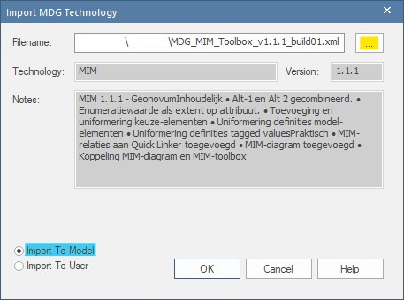

 - Klik '_Ok_'
 - Navigeer in het '_Resources_' naar '_MDG Technologies_' > '_Model Technologies_'.
 - Controleer of hier nu een map met de naam '_MIM_' staat.
 - Controleer ook of het MIM-versienummer klopt bij '_UML Profiles_', '_Diagram Types_' en '_Toolboxes_'.

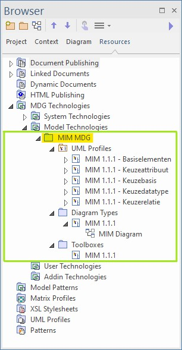

 - Bij een _user import_ zal er nog een venster verschijnen met de tekst '_Copy succesfull_'.
 - De MIM-toolbox is nu beschikbaar  voor gebruik, maar het is raadzaam om eerst de volgende instructies door te nemen: 
 - Instructie voor het [gebruik van het MIM-diagram](#2--toepassen-mim-diagram).
 - Instructie voor het [gebruik van de Quick Linker](#3--toepassen-quick-linker).
 - Instructie voor het [gebruik van toolbox-item «Relatierol»](#4--toepassen-toolbox-item-relatierol).

 > **Let op**: de MIM-toolbox heeft een versienummer. Deze staat niet in de naam. Indien je besloten hebt om oudere versies van de MIM-toolbox niet te verwijderen, komt de naam 'MIM' mogelijk meerdere malen voor. Het [beheren van toolboxen](#6--toolboxen-beheren) in Enterprise Architect doe je op deze manier.

## 2: Toepassen MIM-diagram

In voorgaande versies werd de MIM-toolbox toegepast op een standaard UML diagram (`UML::Class`). Dat kan nog steeds. Dit heeft echter één nadelige eigenschap. Als je in je project met meerdere diagrammen werkt, kan het voorkomen dat bij het wisselen tussen diagrammen de toolbox terugspringt op de standaard UML-toolbox. Hierdoor moet je de MIM-toolbox opnieuw opzoeken.

Dit probleem wordt veroorzaakt doordat een diagram en een toolbox aan elkaar gekoppeld zijn. Daarom is in versie 1.1.1 van de MIM-toolbox een speciaal MIM-diagram aangemaakt waaraan de toolbox gekoppeld is. Dit diagram is een directe afgeleide van het standaard '_UML Class diagram_'. Hieronder staat uitgelegd hoe je dit kunt toepassen.

 - Ga in de '_Project Browser_' naar '_Project_'.
 - Selecteer een package.
 - Klik op het diagramlogo om een nieuw diagram aan te maken.

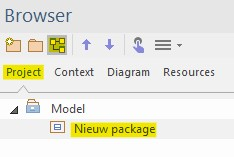

 > **Let op**: dit kan alleen als je onder model al een package hebt aangemaakt. Als je dat nog niet hebt, maak dan eerst een nieuw package aan.

 - Er opent nu een venster.
 - Geef het diagram een naam.
 - Klik op het dropdown-menu bij '_Type_'.
 - Selecteer '_Specialized_' > '_User Technologies_' of '_Model Technologies_' (afhankelijk van de manier waarop je de [toolbox geimporteerd](#1--importeren-mim-toolbox) hebt).

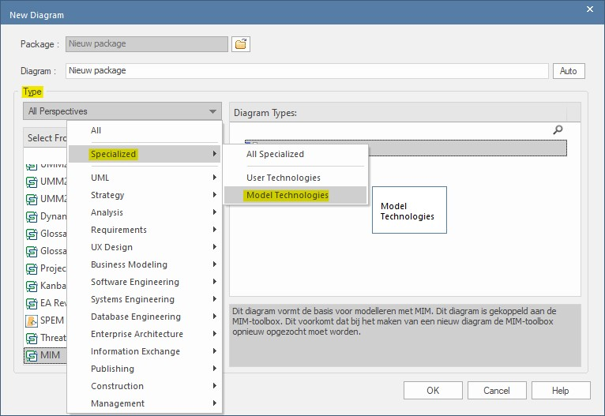

 - Klik in het deelvenster '_Select From_' op '_MIM 1.1.1_'.

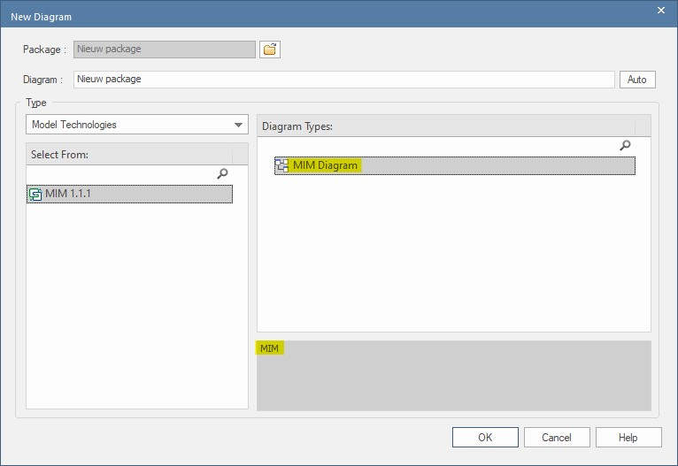

 - Nu verschijnt in het deelvenster '_Diagram Types_' het '_MIM Diagram_'.
 - Selecteer het diagram en klik op '_Ok_'.

 > **Let op**: het is belangrijk dat je het diagram daadwerkelijk selecteert. Je kunt herkennen of dit gelukt is, doordat in het onderste deelvenster een toelichtende tekst op het diagram verschijnt (anders staat er alleen 'MIM').

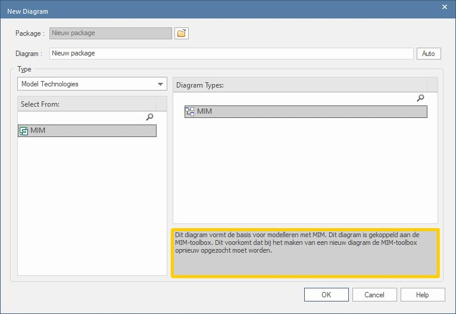 

 - De MIM-toolbox verschijnt nu in het toolbox-menu.

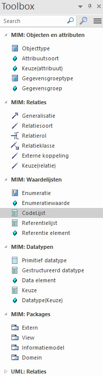

 - Dubbelklik in de '_Project browser_' op het nieuwe diagram.
 - In het venster '_Properties_' zie je dat het diagram van het type '_MIM_' is.

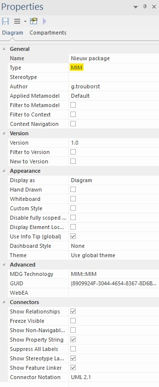

Het MIM-versienummer komt nu ook terug het veld Stereotype in het venster '_Properties_' van het object.
 - Maak een objecttype "A" aan.
 - Controleer vervolgens in de het venster '_Properties_' of in de naam van het stereotype het betreffende MIM-versienummer verschijnt.
 - Tevens verschijnt er in dit venster een deelmenu met de titel '_«Objecttype» ( from MIM 1.1.1 - Basiselementen )_'
 - Als dit klopt, is de toolbox correct geïmporteerd.

## 3: Toepassen Quick Linker

De Quick Linker is een hulpmiddel om snel en eenvoudig relaties te kunnen leggen tussen verschillende elementen. Het voordeel hiervan is dat het de gebruiker inzicht geeft in de volgens MIM toegestane relaties. De Quick Linker is beschikbaar via een icoontje dat rechtsboven een diagramelement verschijnt op het moment dat je het selecteert.

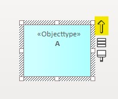

Je kunt de Quick Linker op drie manieren inzetten, namelijk voor het:

 - [Verbinden van twee bestaande modelelementen](#31--verbinden-bestaande-modelelementen)
 - [Creëren van nieuwe modelelementen](#32--nieuw-modelelement)
 - [Creëren van meerdere modelelemten tegelijk](#33--meerdere-nieuwe-modelelementen)

Hieronder beschrijven we elke methode afzonderlijk.

### 3.1 | Verbinden bestaande modelelementen
 - Klik met de muis op het icoon.
 - Houd de muisknop ingedrukt en trek een lijn naar het object waarmee je het wilt verbinden.
 - Er verschijnt een stippellijn en een menu.

 - Selecteer het gewenste type MIM-relatie (bijvoorbeeld: `«Generalisatie»`.

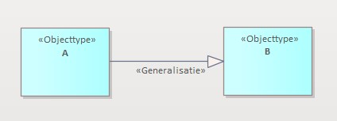

### 3.2 | Nieuw modelelement
Je kunt ook vanuit een bestaand element een nieuw modelelement creëren. Dat gaat als volgt:

 - Klik met de muis op het icoon.
 - Houd de muisknop ingedrukt en trek een lijn naar een lege plek in het diagram.
 - Er verschijnt een stippellijn en een menu.

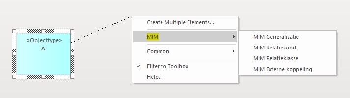

 - Dit menu ziet er anders uit dan bij het verbinden van twee bestaande elementen.
 - Navigeer naar '_MIM_' en selecteer het gewenste type MIM-relatie (bijvoorbeeld: `«Generalisatie»`)

### 3.3 | Meerdere nieuwe modelelementen
Ook is het mogelijk om vanuit een bestaand element meerdere én verschillende soorten modelelementen in één keer te creëren. Dat gaat als volgt:

 - Klik met de muis op het icoon.
 - Houd de muisknop ingedrukt en trek een lijn naar een lege plek in het diagram.
 - Er verschijnt een stippellijn en een menu.

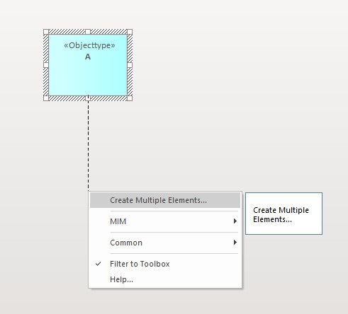

 - Navigeer naar '_Create Multiple Elements_'.
 - Er verschijnt een nieuw venster.

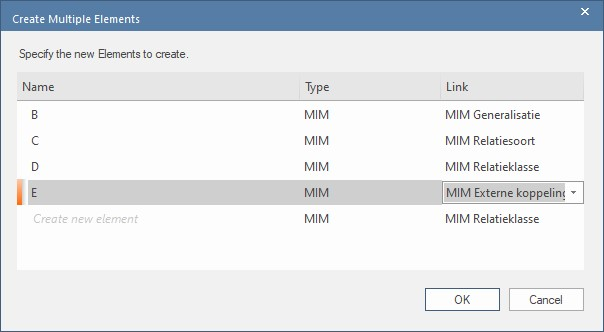

 - Defineer in dit venster de elementen in de eerste kolom ('_Name_') en selecteer het gewenste type relatie in de derde kolom ('_Type_').
 - Klik op '_Ok_' als je klaar bent.

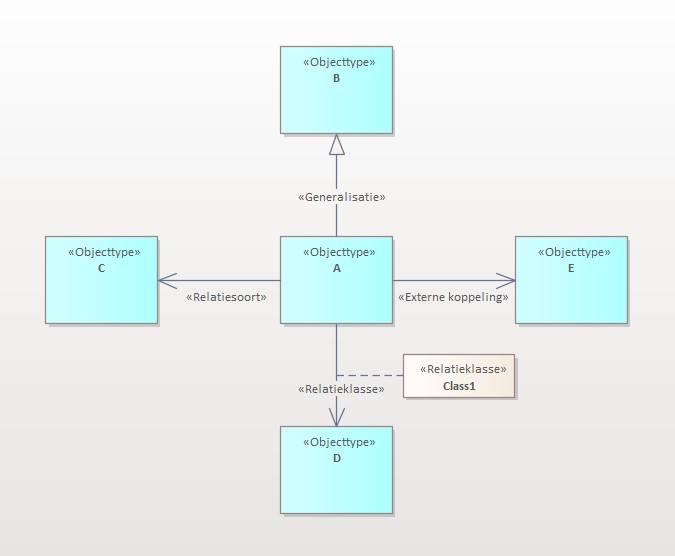

## 4: Toepassen toolbox-item 'Relatierol'

Net als alle andere relatie-elementen uit de MIM-toolbox, kun je `«Relatierol»` naar het diagram slepen. Dit werkt alleen als je dit naar het uiteinde van een reeds bestaande `«Relatiesoort»` sleept. Wanneer je in EA het stereotype `«Relatierol»` toewijst aan een relatie, worden de bijbehorende '_Tagged Values_' niet automatisch meegenomen. Hieronder staat bschreven hoe je de tagged values voor alle in het model aanwezige stereotypen `«Relatierol»` in het model kunt synchroniseren.

 - Indien je twee modelelementen met elkaar verbindt door middel van een «Relatiesoort», kun je de relatierol van de target toevoegen door middel van het toolbox-item «Relatierol».
 - Klik op het toolbox-item «Relatierol» en sleep het item met de muisknop ingedrukt naar de target-kant van de associatie en laat hier de muisknop weer los.
 - Er verschijnt een popup-venster.

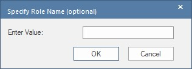

 - Vul bij '_Enter value_' de naam van de relatierol in en klik op '_Ok_'.
 - Klik vervolgens in het '_Properties_' venster op het '_Target_' tabblad.
 - Hierin ontbreken de bijbehorende tagged values voor [alternatief 1](https://docs.geostandaarden.nl/mim/mim/#relatiesoort-is-leidend-alternatief-1) of [alternatief 2](https://docs.geostandaarden.nl/mim/mim/#relatierol-is-leidend-alternatief-2).

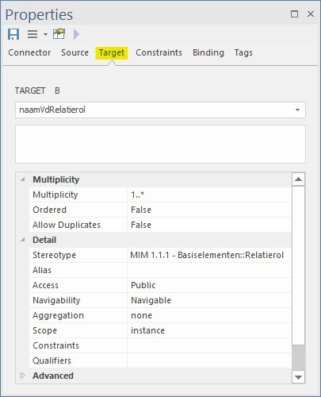

 - Ga naar het toolbox-item Relatierol en klik hier met de rechtermuisknop op.

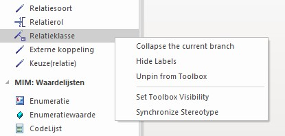

 - Klik op '_Synchronize Stereotype_'.
 - Er opent een nieuw venster
 - Hierin staat in het veld '_stereotype_' 'relatierol' al geselecteerd.
 - Klik op '_Ok_'.

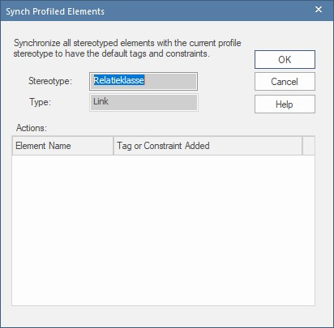

 - Er verschijnt een popup-venster dat vraagt: '_Save latest changes?_', klik '_Ja_'.
 - De tagged values zijn nu gesynchroniseerd.

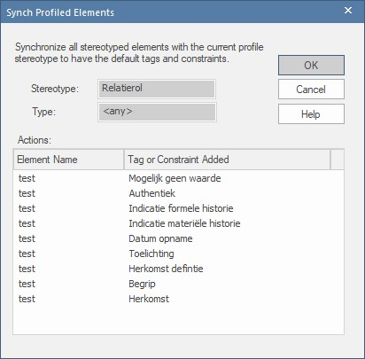

 > **Let op**: dit werkt nog niet!

## 5: Verwijderen oudere toolbox
Deze instructie is bedoeld voor het verwijderen van toolboxen die je niet meer wilt gebruiken. Bijvoorbeeld oudere versies van de MIM-toolbox.

 - Open Enterprise Architect
 - Open '_Resources_'
 - Kies rechts in beeld op '_Portals_'
 - Selecteer in het dropdown-menu '_Windows_'
 - Kies '_Resources_' (onder '_Explore_')
 - Klik op '_MDG Technologies_'
 
 Controleer nu of er onder '_Model Technologies_' en/of '_User Technologies_' toolboxen staan die je niet meer wilt gebruiken.

 - Verwijderen '_Model Technologies_'
    - Klik met de rechtermuisknop op de toolbox en selecteer '_Remove technology_'
    - Start hierna voor de zekerheid EA opnieuw op.
 - Verwijderen '_User Technologies_'
    - Klik met de rechtermuisknop op de toolbox en selecteer '_Locate Technology_'. 
    - Verwijder het XML-bestand van de toolbox op deze locatie
    - Start hierna voor de zekerheid EA opnieuw op.
    - Ga verder met het [importeren van de MIM-toolbox](#1--importeren-mim-toolbox).

## 6: Toolboxen beheren
 - Ga naar de menubalk boven in beeld en selecteer '_Specialize_' > '_Manage-Tech_'
 - Hier vind je een overzicht van alle aanwezige MDG-technologies.
 - Scroll naar beneden en zoek '_MIM_' op.
 - Indien je meerdere versies van de toolbox geïmporteerd hebt, vind je die hier terug.
 - Klik op één van de versies voor meer informatie.
 - In het informatievenster rechtsboven zie je welke versie het betreft. Tevens vind je hier terug of de toolbox op model- of gebruikersniveau is geïmporteerd.
 - Met het checkbox in de kolom '_Enabled_' kun je ervoor kiezen om bepaalde bepaalde toolboxen uit te zetten. Dit doe je door het vinkje te verwijderen.
 - Ga verder met de laatste stappen van het [importeren van de MIM-toolbox](#1--importeren-mim-toolbox).

 > **Let op**: indien je toolboxen gebruikt met gelijknamige modelelementen, bijvoorbeeld oudere MIM-toolboxen of NEN3610 BRO Grouping-NL, dan kan dit bij het toewijzen van het stereotype «Relatierol» leiden tot een verwijzing naar het 'verkeerde' profiel. Enterprise Architect doet dit automatisch. Hierdoor beschikt het stereotype bijvoorbeeld niet over de gewenste tagged values.

## 7: Workspaces gebruiken