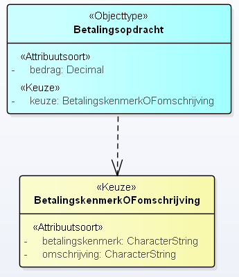
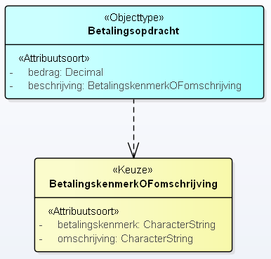
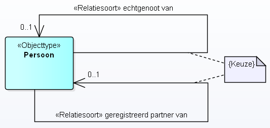
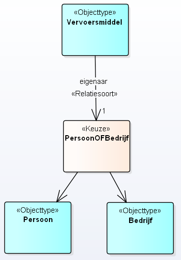

# Use cases voor Keuze

Een *Keuze* is een opsomming van meerdere modelelementen, waarbij er maar van één tegelijkertijd sprake kan zijn.

*Toelichting:* De keuze is een alternatieve manier voor het modelleren van een constraint.

Een *Keuze* kan op meerdere plekken gebruikt worden, en maakt het mogelijk waar in het metamodel normaal gesproken maar één mogelijkheid bestaat, een opsomming te geven van meerdere mogelijkheden, waarbij in een concreet geval altijd precies één van deze mogelijkheden wordt gebruikt.

Een belangrijk voordeel van deze modellering is dat de kardinaliteiten zuiver gehouden kunnen worden. Anders gezegd, er kan mee voorkomen worden dat een kardinaliteit van bijvoorbeeld twee kenmerk eerst optioneel gemaakt moet worden en dat hierna via een constraint deze toch weer verplicht gemaakt moeten worden, voor precies één van de mogelijkheden. Het is aan de modelleur om te kiezen voor een constraint of een Keuze.

Dit document beschrijft vier use cases waarin het modelleren met een *Keuze* van toegevoegde waarde is. Zonder een dergelijke modelconstructie zou het nodig moeten zijn om met een expliciete constraint de keuze aan te geven.

- Bij use cases 1 tot en met 4 gaat het over meerdere kenmerken, waartussen een keuze gemaakt moet worden omdat er van precies 1 sprake is. Dit is in MIM een keuze tussen twee (of meer) modelelementen. In de verzamelingenleer noemen we dit een XOR situatie. Hierbij is het vooral van belang dat er als gevolg van de modellering van een keuze in plaats van constraint er geen nieuwe kenmerken mogen ontstaan en ook geen kenmerken mogen wegvallen. De kenmerken van het object blijven gelijk.

## Use case 1: een keuze tussen twee datatypen

Van een objecttype "Persoon" is relevant op welk adres deze persoon woont. Er is sprake van één attribuutsoort "adres". Het adres kan vervolgens een tekstveld zijn (bijvoorbeeld: "Krankeledenstraat 34 te Amersfoort"), maar ook meer gestructureerd zijn opgenomen, waarbij de elementen straatnaam, huisnummer en woonplaats afzonderlijk zijn opgenomen. Er is sprake van een keuze tussen het primitieve datatype "CharacterString" en het gestructureerde datatype "Adrestype" met de data-elementen "straatnaam", "huisnummer" en "woonplaats"

Opmerking: andere modelleringen van een adres zijn ook mogelijk, een adres zou ook een gegevensgroep kunnen zijn en een Adrestype een Gegevensgroeptype, en een adres zou ook als een Objecttype gemodelleerd kunnen worden. In dit voorbeeld is het adres gemodelleerd als een attribuutsoort en het Adrestype als een datatype.

Onderstaand figuur geeft in zowel UML als Linked Data weer hoe beide modellen er uit zouden zien voor beide afzonderlijke situaties met het gebruik van `<<Keuze>>`.

<table><tbody>
<tr><th>UML</th><th>Linked Data</th></tr>
<tr><td></td><td>
<pre class='ex-turtle'>
vb:Persoon a mim:Objecttype;
  mim:naam "Persoon";
  mim:attribuut [
    a mim:Attribuutsoort;
    mim:naam "adres";
    mim:type vb:CharacterStringOFAdrestype
  ];
.
vb:CharacterStringOFAdrestype a mim:Keuze;
  mim:type mim:CharacterString;
  mim:type vb:Adrestype;
.
vb:Adrestype a mim:GestructureerdDatatype;
  mim:naam "Adrestype";
  mim:dataElement [
    a mim:DataElement;
    mim:naam "huisnummer";
    mim:type mim:CharacterString;
  ];
  mim:dataElement [
    a mim:DataElement;
    mim:naam "straatnaam";
    mim:type mim:CharacterString;
  ];
  mim:dataElement [
    a mim:DataElement;
    mim:naam "woonplaats";
    mim:type mim:CharacterString;
  ]
.
</pre></td></tr>
</tbody></table>

In het UML model is sprake van een steunproperty met stereotype `<<Type>>`. Deze is nodig omdat een UML datatype niet direct gerelateerd kan worden aan een ander UML datatype. In het LD model is zichtbaar dat een dergelijke steunproperty niet nodig is. Er is dan ook **geen** sprake van een attribuutsoort "type1" en "type2". Dit zijn "steunproperties" die wegvallen in het feitelijke MIM-model.

## Use case 2a: een keuze tussen twee attribuutsoorten bij een objecttype

Bij een objecttype "Betalingsopdracht" moet, naast het bedrag, ook een betalingskenmerk worden opgenomen OF een omschrijving. Eén van beide attribuutsoorten moet worden ingevuld. Het is niet toegestaan dat beide velden worden ingevuld: alleen een betalingskenmerk, of alleen een omschrijving.

Onderstaand figuur geeft in zowel UML als Linked Data weer hoe beide modellen er uit zouden zien voor beide afzonderlijke situaties met het gebruik van `<<Keuze>>`.

<table><tbody>
<tr><th>UML</th><th>Linked Data</th></tr>
<tr><td></td><td>
<pre class='ex-turtle'>
vb:Betalingsopdracht a mim:Objecttype;
  mim:naam "Betalingsopdracht";
  mim:attribuut vb:bedrag;
  mim:attribuut vb:BetalingskenmerkOFomschrijving
.
vb:bedrag a mim:Attribuutsoort;
    mim:naam "bedrag";
    mim:type mim:Decimal;
    mim:kardinaliteit "1";
.
vb:BetalingskenmerkOFomschrijving a mim:Keuze;
  mim:attribuut vb:betalingskenmerk;
  mim:attribuut vb:omschrijving
.
vb:betalingskenmerk a mim:Attribuutsoort;
    mim:naam "betalingskenmerk";
    mim:type mim:CharacterString;
    mim:kardinaliteit "1";
.
vb:omschrijving a mim:Attribuutsoort;
    mim:naam "omschrijving";
    mim:type mim:CharacterString;
    mim:kardinaliteit "1";
.
</pre></td></tr>
</tbody></table>

In het UML model is sprake van een steunproperty met stereotype `<<Keuze>>`. Deze is nodig omdat een UML objecttype niet direct gerelateerd kan worden aan een UML datatype. In het LD model is zichtbaar dat een dergelijke steunproperty niet nodig is. Er is dan ook **geen** sprake van een attribuutsoort "keuze". Dit is een "steunproperty" die wegvalt in het feitelijke MIM-model.

## Use case 2b: een keuze tussen twee attribuutsoorten bij een gestructureerd datatype
Bij een objecttype "Betalingsopdracht" moet een bedrag en een beschrijving worden opgenomen. De beschrijving is feitelijk een structuur waarbij de keuze moet worden gemaakt tussen een betalingskenmerk OF een omschrijving. Eén van beide attribuutsoorten moet worden gebruikt binnen de structuur die gebruikt wordt voor een waarde van de beschrijving. Het is niet toegestaan dat beide velden worden ingevuld: alleen een betalingskenmerk, of alleen een omschrijving.

Deze use case is voor een groot deel overeenkomstig aan use case 2a. Het verschil zit in het feit dat de keuze niet betrekking heeft op attribuutsoorten van een objecttype, maar attribuutsoorten van een gestructureerd datatype.

Onderstaand figuur geeft in zowel UML als Linked Data weer hoe beide modellen er uit zouden zien voor beide afzonderlijke situaties met het gebruik van `<<Keuze>>`.

<table><tbody>
<tr><th>UML</th><th>Linked Data</th></tr>
<tr><td></td><td>
<pre class='ex-turtle'>
vb:Betalingsopdracht a mim:Objecttype;
  mim:naam "Betalingsopdracht";
  mim:attribuut vb:bedrag;
  mim:attribuut vb:beschrijving;
.
vb:bedrag a mim:Attribuutsoort;
    mim:naam "bedrag";
    mim:type mim:Decimal;
    mim:kardinaliteit "1";
.
vb:beschrijving a mim:Attribuutsoort;
  mim:type vb:BetalingskenmerkOFomschrijving
.
vb:BetalingskenmerkOFomschrijving a mim:Keuze;
  mim:attribuut vb:betalingskenmerk;
  mim:attribuut vb:omschrijving
.
vb:betalingskenmerk a mim:Attribuutsoort;
    mim:naam "betalingskenmerk";
    mim:type mim:CharacterString;
    mim:kardinaliteit "1";
.
vb:omschrijving a mim:Attribuutsoort;
    mim:naam "omschrijving";
    mim:type mim:CharacterString;
    mim:kardinaliteit "1";
.
</pre></td></tr>
</tbody></table>

In het UML model is in deze situatie geen noodzaak voor een steunproperty. Er is daadwerkelijk sprake van een attribuutsoort "beschrijving". Wat wel opvalt, is dat er zowel in het UML model als in het LD model (feitelijk) geen sprake meer is van een gestructureerd datatype: het is slechts een keuze en in die zin een echt datatype met veel kenmerken die ook voor een gestructureerd datatype gelden.

## Use case 3: een keuze tussen twee relatiesoorten

Een objecttype "Persoon" kan getrouwd zijn met een ander persoon, of een geregistreerd partnerschap hebben met een ander persoon. Het is niet mogelijk dat een persoon beide relaties heeft. Er is sprake van een keuze tussen OF getrouwd zijn, OF geregistreerd partnerschap.

Onderstaand figuur geeft in zowel UML als Linked Data weer hoe beide modellen er uit zouden zien voor beide afzonderlijke situaties met het gebruik van `<<Keuze>>`.

<table><tbody>
<tr><th>UML</th><th>Linked Data</th></tr>
<tr><td></td><td>
<pre class='ex-turtle'>
vb:Persoon a mim:Objecttype;
  mim:naam "Persoon";
.
vb:echtgenootVan a mim:Relatiesoort;
  mim:naam "echtgenoot van";
  mim:doel vb:Persoon;
  mim:bron vb:Persoon;
  mim:kardinaliteit "0..1";
.
vb:geregistreerdPartnerVan a mim:Relatiesoort;
  mim:naam "geregistreerd partner van";
  mim:doel vb:Persoon;
  mim:bron vb:Persoon;
  mim:kardinaliteit "0..1";
.
vb:EchtgenootVanOFgeregistreerdPartnerVan
  a mim:KeuzeConstraint;
  mim:modelelement vb:echtgenootVan;
  mim:modelelement vb:geregistreerdPartnerVan
.
</pre></td></tr>
</tbody></table>

Voor het modelleren van use case 3 maken we voor het UML model gebruik van een standaard manier om constraints uit te drukken. Wel betreft het hier een specifieke constraint: de Keuzeconstraint, wat zoveel zegt dat slechts één van de twee relatiesoorten mag bestaan ("xor"). De metaklasse "Keuzeconstraint" verschilt van de metaklasse "Keuze", in de zin dat eerstgenoemde een specialisatie is van de metaklasse "Constraint", en laatstgenoemde een specialisatie is van de metaklasse "Datatype".

## Use case 4: Een keuze tussen twee relatiedoelen

Een objecttype "Vervoersmiddel" heeft een eigenaar. Dit kan een persoon zijn, of een bedrijf, maar niet beiden. Er is sprake van één relatiesoort ("eigenaar") en een keuze tussen twee relatiedoelen, de objecttypen "persoon" en "bedrijf".

Onderstaand figuur geeft in zowel UML als Linked Data weer hoe beide modellen er uit zouden zien voor beide afzonderlijke situaties met het gebruik van `<<Keuze>>`.

<table><tbody>
<tr><th>UML</th><th>Linked Data</th></tr>
<tr><td></td><td>
<pre class='ex-turtle'>
vb:Vervoersmiddel a mim:Objecttype;
  mim:naam "Vervoersmiddel";
.
vb:eigenaar a mim:Relatiesoort;
  mim:naam "eigenaar";
  mim:bron vb:Vervoersmiddel;
  mim:doel vb:PersoonOfBedrijf;
  mim:kardinaliteit "1";
.
vb:PersoonOfBedrijf a mim:Keuze;
  mim:doel vb:Persoon;
  mim:doel vb:Bedrijf;
.
vb:Persoon a mim:Objecttype;
  mim:naam "Persoon";
.
vb:Bedrijf a mim:Objecttype;
  mim:naam "Bedrijf";
.
</pre></td></tr>
</tbody></table>

In het UML model is sprake van twee steunassociaties die verder geen naam of kardinaliteiten hebben. Deze steunassociaties zijn puur bedoeld om de keuze uit te drukken. In het LD model zijn deze steunassociaties niet nodig. Er is in dit model dan ook maar sprake van één relatiesoort. In het feitelijke MIM-model vallen deze steunassociaties weg.
