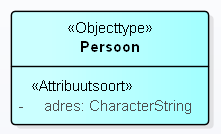
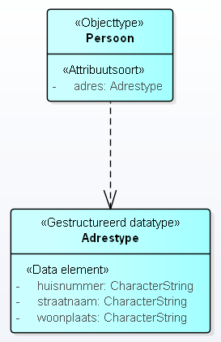
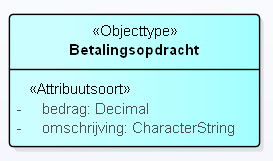
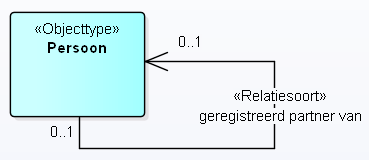
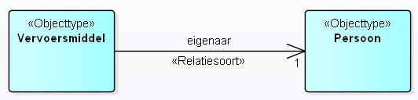
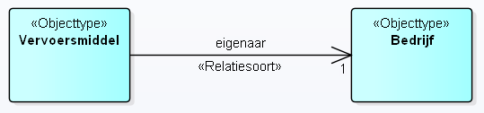

# Use cases voor Keuze

Een *Keuze* is een opsomming van meerdere modelelementen, waarbij er maar van één tegelijkertijd sprake kan zijn.

*Toelichting:* De keuze is een alternatieve manier voor het modelleren van een constraint.

Een *Keuze* kan op meerdere plekken gebruikt worden, en maakt het mogelijk waar in het metamodel normaal gesproken maar één mogelijkheid bestaat, een opsomming te geven van meerdere mogelijkheden, waarbij in een concreet geval altijd precies één van deze mogelijkheden wordt gebruikt.

Een belangrijk voordeel van deze modellering is dat de kardinaliteiten zuiver gehouden kunnen worden. Anders gezegd, er kan mee voorkomen worden dat een kardinaliteit van bijvoorbeeld twee kenmerk eerst optioneel gemaakt moet worden en dat hierna via een constraint deze toch weer verplicht gemaakt moeten worden, voor precies één van de mogelijkheden. Het is aan de modelleur om te kiezen voor een constraint of een Keuze.

Dit document beschrijft zes use cases waarin het modelleren met een *Keuze* van toegevoegde waarde is. Zonder een dergelijke modelconstructie zou het nodig moeten zijn om met een expliciete constraint de keuze aan te geven.

- Bij use cases 1 tot en met 4 gaat het over meerdere kenmerken, waartussen een keuze gemaakt moet worden omdat er van precies 1 sprake is. Dit is in MIM een keuze tussen twee (of meer) modelelementen. In de verzamelingenleer noemen we dit een XOR situatie. Hierbij is het vooral van belang dat er als gevolg van de modellering van een keuze in plaats van constraint er geen nieuwe kenmerken mogen ontstaan en ook geen kenmerken mogen wegvallen. De kenmerken van het object blijven gelijk. 

- Bij use cases 5 en 6 gaat het over precies 1 kenmerk. Er is hierbij geen sprake van een XOR situatie. Bij dit kenmerk is het bijzondere dat er meerdere verschijningsvormen van dit ene kenmerk kunnen zijn. Hierbij is het vooral van belang dat er als gevolg van de modellering van een keuze er geen nieuwe kenmerken mogen ontstaan. 

## Use case 1: een keuze tussen twee datatypen

Van een objecttype "Persoon" is relevant op welk adres deze persoon woont. Er is sprake van één attribuutsoort "adres". Het adres kan vervolgens een tekstveld zijn (bijvoorbeeld: "Krankeledenstraat 34 te Amersfoort"), maar ook meer gestructureerd zijn opgenomen, waarbij de elementen straatnaam, huisnummer en woonplaats afzonderlijk zijn opgenomen. Er is sprake van een keuze tussen het primitieve datatype "CharacterString" en het gestructureerde datatype "Adrestype" met de data-elementen "straatnaam", "huisnummer" en "woonplaats" 

Opmerking: andere modelleringen van een adres zijn ook mogelijk, een adres zou ook een gegevensgroep kunnen zijn en een Adrestype een Gegevensgroeptype, en een adres zou ook als een Objecttype gemodelleerd kunnen worden. In dit voorbeeld is het adres gemodelleerd als een attribuutsoort en het Adrestype als een datatype. 

Onderstaand figuur geeft in zowel UML als Linked Data weer hoe beide modellen er uit zouden zien voor beide afzonderlijke situaties (en er nog geen sprake is van een constraint of een keuze).  

<table><tbody>
<tr><th>UML</th><th>Linked Data</th></tr>
<tr><td></td><td>
<pre class='ex-turtle'>
vb:Persoon a mim:Objecttype;
  mim:naam "Persoon";
  mim:attribuut [
    a mim:Attribuutsoort;
    mim:naam "adres";
    mim:type mim:CharacterString
  ];
.
</pre></td></tr>
<tr><td></td><td>
<pre class='ex-turtle'>
vb:Persoon a mim:Objecttype;
  mim:naam "Persoon";
  mim:attribuut [
    a mim:Attribuutsoort;
    mim:naam "adres";
    mim:type vb:Adrestype
  ]
.
vb:Adrestype a mim:GestructureerdDatatype;
  mim:naam "Adrestype";
  mim:dataElement [
    a mim:DataElement;
    mim:naam "huisnummer";
    mim:type mim:CharacterString;
  ];
  mim:dataElement [
    a mim:DataElement;
    mim:naam "straatnaam";
    mim:type mim:CharacterString;
  ];
  mim:dataElement [
    a mim:DataElement;
    mim:naam "woonplaats";
    mim:type mim:CharacterString;
  ]
.
</pre></td></tr>
</tbody></table>

Zonder de mogelijkheid van keuze, zou je te maken krijgen met twee attribuutsoorten met bijbehorend datatype. Echter, in dat geval mogen de attribuutsoorten niet dezelfde naam hebben, aangezien deze bij hetzelfde objecttype horen. Ook zou de kardinaliteit niet kloppen: die zou dan [0..1] moeten worden, maar dat doet geen recht aan het feit dat er één verplicht aanwezig moet zijn, en er ook geen twee naast elkaar mogen zijn. De werkelijke kardinaliteit is [1..1].

In MIM modelleren we daarom het attribuutsoort adres als een datatype, welke een keuze betreft tussen het datatype CharacterString en het datatype Adrestype. 

## Use case 2: een keuze tussen twee attribuutsoorten

Bij een objecttype "Betalingsopdracht" moet, naast het bedrag, ook een betalingskenmerk worden opgenomen OF een omschrijving. Eén van beide attribuutsoorten moet worden ingevuld. Het is niet toegestaan dat beide velden worden ingevuld: alleen een betalingskenmerk, of alleen een omschrijving.

Onderstaand figuur geeft in zowel UML als Linked Data weer hoe beide modellen er uit zouden zien voor beide afzonderlijke situaties (en er nog geen sprake is van een constraint of een keuze).

<table><tbody>
<tr><th>UML</th><th>Linked Data</th></tr>
<tr><td></td><td>
<pre class='ex-turtle'>
vb:Betalingsopdracht a mim:Objecttype;
  mim:naam "Betalingsopdracht";
  mim:attribuut [
    a mim:Attribuutsoort;
    mim:naam "bedrag";
    mim:type mim:Decimal;
    mim:kardinaliteit "1";
  ];
  mim:attribuut [
    a mim:Attribuutsoort;
    mim:naam "betalingskenmerk";
    mim:type mim:CharacterString;
    mim:kardinaliteit "1";
  ]
.
</pre></td></tr>
<tr><td></td><td>
<pre class='ex-turtle'>
vb:Betalingsopdracht a mim:Objecttype;
  mim:naam "Betalingsopdracht";
  mim:attribuut [
    a mim:Attribuutsoort;
    mim:naam "bedrag";
    mim:type mim:Decimal;
    mim:kardinaliteit "1";
  ];
  mim:attribuut [
    a mim:Attribuutsoort;
    mim:naam "omschrijving";
    mim:type mim:CharacterString;
    mim:kardinaliteit "1";
  ]
.
</pre></td></tr>
</tbody></table>

Zonder de mogelijkheid van keuze zouden beide attribuutsoorten opgenomen zijn bij het objecttype als optionele velden, met een constraint dat een van beide gevuld moet zijn. Dit is in deze use-case niet echt een probleem. Wel is de kardinaliteit ook in dit geval dan niet erg duidelijk gemodelleerd: die zou dan [0..1] moeten worden, maar dat doet geen recht aan het feit dat er één verplicht aanwezig moet zijn, en er ook geen twee naast elkaar mogen zijn. De werkelijke kardinaliteit is [1..1] op de keuze zelf. Met een constraint is dit op zich wel correct te modelleren, maar met een modellering van een keuze is dit veel duidelijker. 

## Use case 3: een keuze tussen twee relatiesoorten 

Een objecttype "Persoon" kan getrouwd zijn met een ander persoon, of een geregistreerd partnerschap hebben met een ander persoon. Het is niet mogelijk dat een persoon beide relaties heeft. Er is sprake van een keuze tussen OF getrouwd zijn, OF geregistreerd partnerschap.

Onderstaand figuur geeft in zowel UML als Linked Data weer hoe beide modellen er uit zouden zien voor beide afzonderlijke situaties (en er geen nog sprake is van een constraint of een keuze).

<table><tbody>
<tr><th>UML</th><th>Linked Data</th></tr>
<tr><td></td><td>
<pre class='ex-turtle'>
vb:Persoon a mim:Objecttype;
  mim:naam "Persoon";
.
vb:echtgenootVan a mim:Relatiesoort;
  mim:naam "echtgenoot van";
  mim:doel vb:Persoon;
  mim:bron vb:Persoon;
  mim:kardinaliteit "0..1";
.
</pre></td></tr>
<tr><td></td><td>
<pre class='ex-turtle'>
vb:Persoon a mim:Objecttype;
  mim:naam "Persoon";
.
vb:geregistreerdPartnerVan a mim:Relatiesoort;
  mim:naam "geregistreerd partner van";
  mim:doel vb:Persoon;
  mim:bron vb:Persoon;
  mim:kardinaliteit "0..1";
.
</pre></td></tr>
</tbody></table>

Zonder de mogelijkheid van keuze zouden beide relatiesoorten opgenomen zijn bij het objecttype, met een optionele kardinaliteit. Hiermee is het echter niet duidelijk zichtbaar dat er slechts één van de twee relatiesoorten aanwezig mogen zijn. Met een constraint is dit op zich wel correct te modelleren, aan te geven dat precies 1 van beide verplicht is, maar met een modellering van een keuze is dit veel duidelijker. 

Merk op: use case 2 en 3 zijn eigenlijk vergelijkbaar, bij use case 2 gaat het om attribuutsoorten, bij use case 3 gaat het om relatiesoorten. Vanuit het perspectief van keuze gaat het in beide gevallen om een keuze tussen twee modelelementen die verbonden zijn met een objecttype. Het is ook mogelijk om een keuze te hebben tussen attribuutsoort OF een relatiesoort. Dit werkt analoog, maar is in de use cases (nog) niet uitgewerkt.  

Nota bene. Use case 3 is relevant voor wanneer er bij Relatiemodelleringstype gekozen wordt voor: Relatiesoort leidend. Use case 4 is relevant wanneer er bij Relatiemodelleringstype gekozen wordt voor: Relatierol leidend. 

## Use case 4: Een keuze tussen twee relatiedoelen

Een objecttype "Vervoersmiddel" heeft een eigenaar. Dit kan een persoon zijn, of een bedrijf, maar niet beiden. Er is sprake van één relatiesoort ("eigenaar") en een keuze tussen twee relatiedoelen, de objecttypen "persoon" en "bedrijf".

Onderstaand figuur geeft in zowel UML als Linked Data weer hoe beide modellen er uit zouden zien voor beide afzonderlijke situaties 
(en er geen sprake is van een constraint of een keuze). 

<table><tbody>
<tr><th>UML</th><th>Linked Data</th></tr>
<tr><td></td><td>
<pre class='ex-turtle'>
vb:Vervoersmiddel a mim:Objecttype;
  mim:naam "Vervoersmiddel";
.
vb:Persoon a mim:Objecttype;
  mim:naam "Persoon";
.
vb:eigenaar a mim:Relatiesoort;
  mim:naam "eigenaar";
  mim:doel vb:Vervoersmiddel;
  mim:bron vb:Persoon;
  mim:kardinaliteit "1";
.
</pre></td></tr>
<tr><td></td><td>
<pre class='ex-turtle'>
vb:Vervoersmiddel a mim:Objecttype;
  mim:naam "Vervoersmiddel";
.
vb:Persoon a mim:Objecttype;
  mim:naam "Bedrijf";
.
vb:eigenaar a mim:Relatiesoort;
  mim:naam "eigenaar";
  mim:doel vb:Vervoersmiddel;
  mim:bron vb:Bedrijf;
  mim:kardinaliteit "1";
.
</pre></td></tr>
</tbody></table>

Zonder de mogelijkheid van keuze zouden de relatiedoelen (de gerelateerde objecttypes) opgenomen zijn bij de relatiesoorten van het objecttype, met elk een optionele kardinaliteit. Hiermee is het echter niet duidelijk zichtbaar dat er slechts één van de twee relatiedoelen aanwezig mogen zijn. Met een constraint is dit op zich wel correct te modelleren, aan te geven dat precies 1 van beide verplicht is, maar met een modellering van een keuze is dit veel duidelijker. 

## Use case 5: Een keuze tussen twee verschijningsvormen van een attribuutsoort

Van een objecttype "Persoon" kan geregistreerd worden wat het telefoonnummer van deze persoon is. Een dergelijk telefoonnummer kan een privé telefoonnummer zijn, of een zakelijk telefoonnummer. 

Deze use case lijkt sterk op use case 2 (waarbij ook sprake was van een keuze tussen attribuutsoorten). Het verschil is dat bij deze use case er vanuit een conceptueel perspectief sprake is van een meer algemeen attribuutsoort "telefoonnummer" c.q. van 1 attribuutsoort die verschillende verschijningsvormen kent.  

## Use case 6: Een keuze tussen twee verschijningsvormen van een relatiesoort

Een objecttype "Persoon" kan gerelateerd zijn aan een objecttype "Locatie". Een dergelijk adres-relatie kan betrekking hebben op het (formele) woonadres, correspondentieadres of verblijfsadres.

Deze use case lijkt sterk op use case 3 (waarbij ook sprake was van een keuze tussen relatiesoorten). Het verschil is dat bij deze use case vanuit een conceptueel perspectief sprake is van een meer algemene relatiesoort "adres", die verschillende verschijningsvormen kent c.q. van 1 relatiesoort, die naar verschillende objecttypen kan verwijzen. 

Daarnaast lijken use case 5 en 6 op elkaar: het betreft vergelijkbare constructies met als verschil de keuze tussen attribuutsoort dan wel relatiesoort.

(Merk op: er is geen noodzaak voor een keuze tussen datatypen of relatiedoelen op deze wijze, aangezien een datatype-keuze of objecttype-keuze al mogelijk is via een specialisatie van een datatype dan wel objecttype).

------

Einde tekst. Deze opmerkingen moeten nog uit de uiteindelijke tekst. 

**Opmerking MB**: ik vraag me dan ook af of use cases 5 en 6 wel horen bij "Keuze". Ik zou deze eerder plaatsen bij generalisatie/specialisatie, zoals bij datatype en objecttype.
**Opmerking LvB**: Adres als datatype vind ik ongelukkig. in de BAG is dit nooit een datatype. VlakOfMultivlak was een beter voorbeeld voor een conceptueel model, ook al was die ook niet perfect. Graag een beter voorbeeld verzinnen waar geen ruis door kan ontstaan. 
