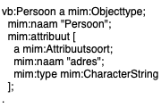

# Use cases voor Keuze

Een *Keuze* is een opsomming van meerdere modelelementen, waarbij er maar van één tegelijkertijd sprake kan zijn.

*Toelichting:* De keuze is een alternatieve manier voor het modelleren van een constraint.

Een *Keuze* kan op meerdere plekken gebruikt worden, en maakt het mogelijk waar in het metamodel normaal gesproken maar één mogelijkheid bestaat, een opsomming te geven van meerdere mogelijkheden, waarbij in een concreet model altijd precies één van deze mogelijkheden wordt gebruikt.

Dit document beschrijft vijf use cases waarin het modelleren met een *Keuze* van toegevoegde waarde is. Zonder een dergelijke modelconstructie zou het nodig moeten zijn om met een expliciete constraint de keuze aan te geven.

## Use case 1: een keuze tussen twee datatypen

Van een objecttype "Persoon" is relevant op welk adres deze persoon woont. Er is sprake van één attribuutsoort "adres". Het adres kan vervolgens een tekstveld zijn (bijvoorbeeld: "Krankeledenstraat 34 te Amersfoort"), maar ook meer gestructureerd zijn opgenomen, waarbij de elementen straatnaam, huisnummer en woonplaats afzonderlijk zijn opgenomen. Er is sprake van een keuze tussen het primitieve datatype "CharacterString" en het gestructureerde datatype "Adrestype" met de data-elementen "straatnaam", "huisnummer" en "woonplaats".

Onderstaand figuur geeft in zowel UML als Linked Data weer hoe beide modellen er uit zouden zien voor beide afzonderlijke situaties.

| UML | Linked Data |
|-----|-------------|
|||
|||
