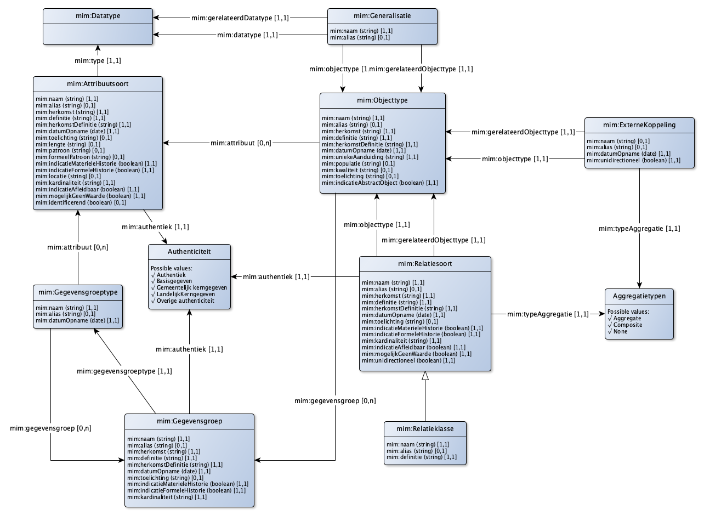
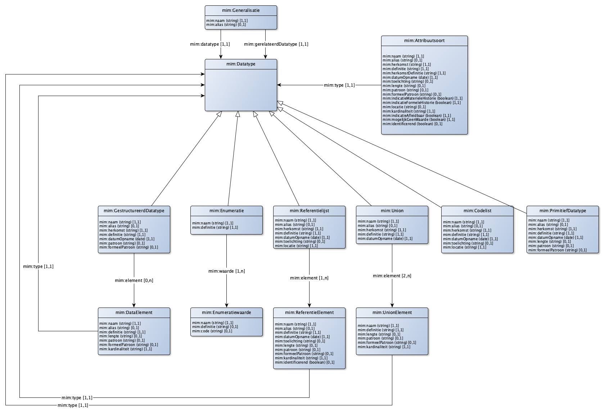
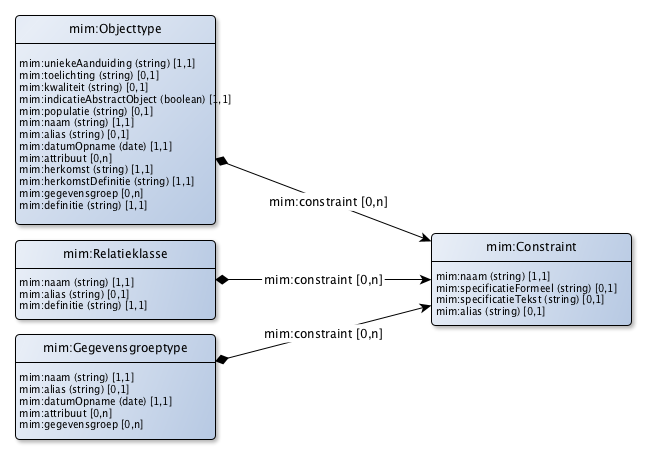
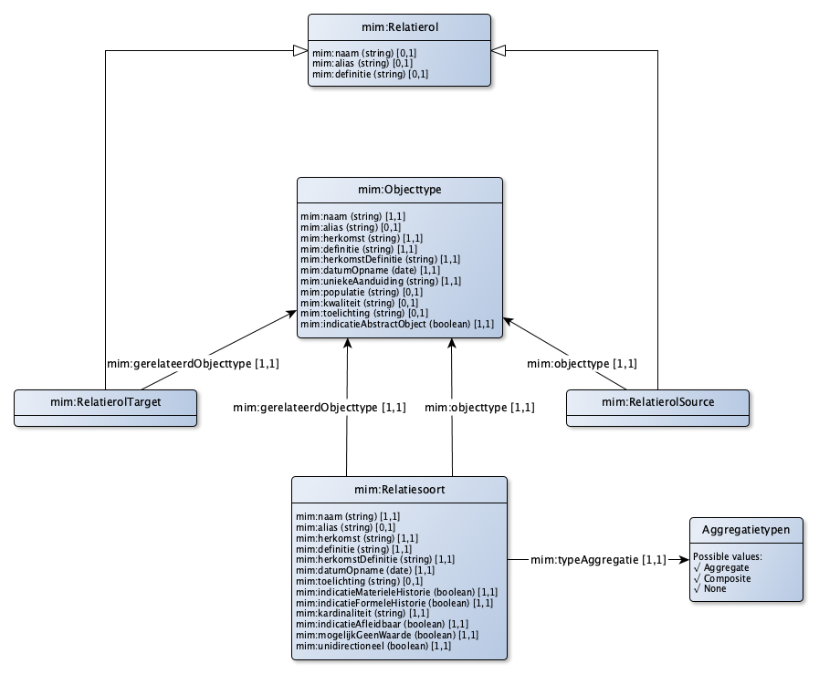

# Metamodel voor informatiemodellen in RDF

Deze repository bevat de formele definitie en besschrijving van het Metamodel voor informatiemodellen in RDF. Het betreft de RDF representatie van het metamodel beschreven in https://docs.geostandaarden.nl/mim/mim10. (zie ook [overige documentatie](https://www.geonovum.nl/geo-standaarden/metamodel-informatiemodellering/nationaal-metamodel-voor-informatiemodellering)).

Het MiM is een *metamodel*. Dit betekent dat in termen van het MiM een concreet informatiemodel kan worden uitgewerkt, bijvoorbeeld het informatiemodel Basisregistratie Adressen en Gebouwen. Het MiM is niet bedoeld om vervolgens in termen van dit informatiemodel een concrete dataset te vormen. Hiervoor is een transformatie nodig naar een (technisch) uitwisselings- of opslagmodel nodig.

Op diezelfde manier levert het toepassen van het MiM in RDF geen ontologie of vocabulaire waarin RDF kan worden uitgedrukt: slechts het informatiemodel zelf is op deze manier in RDF uitgedrukt. Voor de vertaalslag naar een ontologie is een afzonderlijke transformatie nodig.

Zo leidt een MiM objecttype "Schip" tot de volgende weergave in RDF:

```
@prefix vb: <http://bp4mc2.org/voorbeeld/>.
@prefix mim: <http://bp4mc2.org/def/mim#>.

vb:Schip a mim:Objecttype;
  rdfs:label "Schip"@nl;
.
```

`vb:Schip` is in dit voorbeeld een voorkomen van de klasse `mim:Objecttype`. dit voorkomen kent zelf geen voorkomens. Hiervoor is een vertaling nodig naar een `rdfs:Class`, bijvoorbeeld door:

```
@prefix vbo: <http://bp4mc2.org/voorbeeld/def#>.

vbo:Schip a rdfs:Class;
  rdfs:seeAlso vb:Schip;
.
vb:Pakjesboot12 a vbo:Schip.
```

## Status

De huidige status van deze beschrijving is *concept*. Op de volgende hoofdpunten zijn vervolgacties nodig:

- Er zijn issues gevonden die opgelost dienen te zijn voordat sprake kan zijn van een correcte representatie;
- Een handreiking is gewenst hoe vanuit een MiM RDF informatiemodel een RDF ontologie gemaakt kan worden. Hierbij kan aangesloten worden bij de ontwikkelingen rondom [NEN3610 en Linked data](https://github.com/Geonovum/NEN3610-Linkeddata).
- Het MiM in RDF dient opgenomen te worden als onderdeel van de MiM standaard.

## Interpretatie

Bij het opstellen van het MiM in RDF is gebruik gemaakt van de tekstuele beschrijving van het MiM. Er is een 1-op-1 omzetting gedaan, zonder enige aanpassing van de beschrijvingen. Dit maakt het mogelijk om een MiM informatiemodel om te zetten van een UML representatie naar een RDF representatie en weer terug, zonder verlies van informatie.

De volgende regels zijn gebruikt bij de omzetting van de MiM tekst naar RDF:

1. Elk voorkomen van een MiM «metaclass» is omgezet naar een voorkomen van een `owl:Class`;
2. Elk aspect van een MIM «metaclass» is omgezet naar een voorkomen van een `owl:DatatypeProperty`, voor zover sprake is van een aspect dat een waarde heeft die met een datatype is uit te drukken (zoals tekstuele, nummerieke of boolean aspecten);
3. Elk aspect van een MIM «metaclass» is omgezet naar een voorkomen van een `owl:ObjectProperty`, voor zover sprake is van een aspect waarbij de waarde verwijst naar een voorkomen van een andere MiM «metaclass»;
4. Een `rdfs:label` is opgenomen met de naam van de MiM «metaclass» c.q. het aspect;
5. Een `rdfs:comment` is opgenomen met de definitie van de MiM «metaclass» c.q. het aspect.

In een enkel geval ontbreekt in de tekst een beschrijving van het aspect. In dat geval is de target rolnaam gebruikt van de associatie, zoals afgebeeld in het figuur bij de tekst. In het voorkomende geval is hiervan een issue aangemaakt.

Voor de omzetting van de gegevensconstraints (zoals cardinaliteiten, datatypen en properties per klasse), is op de volgende manier een SHACL shape graph gemaakt:

1. Elk voorkomen van een MiM «metaclass» kent ook een `sh:NodeShape` met een `sh:name` die overeen komt de originele technische naam (UpperCamelCase);
2. Voor elk voorkomen van een MiM «metaclass» zijn `sh:PropertyShapes` aangemaakt om aan te geven welke aspecten zijn toegestaan voor een MiM «metaclass», de cardinaliteiten en het datatype c.q. de geassocieerde MiM «metaclass».

## Grafische weergave

Onderstaand figuur geeft het MiM in RDF weer, opgesteld vanuit de ontologie en de shape graph, conform de visualisatie zoals gedefinieerd in [BP4mc2](http://bp4mc2.org/20181107/#grafische-representatie).

### Kern


### Datatype


### Constraint


### Relatie

